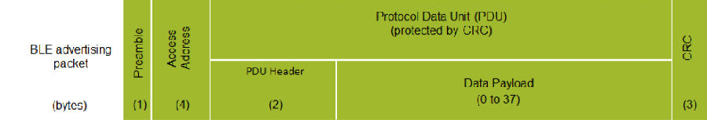
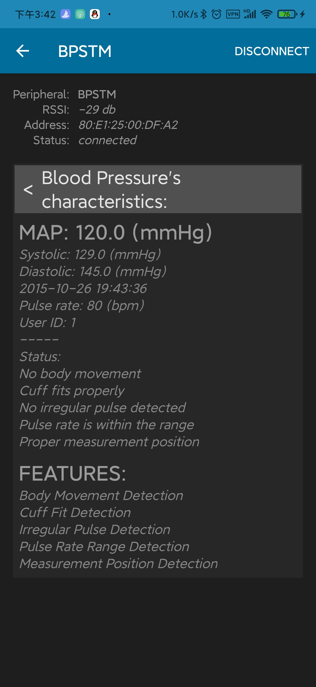
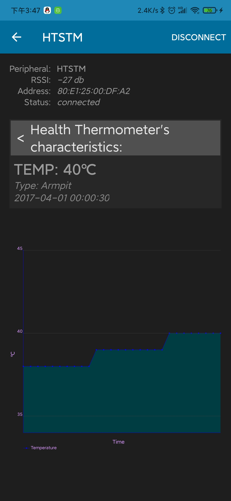
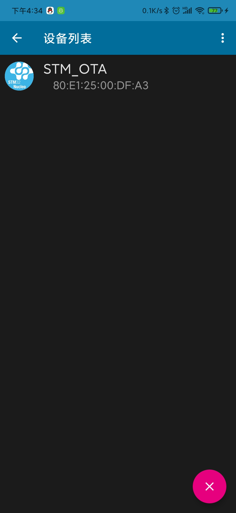
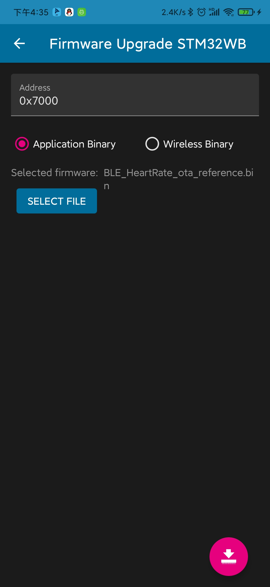
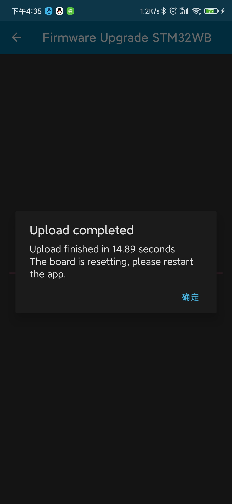

# wb55_sample演示

## 前言

前文提过stm32wb55官方软件包，里面有许多demo，本文会选取一些sample进行演示。

## BLE_Beacon演示

### 示例说明

该示例主要说明如何广播三种信标（tlm，uuid，url）。

信标一些讲解资料https://blog.csdn.net/jiankeufo/article/details/80590207说的很好，这里借鉴一下：

***\**\*1蓝牙信标\*\**\***

　　蓝牙信号实际上并不是一个蓝牙技术联盟（Bluetooth SIG）的标准。相反，它们可以被称为“伪标准”（Pseudo-Standard），或由大型供应商或企业集团牵头的信标应用的正式格式。

　　当今市场上有三个“伪标准”发展强劲，即：Apple的 [*iBeacon*](http://www.eepw.com.cn/news/listbylabel/label/iBeacon)，Google的Eddystone，Radius Network的AltBeacon。这三个标准都使用[*低功耗蓝牙*](http://www.eepw.com.cn/news/listbylabel/label/低功耗蓝牙)（BLE）广播方法，蓝牙信标利用其支持的通用属性（GATT）配置文件在第37,38,39通道发送广播包蓝牙扫描器接收广播包，对它们进行解码，然后采取行动，以免免2.4GHz工业，科学和医疗（ISM）免执照频段上与无线网络数据流产生冲突。

　　进一步来说，每种标准都使用BLE广播的结构来嵌入它们自己的格式和数据。每当信标设备进行广播时，相同的包通常会在所有三个广播通道上被发送，从而使BLE接收器/扫描器更有可能接收到它。一旦接收到，扫描器会判定包的内容是否可被解码且是否相关，然后将采取相应的行动。

　　在广播数据包内，数据有效负载被构造为一个或多个[长度，类型，数据]三字段形式。

　　·长度字段定义了后面的类型字段和数据字段的总长度;

　　· 类型字段用以指定数据是一个名称、一个服务通用唯一标识符(UUID)、一个统一资源标识符(URI)，还是许多其他已定义数据类型中的一个;

　　· 信标可以对包的数据进行进一步的结构化设置，在数据字段内定义一个子结构，以判定不同的伪标准。

​																	**BLE广播包格式**

英文解释：

　　BLE advertising packet BLE广播包 preamble序言 access address 访问地址

　　Protocol data unit(PDU)(protected by CRC) 协议数据单元(PDU)(受CRC保护)

　　PDU Header PDU插头 Data payload(0 to 37)数据有效载荷(0-37)

　　广播包和数据包都使用相同的格式(如表1)。信标遵循标准的广播包格式，但包括了针对一种或多种伪标准的嵌入式数据有效负载。

　　**2 Apple的[\*iBeacon\*](http://www.eepw.com.cn/news/listbylabel/label/iBeacon)**

　　Apple凭借其[*iBeacon*](http://www.eepw.com.cn/news/listbylabel/label/iBeacon)成为了一家早期的信标采用者。iBeacon这个术语是Apple的商标，想要销售iBeacon产品或使用iBeacon标识的供应商必须从Apple获得一个免费许可。

　　iBeacon规定了一个30字节的包，它必须在一个100ms的时隙上广播出去(尽管iBeacon的原始设备制造商们似乎并不总是严格遵守100ms的要求)。使用Core Location框架的iOS 应用程序，可以要求iOS持续监测穿过信标区域的事件，例如，进入或者离开一个由UUID、Major和Minor字段定义的iBeacon的接近区域。无论一个应用程序是否运行，iOS监测都会发生，它甚至可以触发一个已关闭的应用程序开始运行。监测仅在用户为相应的应用程序开启位置服务(Location Service)时才工作。

　　**3 Google的Eddystone**

　　埃迪斯通是谷歌开发的一种开源的，跨平台的信标格式。它同时支持安卓和iOS的设备。不同于其他信标标准，它定义了几种不同的框架类型，这些框架类型可以独立使用或者结合起来使用：

　　·Eddystone-UID：它广播一个独一无二的信标ID;

　　·Eddystone-URL：它广播统一资源定位符（URL）;

　　·Eddystone-TLM：它可以被用来广播信标本身的遥测（健康和状态）数据;

　　·Eddystone-EID：它使用短暂的（短寿命的）标识符以支持要求更高的安全性的信号应用。这种框架格式的规格尚未发布。

　　Eddystone-URL框架使移动平台能够提供基于位置接近感知的网页内容，且无需安装应用程序，从而实现Google一直在推介的“Physical Web”，或者“走过去并使用任何东西的能力Any Edition）“的创新。对于iOS系统，Eddystone已经得到了Chrome浏览器的支持;从版本49开始，用于Android系统的Chrome浏览器（Chrome for Android）也将提供对Eddystone的支持。有了Chrome今天小程序，用户就可以访问与其所处周边环境相关的网页内容，并且在遇到信标时能够收到通知。

　　**4 AltBeacon**

　　Radius Network定义了AltBeacon规格，以尝试创建一种与操作系统无关的，开源的标准，从而不倾向于任何特定的供应商。该规格可以免费使用，而不用支付版税或授权费。像其他信标一样，它使用不可连接的，无定向的广播包。

### 运行要求

该应用程序需要无线协处理器上运行STM32WB5X_BLE_STACK_FULL_FW.bin二进制文件。
如果固件不是STM32WB5X_BLE_STACK_FULL_FW.bin，则需要使用STM32CubeProgramme刷写固件。刷写过程见前文STM32WB环境搭建。

### 刷写过程

工程在软件包STM32CubeWB\Projects\P-NUCLEO-WB55.Nucleo\Applications\BLE\BLE_Beacon目录下，打开工程编译下载重启开发版。

### 历程验证

手机打开Beacon Scanner ，可看到相关信息。

## BLE_BloodPressure演示

### 示例说明

该示例演示了如何使用BLE SIG规定实现血压曲线。

### 运行要求

该应用程序需要无线协处理器上运行STM32WB5X_BLE_STACK_FULL_FW.bin二进制文件。
如果固件不是STM32WB5X_BLE_STACK_FULL_FW.bin，则需要使用STM32CubeProgramme刷写固件。刷写过程见前文STM32WB环境搭建。

### 刷写过程

工程在软件包STM32CubeWB\Projects\P-NUCLEO-WB55.Nucleo\Applications\BLE\BLE_BloodPressure目录下，打开工程编译下载重启开发版。

### 历程验证

手机打开ST BLE Profile 连接BPSTM设备，可看到相关信息。

## BLE_HealthThermometer演示

### 示例说明

该示例演示了如何使用BLE SIG规定实现健康温度计型曲线。

### 运行要求

该应用程序需要无线协处理器上运行STM32WB5X_BLE_STACK_FULL_FW.bin二进制文件。
如果固件不是STM32WB5X_BLE_STACK_FULL_FW.bin，则需要使用STM32CubeProgramme刷写固件。刷写过程见前文STM32WB环境搭建。

### 刷写过程

工程在软件包STM32CubeWB\Projects\P-NUCLEO-WB55.Nucleo\Applications\BLE\BLE_HealthThermometer目录下，打开工程编译下载重启开发版。

### 历程验证

手机打开ST BLE Profile连接设备HTSTM ，可看到相关信息。

## BLE_HeartRate演示

### 示例说明

该示例演示了如何使用BLE SIG规定实现心率曲线。

### 运行要求

该应用程序需要无线协处理器上运行STM32WB5X_BLE_STACK_FULL_FW.bin二进制文件。
如果固件不是STM32WB5X_BLE_STACK_FULL_FW.bin，则需要使用STM32CubeProgramme刷写固件。刷写过程见前文STM32WB环境搭建。

### 刷写过程

工程在软件包STM32CubeWB\Projects\P-NUCLEO-WB55.Nucleo\Applications\BLE\BLE_HeartRate目录下，打开工程编译下载重启开发版。

### 历程验证

手机打开ST BLE Sensor 连接设备HRSTM ，可看到相关信息。

手机打开ST BLE Profile连接设备HRSTM ，可看到相关信息。

## BLE_Ota演示

### 示例说明

示例该示例演示使用OTA 实现下载一个新的固件到flash。

看这部分前可以看一下小伙伴写的[用户应用程序的无线更新](https://supperthomas-wiki.readthedocs.io/en/latest/05_luhuadong/STM32WB_OTA.html)篇。

### 运行要求

该应用程序需要无线协处理器上运行STM32WB5X_BLE_STACK_FULL_FW.bin二进制文件。
如果固件不是STM32WB5X_BLE_STACK_FULL_FW.bin，则需要使用STM32CubeProgramme刷写固件。刷写过程见前文STM32WB环境搭建。

### 刷写过程

工程在软件包STM32CubeWB\Projects\P-NUCLEO-WB55.Nucleo\Applications\BLE\BLE_Ota目录下，打开工程编译下载重启开发版。

### 历程验证

手机打开ST BLE Sensor 连接设备STM_OTA。

之后点击SELECT FILE选择OTA的bin文件，这里用BLE_HeartRate_ota进行展示，bin文件在STM32CubeWB\Projects\P-NUCLEO-WB55.Nucleo\Applications\BLE\BLE_HeartRate_ota\Binary目录下，因程序起始在 0x0800 7000所以地址我们填写0x7000

点击下载等待结束

之后自动重启，设备搜索显示HRSTM证明OTA成功

点击验证效果正常

至此OTA结束。