# RF协议栈的有线和无线更新

本节介绍两种种近程固件更新方式，即 USB 和 JTAG/SWD 方式。分别通过 USB 和通过 JTAG/SWD 来更新 FUS、RF stack，开始之前先了解一下什么是 FUS。

## FUS 介绍

### 什么是 FUS

FUS，是 firmware upgrade service 的简称，是一段跑在安全用户 flash 上的，由 M0+ 内核运行的程序。所有和 STM32WB 新引入的安全功能，都要通过它来操作。比如安装或者升级，由 ST 签名加密过的 FUS、RF stack image；比如要存储和使用应用秘钥，所谓 CKS（ CTM key service），都是通过 FUS service 暴露给 M4 内核的 API 来调用、执行的。关于应用 key 和客户 key 的使用，我们后面再讲。

FUS 目前有三个版本，一个是 STM32WB 芯片出厂预烧好的 0.5.3 版本（大家拿不到的），另外两个是 1.0.1 和 1.0.2 版本，可以在 STM32CubeWB 固件包里可以拿到。这些随 WB 固件包一起更新并发布的 image，都是被 ST 签名加密过的。

- **FUS（Firmware upgrade service，固件升级服务）**
    - （专用于）固件升级的服务，这里的“Firmware”特指的是跑在 M0+ 内核上的 RF stack 固件。
    - FUS 和 RF stack 一样，由 Cortex-M0 运行在 secured Flash 上。
- **该段代码的功能**
    - 安装、删除、更新由 ST 签名加密过的 RF stack（还可被客户进行二次签名）。
    - 更新由 ST 签名加密过的 FUS（还可被客户进行二次签名）。
    - 安装、更新、锁定客户认证 Key（用于 RF stack/FUS 的客户二次签名）。
    - 用户（应用）key 的管理：密钥的存储、秘钥的使用。
    - 和运行用户应用程序、Bootloader 的 Cortex-M4 相互通信。
- **FUS 的版本**
    - 0.5.3，预装在出厂的 STM32WB 芯片里，官网上是没有下载的；到手的 STM32WB5xG 要把 FUS 升到至少 1.0.1；到手的 STM32WB5xC/E 要把 FUS 升级到 1.0.2。
    - 1.0.1，在官网上 STM32WBCube 1.1.0 中有二进制 image；只适用于 STM32WB5xG。
    - 1.0.2，在官网上 STM32WBCube 1.1.1/1.2.0 中有二进制 image；主要是给 STM32WB5C/E 使用的。


### FUS 的版本及升级规则

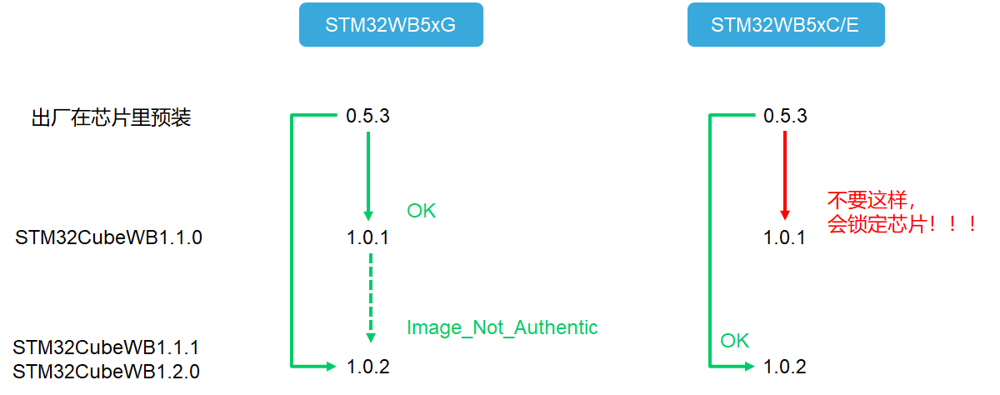

1.0.1 版本的 FUS，是在 STM32CubeWB 固件包 1.1.0 中发布的，它适用于 1M flash 的 WB 芯片，即 STM32WB4xG。
支持 256K flash 和 512K flash 的 WB 芯片，即 STM32WB5xC/E 的 FUS，是版本 1.0.2，在 STM32CubeWB 固件包的 1.1.1 中发布。

注意事项：

- 如果拿到手上的 STM32WB 芯片是 5xC/E，请直接升到 1.0.2 版本的 FUS，不要升到 1.0.1，否则芯片会被不可逆的锁定。
- 如果手上的是 5xG，1.0.1 和 1.0.2 的 FUS 都适用，无需再从 1.0.1 升到 1.0.2，因为功能上并无大变化，实在要升，会返回 `Image_Not_Authetic` 的提示。


### FUS 和 RF Stack 的位置

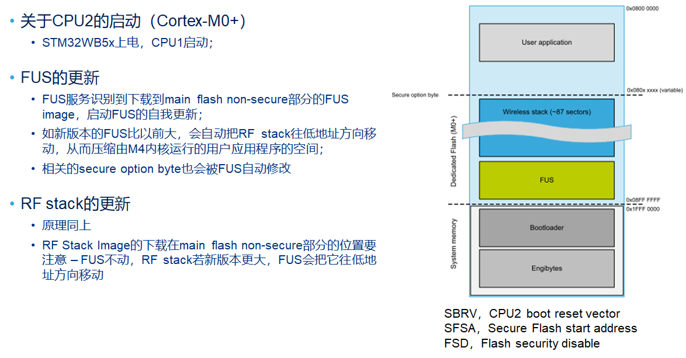

FUS 和 RF stack 都是由 M0+ 运行，且都运行在安全用户闪存区域，即图中两根虚线之间的位置。它们和用户的应用程序都一样存放在用户 flash，但是占据着由 Secure option byte（安全选项字节）指定的地址开始的高段空间。高段空间的尾部，是 ST 预留的和安全 feature 相关的预留地，不能动，因此如果 FUS 或者 RF stack 的新版本尺寸比以前大了，会把上面那根虚线继续往上抬，即挤压用户应用程序的空间，然后 secure option byte 的值也会被自动修改。


## 通过USB更新

下面介绍通过 USB 更新 USBDongle 板的 FUS 和 RF Stack 的操作方法。大家也可以在【[UM2550](https://www.stmcu.com.cn/Designresource/design_resource_detail/file/592527/lang/EN/token/065437c191ece5199f3f4c210ab9736f)】文档第五章节，或者 STM32CubeWB 固件包中的 Projects/STM32WB_Copro_Wireless_Binaries/STM32WB5x/Release_Notes.html 页面的 How to flash the Wireless Coprocessor Binary 栏目查阅。

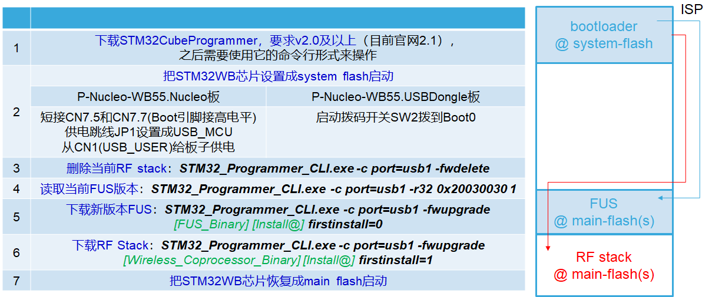

现在我们先使用第一种方式，即通过 USB 接口，使用 STM32CubeProgrammer 的命令行来升级 FUS 和 BLE stack 了。一共有七个步骤：

1. 首先确保自己电脑上装有 v2.0 版本及以上的 STM32CubeProgrammer。
2. 然后把板子设置成从系统 flash 启动，对于 USB dongle 板，很简单，就是直接把 SW2 这个开关拨到 BOOT0 这边，就是远离标准 USB-A 插口那个方向。
3. 然后使用 STM32CubeProgrammer 的命令行，分别通过 fwdelete 删掉预装的 0.5.1 的 BLE stack，再通过 fwupgrade 来分别升级最新版的 FUS 和 BLE stack。

绿色的是我们将要升级的新版本 FUS、RF stack image，在自己 PC 上的存放地址，以及将要烧到目标芯片里的位置。这些地址，在 STM32CubeWB 固件包专门存放最新版 M0+ 内核运行的 image 的文件夹里，和各个 image 放在一起的一个 release note 里面可以查到。

### 准备工作

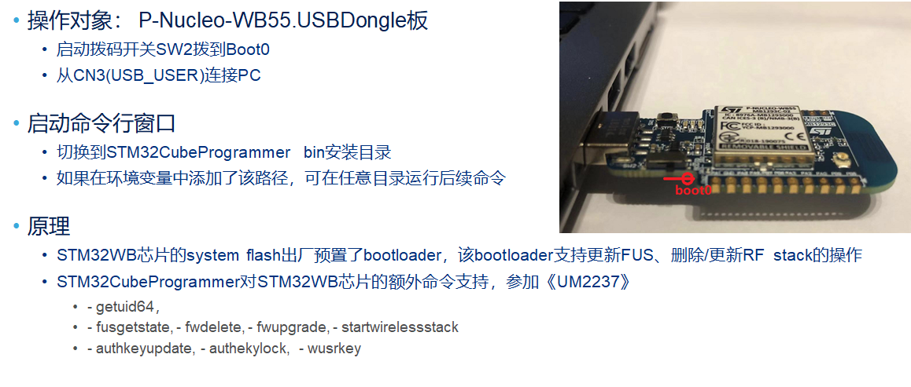

现在开始具体操作。USB dongle 板子 SW2 开关拨到如图方向，连接到 PC，STM32WB 芯片从系统 flash 启动，开始运行系统 bootloader 了。它扫描到 USB 通信口上有信号，进入 DFU 模式，激活 M0+ 内核让它开始运行，由此可以响应来自上位机 PC 的 STM32CubeProgrammer 发出的命令。

### 删除RF协议栈

删除当前 RF 协议栈，运行命令：

```shell
STM32_Programmer_CLI.exe -c port=usb1 -fwdelete
```

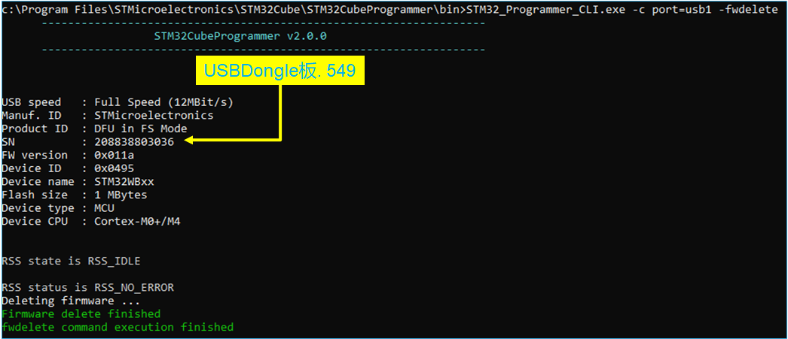

通过 `-fwdelete` 命令，删除 USB Dongle 板子上预装的 0.5.1 版本的 BLE stack。

### 读取FUS版本

读取当前 FUS 版本，运行命令：

```shell
STM32_Programmer_CLI.exe -c port=usb1 -r32 0x20030030 1
```

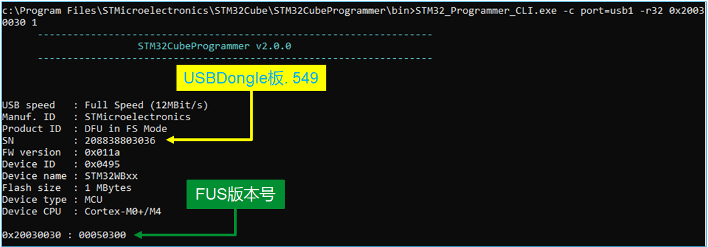

查看 FUS 版本，直接读读内存 `0x20030030` 处的值即可。版本 0.5.3，因此需要升级到当前 STM32CubeWB 里的最新版本 1.0.2。

### 更新FUS版本

下载新版本 FUS，运行命令：

```shell
STM32_Programmer_CLI.exe -c port=usb1 -fwupgrade C:\stm32wb5x_FUS_fw.bin 0x080EC000 firstinstall=0
```

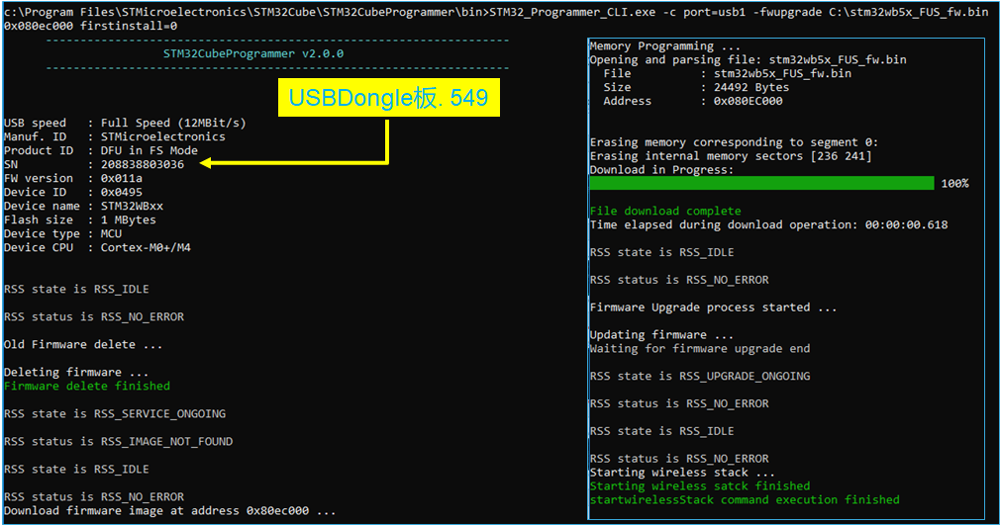

接着，使用`-fwupgrade` 命令升级 FUS。由于现在芯片里有老的 FUS，因此 firstinstall 参数是0。在命令行窗口可以看到升级过程中的 log 信息。

再次读取当前 FUS 版本，运行命令：

```shell
STM32_Programmer_CLI.exe -c port=usb1 -r32 0x20030030 1
```

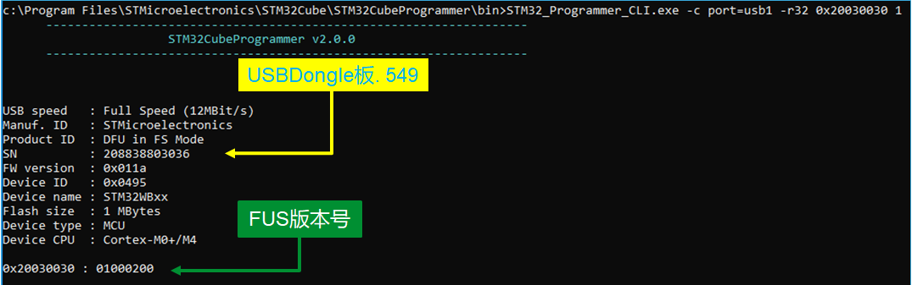

现在版本已经是 1.0.2 了，可以继续去下载所需的 BLE RF Stack 啦。

### 更新RF协议栈

下载新版本 BLE RF Stack，运行命令：

```shell
STM32_Programmer_CLI.exe -c port=usb1 -fwupgrade C:\stm32wb5x_BLE_Stack_fw.bin 0x080CC000 firstinstall=1
```

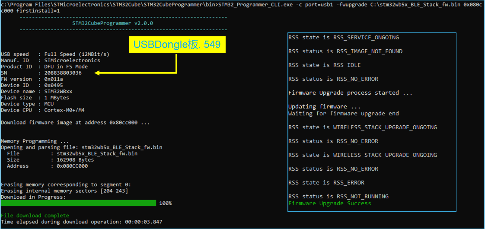

FUS 已经最新版本了，接下来就是下载通用最新版本的 BLE stack了。经过几秒，BLE stack 也下载好了。

再次读取当前 FUS 和 RF Stack 版本，运行命令：

```shell
STM32_Programmer_CLI.exe -c port=usb1 -r32 0x20030024 50
```

（可选项）把 USBDongle 板恢复成 main flash 启动：SW2 拨到“0”的位置

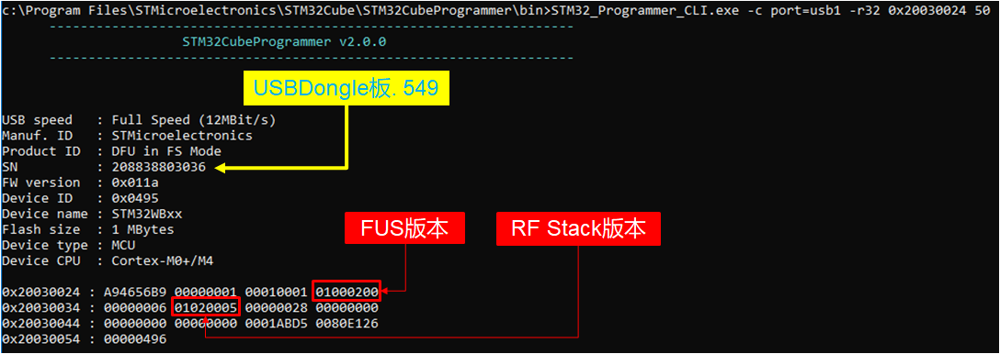

OK，现在 P-Nucleo-WB55.USBDongle 板的版本是：

- FUS 版本：1.0.2
- RF Stack 版本：1.2.0

现在，USBDongle 板子里的 FUS 和BLE stack 都是 STM32CubeWB 固件包里最新版了。我们在把它恢复成用户 flash 启动之前，先继续使用当前的 DFU 模式，来把 STM32CubeWB 固件包里的 TransparentVCP 例程下载进去，稍后做 BLE 空中升级时会用到。最后，才把 USB dongle 板子的 SW2 开关拨回到“0”的位置。这样，之后板子上电就会自动运行虚拟串口的透传功能了。


## 通过SWD更新

现在来看第二种近程更新 FUS 和 RF stack 的方式，通过 JTAG/SWD 这样的调试接口。前面使用的是 USB dongle 板，这次我们使用 Nucleo 板。nucleo 板这次升级，不准备一步到位，先把 FUS 和 RF stack 分别升级到 1.0.1 和 1.1.0；留着点空间，后面演示空中升级。因此只要双击 FLASH_BLE_stack_V1.1.0.bat 和 FLASH_FUS_V1.0.1.bat 两个批处理即可。

这个方法的原理是，使用 STLINK-Utility 的命令行，通过 SWD 接口，把一段叫做 FUS_Operator 的代码下载用户 flash 开始处，再把对应要升级的 FUS 或者 RF stack 的 image 下到用户 flash 稍后的地方，启动 FUS operator 运行。FUS operator 检查到约定好的用户 flash 地址处有 image 待升级，就调用 FUS 的 API，来把 image 进行验签和解密，然后烧写。

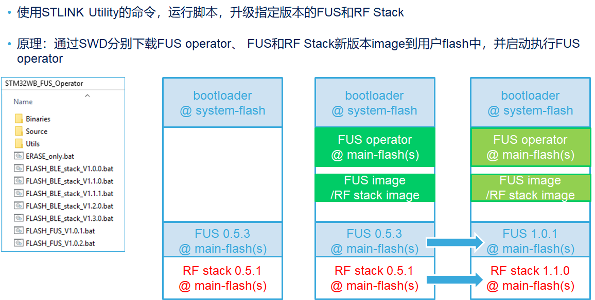

目前 ST 官网上还没有公开对应代码，大家可以找 ST 的代理或者 FAE 索要试用。好消息是：今年底（2019）之前，会把这个功能集成到 STM32CubeProgrammer 里，先是命令行支持，随后会是GUI支持。

> 关于 STM32 PC 端的工具，大趋势是：STM32CubeProgrammer 会替换掉之前的 Flash loader、DFUSe，STLINK-utility、STVP 等功能。

再次检验当前版本，将 P-Nucleo-WB55.Nucleo 板设置成 system flash 启动，执行如下命令读取当前 FUS 和 RF Stack 的版本。

```shell
STM32_Programmer_CLI.exe -c port=usb1 -r32 0x20030024 50
```

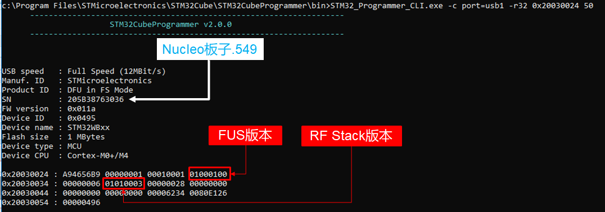

读出当前 Nucleo 板子上的 FUS 和 BLE stack 版本，分别是 1.0.1 和 1.1.0，符合预期。


## 近程升级小结

近程升级 FUS、RF Stack 的小结

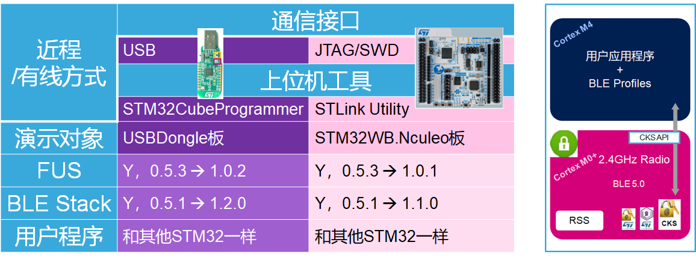

现在回顾一下，刚才分别对 STM32WB 套件中两个板子，通过 USB 接口，一步一步输命令；通过 JTAG/SWD 调试接口，执行批处理文件，升级了芯片的 FUS、和 BLEstack 版本。USBDongle 板的版本一步到位，并且也烧录好了 TransparentVCP 例程。

其实这两种方式本质是一样的，都是跑了一段程序，去调用 FUS 的 API，然后 FUS 把已经放在用户 flash 用户区域的 image，拿来验签、解密、烧写。不同的仅仅是前者通过 USB 接口，和系统 bootloader 里的代码交互，一条命令一条命令的执行；后者通过 JTAG 调试接口，把代码一口气下到用户 flash，一口气跑完，所谓批处理。