# 用户应用程序的无线更新

## 无线/空中升级

### 无线/空中升级（FOTA）

接下来，我们来学习无线的空中升级的原理。升级对象是 Nucleo 板子。它的 FUS 已经是 1.0.1，可以不用在升级了；我们把 BLE stack 从 1.1.0 升到最新的 1.2.0；用户程序就更加直观了，从心跳 profile，升级成 P2P server profile。上位机采用 PC 上的 STM32CubeProgrammer，并搭配运行 TransparentVCP（虚拟串口透传功能）的 USB dongle 板，一起工作。

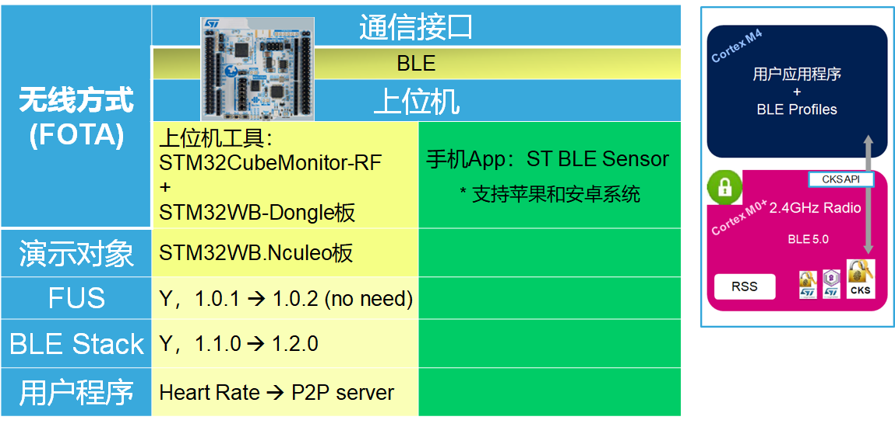

### 使用 STM32CubeMonitorRF 触发 BLE 连接的 OTA

左边是上位机，FOTA 客户端，通过 BLE，发起 OTA 请求，并提供新版本 image；右边是 Nucleo 板，FOTA server 端，通过 BLE，接收 OTA 请求，并接收新版本的 image。可以升级用户程序本身，也可升级 RF stack，如图中两个红色箭头所示。

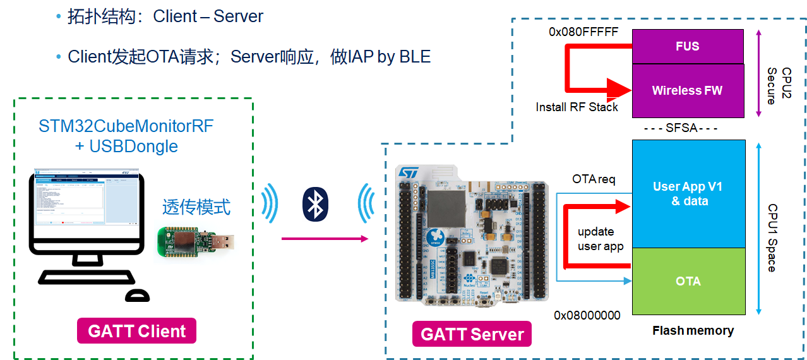

### 升级用户应用

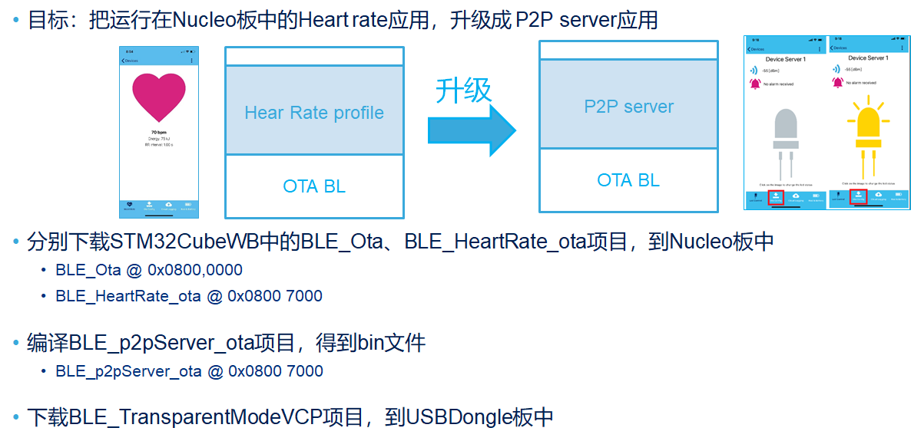

我们先来升级用户应用，目标是从当前的心跳 profile，升级到 P2P server，升级成功后，效果非常直接，运行手机 app， ST BLE sensor，连接设备，界面完全不同。为了达到这个目标，使用 STM32CubeWB 固件包中的三个项目。

- 先把 BLE_OTA 和 BLE_HeartRate_ota 下载到 nucleo 板子上；把 BLE_heartrate_ota 下载到 `0x0800,7000` 处。
- ble_ota 是编译链接在 `0x0800,0000` 地址处，是 Nucleo 板子上电就运行的；它要是没有查到 ota 请求标志，并且 `0x0800,7000` 处有有效代码，则跳转到 `0x800,7000` 运行，执行 heart rate 的心跳 profile 了。
- 否则继续执行 ota 本身，开始准备接收来自 FOTA  客户端的新固件。 这样看下来，整个过程，逻辑上跟我们以前的 IAP by USB， IAP by Ethernet 没有什么区别。

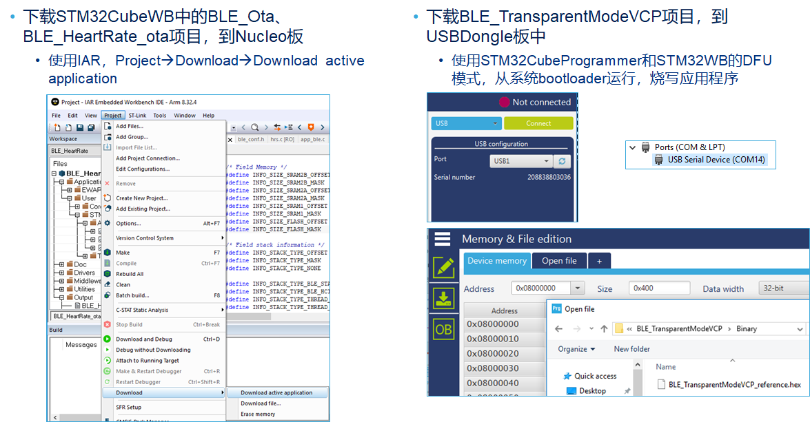

对于 Nucleo 板，要把两个分别链接在两个不同 flash 地址的项目下载下去，可以使用 IAR 里的 Download active application 功能；当然 STM32CubeProgrammer 也有类似功能，大家按照自己的喜好使用不同工具都可以。

对于 Dongle 板，它只有 USB 口，没有 jtag/swd 调试口暴露出来，因此要使用它的系统 bootloader，使用 DFU 的形式，把透传 VCP 的程序下载下去，上位机，就用我们的 STM32CubeProgrammer 即可。烧写好了之后，dongle 板记得恢复到从用户 flash 启动。连到 PC 会看到一个虚拟串口。

### 启动 STM32CubeMonitorRF，并连接 Dongle 设备

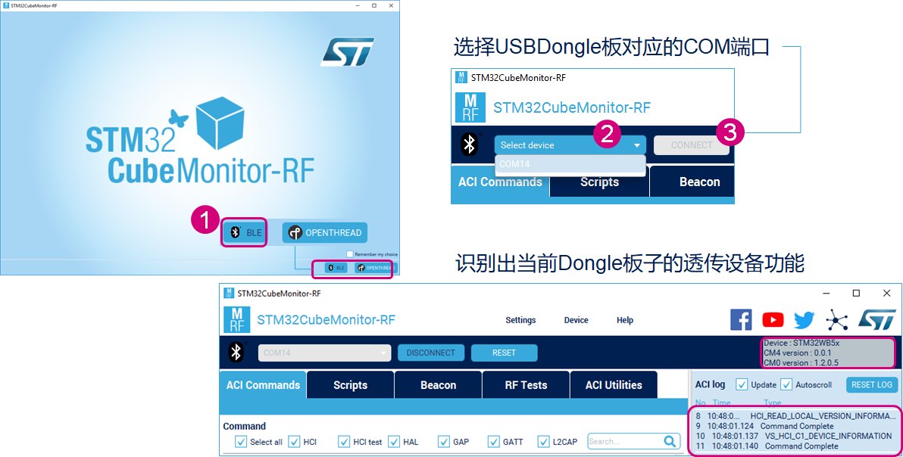

打开 STM32CubeMonitor-RF，在首页选择 BLE 协议；然后在 Select device 这里的下拉菜单中，选择 Dongle 板子对应的 COM 口，这里是 COM14，然后点击 connect。这个连接动作，实际是上位机发一条“获取版本信息”的命令给到 dongle 板。如果它正常工作，就会返回信息，如图右上角。

### 启动 OTA Updater，更新用户应用程序

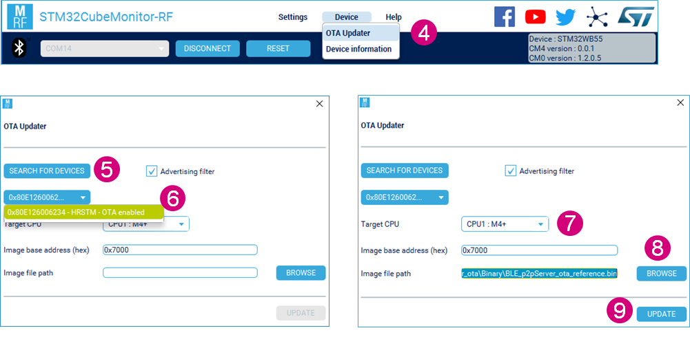

启动 OTA Update 功能，搜寻 OTA 设备，找到之后选中它；

我们现在先来更新用户应用程序，因此 Target CPU，使用默认的 CPU1：M4 即可；固件下载目标地址，使用默认的 `0x7000` 即可，这个值是和待更新的用于程序 P2P_server_ota 的链接地址保存一致的。然后通过 browse 按钮，给出新应用程序 p2pserver_ota 的 bin 文件地址。最后点击 update 即可。

升级完成后，会显示 done 的提示。nucleo 板子当前已经是 P2P sever 了。使用手机 app 的 ST BLE Sensor 可以连接并控制它上面的 LED 灯。

### 启动 OTA Updater，更新 BLE 协议栈

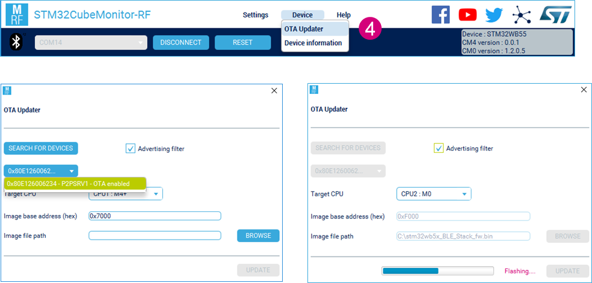

更新 BLE stack 也是一样的操作。现在我们要把 nucleo 板子上的 BLE stack1.1.0 更新到最新的 1.2.0。

也是启动 OTA Update 功能，搜寻 OTA 设备，找到之后选中它；因为要更新 BLE 协议栈，因此 Target CPU，选择 CPU2：M0+；image 下载目标地址，使用默认的 `0xF000` 即可。这个地址是和 OTA bootloader 的代码搭配好的。然后指定 1.2.0  版本 BLE stack image 的地址，点击 Update 即可。

### 再次检验当前版本

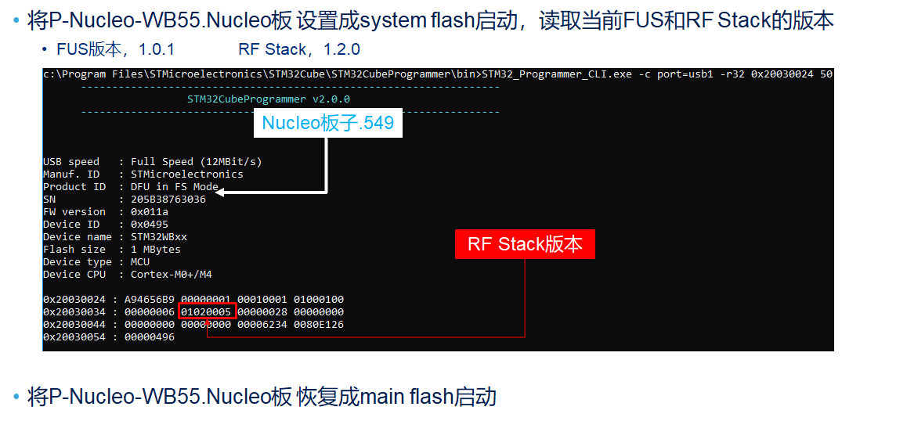

最后，为了验证，我们按照之前的方式，把 Nucleo 板子设置到系统 bootloader 启动，通过 STM32CubeProgrammer 的命令行，读出当前 Nucleo 板子上的 BLE stack 版本，已经从 1.1.0 升级到了 1.2.0，符合预期。

## 架构：用户bootloader – 用户application

通过 BLE 接口，空中无线升级用户应用程序，和 BLE  协议栈，体验完毕后，我们现在来讨论一下 BLE FOTA 的原理和实现。和普通的 IAP 一样，STM32CubeWB 固件包里的 ota 例子，也是采用“用户 bootloader 和用户应用程序这种架构”。

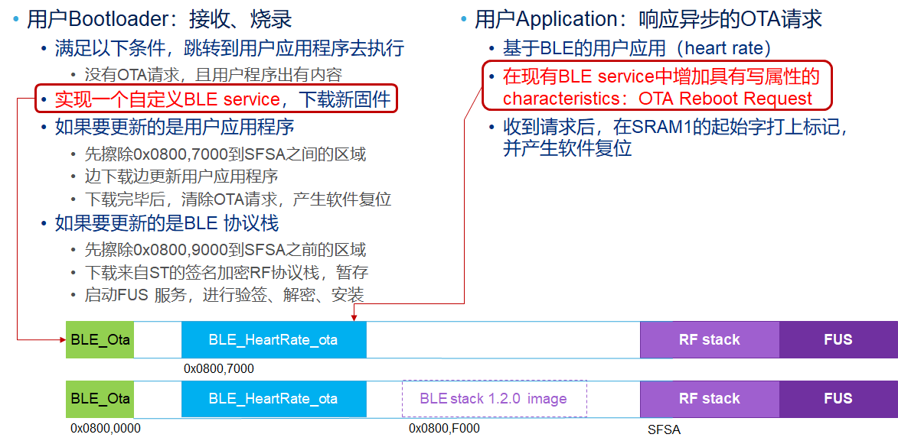

板子上电，先运行用户 bootloader，即图中绿色 OTA 部分。因为之前没有收到来自外界的 fota 请求，并且 `0x08007000` 这里也已经烧好了用户应用，就跳到蓝色部分执行，heart rate profile。heart rate 心跳应用，除了常规的把测量到的心跳值，这里用的是一个模拟值，定期通过 BLE 发出去。我们使用手机 app，ST BLE sensor 可以连接该设备，看到心跳的界面。除了这个常规业务功能，为了实现 OTA 功能，需要在现有的 BLE service 中，比如现在这个 heart rate service 里，增加一个名为 OTA reboot request 的 characteristic。它用来接受发自 OTA client，比如手机 app，或者这里的 CubeMonitor-RF 上位机的固件升级请求。并且用户应用程序，在收到 OTA 请求后，在 SRAM1 的起始位置打上标记并复位。

复位后，先运行绿色的 ota bootloader。这次它检查到了 ota 请求标志，于是就不跳转到蓝色的用户应用执行了，而是继续运行 ota bootloader 的接收新固件程序。这是通过一个 ST 自定义的 BLE service 实现的。

也就是说，这个 BLE FOTA，相比以往传统的 IAP，就是分别在 bootloader 和用户 application，各自增加了一个自定义 BLE service，和一个自定义的 characteristics。我们来看一下细节。

### 自定义 BLE service/char

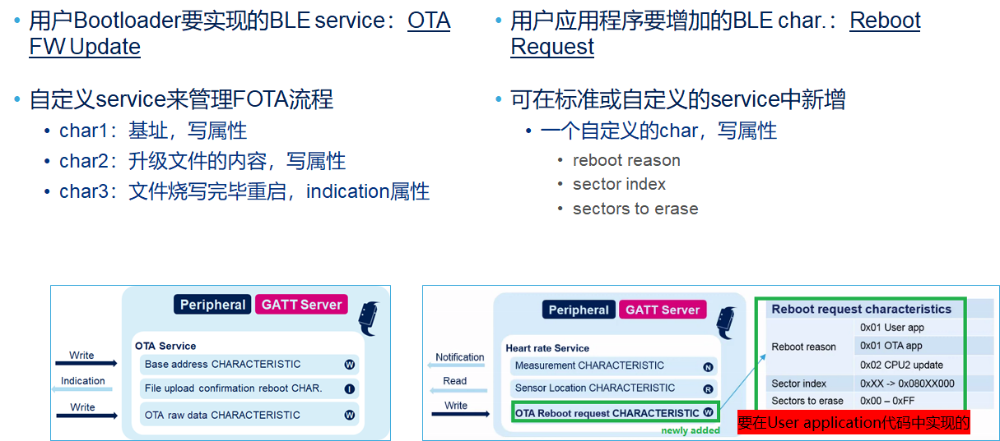

自定义 BLE service/char，用户 bootloader 需要实现一个自定义 BLE service，来管理 FOTA 的流程，它由三个 characteristic 组成：

- 第一个，base address，属性为写，由 OTA 上位机，即 OTA client 发过来的，被 OTA server 上运行的这个用户 bootloader 接收，写到我们自定义的这个 BLE service 的第一个 characteristic；
- 第二个，是升级文件 image 的具体内容，理所当然，它的属性也是写；
- 第三个是一个 indication 属性的 characteristic，它是在 OTA bootloader 完成了固件升级后，要复位重启设备端的一个通知，给到 OTA 上位机。

通过这样一个自定义的 BLE service，ota bootloader 就可以实现来自上位机的新固件文件的接收，烧写、以及过程结束后的状态回复。

另外一方面，用户的业务应用，要在已有的 BLE service 中新增一个具有写属性的 characteristic：“Reboot Request”，它包含三个信息：reboot 的方式，要擦除的起始扇区编号、以及要擦除的扇区个数。这样一个支持 reboot request/重启请求的能力，会在该设备和客户端 AP 建立连接之前的广播阶段，表达出来。

### 广播包自定义信息

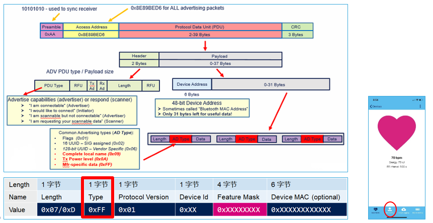

广播报文包，在 PDU 字段，可以表达很多广播信息，根据不同的 AD type，封装不同的 AD 信息。比如常见的有设备发射功率，以 `0x0A` 为广播类型；完整设备名称，以 `0x09` 为广播类型；当广播类型为 `0xff` 时，后面可以封装厂商自定义设备信息。我们借此机会，在4字节的 Feature mask 字段，表达该设备实现了的属性。支持 OTA reboot 的能力，就是在这里有相应的位来表示。具体的厂商自定义规范，可以查阅文档《[AN5247](https://www.stmcu.com.cn/Designresource/design_resource_detail/file/588300/lang/EN/token/df56337227650ed3f44f42524ecdb9b4)》，以及 ST github 上的 STBlue 这个协议。

有了这样的广播信息，以及用户应用中新增了 reboot request 这个 characteristic 后，在常规的 BLE 应用，比如 Heart rate profile 之上，手机 APP ST BLE Sensor 可以识别出来该应用可以支持 OTA，如图：Heart Rate 设备的 footer，第二个图标“ota config”。如果 nucleo 板运行的是 STM32CubeWB 固件包里的普通 heart rate profile demo，手机端识别出来的心跳应用，footer 是没有这个图标的。

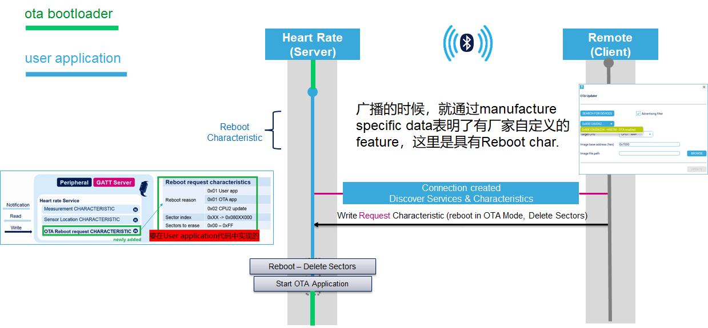

最后，我们来理一下整个 BLE 的通信流程。被升级的 Nucleo 板子就是图中的 Server，Client 是 OTA 上位机，可以是 STM32CubeMonitor-RF，或者 ST BLE Sensor 这样的手机 APP。Server 侧，绿色的线段表示在运行 ota bootloader，蓝色的线段表示在运行 user application。

设备上电，最先运行 ota bootloader，如果没有 ota 请求标志置位，并且后面的扇区有应用程序代码，就跳转到 user application 执行。user application 通常也是一个 BLE 应用，在广播的时候，它通过厂商自定义信息字段，告诉 OTA  上位机它支持 ota reboot 请求。这样上位机，比如 STM32CubeMonitor-RF 才可以 scan 来找到符合要求的 BLE 设备。上位机发起 OTA 请求，往设备写入 reboot 相关信息，reboot 模式、要擦除的扇区；user applicatioin 收到后，在 SRAM 的起始地址打上标记，然后设备重启。起来之后，运行 ota bootloader，即绿色的线条。根据 SRAM 上留下的印记，先擦除对应扇区，然后开始 ota bootloader 的 ble 通信。

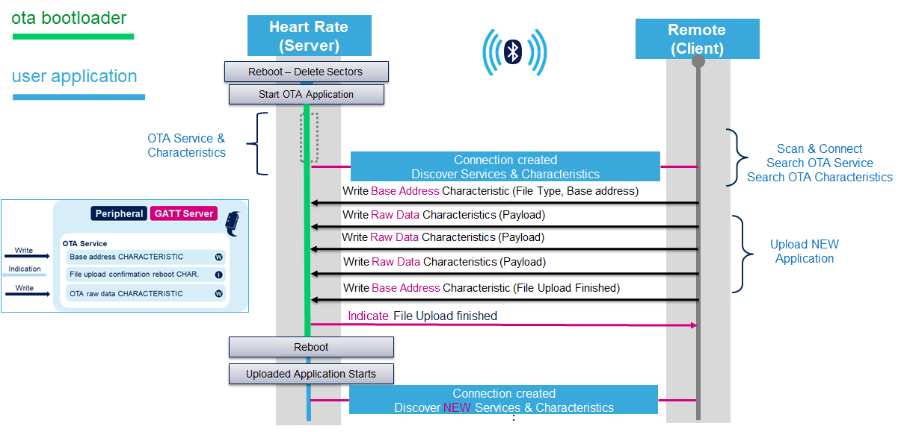

和上位机建立连接后，上位机获得 wb 设备 service 能力和相关 character。然后就通过这个 OTA service，来进行更新文件 image 起始地址、image 内容的下发；并在文件更新完成后，由 WB 设备回传过程结束的信息，并在此复位设备。重启之后，SRAM 中不再有 ota 请求，于是直接跳到应用程序部分开始执行。

## WB固件升级总结

最后，我们总结一下 WB 固件升级的内容。

### 近程升级FUS、RF Stack小结

STM32WB 有两个独立的内核，分别运行 RF 协议栈和用户的应用程序。我们要升级的目标文件是 RF 协议栈和用户应用程序，但是由于 WB 特有的安全特性，运行在 M0+ 内核上的 RF 协议栈都是以被 ST 签名加密过的 image 形式提供给用户，因此需要一个额外的 FUS 来负责对 RF 协议栈的更新。由于 FUS 本身有和 RF 协议栈的版本对应要求，因此在 STM32WB 芯片上，还需要一个额外的 FUS 的更新。

我们通过 USB 和 JTAG/SWD 两种接口，以有线、近程的方式，分别对 USB dongle 板子和 WB Nucleo 板，做了 FUS、和 BLEstack 的升级。

### 无线/空中升级（FOTA）小结

然后，以 WB Nucleo 为对象，上位机使用 STM32CubeMonitor-RF 搭配 USBDongle 板做透传，对 WB Nucleo 板子的 BLE 协议栈和应用程序做了升级到演示。

实际操作一遍更有利于理解关于 STM32WB 的协议栈和应用程序升级哦。

