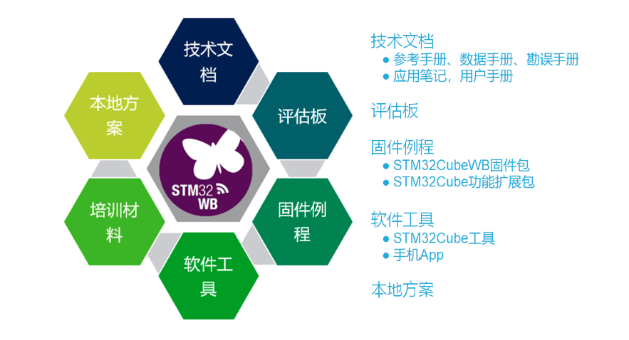
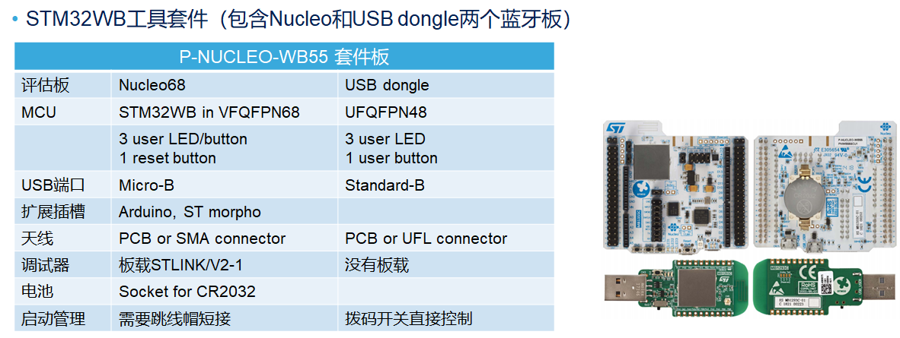
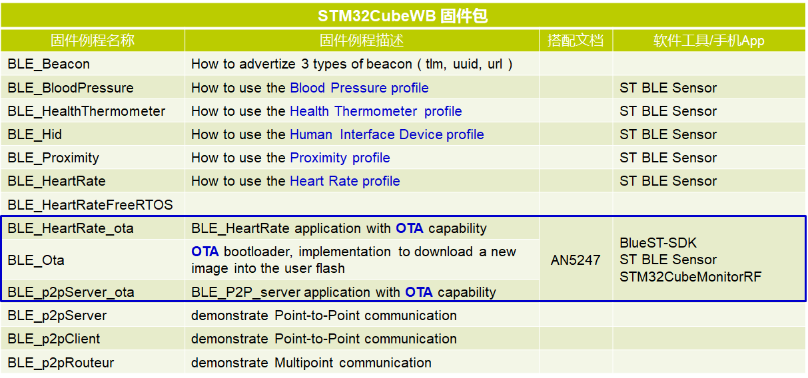
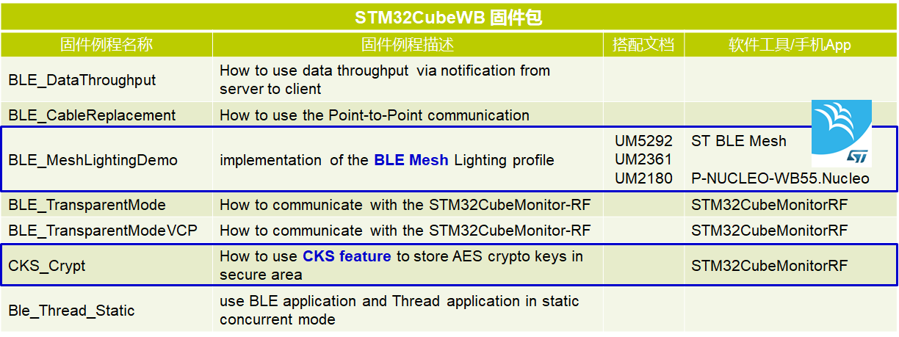
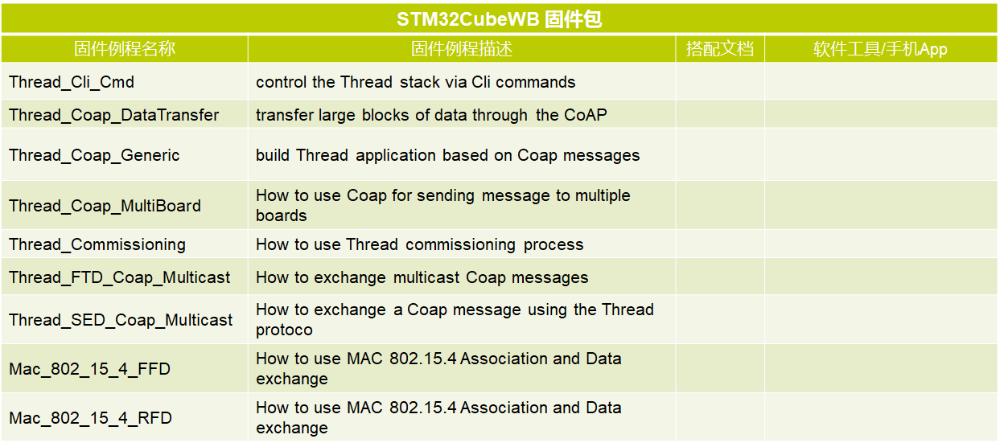
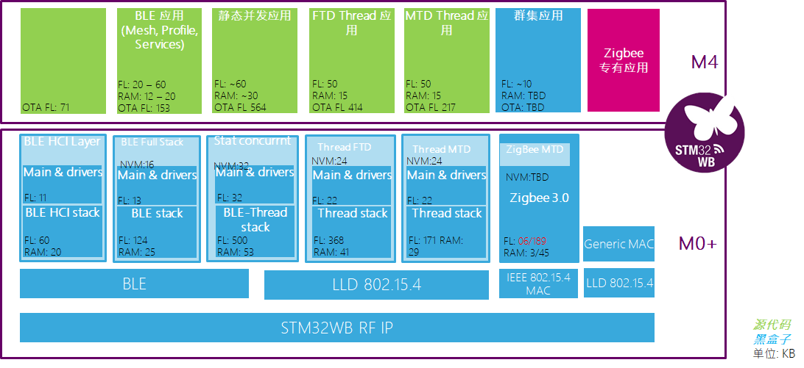
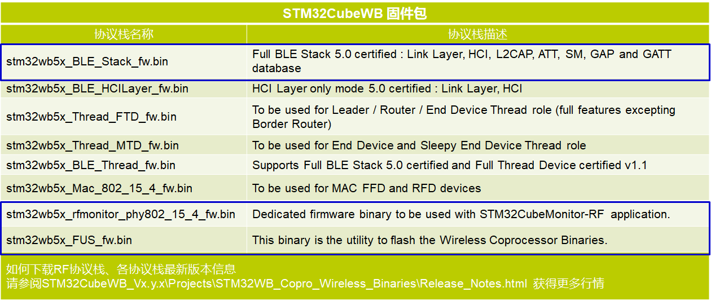
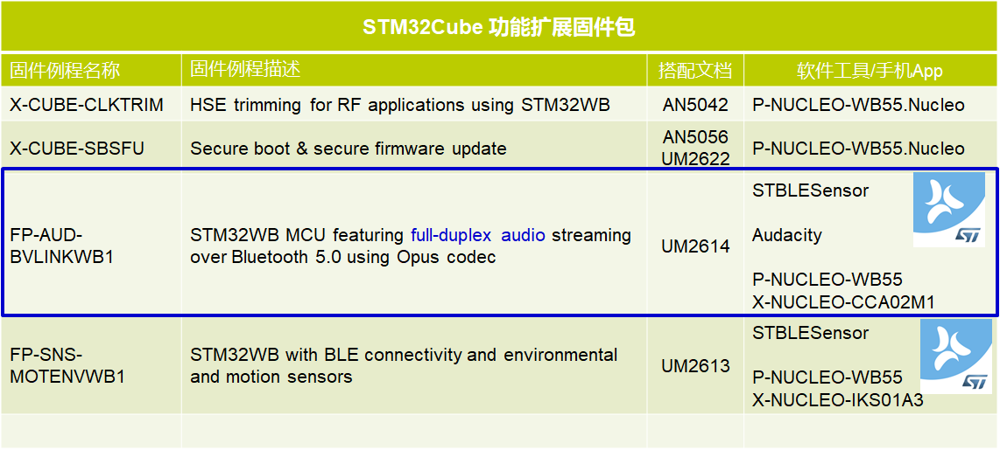
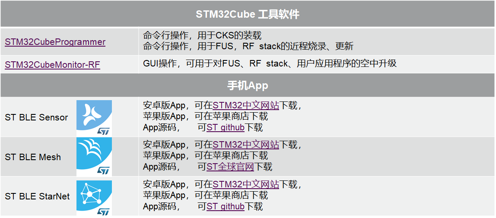

# STM32WB 概览

## 生态系统

从使用角度，ST 官方给开发者提供了以下六类设计资源，帮助用户开展基于 STM32WB 的低功耗蓝牙应用开发。

包括技术文档、评估板、参考固件例程、配合低功耗应用的软件工具、中文培训材料、本地方案（ST本地支持团队和中国合作伙伴开发的方案，都会在这里向大家集中展示），所有资料可以在 [ST中文官网](https://www.stmcu.com.cn/) 找到。

## 技术文档

> 提示：(f) 表示该文档有对应的固件例程

### 基础技术文档

STM32WB 的基础文档，首先是芯片的参考手册。目前 STM32WB 家族里只有一个 55 系列，它的参考手册是 RM0434。它有1500多页，分章节描述了 STM32WB 芯片架构、总线、片上 RAM、Flash、以及各个外设的功能、寄存器说明。WB 主要新增的外设有实现 RSA、ECC 等非对称加解密功能的 PKA 单元，即 public key accelerator（公钥加速器），用于双核通信的 IPCC（inter processor communication controller）和硬件信号量 HSEM 等。

另外还有数据手册、勘误手册。这三份文档是 STM32WB 的基础技术文档。

| 编号                                                         | 名称                              | 备注 |
| ------------------------------------------------------------ | --------------------------------- | ---- |
| [RM0434](https://www.stmcu.com.cn/Designresource/design_resource_detail/file/565195/lang/EN/token/48db20f1dff2d6692fd3cc523e8c0de3) | 《STM32WB55xx系列 参考手册》      |      |
| [DS11929](https://www.stmcu.com.cn/Designresource/design_resource_detail/file/594036/lang/EN/token/4a86d3db67259e7c25e3f9cdef7fe709) | 《STM32WB55xx系列 数据手册》      |      |
| [ES0394](https://www.stmcu.com.cn/Designresource/design_resource_detail/file/565001/lang/EN/token/5b794885f4d7220afb5e40ac594e4c58) | 《STM32WB55xx芯片版本Y 勘误手册》 |      |

### 硬件设计文档

这里的5个应用笔记，都和 STM32WB 的硬件设计使用有关。

| 编号                                                         | 名称                                           | 备注 |
| ------------------------------------------------------------ | ---------------------------------------------- | ---- |
| [AN5042(f)](https://www.stmcu.com.cn/Designresource/design_resource_detail/file/588198/lang/EN/token/a858af711947c7164ee945e16febe347) | 《微调HSE，为STM32WB做射频应用提供高精度时钟》 |      |
| [AN5129](https://www.stmcu.com.cn/Designresource/design_resource_detail/file/588240/lang/EN/token/a765e92a0043c283169819c883508678) | 《STM32WB的2.4GHz低成本PCB天线设计》           |      |
| [AN5165](https://www.stmcu.com.cn/Designresource/design_resource_detail/file/588255/lang/EN/token/cbd79465eb26558221c0dec1e116244c) | 《STM32WB的硬件开发指南》                      |      |
| [AN5290](https://www.stmcu.com.cn/Designresource/design_resource_detail/file/588317/lang/EN/token/f9f95613d1e80c6ee1adf8957b4bc99e) | 《使用STM32WB做低功耗蓝牙应用的最小BOM参考》   |      |
| [AN5246](https://www.stmcu.com.cn/Designresource/design_resource_detail/file/588298/lang/EN/token/391350d5cda142a43876a965642cd16e) | 《如何使用STM32WB的开关电源（SMPS）》          |      |

- 因为 WB 集成了一颗支持低功耗蓝牙应用和 802.15.4 的 RF 收发器，相比以前的 STM32，WB 在硬件 lay 板子的时候，需要额外注意一些问题。【AN5165】是 WB 做射频应用时硬件开发方面总的指南。
- STM32WB 设计的目标之一就是高集成度，在保证优化的射频性能前提下，能让用户尽量减少外部器件的使用，降低 BOM 成本。【AN5290】就以 QFN48 引脚封装的 WB55 芯片为例，并给出了最小系统原理图。 
- “高集成度” 主要体现在 WB 集成了开关电源，以提高 2V 以上供电时的电源转换效率。WB 使用 HSE 外部高速晶振给 RF 模块提供时钟，可通过芯片内部集成的负载电容调节 HSE 精度，无需用户采用外部电容器件。另外两个应用笔记【AN5042】和【AN5246】就是对这两个特性展开的说明。
- 为了进一步节约成本，还可以使用 PCB 天线，只要设计得当，它的性能可以和表贴陶瓷天线相当。【AN5129】对其进行了详细指导和说明。

### 低功耗文档

STM32WB 的主要应用是低功耗蓝牙应用，低功耗是 STM32WB 的主要设计目标之二。

STM32WB 继承了 STM32L4 的低功耗特性，支持多种低功耗模式，以及每个模式下面的子模式选项；低功耗的模拟外设、BAM（批处理获取模式）、灵活的时钟系统。【AN5071】就是对 STM32WB 芯片的低功耗特性概览。

| 编号                                                         | 名称                   | 备注 |
| ------------------------------------------------------------ | ---------------------- | ---- |
| [AN5071](https://www.stmcu.com.cn/Designresource/design_resource_detail/file/588220/lang/EN/token/0eaf0bbe8ff49916269d518232408670) | 《STM32WB 低功耗概览》 |      |

### 固件升级文档

STM32WB 的双核之一，M0+ 内核是专门跑射频协议栈的，对用户或者说对 M4 内核，是一个黑盒子。

要更新 M0+ 上运行的射频协议栈，无论是通过 JTAG/SWD、USB/UART 这样的近程有线，还是通过 BLE 空中升级方式，都必须通过 FUS（即 firmware update service）。注意，这里的 firmware 不是指跑在 M4 内核上的用户应用程序 firmware，而是专指跑在 M0+ 内核上，对用户不可见的射频协议栈 firmware。这是一段芯片出厂就已经固化在 STM32WB 的 secure flash 中的一段程序，永远擦除不掉。

| 编号                                                         | 名称                              | 备注 |
| ------------------------------------------------------------ | --------------------------------- | ---- |
| [AN5185](https://www.stmcu.com.cn/Designresource/design_resource_detail/file/588276/lang/EN/token/72fd83afa098dade5e7a1359a9e48a97) | 《STM32WB 的固件升级服务（FUS）》 |      |
| [AN5247(f)](https://www.stmcu.com.cn/Designresource/design_resource_detail/file/588300/lang/EN/token/df56337227650ed3f44f42524ecdb9b4) | 《STM32WB 空中固件升级》          |      |

芯片出厂时，只有预装了 FUS，没有任何协议栈。需要用户根据自己的应用，使用无线或者有线方式，来把对应的协议栈通过 FUS 写进去。然后才可以继续在 M4+ 内核上开发应用程序。

- 【AN5185】就是对 FUS 的详细说明；
- 【AN5247】是 STM32CubeWB 固件包里的 OTA 例程说明文档。里面描述了这个 ota 样例程序的逻辑，用户使用步骤。这个 ota 程序，不仅可以空中升级 M4 上运行的用户应用程序，也可以空中升级 M0+ 上运行的射频协议栈。

由于 FUS 的存在，射频协议栈，一定是被 ST 公钥签名加密过的。关于 FUS 和 OTA 的使用，我们下一节，有更详细的介绍。

### Mesh 应用文档

BLE Mesh 应用，在 STM32CubeWB中 也有示例程序，这里的三个文档【AN5292】、【UM2180】、【UM2361】，分别是对 BLE Mesh 例程的说明，以及搭配例程使用的手机 app 的说明。

| 编号                                                         | 名称                                | 备注 |
| ------------------------------------------------------------ | ----------------------------------- | ---- |
| [AN5270](https://www.stmcu.com.cn/Designresource/design_resource_detail/file/588306/lang/EN/token/7df728bb5ce94a517cbaba901231178e) | 《STM32WB低功耗蓝牙应用的无线接口》 |      |
| [AN5289](https://www.stmcu.com.cn/Designresource/design_resource_detail/file/588315/lang/EN/token/b77a29279e4161e867ada83da19b0fd6) | 《使用STM32WB搭建无线应用》         |      |
| [AN5292(f)](https://www.stmcu.com.cn/Designresource/design_resource_detail/file/588321/lang/EN/token/c3f1640e1436f939949f075439c5bbf1) | 《使用STM32WB搭建BLE Mesh应用》     |      |
| UM2180                                                       | 《使用安卓应用：ST BlueNRG-Mesh》   |      |
| UM2361                                                       | 《使用苹果应用：ST BlueNRG-Mesh》   |      |

【AN5270】和【AN5289】，更偏向于开发者角度，详细列出了 ACI 层和 HCI 层的事件，比如连接完成，请求 LTK 这些 LE META 事件；比如配对完成、绑定丢失、数值比较这些 ACI 层的 GAP 事件；比如 notification、server confirmation 这样的 ACI 层 GATT/ATT 事件。以及所有协议栈使用的，私有的 HCI 层、GAP、GATT 相关命令。

### 应用笔记/用户手册

| 编号                                                         | 名称                                          | 备注           |
| ------------------------------------------------------------ | --------------------------------------------- | -------------- |
| UM2613(f)                                                    | 《如何使用软件例程：FP-SNS-MOTENVWB1》        |                |
| UM2614(f)                                                    | 《如何使用软件例程：FP-AUD-BVLINKWB1》        | 全双工音频传输 |
| [UM2262(f)](https://www.stmcu.com.cn/Designresource/design_resource_detail/file/592381/lang/EN/token/4639b0b020b4e08abce7e5beff51a610) | 《如何使用软件例程：X-CUBE-SBSFU》            | 安全固件升级   |
| [AN5056(f)](https://www.stmcu.com.cn/Designresource/design_resource_detail/file/588213/lang/EN/token/cc4662538cb48513381dd4eecce9b894) | 《X-CUBE-SBSFU 的集成指南》                   | 安全固件升级   |
| [UM2442](https://www.stmcu.com.cn/Designresource/design_resource_detail/file/592484/lang/EN/token/3bc30437942133993165ec52f4acf5e7) | 《STM32CubeWB 固件包中的 HAL 和底层驱动说明》 | 固件包使用说明 |
| [AN5155](https://www.stmcu.com.cn/Designresource/design_resource_detail/file/588251/lang/EN/token/8e7362ff8e48412ab8502376859f9c19) | 《STM32CubeWB 固件包中的例程说明》            | 固件包使用说明 |
| [UM2550](https://www.stmcu.com.cn/Designresource/design_resource_detail/file/592527/lang/EN/token/065437c191ece5199f3f4c210ab9736f) | 《如何使用 STM32CubeWB 固件包》               | 固件包使用说明 |
| UM2551                                                       | 《STM32CubeWB 固件包中基于 Nucleo 板的例程》  | 固件包使用说明 |

这里的前四个文档，是对三个例程的使用说明，分别是：

- 使用 STM32WB 获取传感器参数，并通过 BLE 发送给手机
- 使用 STM32WB 做全双工的音频传输
- 基于 STM32WB 的 SBSFU，即安全启动和安全固件升级。之前在 STM32CubeWB 固件包里的 ota 例程，对 M4 内核上运行的用户应用程序升级，是明文升级。如果对用户应用程序的升级有加密和认证需求，可以参考这个例程的实现。

## 评估板

接下来，是 ST 官方出品的 STM32WB55，目前唯一一款评估板：订购号，P-Nucleo-WB55 pack。这个套件里包含两块基于 STM32WB55 的板子，如下图所示。

- 一个是 Nucleo 板，板载 QFPN68 引脚封装的 STM32WB，以及 STLINK V2；
- 一个是板载 QFPN48 引脚封装 STM32WB 的 USB dongle 板。

STM32CubeWB 固件包里包含两个板子上的多个例程。Nucleo 板，由于板载了 STLINK，因此烧写程序比较方便；USB dongle 板只能通过 48 引脚 WB 芯片上，系统 memory 里面集成的 bootloader 来烧写应用程序。USB dongle板通常搭配 STM32CubeMonitor-RF 使用。由于需要系统 memory 启动，USB dongle 板引出了拨码开关，方便启动模式的切换。

下节介绍 ota 例程时，会详细说明。

## 固件例程

介绍完了 STM32WB 的技术文档、评估板，我们接下来看一下，ST 目前提供了哪些关于低功耗蓝牙应用的参考例程。

- beacon 和几个 SIG 协会定义的标准 profile，例程都有支持。
- P2P 通信基于自定义 profile，给出了sever，client，router 的实现例程。
- 其中蓝色框中的三个例程演示了如何通过 ota bootloader，把用户应用从 p2p server 更新到心跳 profile。这个例程，Nucleo 板作为 OTA server，OTA server 可以由手机上的 app，ST BLE Sensor 或者 STM32CubeMonitor-RF 来担任。使用后者的时候，需要搭配使用 USB dongle 板。

STM32CubeWB 固件包里还有大家最关心的 BLE Mesh 智能照明应用例程，对应的手机 App 是 ST BLE Mesh。例程的使用，以及手机 app 的使用，都可以参考表格里的文档。

还有一个值得强调的是 CKS 加密这个例程。这不是 BLE 应用的标准场景，而是 STM32WB 芯片特有的安全功能。STM32WB 提供对用户应用 key 的安全存储。在安全环境中，用户把应用 key 放到 STM32WB 的安全存储区域内，之后 M4 的应用就可以使用这些 key 进行加解密运算。key 的存储和使用都很安全，用户通过 index 来操作 key，得到的是明文和密文，永远无法或者 key 本身。key 的存储，可以通过 M4 上的用户存储调用 FUS API，也可以通过 STM32CubeMonitor-RF 来把用户 key 传递给 STM32WB，当然底层也是一样调用的 FUS API。这个例子的讲解，也会在下次介绍来展开。

除了 BLE 协议栈，M0+ 内核还可以运行 OpenThread，以及 generic MAC，基于这两个 RF 协议栈的例程，ST 也提供了若干，如表格中所列。

## RF协议栈

### STM32CubeWB 固件包

下面这张图展示了 STM32WB 芯片支持的多种 RF 协议栈（图中蓝色部分），即可以在 M0+ 内核烧写不同的协议栈；然后在 M4+ 上运行不同类型的用户程序（图中绿色部分）。每一列是一个使用场景，但是彼此独立。比如左边第二列，是最常见的应用，就是 M0+ 里运行 BLE full stack，然后 M4 上跑 BLE 应用，比如 mesh，比如其他标准或者自定义的 profile 和 service。也可以采用第四列，M0+ 里运行 Thread FTD（Full Thread stack），然后绿色的 M4 内核部分运行 Full thread 应用。但是这两种使用场景是不能同时存在的。

目前，6 种 RF 协议栈都已经支持，并且随 STM32CubeWB 固件包一起发布。（STM32CubeWB 1.3.0 版本开始支持 Zigbee 协议栈）

目前（2020年10月），[STM32CubeWB 固件包](https://github.com/STMicroelectronics/STM32CubeWB)最新版本是 1.9.0，最新版本的各种RF协议栈存放在 Project/STM32WB_Copro_Wireless_Binaries 文件夹下面。需要注意的是，所有随 STM32CubeWB 固件包发布的协议栈，都是被 ST 私钥签名加密过的，必须搭配 STM32WB 中的 FUS 才能验签并且解密，然后烧写到 M0+ 内核独享的 secure flash 中。

比如，下表中前6行就是6种 RF 协议栈。后2行一个是 FUS 本身，另一个是用于配合 STM32CubeMonitor-RF 做 STM32WB 板射频性能测试使用的。

FUS 在芯片出厂时已经固化在 STM32WB 中，但是版本默认都是 0.5.3，要想使用 CKS 功能，则需要升级 FUS 版本。现在 STM32CubeWB 固件包里的 FUS 是 v1.0.1。

### STM32Cube 功能扩展固件包

除了 STM32CubeWB 固件包里包含的多个低功耗蓝牙和 Thread 应用的例程，在 STM32CubeWB 固件包之外，还有不少独立的固件例程，来展示 STM32WB 芯片的各种使用案例。

- 调整 HSE 精度以提供 STM32WB 的射频应用高精度时钟。
- 基于 STM32WB 的 SBSFU，即安全启动和安全固件升级。
- 使用 STM32WB 做全双工的音频传输升级。
- 使用 STM32WB 获取传感器参数，并通过 BLE 发送给手机

它们分别搭配的说明文档，在之前讲 STM32WB 的技术文档时，都已经提到过。

## 软件工具

我们提供的丰富的基于 STM32WB 的低功耗蓝牙应用，有的是蓝牙板板子之间的通信，有的是蓝牙板和手机通信。需要用到的手机端 App，源码都公布在 STMicroelectronics 的 [Github](https://github.com/STMicroelectronics) 下；苹果版 App 在苹果商店可以下载，安卓版 App在 STM32 中文网站可以下载。

在做 OTA 和 FUS 更新时候需要用到的 STM32Cube PC 端工具，也都在表格里列了出来。下一节，我们会结合具体使用案例，来展示如何使用。
