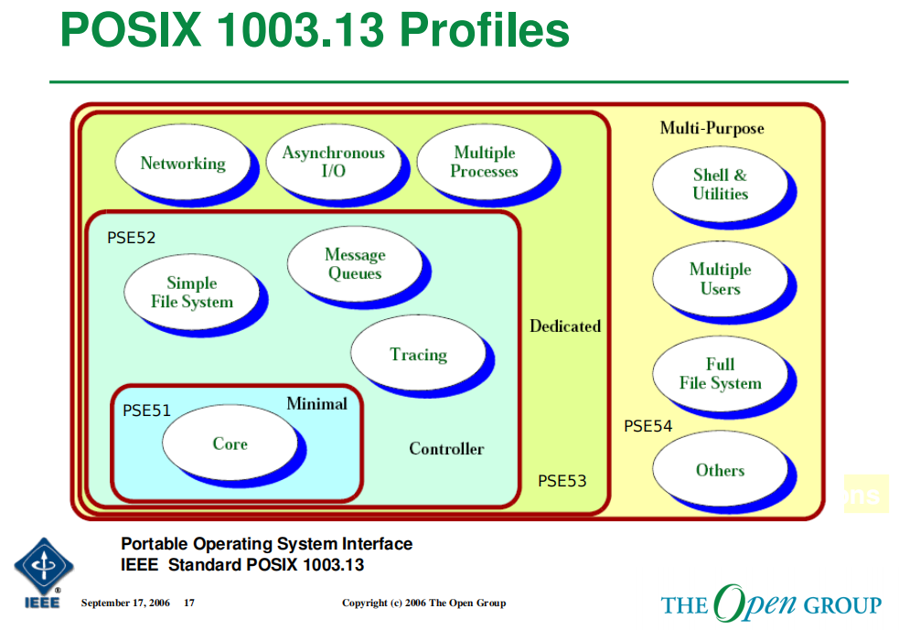
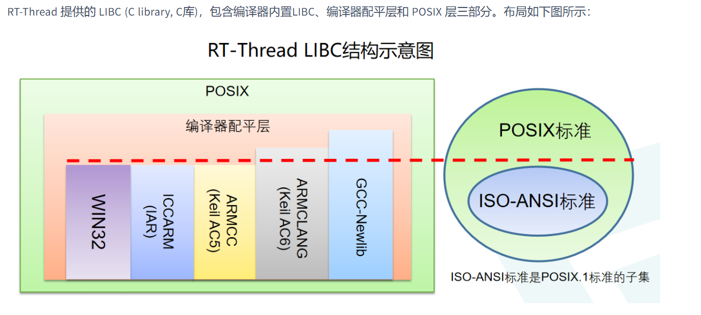
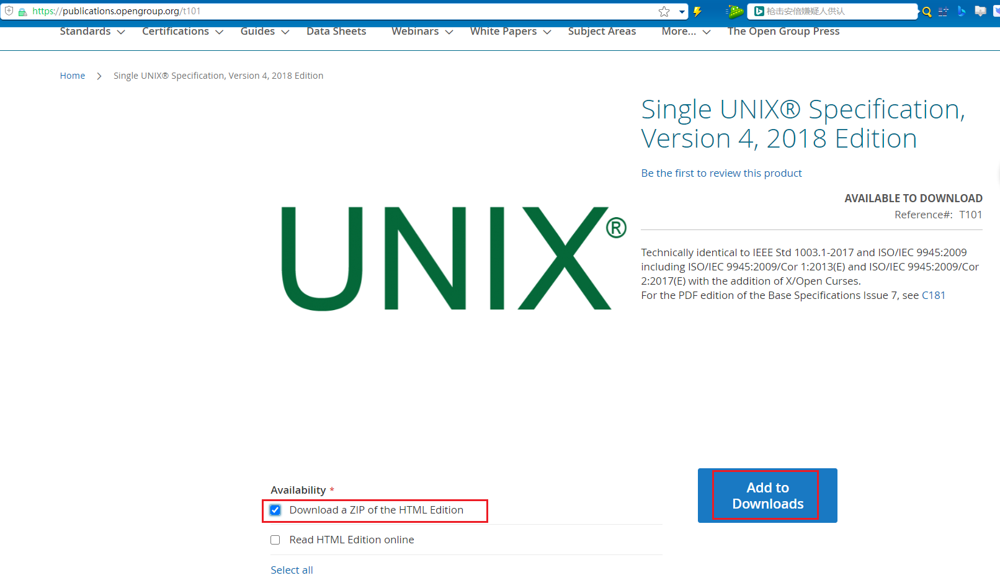
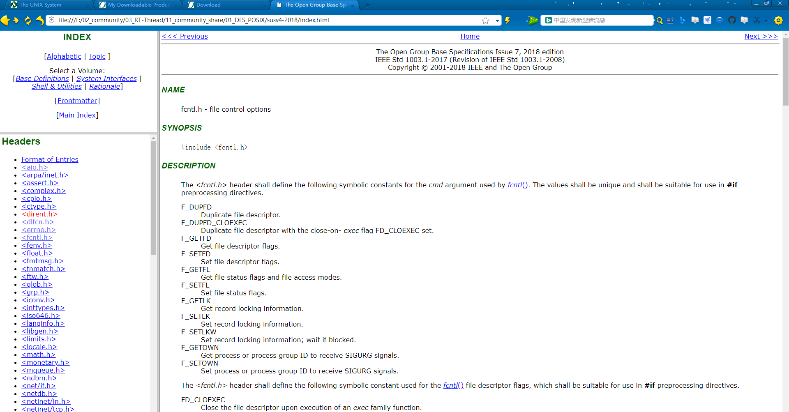
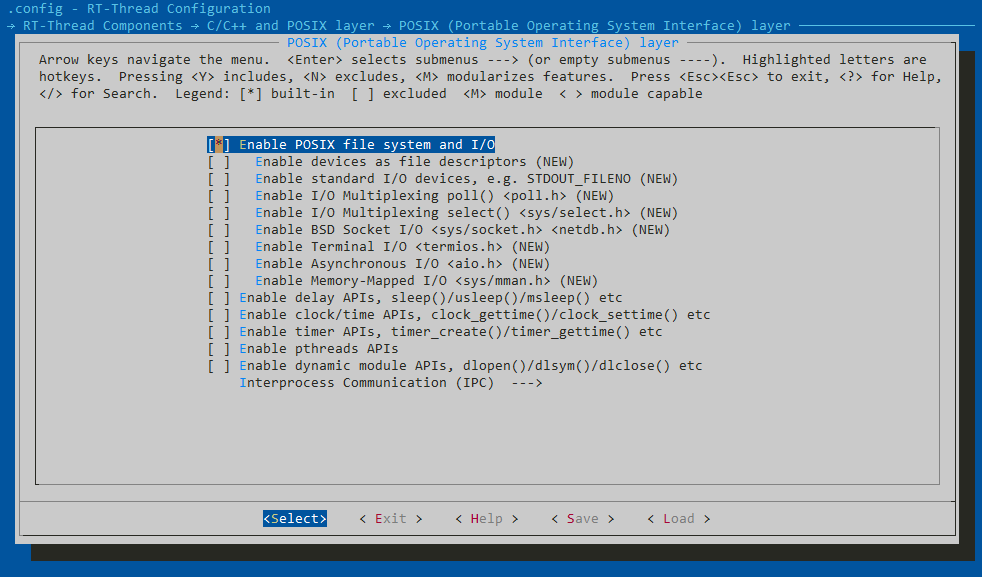
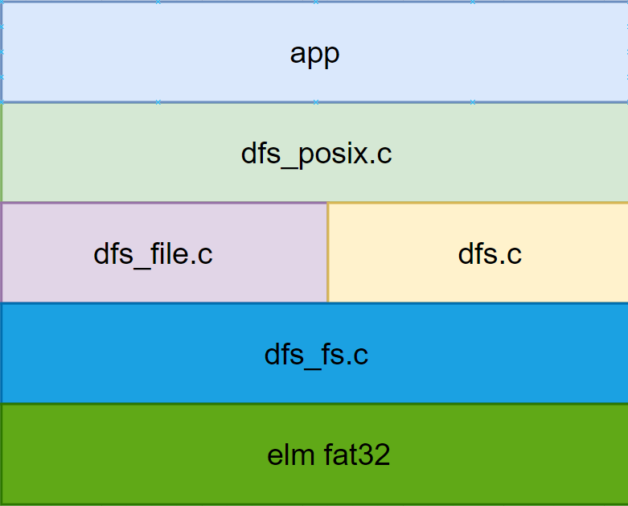

# POSIX 介绍

## 参考资料

- [《UNIX环境高级编程（中文第三版）--高清版.pdf》](https://book.douban.com/subject/25900403)
- [Posix Standard](https://linuxhint.com/posix-standard/)
- [Posix WIKI](https://en.wikipedia.org/wiki/POSIX)
- [RT-Thread 文档中心-POSIX介绍](https://www.rt-thread.org/document/site/#/rt-thread-version/rt-thread-standard/programming-manual/libc/posix/introduction)
- [RT-Thread LIBC](https://www.rt-thread.org/document/site/#/rt-thread-version/rt-thread-standard/programming-manual/libc/introduction?id=isoansi-c)
- [IEEE 官方关于POSIX标准的说明](https://pubs.opengroup.org/onlinepubs/9699919799/toc.htm)


## 简介

`POSIX` 全称 `Portable Operating System Interface `，即可移植操作系统接口，这些接口是IEEE组织定义的，这些接口，在不同的操作系统中，应当都被支持，从理论上来说，使用`POSIX`接口编写的应用程序，运行在不同，但是都支持POSIX标准的操作系统中，是不需要做任何修改就能运行起来的。


目前支持`POSIX`标准的系统有哪些呢？ 目前主流的linux系统，比如ubuntu, centos等，都支持POSIX标准API接口；

对于Windows系统，posix支持情况，可以查看[链接](https://social.technet.microsoft.com/wiki/contents/articles/10224.posix-and-unix-support-in-windows.aspx)，总得来说，windows本身的API接口是不支持posix接口的，但是通过扩展的方式，支持了posix，比如，win10中，通过开启WSL，来支持posix接口


POSIX 为了提供不同层级的RTOS能力，划定了 PSE51, PSE52, PSE53, PSE54 共四个级别；分别对应了四种操作系统。

1. Minimal Real-time System Profile IEEE Std 1003.13 PSE51，基础 RTOS
2. Real-time Controller Profile IEEE Std 1003.13 PSE52，带有简单的文件系统...等
3. Dedicated Real-time Profile IEEE Std 1003.13 PSE53，拥有网络功能...等
4. Multi-Purpose Real-time Profile IEEE Std 1003.13 PSE54，完整的文件系统，带有 Shell 组件...等





## FAQ

[参考链接](https://www.opengroup.org/austin/papers/posix_faq.html)

### 什么是POSIX？什么是 POSIX.1？

POSIX 是 IEEE 的商标。

**POSIX** 是可移植操作系统**接口**的**首字母 **缩写。

POSIX.1是某一个具体的标准，这里指IEEE Std 1003.1-1988，这保持了符号“POSIX”的可读性优势，而不会与 POSIX 系列标准产生歧义。


### **POSIX.1 的最新版本是什么？**

1003.1-2017标准于2018年3月发布。该标准正式名称为：

IEEE Std 1003.1-2017 The Open Group Technical Standard Base Specifications，第 7 期，2018 年版，[该标准的简单介绍](https://www.opengroup.org/austin/papers/backgrounder.html)


### **我可以从哪里下载 1003.1 标准？**

该标准最新版本的 html 版本（包含技术勘误 1）相关资料可从以下网址免费阅读和下载

```
http://www.unix.org/version4/ 
```


下载POSIX.1标准的连接：https://publications.opengroup.org/t101 

> 自己下载的话，需要注册，登陆




## 如何为OS适配POSIX接口

- [下载POSIX.1标准文档](https://publications.opengroup.org/t101 )

  

- 阅读每一个头文件中的描述，该头文件中，说明了，需要定义那些类型，宏，枚举，以及接口等


## RT-Thread OS中POSIX支持情况



- POSIX FILE 相关接口，包含了文件系统的内容，接口比较丰富；标准 I/O 接口，Poll / Select 等较复杂的功能也已经支持
- Delay 相关接口
- Clock 相关接口，对拥有 RTC 硬件，或者没有使用 RTC 硬件的设备都有对应的功能实现
- Timer 相关接口，已经对接到 RT-Thread 的定时器接口，实现对应的函数
- Pthread 相关接口，在多任务编程中使用很广泛
- Dynamic 动态模块
- POSIX 的 标准 IPC 接口 ：pipe ，message，semaphore 等函数
- Socket接口：Enable BSD Socket I/O <sys/socket.h> <netdb.h>后就可以使用BSD Socket接口


## RT-Thread中DFS介绍

### 框架介绍



### 相关资源

[视频链接](https://www.bilibili.com/video/BV1A3411F7Zs/?vd_source=a25fe9d1f3d93c851d172c22091e3512)

[文档连接(可以使用draw.io网址在线打开](./RT-Thread DFS数据结构分析.drawio)
