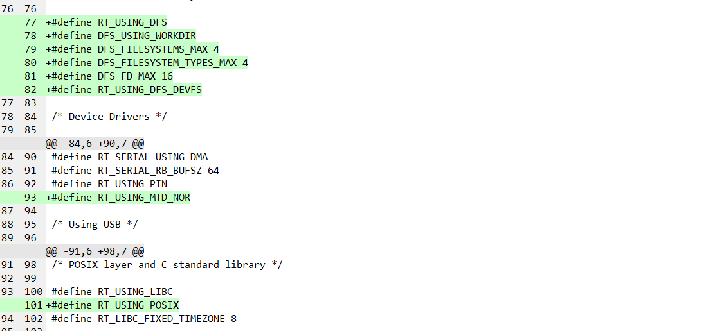
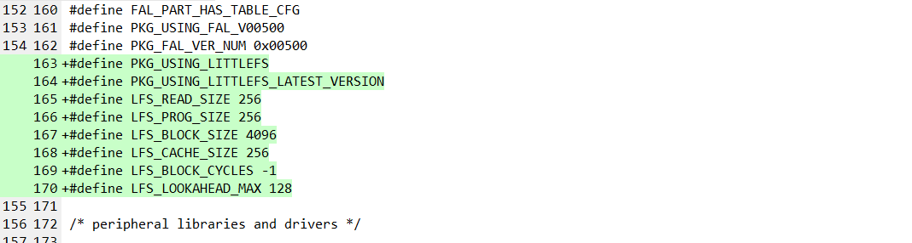

[TOC]

# nRF52832 RT-Thread dmodule适配

## 硬件准备

准备NRF52832开发板，我这里使用的是青风的NRF52832开发板


## 软件准备

- rtthread源码

  ```
  git clone https://gitee.com/rtthread/rt-thread.git
  
  注意： 请使用master分支，master分支和github上保持一致的
  ```

  

- rtthread-app源码

  ```
  git clone https://github.com/RT-Thread/rtthread-apps.git
  ```


## MCU内部储存器

### RAM和FLASH

不同型号，内部资源不完全一致，参考如下说明

备注：青风52832开发板，Device Name为nRF52832-QFAA，内部资源为RAM 64KB, Flash 512KB


### Flash的Page Size

nordic内部flash的管理是通过NVMC（non-volatile memory controller）控制器管理的，page size 大小和block size大小参考文档《nRF52832_PS_v1.4.pdf》第23页

即page size大小为0x1000, block size大小为0x200， 每个page包含了7个block


## nRF52832运行rtthread最小系统

由于，希望适配动态模块的加载，需要使用arm-gcc交叉编译工具链，因此，接下来的操作，都将基于arm-gcc环境操作的，nRF52832的arm-gcc环境，这里以vscode开发为例，在vscode上GCC环境搭建，可以参考如下链接

[在VS Code上使用GCC开发嵌入式应用](https://supperthomas-wiki.readthedocs.io/en/latest/10_jiy/02_gcc_on_vscode/gcc_on_vscode.html)


### 使用GCC编译程序

#### 基本编译环境

在```rt-thread\bsp\nrf5x\nrf52832``` 目录中，使用rtthread env工具打开，执行scons，使用arm-gcc来编译程序，出现如下提示


上面的错误原因，提示很明显，需要设置bsp根目录下的rtconfig.py中的EXEC_PATH，设置GCC交叉编译工具链的路径，这里需要修改的内容如下


根据自己当前的电脑环境设置正确的GCC交叉编译工具链位置，比如我这里设置修改如下

注意，这里由于是windows开发环境，路径是反斜杠，在python环境中，有三种处理方式

- 在字符串前加```r```字母
- 所有反斜杠```'\'```都需要转义
- 将所有反斜杠```'\'```修改成斜杠```'/'```


修改后，再次执行```scons```编译程序，出现如下提示


这里，说明一下，由于nrf5x bsp可以正确运行，还需要加载nrfx hal 库，类似于stm32的hal库，nrfx hal 库使用软件包的形式提供，而不是像stm32中的hal库，已经存在于bsp中，因此这里才会报错，这里我们需要下载对应的软件包


#### 下载nrfx hal 库软件包

在env环境中，执行```menuconfig```命令

- 选择online packages

  


- 选择外设库和驱动

  

- 选择nrfx 库

  


- 选择最新nrfx最新版本

  


- 保存修改

  


- 执行pkgs –update更新nrfx库软件包

  

- 软件包，下载好，继续编译，提示如下错误，由于GCC链接脚本适配异常，这里，我们还需要修改链接脚本

  


#### 链接脚本修改

链接脚本修改为如下内容

```
/* Linker script to configure memory regions. */

MEMORY
{
  ROM (rx) : ORIGIN = 0x00000000, LENGTH = 0x80000  /* 512K FLASH */
  RAM (rw) : ORIGIN = 0x20000000, LENGTH = 0x10000  /* 64K RAM    */
}
ENTRY(Reset_Handler)
_system_stack_size = 0x200;

SECTIONS
{
    .text :
    {
        . = ALIGN(4);
        _stext = .;
        KEEP(*(.isr_vector))            /* Startup code */

        . = ALIGN(4);
        *(.text)                        /* remaining code */
        *(.text.*)                      /* remaining code */
        *(.rodata)                      /* read-only data (constants) */
        *(.rodata*)
        *(.glue_7)
        *(.glue_7t)
        *(.gnu.linkonce.t*)

        /* section information for finsh shell */
        . = ALIGN(4);
        __fsymtab_start = .;
        KEEP(*(FSymTab))
        __fsymtab_end = .;

        . = ALIGN(4);
        __vsymtab_start = .;
        KEEP(*(VSymTab))
        __vsymtab_end = .;

        /* section information for initial. */
        . = ALIGN(4);
        __rt_init_start = .;
        KEEP(*(SORT(.rti_fn*)))
        __rt_init_end = .;

        /* section information for modules */
        . = ALIGN(4);
        __rtmsymtab_start = .;
        KEEP(*(RTMSymTab))
        __rtmsymtab_end = .;

        . = ALIGN(4);
        
        PROVIDE(__ctors_start__ = .);
        KEEP (*(SORT(.init_array.*)))
        KEEP (*(.init_array))
        PROVIDE(__ctors_end__ = .);

        . = ALIGN(4);

        _etext = .;
    } > ROM = 0

    /* .ARM.exidx is sorted, so has to go in its own output section.  */
    __exidx_start = .;
    .ARM.exidx :
    {
        *(.ARM.exidx* .gnu.linkonce.armexidx.*)

        /* This is used by the startup in order to initialize the .data secion */
        _sidata = .;
    } > ROM
    __exidx_end = .;

    /* .data section which is used for initialized data */
    .data : AT (_sidata)
    {
        . = ALIGN(4);
        /* This is used by the startup in order to initialize the .data secion */
        _sdata = . ;

        *(.data)
        *(.data.*)
        *(.gnu.linkonce.d*)

        PROVIDE(__dtors_start__ = .);
        KEEP(*(SORT(.dtors.*)))
        KEEP(*(.dtors))
        PROVIDE(__dtors_end__ = .);

        . = ALIGN(4);
        /* This is used by the startup in order to initialize the .data secion */
        _edata = . ;
    } >RAM

    .stack : 
    {
        . = ALIGN(4);
        _sstack = .;
        . = . + _system_stack_size;
        . = ALIGN(4);
        _estack = .;
    } >RAM

    __bss_start = .;
    .bss :
    {
        . = ALIGN(4);
        /* This is used by the startup in order to initialize the .bss secion */
        _sbss = .;

        *(.bss)
        *(.bss.*)
        *(COMMON)

        . = ALIGN(4);
        /* This is used by the startup in order to initialize the .bss secion */
        _ebss = . ;
        
        *(.bss.init)
    } > RAM
    __bss_end = .;

    _end = .;

    PROVIDE(__etext = __exidx_end);
    PROVIDE(__data_start__ = _sdata);
    PROVIDE(__bss_start__ = __bss_start);
    PROVIDE(__bss_end__ = __bss_end);
    PROVIDE(__StackTop = _estack);

    /* Stabs debugging sections.  */
    .stab          0 : { *(.stab) }
    .stabstr       0 : { *(.stabstr) }
    .stab.excl     0 : { *(.stab.excl) }
    .stab.exclstr  0 : { *(.stab.exclstr) }
    .stab.index    0 : { *(.stab.index) }
    .stab.indexstr 0 : { *(.stab.indexstr) }
    .comment       0 : { *(.comment) }
    /* DWARF debug sections.
     * Symbols in the DWARF debugging sections are relative to the beginning
     * of the section so we begin them at 0.  */
    /* DWARF 1 */
    .debug          0 : { *(.debug) }
    .line           0 : { *(.line) }
    /* GNU DWARF 1 extensions */
    .debug_srcinfo  0 : { *(.debug_srcinfo) }
    .debug_sfnames  0 : { *(.debug_sfnames) }
    /* DWARF 1.1 and DWARF 2 */
    .debug_aranges  0 : { *(.debug_aranges) }
    .debug_pubnames 0 : { *(.debug_pubnames) }
    /* DWARF 2 */
    .debug_info     0 : { *(.debug_info .gnu.linkonce.wi.*) }
    .debug_abbrev   0 : { *(.debug_abbrev) }
    .debug_line     0 : { *(.debug_line) }
    .debug_frame    0 : { *(.debug_frame) }
    .debug_str      0 : { *(.debug_str) }
    .debug_loc      0 : { *(.debug_loc) }
    .debug_macinfo  0 : { *(.debug_macinfo) }
    /* SGI/MIPS DWARF 2 extensions */
    .debug_weaknames 0 : { *(.debug_weaknames) }
    .debug_funcnames 0 : { *(.debug_funcnames) }
    .debug_typenames 0 : { *(.debug_typenames) }
    .debug_varnames  0 : { *(.debug_varnames) }
}

```


如上链接脚本，和bsp\stm32\stm32h750-artpi-h750\board\linker_scripts\link.lds相比仅有如下区别

- 内存分布不一样，CPU型号不同，内存分布必然不一样，右边是nRF52832的

  


- 提供了一些链接符号，给到gcc_startup_nrf52.S启动文件使用，启动文件需要知道这些符号，来初始化bss段，重定向数据端，设置堆栈指针sp等

  


对于启动文件gcc_startup_nrf52.S还有一个注意点，需要说明下，作为一个遗留优化空间吧！

参考stm32的gcc启动文件，好像是并没有栈大小，堆大小的定义


#### 链接脚本分析

- 内存布局分析

  


- PROVIDE关键字

  

在链接脚本中，使用PROVIDE关键，PROVIDE（符号 = 值）， 在汇编或者C语言中，可以直接引用

比如，链接脚本中，提供的这些符号，在如下启动文件中，使用到了


- 参考文档《rombootloader链接脚本分析.md》

  

再提一个主意事项，我在实际测试过程中，menuconfig加载的默认值和Kconfig中配置的不一致，暂不清楚原因，因此，需要menuconfig时，特别加上一个设置MCU资源的配置，配置如下


### 再次编译

- 编译通过，编译后，在bsp根目录生成了rt-thread.elf, rt-thread.bin,rt-thread.hex三个文件

  


- 在env环境中，执行```code .``` 打开vscode

  


- 在vscode环境中编译代码（和在env环境中执行scons一致），点击菜单栏```终端``` -> ```运行生成任务``` 快捷键 ``` ctrl+shift+b```，快速编译代码，编译完成会有如下提示

  


- 进入Debug环境，发现程序可以停在第一条将要执行的指令上了

  


- 打开串口，全速运行，rtthread最小系统运行成功

  


### 查看整个修改点

通过git管理，查看文件的修改情况如下，仅修改了4个文件


## FAL 适配

####  使能fal软件包

- 在线软件包

  


- 系统软件包

  


- fal软件包

  

  

- 使用默认fal配置即可

  


- 保存，并执行```pkgs –update```命令，更新软件包

  


- 使能片上Flash

  


#### 添加配置文件

- 在board目录下新建fal_cfg.h，并加入如下内容

```c
/*
 * File      : fal_cfg.h
 * This file is part of FAL (Flash Abstraction Layer) package
 * COPYRIGHT (C) 2006 - 2018, RT-Thread Development Team
 *
 *  This program is free software; you can redistribute it and/or modify
 *  it under the terms of the GNU General Public License as published by
 *  the Free Software Foundation; either version 2 of the License, or
 *  (at your option) any later version.
 *
 *  This program is distributed in the hope that it will be useful,
 *  but WITHOUT ANY WARRANTY; without even the implied warranty of
 *  MERCHANTABILITY or FITNESS FOR A PARTICULAR PURPOSE.  See the
 *  GNU General Public License for more details.
 *
 *  You should have received a copy of the GNU General Public License along
 *  with this program; if not, write to the Free Software Foundation, Inc.,
 *  51 Franklin Street, Fifth Floor, Boston, MA 02110-1301 USA.
 *
 * Change Logs:
 * Date           Author        Notes
 * 2021-06-26     chenyingchun  the first version
 */

#ifndef _FAL_CFG_H_
#define _FAL_CFG_H_

#include <rtconfig.h>
#include <board.h>

#define ON_CHIP_FLASH_DEV_NAME  "mcu_onchip_flash"
#define ON_CHIP_PARTION_NAME    "filesystem"

/* ===================== Flash device Configuration ========================= */
extern const struct fal_flash_dev mcu_onchip_flash;

/* flash device table */
#define FAL_FLASH_DEV_TABLE \
    {                       \
        &mcu_onchip_flash,  \
    }   
/* ====================== Partition Configuration ========================== */
#ifdef FAL_PART_HAS_TABLE_CFG
/* partition table */
#define FAL_PART_TABLE                                                                                  \
    {                                                                                                   \
        {FAL_PART_MAGIC_WORD, ON_CHIP_PARTION_NAME, ON_CHIP_FLASH_DEV_NAME, 160 * 1024, 268 * 1024, 0}, \
    }
#endif /* FAL_PART_HAS_TABLE_CFG */

#endif /* _FAL_CFG_H_ */

```


- 在application.c中加入如下代码

  

- 编译，运行代码，可以看到fal初始化成功

  


## 虚拟文件系统适配

[虚拟文件系统参考链接 ](https://www.rt-thread.org/document/site/#/rt-thread-version/rt-thread-standard/programming-manual/filesystem/filesystem)

### DFS简介

DFS 是 RT-Thread 提供的虚拟文件系统组件，全称为 Device File System，即设备虚拟文件系统，文件系统的名称使用类似 UNIX 文件、文件夹的风格，目录结构如下图所示


### DFS架构

RT-Thread DFS 组件的主要功能特点有：

- 为应用程序提供统一的 POSIX 文件和目录操作接口：read、write、poll/select 等。
- 支持多种类型的文件系统，如 FatFS、RomFS、DevFS 等，并提供普通文件、设备文件、网络文件描述符的管理。
- 支持多种类型的存储设备，如 SD Card、SPI Flash、Nand Flash 等。

DFS 的层次架构如下图所示，主要分为 POSIX 接口层、虚拟文件系统层和设备抽象层。


#### POSIX接口层

POSIX 表示可移植操作系统接口（Portable Operating System Interface of UNIX，缩写 POSIX），POSIX 标准定义了操作系统应该为应用程序提供的接口标准，是 IEEE 为要在各种 UNIX 操作系统上运行的软件而定义的一系列 API 标准的总称。

POSIX 标准意在期望获得源代码级别的软件可移植性。换句话说，为一个 POSIX 兼容的操作系统编写的程序，应该可以在任何其它 POSIX 操作系统（即使是来自另一个厂商）上编译执行。RT-Thread 支持 POSIX 标准接口，因此可以很方便的将 Linux/Unix 的程序移植到 RT-Thread 操作系统上。


#### 虚拟文件系统层

用户可以将具体的文件系统注册到 DFS 中，如 FatFS、RomFS、DevFS 等，下面介绍几种常用的文件系统类型：

- FatFS 是专为小型嵌入式设备开发的一个兼容微软 FAT 格式的文件系统，采用 ANSI C 编写，具有良好的硬件无关性以及可移植性，是 RT-Thread 中最常用的文件系统类型。
- 传统型的 RomFS 文件系统是一种简单的、紧凑的、只读的文件系统，不支持动态擦写保存，按顺序存放数据，因而支持应用程序以 XIP(execute In Place，片内运行) 方式运行，在系统运行时, 节省 RAM 空间。
- Jffs2 文件系统是一种日志闪存文件系统。主要用于 NOR 型闪存，基于 MTD 驱动层，特点是：可读写的、支持数据压缩的、基于哈希表的日志型文件系统，并提供了崩溃 / 掉电安全保护，提供写平衡支持等。
- DevFS 即设备文件系统，在 RT-Thread 操作系统中开启该功能后，可以将系统中的设备在 /dev 文件夹下虚拟成文件，使得设备可以按照文件的操作方式使用 read、write 等接口进行操作。
- NFS 网络文件系统（Network File System）是一项在不同机器、不同操作系统之间通过网络共享文件的技术。在操作系统的开发调试阶段，可以利用该技术在主机上建立基于 NFS 的根文件系统，挂载到嵌入式设备上，可以很方便地修改根文件系统的内容。
- UFFS 是 Ultra-low-cost Flash File System（超低功耗的闪存文件系统）的简称。它是国人开发的、专为嵌入式设备等小内存环境中使用 Nand Flash 的开源文件系统。与嵌入式中常使用的 Yaffs 文件系统相比具有资源占用少、启动速度快、免费等优势。


### 内部flash挂载文件系统

[RT-Thread--片上 flash挂载 Fatfs 文件系统](https://blog.csdn.net/tyustli/article/details/105809582)

[在STM32L4上应用littlefs文件系统 (rt-thread.org)](https://www.rt-thread.org/document/site/#/rt-thread-version/rt-thread-standard/application-note/components/dfs/an0027-littlefs.md)

通过实测，发现nRF52832挂载FatFs文件系统失败，可能是由于Flash空间大小的问题，因为FatFs需要占用的尺寸比较大，具体深层次原因，并没有仔细调查

下面以挂载littlefs文件系统为例，说明下操作流程

- 开启 / 配置 DFS 框架，为应用程序提供统一的 POSIX 文件和目录操作接口

  

- 使能 littlefs 软件包，注意选择最新版本

  

  

- 使能 MTD 设备

  

- 使能 fal，上面已经操作过该步骤，并测试正常

- 执行```pkgs –update```更新软件包

- 查看经过上面的配置，新增了哪些宏

  

  


- 编译运行代码，littlefs文件系统挂载成功

  


## 动态模块适配

[动态模块 参考链接](https://www.rt-thread.org/document/site/#/rt-thread-version/rt-thread-standard/programming-manual/dlmodule/dlmodule?id=动态模块)

### 基本介绍

在传统桌面操作系统中，用户空间和内核空间是分开的，应用程序运行在用户空间，内核以及内核模块则运行于内核空间，其中内核模块可以动态加载与删除以扩展内核功能。`dlmodule` 则是 RT-Thread 下，在内核空间对外提供的动态模块加载机制的软件组件。在 RT-Thread v3.1.0 以前的版本中，这也称之为应用模块（Application Module），在 RT-Thread v3.1.0 及之后，则回归传统，以动态模块命名。

`dlmodule` 组件更多的是一个 ELF 格式加载器，把单独编译的一个 elf 文件的代码段，数据段加载到内存中，并对其中的符号进行解析，绑定到内核导出的 API 地址上。动态模块 elf 文件主要放置于 RT-Thread 下的文件系统上。


### 功能简介

动态模块为 RT-Thread 提供了动态加载程序模块的机制，因为也独立于内核编译，所以使用方式比较灵活。从实现上讲，这是一种将内核和动态模块分开的机制，通过这种机制，内核和动态模块可以分开编译，并在运行时通过内核中的模块加载器将编译好的动态模块加载到内核中运行。

在 RT-Thread 的动态模块中，目前支持两种格式：

- `.mo` 则是编译出来时以 `.mo` 做为后缀名的可执行动态模块；它可以被加载，并且系统中会自动创建一个主线程执行这个动态模块中的 `main` 函数；同时这个 `main(int argc, char**argv)` 函数也可以接受命令行上的参数。
- `.so` 则是编译出来时以 `.so` 做为后缀名的动态库；它可以被加载，并驻留在内存中，并提供一些函数集由其他程序（内核里的代码或动态模块）来使用。

当前 RT-Thread 支持动态模块的架构主要包括 ARM 类架构和 x86 架构，未来会扩展到 MIPS，以及 RISC-V 等架构上。RT-Thread 内核固件部分可使用多种编译器工具链，如 GCC, ARMCC、IAR 等工具链；但动态模块部分编译当前只支持 GNU GCC 工具链编译。因此编译 RT-Thread 模块需下载 GCC 工具，例如 CodeSourcery 的 arm-none-eabi 工具链。一般的，最好内核和动态模块使用一样的工具链进行编译（这样不会在 libc 上产生不一致的行为）。另外，动态模块一般只能加载到 RAM 中使用，并进行符号解析绑定到内核导出的 API 地址上，而不能基于 Flash 直接以 XIP 方式运行（因为 Flash 上也不能够再行修改其中的代码段）。

### 使用动态模块

当要在系统中测试使用动态模块，需要编译一份支持动态模块的固件，以及需要运行的动态模块。下面将固件和动态模块的编译方式分为两部分进行介绍。

#### 编译固件

- 当要使用动态模块时，需要在固件的配置中打开对应的选项，使用 menuconfig 打开如下配置：

  


- bsp 对应的 rtconfig.py 中设置动态模块编译时需要用到的配置参数，修改点如下
    

- 上面修改内容，说明如下

  ```
  STRIP  = PREFIX + 'strip'
  CXXFLAGS = CFLAGS 
  M_CFLAGS = CFLAGS + ' -mlong-calls -fPIC '
  M_CXXFLAGS = CXXFLAGS + ' -mlong-calls -fPIC'
  M_LFLAGS = DEVICE + CXXFLAGS + ' -Wl,--gc-sections,-z,max-page-size=0x4' +\
                                  ' -shared -fPIC -nostartfiles -nostdlib -static-libgcc'
  M_POST_ACTION = STRIP + ' -R .hash $TARGET\n' + SIZE + ' $TARGET \n'
  #M_BIN_PATH = r'E:\qemu-dev310\fatdisk\root'  # 这个配置可以注释掉
  
  相关的解释如下：
  
  M_CFLAGS - 动态模块编译时用到的 C 代码编译参数，一般此处以 PIC 方式进行编译（即代码地址支持浮动方式执行）；
  M_CXXFLAGS - 动态模块编译时用到的 C++ 代码编译参数，参数和上面的 M_CFLAGS 类似；
  M_LFLAGS - 动态模块进行链接时的参数。同样是 PIC 方式，并且是按照共享库方式链接（部分链接）；
  M_POST_ACTIOn - 动态模块编译完成后要进行的动作，这里会对 elf 文件进行 strip 下，以减少 elf 文件的大小；
  M_BIN_PATH - 当动态模块编译成功时，对应的动态模块文件是否需要复制到统一的地方；
  基本上来说，ARM9、Cortex-A、Cortex-M 系列的这些编译配置参数是一样的。
  ```


- 内核固件也会通过 `RTM(function)` 的方式导出一些函数 API 给动态模块使用，这些导出符号可以在 msh 下通过命令```list_symbols```列出固件中所有导出的符号信息。`dlmodule` 加载器也是把动态模块中需要解析的符号按照这里导出的符号表来进行解析，完成最终的绑定动作。

- 这段符号表会放在一个专门的，名字是 RTMSymTab 的 section 中，所以对应的固件链接脚本也需要保留这块区域，而不会被链接器优化移除掉。可以在链接脚本中添加对应的信息：

  ```
  /* section information for modules */
  . = ALIGN(4);
  __rtmsymtab_start = .;
  KEEP(*(RTMSymTab))
  __rtmsymtab_end = .;
  ```


- 编译时提示没有定义```rt_hw_us_delay```函数，我们参考其他bsp，在board.c中添加该函数

  ```
  /**
   * The time delay function.
   *
   * @param microseconds.
   */
  void rt_hw_us_delay(rt_uint32_t us)
  {
      rt_uint32_t ticks;
      rt_uint32_t told, tnow, tcnt = 0;
      rt_uint32_t reload = SysTick->LOAD;
  
      ticks = us * reload / (1000000 / RT_TICK_PER_SECOND);
      told = SysTick->VAL;
      while (1)
      {
          tnow = SysTick->VAL;
          if (tnow != told)
          {
              if (tnow < told)
              {
                  tcnt += told - tnow;
              }
              else
              {
                  tcnt += reload - tnow + told;
              }
              told = tnow;
              if (tcnt >= ticks)
              {
                  break;
              }
          }
      }
  }
  ```


- BSP 工程目录下执行 `scons` 正确无误地生成固件

  

- 在 BSP 工程目录下执行一下命令```scons --target=ua -s```来生成编译动态模块时需要包括的内核头文件搜索路径及全局宏定义，执行成功，有如下LOG打印

  


- 生成了rtup.py文件

  

  


- 至此，相当于内核运行环境已经编译好了，并导出了编译动态模块时所需要到的一些头文件搜索路径


#### 编译动态模块

在 github 上有一份独立仓库： [rtthread-apps](https://github.com/RT-Thread/rtthread-apps) ，这份仓库中放置了一些和动态模块，动态库相关的示例。

- 录结构如下：
| **目录名** | **说明**                                          |
| ---------- | ------------------------------------------------- |
| cxx        | 演示了如何在动态模块中使用 C++ 进行编程           |
| hello      | 最简单的 `hello world` 示例                       |
| lib        | 动态库的示例                                      |
| md5        | 为一个文件产生 md5 码                             |
| tools      | 动态模块编译时需要使用到的 Python/SConscript 脚本 |
| ymodem     | 通过串口以 YModem 协议下载一个文件到文件系统上    |


可以把这份 git clone 到本地，然后在命令行下以 scons 工具进行编译，如果是 Windows 平台，推荐使用 RT-Thread/ENV 工具。

进入控制台命令行后，进入到这个 rtthread-apps repo 所在的目录（同样的，请保证这个目录所在全路径不包含空格，中文字符等字符），并设置好两个变量：

- RTT_ROOT - 指向到 RT-Thread 代码的根目录；
- BSP_ROOT - 指向到 BSP 的工程目录；


在rtthread-apps目录中，打开env环境，使用命令scons --app=hello编译hello动态模块， 下面报错了，提示找不到rtua.py


出现上面的错误，请查看电脑系统环境变量是否设置了RTT_ROOT了，如果有，请先删除，这里编译动态模块所需要的的RTT_ROOT必须是和编译BSP在一起的RTT


- 排除以上错误后，再次编译动态模块，又提示如下错误

  

- 上面的错误，是有bsp目录下rtconfig.py中未定义CXX导致，定义后，再次编译

  

- 继续编译，又提示错误

  


- 上面的错误，经过定位是rt-thread/tools/building.py中，执行是，交叉编译工具链的位置没有找到，暂时还不清楚哪里配置不对，暂且写死，绕过，后续再继续查找原因

  


- 继续编译成功

  


### 加载动态模块

接下来需要将成功编译后的动态模块加载到文件系统中，动态执行，由于我们是内部的flash，无法将编译生成的hello.mo拷贝到文件系统中，那么至少有两种方法，一种，使用ymodem协议，下载hello.mo文件到文件系统中，另一种是在程序中，将hello.mo，写死到文件系统中，这里我们先使用相对简单的方法二测试，方法一，等后续有时间继续实现


- 测试，当执行hello.mo时，出现hardfault

  


- 经过调查，是因为fal分区时，给app应用程序分别的存储空间小于固件编译后的尺寸，因此再加载动态模块时，出现了hardfault，调整fal_cfg.h中的分区，大于固件编译后的尺寸（229032Bytes）

  

- fal_cfg.h调整内容如下

  

- 成功执行动态模块hello.mo

  

- 修改文件列表如下

  


