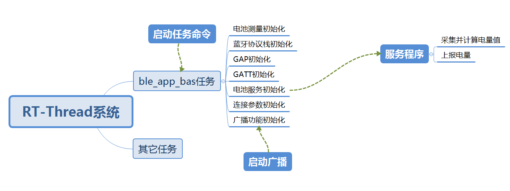

# ble_app_bas总结


## 1 简介

​		此ble_app_bas是nordic nrf5x系列芯片的蓝牙从设备（Slave）应用程序。基于Nordic nRF5_SDK_16 的软件包移植而成。


​		支持RT-Thread实时嵌入式系统。作为RT-Thread软件包nrf5x_sdk的例程，可通过RT-Thread 开发辅助工具Env直接配置到RT-Thread系统工程中。


​		nrf5x_sdk软件包网址：https://github.com/supperthomas/nrf5x_sdk

## 2 功能

​		ble_app_bas应用程序实现了向蓝牙主设备（Master）发送电量值。


​		功能有一个服务，服务包括电池电量特性。特性支持读、通知。

## 3 软硬件平台

​		硬件平台是nordic的nrf5x系列开发板。


​		软件平台是nrf5x系列芯片的RT-Thread嵌入式系统工程，工程需要包含nrfx和nrf5x_sdk两个软件包，Nordic ble协议栈s140，片上外设配置包含UART，ADC和GPIO。

## 4 试验

​		程序工程配置、加载、编译、下载、连接过程，参考ble_app_blinky介绍。

## 5 软件结构



## 6 程序

程序调用接口主要有：

协议栈softdevice s140的通用接口函数，在nrf5x_sdk包softdevice的文件夹下。


rt-thread与nrf5x_sdk适配接口函数，在nrf5x_sdk包rtt_adapter文件夹下。


nrf5x_sdk包含的ble服务组件层接口函数，在ble_bas.c和ble_bas.h里面。是在协议栈softdevice s140的API接口之上封装的模块工具，可用于为电池电量服务的app提供添加服务，添加特性，注册事件句柄。


rt-thread的adc设备组件接口。

### 6.1 创建任务和定时器

```c
int ble_app_bas(void)
{
    static rt_thread_t tid1 = RT_NULL;
    tid1 = rt_thread_create("softdevice",
                        ble_app_softdevice, RT_NULL,
                        4096,
                        22, 5);//创建电池测量的任务
    if (tid1 != RT_NULL)
        rt_thread_startup(tid1);
    
    rt_timer_t timer1 = rt_timer_create("measure_battery_level", 
                                        measure_battery_level_timerout, 
                                        RT_NULL, 
                                        rt_tick_from_millisecond(1000), 
                                        RT_TIMER_FLAG_PERIODIC | RT_TIMER_FLAG_SOFT_TIMER);//创建采集电量的定时器，在定时回调函数中测量和计算电量
    if (timer1 != RT_NULL)
        rt_timer_start(timer1);
    
    return RT_EOK;
}
```


### 6.2 测量电量的初始化工作

```c
/**@brief Function for initializing measure battery module.
 */
void measure_battery_init(void)
{
    drv_nrfx_saadc_channel_t channel_config;//定义adc配置变量
  
    //set adc channel,use saadc channel 0, input pin is AIN1.
    channel_config = (drv_nrfx_saadc_channel_t){.mode = 0, //设置adc的单端模式
                                                .pin_p = ADC_INPUT_PIN, //设置ad采集引脚
                                                .pin_n = 0, //单端模式无效
                                                .channel_num = ADC_CHANNEL_NUM //设置adc通道号
                                               };
    
    //find adc deveice,and add channel data.
    adc_dev = (rt_adc_device_t)rt_device_find(ADC_NAME);//获取adc的设备指针，名称是"adc"
    adc_dev->parent.user_data = &channel_config;//adc设备用户数据指向配置变量，使能adc通道的时候将该用户数据传入并配置好。
    
    //config adc channel,enable channel.
    rt_adc_enable(adc_dev, channel_config.channel_num);//配置和使能adc通道          
}
```


### 6.3 定时器回调测电量

```c
static void measure_battery_level_timerout(void *param)
{ 
    rt_uint32_t result;
    float voltage;
    uint8_t battery_level;
    
    //read value of adc channel 0
    result = rt_adc_read(adc_dev, ADC_CHANNEL_NUM);//读取adc采样值
     
    //(V(P) – V(N)) = (RESULT * 3.6) / 4096
    voltage = (result * 3.6) / 4096;//计算电压值，adc默认配置后的基准电压是3.6V，12位。
        
    //calculate battery level
    battery_level = calc_batt_level(voltage);//电压换算电量值
    
    ble_bas_battery_level_update(&m_bas, battery_level, BLE_CONN_HANDLE_ALL);//蓝牙上报电量。
}
```

### 6.3 换算电量值

```c
/**@brief Function for calculate battery level.
 */
uint8_t calc_batt_level(float volt)
{
    float batt_level;
    
    //suppose battery level 0%-100%,the voltage is 2.7v-4.2v
    if((volt*10) < 27)
    {
        batt_level = MIN_BATTERY_LEVEL;
    }
    else if((volt*10) > 42)
    {
        batt_level = MAX_BATTERY_LEVEL;
    }
    else
    {
        batt_level = ((volt * 10 - 27)/(42-27)) * 100;
    }
    
    return (uint8_t)batt_level;
}
```

此处电量换算方法是，假定0%-100%的电量对应 2.7v-4.2v电压值，认为成线性关系。应用中使用者需要根据自己采样电路的分压比例，确定出采集的电压值。不同类型的电池有不同的电压和电量对应关系，依据电压和电量关系算出电量值。

### 6.4 其它

​		ble初始化的程序介绍，参考ble_app_blinky例程的介绍。