# 【直播回顾】STM32WB，开启"无线"新市场！

STM32Wx为无线系列产品，其规划，包括三类WB、WL及未来的LTE、NB-IOT、UWB系列

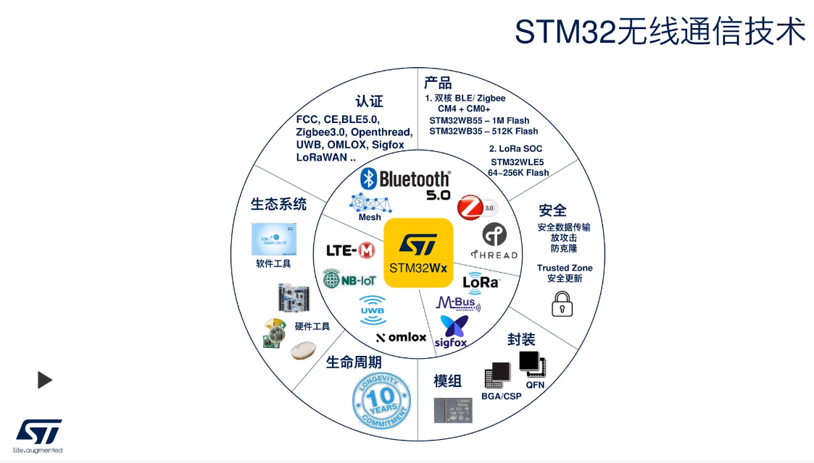

## WB的特点

1. 双核
2. 支持多种协议栈
3. STM32生态支持

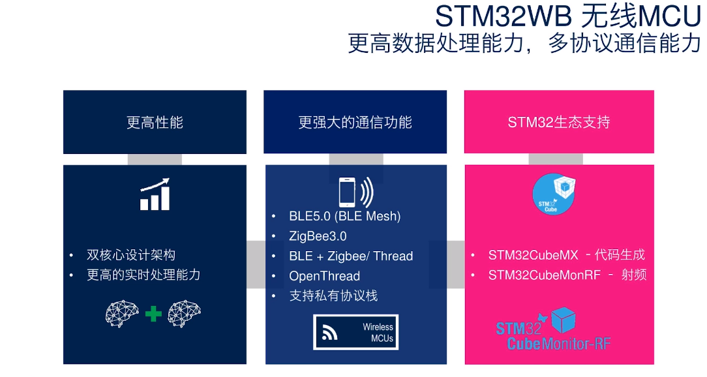

### 芯片参数

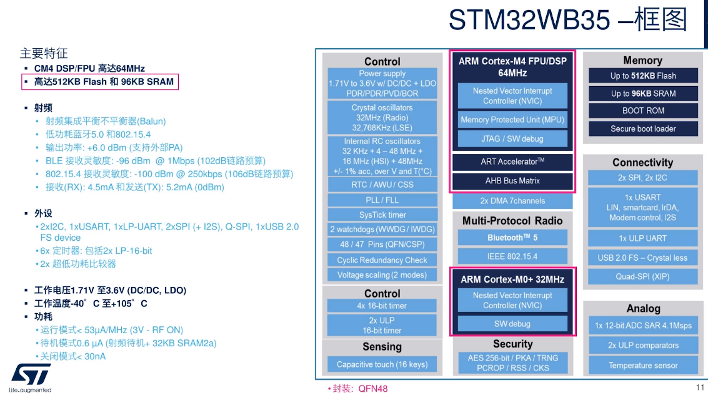

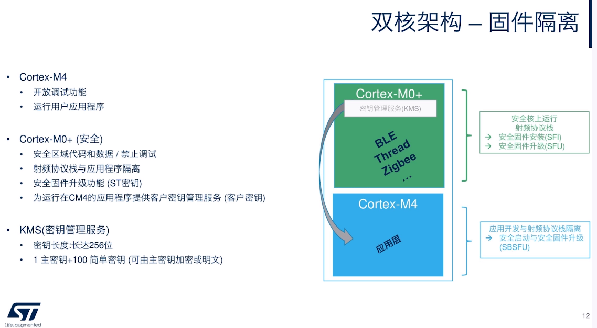

### 协议栈支持情况

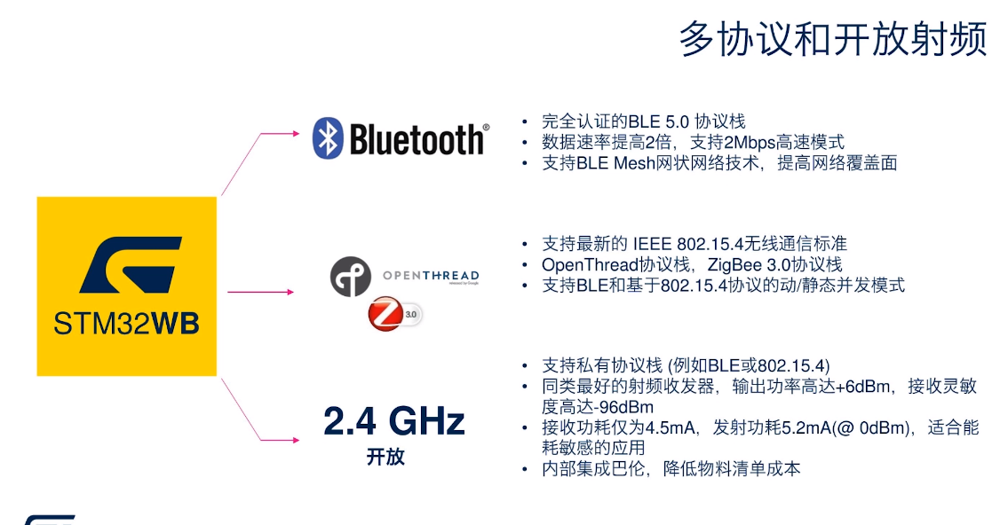

- 可支持静态和动态多协议，支持多协议并发

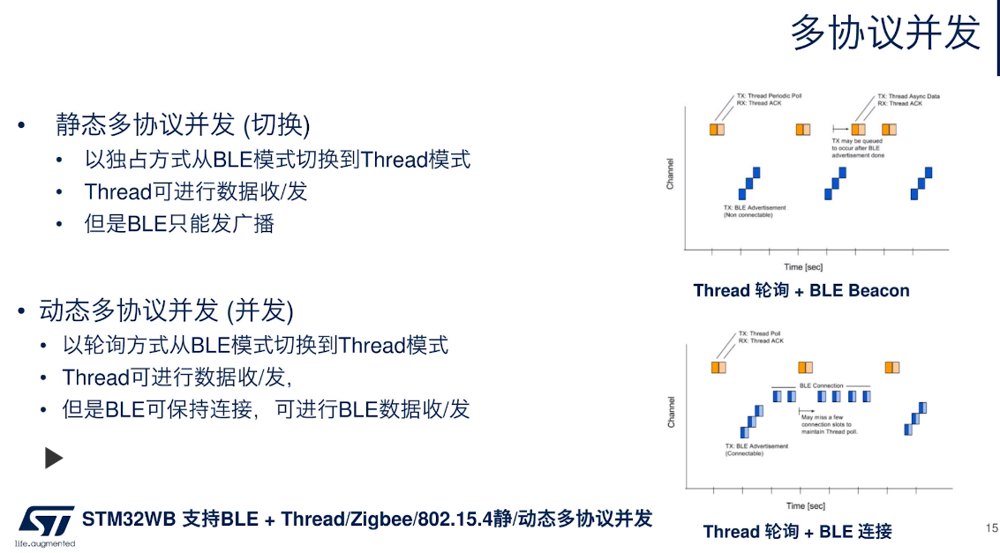

- 支持BT+thread
- 支持bt+zigbee
- 支持BT+802.15.4私有网络

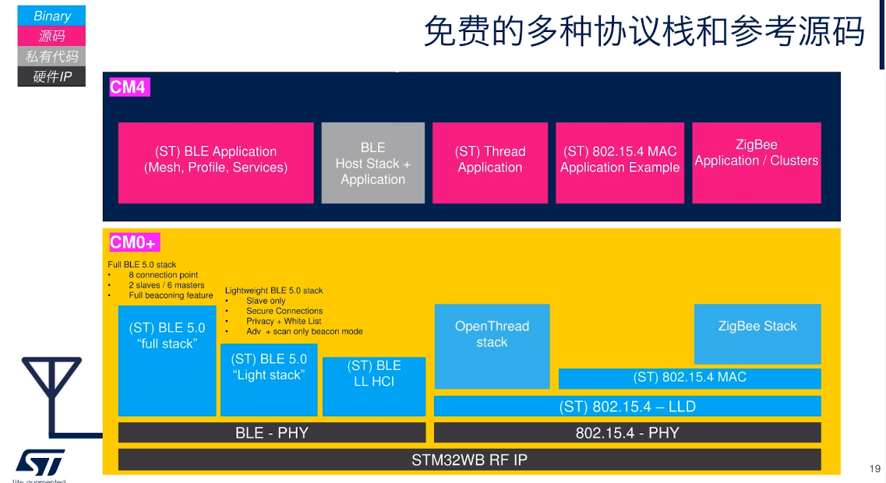

### 芯片差别

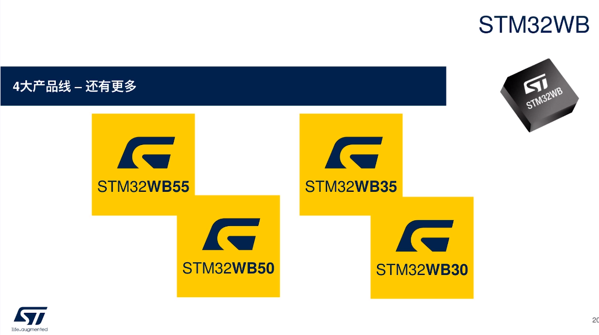

- 外设资源和性能不同
- 协议栈的多并发支持情况不同

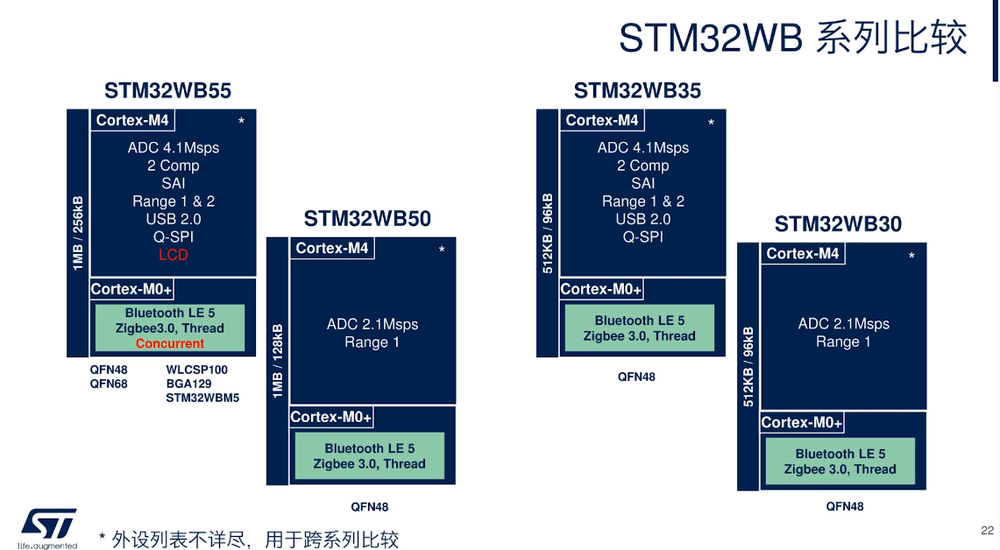

#### WB55/35差别

#### WBx5/x0差别

## 设计

### 阻抗匹配

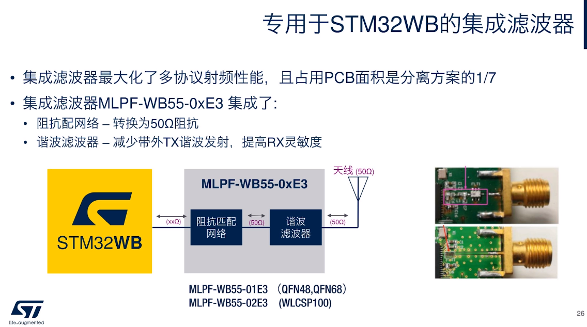

### 原厂模组

## 开发生态

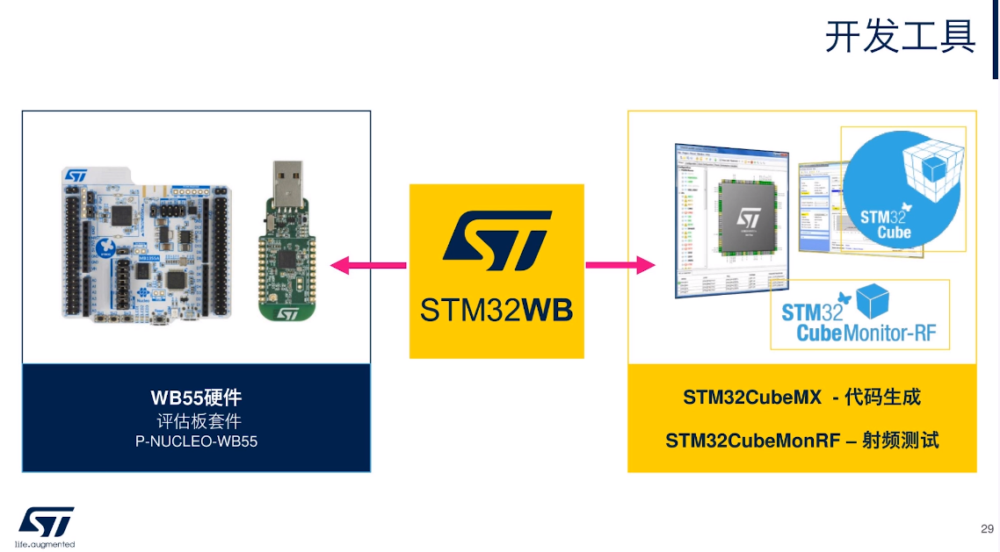

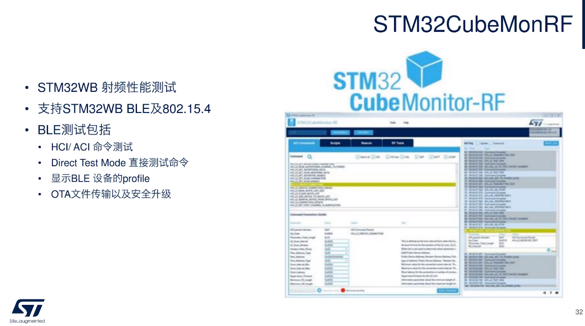

## 总结

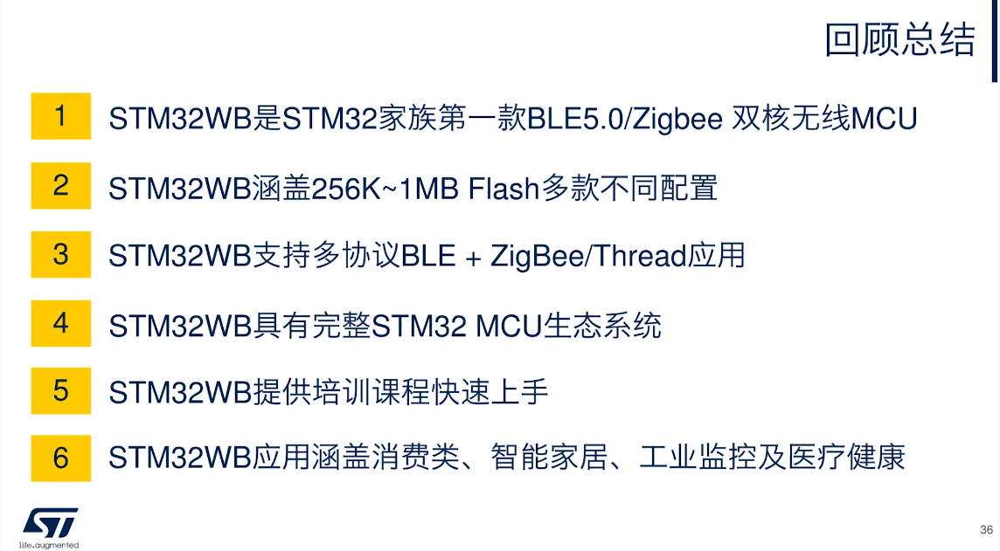