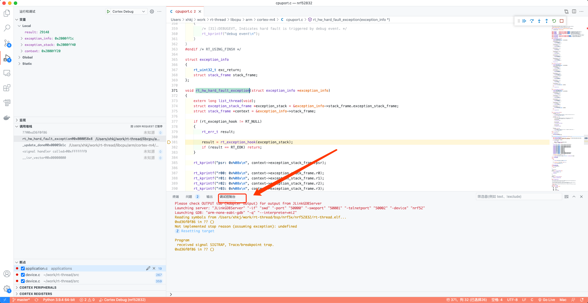
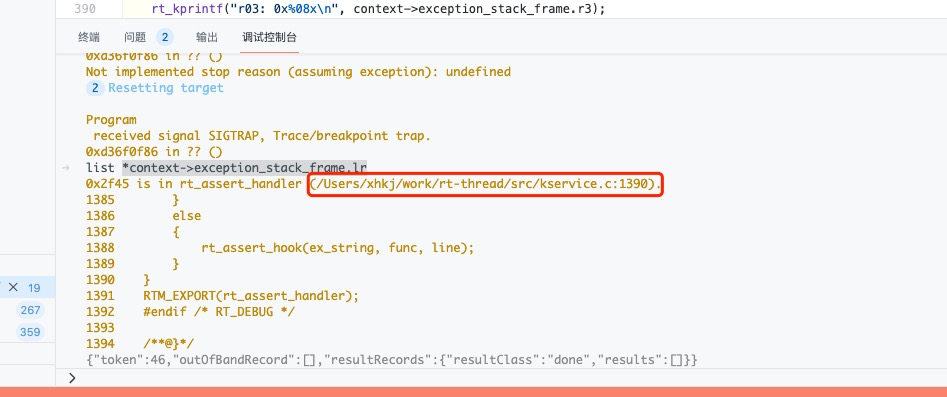

# VS Code中定位HardFault的方法

相关概念：

> LR（Link Register），连接寄存器的英文缩写，在ARM体系结构中LR的特殊用途有两种：一是用来保存子程序返回地址；二是当异常发生时，LR中保存的值等于异常发生时PC的值减4（或者减2），因此在各种异常模式下可以根据LR的值返回到异常发生前的相应位置继续执行。

异常之后打开调试控制台：



在控制台中输入：

```python
list *context->exception_stack_frame.lr
```

此时会显示lr部分的代码：



此时按住Ctrl点击代码路径即可在编辑器中打开出错位置的代码，如无法跳转请在VS Code配置文件`c_cpp_properties.json`的`includePath`中添加对应代码库的路径后重试。