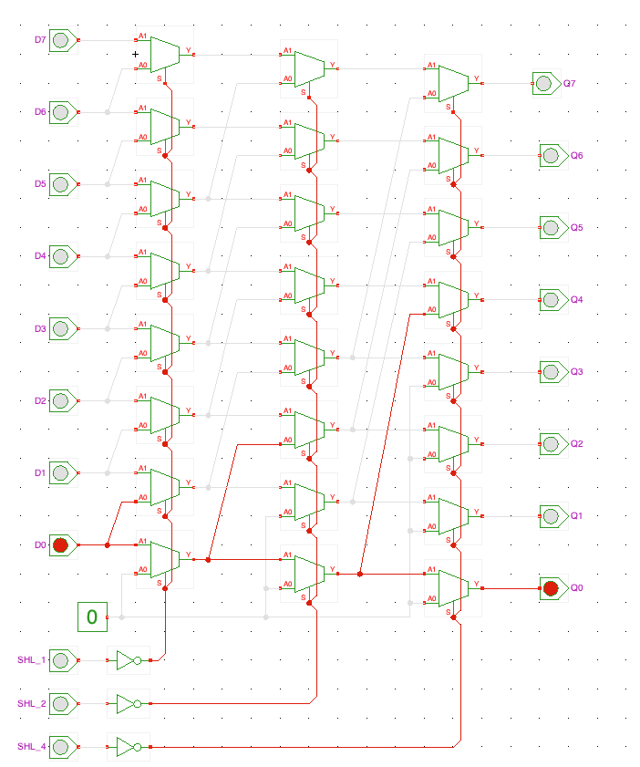
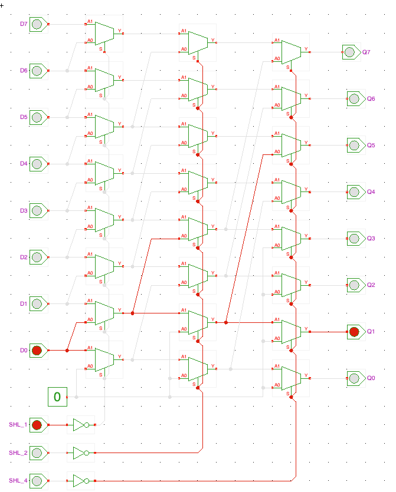
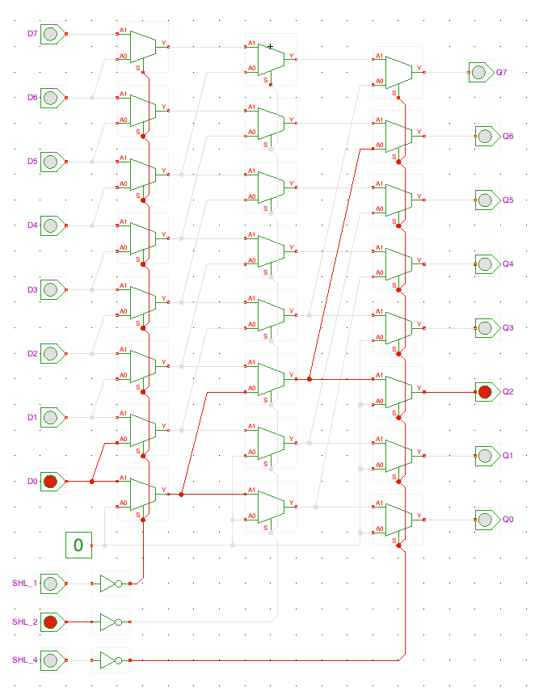
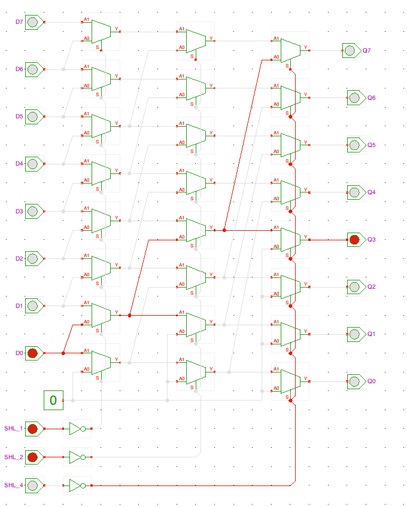
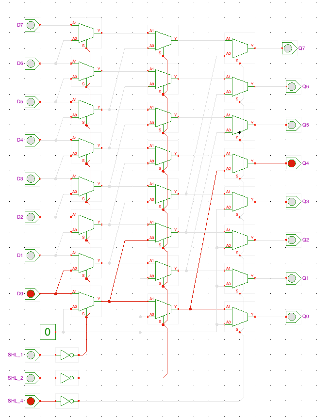
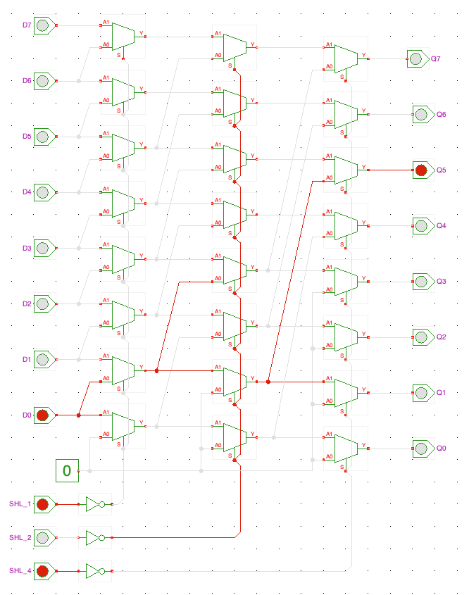
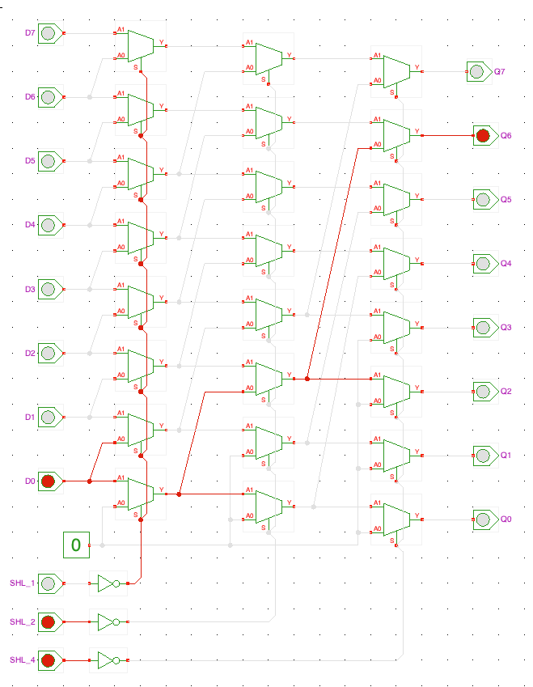
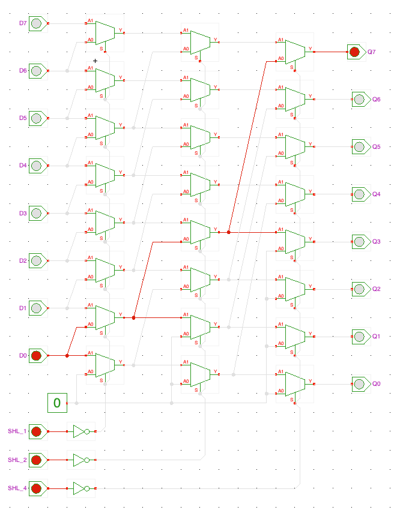
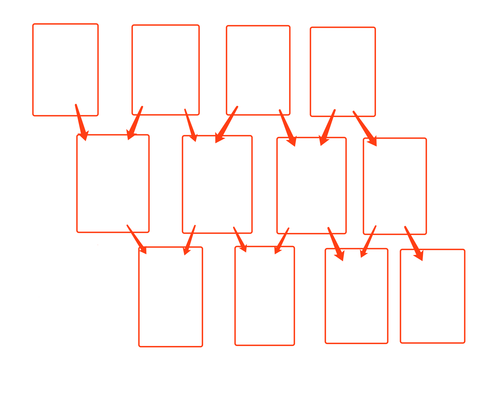
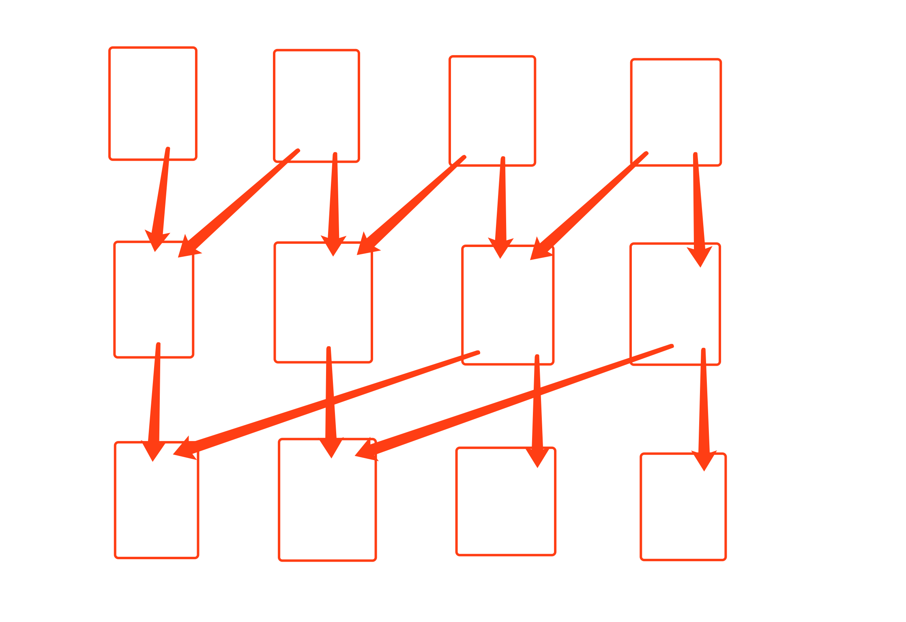

# Verilog实现32位桶形移位器（barrel shifter）

## 一、提出问题和探索

FPGA的教材上面有一个题是实现一个32位的桶形移位器，要求可以在一个时钟周期内对32位数进行逻辑左移、逻辑右移、算术左移、算术右移、循环左移、循环右移。

我当时看到这道题一脸懵逼，什么是桶形移位器？和桶有什么关系？

然后我上百度搜索，看到百度百科里面是这样解释的：


果然看完还是一脸懵逼。

然后我继续在网络上搜索和找好友求助，最后发现了这样一个网站：[https://tams.informatik.uni-hamburg.de/applets/hades/webdemos/10-gates/60-barrel/shifter8.html](https://tams.informatik.uni-hamburg.de/applets/hades/webdemos/10-gates/60-barrel/shifter8.html)

网站里面有一篇解释`barrel shifter` 如何实现的文章，看完后依然似懂非懂。但是这个网站有个非常给力的地方，它把电路的仿真做成了一个Java程序可以下载使用，这里提供了一个8位的`barrel shifter` 逻辑右移仿真程序，于是我把它下载了下来。

## 二、原理分析

启动之后，我按照网页上的说明实际操作了一下这个仿真程序，实现了从0～7位的逻辑右移，上图片：

- 仿真图片（多图预警）

    

    

    

    

    

    

    

    

如上图所示，`D0～D7`的数据经过三排选择器之后可以被控制位移0～7位输出到`Q0～Q7` 。每一排选择器的控制端为同一个信号`SHL_1`、`SHL_2`或`SHL_4`，其中第一排（最左边开始数）选择器实现一位右移，第二排实现两位右移，第三排实现了四位右移，即第N排实现右移$2^{N-1}$位，然后通过三排选择器的组合实现指定数量的右移。看到这里我恍然大悟，这不正是二进制数的表示方式吗？

在理解了桶形移位器的原理之后，我依然对`barrel shifter`这个名字感到困惑，这和桶有什么关系呢？

于是我作出了这样的猜想，如下图所示：



红色的框框是桶，箭头是水龙头，众所周知水龙头可以打开也可以关闭。通过打开和关闭水龙头，就可以实现控制`最顶层第四个桶`里面的酒流到`最底层右边三个桶`的任意一个里面。

但是这样的方式显然不是最优的，因为每次只能移动一位，所以在只有3排桶的情况下，`最顶层第四个桶` 里面的酒无论如何都流不到`最底层第一个桶`里面。

于是稍作调整之后产生了优化过后的“酒桶图”：



在这个图里，`顶层右边的酒桶`就可以流到`底层和自己同一列或者在自己左边` 的任意桶内，把这里的桶、水龙头、酒分别替换成电路里面的的选择器、电路、电平信号就成了`左移的逻辑位移器`。如果要实现算术位移、循环位移只是接法略有区别，原理是一样的。

## 三、Verilog实现和仿真

- 实现代码

    ```verilog
    `timescale 1ns / 1ps

    module barrelShifter(
    output reg [31:0] out,
    input [31:0] data,
    input [1:0] type,
    input direction,
    input [4:0] len
        );

    always @(*)
    	case(type)
    		2'b01:  // logic shifter
    			begin
    				if(direction)
    					begin  // right
    						out = len[0] ? {1'b0, data[31:1]} : data;
    						out = len[1] ? {2'b0, out[31:2]} : out;
    						out = len[2] ? {4'b0, out[31:4]} : out;
    						out = len[3] ? {8'b0, out[31:8]} : out;
    						out = len[4] ? {16'b0, out[31:16]} : out;
    					end
    				else
    					begin  // left
    						out = len[0] ? {data[30:0], 1'b0} : data;
    						out = len[1] ? {out[29:0], 2'b0} : out;
    						out = len[2] ? {out[27:0], 4'b0} : out;
    						out = len[3] ? {out[23:0], 8'b0} : out;
    						out = len[4] ? {out[15:0], 16'b0} : out;
    					end
    			end
    		2'b10:  // arithmetic shifter
    			begin 
    				if(direction)
    					begin  // right
    						out = len[0] ? {data[31], data[31:1]} : data;
    						out = len[1] ? {{2{out[31]}}, out[31:2]} : out;
    						out = len[2] ? {{4{out[31]}}, out[31:4]} : out;
    						out = len[3] ? {{8{out[31]}}, out[31:8]} : out;
    						out = len[4] ? {{16{out[31]}}, out[31:16]} : out;
    					end
    				else
    					begin  // left
    						out = len[0] ? {data[30:0], 1'b0} : data;
    						out = len[1] ? {out[29:0], 2'b0} : out;
    						out = len[2] ? {out[27:0], 4'b0} : out;
    						out = len[3] ? {out[23:0], 8'b0} : out;
    						out = len[4] ? {out[15:0], 16'b0} : out;
    					end
    			end
    		2'b11:  // cyclic shifter
    			begin
    				if(direction)
    					begin  // right
    						out = len[0] ? {data[0], data[31:1]} : data;
    						out = len[1] ? {out[1:0], out[31:2]} : out;
    						out = len[2] ? {out[3:0], out[31:4]} : out;
    						out = len[3] ? {out[7:0], out[31:8]} : out;
    						out = len[4] ? {out[15:0], out[31:16]} : out;
    					end
    				else
    					begin  // left
    						out = len[0] ? {data[30:0], data[31]} : data;
    						out = len[1] ? {out[29:0], out[31:30]} : out;
    						out = len[2] ? {out[27:0], out[31:28]} : out;
    						out = len[3] ? {out[23:0], out[31:24]} : out;
    						out = len[4] ? {out[15:0], out[31:16]} : out;
    					end
    			end
    	endcase

    endmodule
    ```

- 仿真代码

    逻辑左移：

    ```verilog
    `timescale 1ns / 1ps

    module test_logic_shifter_left;

    	// Inputs
    	reg [31:0] data;
    	reg [1:0] type;
    	reg direction;
    	reg [4:0] len;

    	// Outputs
    	wire [31:0] out;

    	// Instantiate the Unit Under Test (UUT)
    	barrelShifter uut (
    		.out(out), 
    		.data(data), 
    		.type(type), 
    		.direction(direction), 
    		.len(len)
    	);

    	initial begin
    		// Initialize Inputs
    		data <= {32{1'b1}};
    		type <= 2'b01;
    		direction <= 0;
    		len <= 0;
    	end
    	
    	always #10 len = len + 1;
          
    endmodule
    ```

    逻辑右移：

    ```verilog
    `timescale 1ns / 1ps

    module test_logic_shifter_right;

    	// Inputs
    	reg [31:0] data;
    	reg [1:0] type;
    	reg direction;
    	reg [4:0] len;

    	// Outputs
    	wire [31:0] out;

    	// Instantiate the Unit Under Test (UUT)
    	barrelShifter uut (
    		.out(out), 
    		.data(data), 
    		.type(type), 
    		.direction(direction), 
    		.len(len)
    	);

    	initial begin
    		// Initialize Inputs
    		data = {32{1'b1}};
    		type = 2'b01;
    		direction = 1;
    		len = 0;
    	end
    	
    	always #10 len = len + 1;
          
    endmodule
    ```

    算术左移:

    ```verilog
    `timescale 1ns / 1ps

    module test_arithmetic_shifter_left;

    	// Inputs
    	reg [31:0] data;
    	reg [1:0] type;
    	reg direction;
    	reg [4:0] len;

    	// Outputs
    	wire [31:0] out;

    	// Instantiate the Unit Under Test (UUT)
    	barrelShifter uut (
    		.out(out), 
    		.data(data), 
    		.type(type), 
    		.direction(direction), 
    		.len(len)
    	);

    	initial begin
    		// Initialize Inputs
    		data <= {32{1'b1}};
    		type <= 2'b10;
    		direction <= 0;
    		len <= 0;
    	end
    	
    	always #10 len = len + 1;
          
    endmodule
    ```

    算术右移:

    ```verilog
    `timescale 1ns / 1ps

    module test_arithmetic_shifter_right;

    	// Inputs
    	reg [31:0] data;
    	reg [1:0] type;
    	reg direction;
    	reg [4:0] len;

    	// Outputs
    	wire [31:0] out;

    	// Instantiate the Unit Under Test (UUT)
    	barrelShifter uut (
    		.out(out), 
    		.data(data), 
    		.type(type), 
    		.direction(direction), 
    		.len(len)
    	);

    	initial begin
    		// Initialize Inputs
    		data <= {{16{1'b1}}, {16{1'b0}}};
    		type <= 2'b10;
    		direction <= 1;
    		len <= 0;
    	end
    	
    	always #10 len = len + 1;
          
    endmodule
    ```

    循环左移:

    ```verilog
    `timescale 1ns / 1ps

    module test_cyclic_shifter_left;

    	// Inputs
    	reg [31:0] data;
    	reg [1:0] type;
    	reg direction;
    	reg [4:0] len;

    	// Outputs
    	wire [31:0] out;

    	// Instantiate the Unit Under Test (UUT)
    	barrelShifter uut (
    		.out(out), 
    		.data(data), 
    		.type(type), 
    		.direction(direction), 
    		.len(len)
    	);

    	initial begin
    		// Initialize Inputs
    		data <= {8{4'b0001}};
    		type <= 2'b11;
    		direction <= 0;
    		len <= 0;
    	end
    	
    	always #10 len = len + 1;
          
    endmodule
    ```

    循环右移:

    ```verilog
    `timescale 1ns / 1ps

    module test_cyclic_shifter_right;

    	// Inputs
    	reg [31:0] data;
    	reg [1:0] type;
    	reg direction;
    	reg [4:0] len;

    	// Outputs
    	wire [31:0] out;

    	// Instantiate the Unit Under Test (UUT)
    	barrelShifter uut (
    		.out(out), 
    		.data(data), 
    		.type(type), 
    		.direction(direction), 
    		.len(len)
    	);

    	initial begin
    		// Initialize Inputs
    		data <= {8{4'b0001}};
    		type <= 2'b11;
    		direction <= 1;
    		len <= 0;
    	end
    	
    	always #10 len = len + 1;
          
    endmodule
    ```