<a name="7ecd5d253667fcb9971e90ecc29ec545"></a>

基于RT-Thread PM2.0与STM32L4的LoRaWAN Class A低功耗终端设备设计与应用笔记

# 1 前言
本文主要描述了基于LSD4RF-TEST2002[STM32L4]平台使用RT-Thread PM2.0组件与lorawan-ed-stack软件包，如何实现LoRaWAN Class A终端设备的低功耗功能。<br />本文主要侧重讲解LoRaWAN-ed-stack的低功耗实现，lorawan-ed-stack软件包的使用可详见 [《lorawan-ed-stack软件包使用说明》](https://github.com/Forest-Rain/lorawan-ed-stack/tree/master/doc)<br />[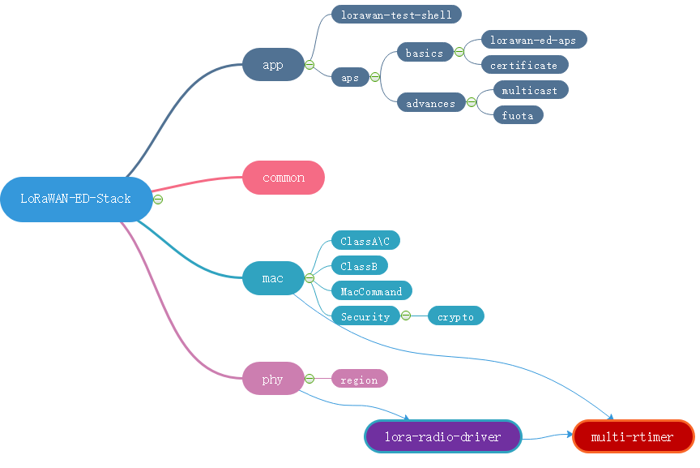

   - lorawan-ed-stack软件包使用了lora-radio-driver软件包作为LoRaWAN的phy层，在使用lorawan-ed-stack软件包前，建议先查看[《LoRa-Radio-Driver软件包使用说明》](https://github.com/Forest-Rain/lora-radio-driver/tree/master/doc)

RT-Thread PM2.0组件设计详见rt-thread官方作者非常详细的系列文章

      - [实践：RT-Thread PM管理实战 系列](https://club.rt-thread.org/ask/article/2282.html)
      - [进阶：RT-Thread精通PM功耗调优 系列](https://club.rt-thread.org/ask/article/2296.html)
<a name="49d1f1cb607a41846cb1f0f1244421de"></a>
## 1.1 准备工作
<a name="29331138ac20a0507b07b7db38bcc2a7"></a>
### 1.1.1 所需硬件

- [ART-Pi LoRa开发套件](http://wsn.lierda.com/index.php/Home/product/detail/id/113.html)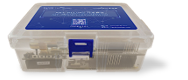
   - LoRa模块转接板(LRS101)
      - 贴装 [LSD4RF-2R717N40 (SX1268,470M频段)](http://bbs.lierda.com/forum.php?mod=viewthread&tid=87&extra=page%3D1).
   - RF评估板
      - [LSD4RF-TEST2002[STM32L4]](http://bbs.lierda.com/forum.php?mod=viewthread&tid=9729&highlight=test2002&_dsign=25cd8f70)
-  电流测试仪器
   - STM32功耗测试工具 STM32CubeMonitor-Power 与 [ STM32L562E-DK](https://www.st.com/en/evaluation-tools/stm32l562e-dk.html)

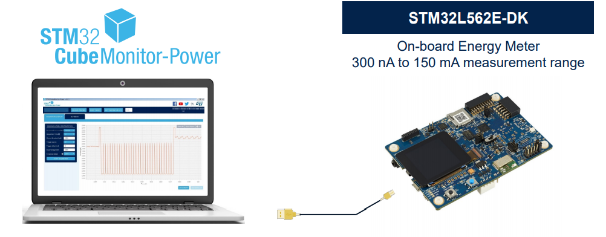
<a name="ad7eaede33b009b37944d0dd879a30ee"></a>

### 1.1.2 所需开发工具

- IDE开发工具
   - [RT-Thread Studio 最新版本](https://www.rt-thread.org/document/site/rtthread-studio/um/studio-user-begin/)2.1.0
      - [https://www.rt-thread.org/page/studio.html](https://www.rt-thread.org/page/studio.html)
- JLink或者ST-Link
<a name="c581e69ea4684dfa712192b28c3c4d85"></a>
# 2 LoRaWAN Class A终端设备的低功耗设计
RT-Thread PM2.0组件的整体设计思想是PM组件让系统(MCU)尽可能多处于睡眠状态（最低功耗状态），用户业务需要干活的时候，用户主动请求系统【不睡眠】(rt_pm_module_request)，并且在事情处理完成后，主动释放(rt_pm_module_release)，【允许】系统睡眠。<br />基于RT-Thread PM2.0组件，LoRaWAN Class A低功耗设计这里涉及到三个软件包lorawan-ed-stack、lora-radio-driver、multi-rtimer，具体如下所示
> 注: 如果使用RT-Studio 2.1.0版本创建项目，在其生成的工程模板中，pm.c、pm.h非最新PM2.0版本代码，需要更新为RT-Thread master 的pm.c、pm.h（PM2.0版本）

<a name="FBNs3"></a>

## 2.1 lorawan-ed-stack低功耗处理
LoRaWAN 应用层低功耗处理如下
```c
/**
  * @brief  lorawan_ed_app_thread_entry
  * @param  void * parameter
  * @retval None
  */
void lorawan_ed_app_thread_entry(void* parameter)
{
    rt_uint32_t ev;
    
    LORAWAN_ED_DEBUG_LOG(LORAWAN_ED_STACK_DEBUG_SHELL_TEST, LOG_LVL_INFO, "LORAMAC_VERSION: %02X.%02X.%02X.%02X", (uint8_t)(__LORA_MAC_VERSION >> 24), (uint8_t)(__LORA_MAC_VERSION >> 16), (uint8_t)(__LORA_MAC_VERSION >> 8), (uint8_t)__LORA_MAC_VERSION);
   
    rt_event_init(&ev_lorawan_apl, "ev_lorawan_apl", RT_IPC_FLAG_PRIO);//RT_IPC_FLAG_FIFO);

    if( auto_periodic_tx_enable )
    {
        /* start to join after powerup */
        rt_event_send(&ev_lorawan_apl, EV_LORAWAN_APL_START_JOIN_NETWORK);
    }

    while (1)
    {
        if (rt_event_recv(&ev_lorawan_apl, (EV_LORAWAN_APL_START_JOIN_NETWORK |
                                            EV_LORAWAN_APL_REJOIN_NETWORK |
                                            EV_LORAWAN_APL_PERIODIC_TX_DATA),
                                            ( RT_EVENT_FLAG_OR | RT_EVENT_FLAG_CLEAR ),
                                            RT_WAITING_FOREVER, &ev) == RT_EOK)
        {

#ifdef RT_USING_PM
            rt_pm_module_request(PM_LORA_APP_ID, PM_SLEEP_MODE_NONE);
            lorawan_ed_app_process(ev);
            rt_pm_module_release(PM_LORA_APP_ID, PM_SLEEP_MODE_NONE);
#else
            lorawan_ed_app_process(ev);
#endif
        }
    }
}
```
LoRaWAN mac层低功耗处理如下
```c
LoRaMac.c
void loramac_thread_entry(void* parameter)
{
    rt_uint32_t ev;
    
    while(1)
    {
        if (rt_event_recv(&loramac_event, EV_LORAMAC_PROCESS_NOTIFY,
                                RT_EVENT_FLAG_OR | RT_EVENT_FLAG_CLEAR,
                                RT_WAITING_FOREVER, &ev) == RT_EOK)
        {
#ifdef RT_USING_PM
            rt_pm_module_request(PM_MAC_ID, PM_SLEEP_MODE_NONE);
            LoRaMacProcess();
            rt_pm_module_release(PM_MAC_ID, PM_SLEEP_MODE_NONE);
#else
            LoRaMacProcess();
#endif
        }
    }
}
```
<a name="I7ajN"></a>
## 2.2 lora-radio-driver低功耗处理
lora-radio低功耗处理如下
```c
lora-radio-sx126x.c
static void lora_radio_thread_entry(void* parameter)
{
    rt_uint32_t ev;
    
    while(1)
    {
        if (rt_event_recv(&lora_radio_event, EV_LORA_RADIO_DIO_IRQ_FIRED,
                                RT_EVENT_FLAG_OR | RT_EVENT_FLAG_CLEAR,
                                RT_WAITING_FOREVER, &ev) == RT_EOK)
        {
#ifdef RT_USING_PM
            rt_pm_module_request(PM_RADIO_ID, PM_SLEEP_MODE_NONE);
            RadioIrqProcess();
            rt_pm_module_release(PM_RADIO_ID, PM_SLEEP_MODE_NONE);
#else
            RadioIrqProcess();
#endif
        }
    }
}
```
<a name="st1Rt"></a>
## 2.3 multi-rtimer低功耗处理
multi-rtimer RTC驱动层低功耗处理如下
```c
hw_rtc_stm32.c
void rtc_set_alarm( uint32_t timeout )
{
    // We don't go in Low Power mode for timeout below MIN_ALARM_DELAY
    if( ( int64_t )( MIN_ALARM_DELAY + McuWakeUpTimeCal ) < ( int64_t )( timeout - rtc_get_timer_elapsed_time( ) ) )
    {
        rt_pm_module_release(PM_BOARD_ID, PM_SLEEP_MODE_NONE);
    }
    else 
    {
        rt_pm_module_request(PM_BOARD_ID, PM_SLEEP_MODE_NONE);
    }
    rtc_start_alarm( timeout );
}
```
<a name="iMDLx"></a>
## 2.4 STM32L4平台相关外设的低功耗处理
LoRaWAN Class A低功耗终端设备（[LSD4RF-TEST2002](http://bbs.lierda.com/forum.php?mod=viewthread&tid=9729&highlight=test2002&_dsign=25cd8f70)[STM32L4] ）当前主要使用了STM32L4 SPI3（LoRa模块使用）、Usart2（日志输出）、RTC(LoRaWAN\LoRa使用)、低频晶振(LSE)、激活模式\STOP 2模式
<a name="UgeqQ"></a>
### 2.4.1 增加STM32L4平台的PM所需硬件驱动
基于STM32L4平台的PM2.0硬件驱动主要使用到了 drv_pm.c 、drv_lptim.c、drv_lptim.h、drv_clk.c。
> 注:  如果使用RT-Studio 2.1.0版本创建项目，在其生成的工程模板中，未包含drv_pm.c 、drv_lptim.c、drv_lptim.h，可以直接从RT-Thread master\bsp\stm32\libraries\HAL_Drivers拷贝过来

1. 在RT-Studio 2.1.0生成的 drv_common.h 中，增加<rtdevice.h>头文件
```c
/*drv_common.h*/
#include <rtdevice.h>
```

2. drv_clk.c根据需求增加不同系统时钟频率设置等
2. drv_pm.c 

3.1 新增进入Deep Sleep前，调用pm_deep_sleep_deinit()
```c
__WEAK void pm_deep_sleep_deinit(void)
{
    SPI_HandleTypeDef hspi = {.Instance = SPI3};      // LoRa Radio SPI
    UART_HandleTypeDef huart = {.Instance = USART2 }; // Shell UART

    HAL_SPI_MspDeInit(&hspi);
    HAL_UART_MspDeInit(&huart);
    SX126xIoDeInit();
    rt_pm_disable_dbgmcu();
}
```
3.2 新增退出Deep Sleep后，首先调用pm_deep_sleep_reinit()
```c
__WEAK void pm_deep_sleep_reinit(void)
{
    SPI_HandleTypeDef hspi = {.Instance = SPI3};      // LoRa Radio SPI
    UART_HandleTypeDef huart = {.Instance = USART2 }; // Shell UART

    HAL_SPI_MspInit(&hspi);
    HAL_UART_MspInit(&huart);
}
```
```c
/**
 * This function will put STM32L4xx into sleep mode.
 *
 * @param pm pointer to power manage structure
 */
static void sleep(struct rt_pm *pm, uint8_t mode)
{
    switch (mode)
    {
    // ...
    case PM_SLEEP_MODE_DEEP:

        pm_deep_sleep_deinit();

        /* Enter STOP 2 mode  */
        HAL_PWREx_EnterSTOP2Mode(PWR_STOPENTRY_WFI);
        /* Re-configure the system clock */
        SystemClock_ReConfig(pm->run_mode);

        pm_deep_sleep_reinit();

        break;
    }
     // ...
}
```
<a name="W7k7n"></a>
### 2.3.2 STM32L4低功耗相关的引脚配置
这里采用STM32CubeMX自动生成的文件(HAL_UART_MspDeInit\HAL_UART_MspReInit)，然后根据实际所需硬件设计最优的GPIO配置。<br />串口HAL_UART_MspDeInit处理如下
```c

/**
* @brief UART MSP De-Initialization
* This function freeze the hardware resources used in this example
* @param huart: UART handle pointer
* @retval None
*/
void HAL_UART_MspDeInit(UART_HandleTypeDef* huart)
{
  if(huart->Instance==USART2)
  {
  /* USER CODE BEGIN USART2_MspDeInit 0 */

  /* USER CODE END USART2_MspDeInit 0 */
    /* Peripheral clock disable */
    __HAL_RCC_USART2_CLK_DISABLE();

    /**USART2 GPIO Configuration
    PA2     ------> USART2_TX
    PA3     ------> USART2_RX
    */
    HAL_GPIO_DeInit(GPIOA, GPIO_PIN_2|GPIO_PIN_3);

  /* USER CODE BEGIN USART2_MspDeInit 1 */

  /* USER CODE END USART2_MspDeInit 1 */
  }

}
```
SPI外设HAL_SPI_MspDeInit处理如下
```c

/**
* @brief SPI MSP De-Initialization
* This function freeze the hardware resources used in this example
* @param hspi: SPI handle pointer
* @retval None
*/
void HAL_SPI_MspDeInit(SPI_HandleTypeDef* hspi)
{
  if(hspi->Instance==SPI3)
  {
  /* USER CODE BEGIN SPI3_MspDeInit 0 */

  /* USER CODE END SPI3_MspDeInit 0 */
    /* Peripheral clock disable */
    __HAL_RCC_SPI3_CLK_DISABLE();

    /**SPI3 GPIO Configuration
    PC10     ------> SPI3_SCK
    PC11     ------> SPI3_MISO
    PC12     ------> SPI3_MOSI
    */
    HAL_GPIO_DeInit(GPIOC, GPIO_PIN_10|GPIO_PIN_11|GPIO_PIN_12);

  /* USER CODE BEGIN SPI3_MspDeInit 1 */
    GPIO_InitTypeDef GPIO_InitStruct = {0};
    GPIO_InitStruct.Pin = GPIO_PIN_11;
    GPIO_InitStruct.Mode = GPIO_MODE_OUTPUT_PP;
    GPIO_InitStruct.Pull = GPIO_PULLDOWN;
    GPIO_InitStruct.Speed = GPIO_SPEED_FREQ_LOW;

    HAL_GPIO_Init(GPIOC, &GPIO_InitStruct);
  /* USER CODE END SPI3_MspDeInit 1 */
  }

}
```
<a name="B3iTz"></a>
# 3 LoRaWAN Class A终端设备的应用示例
<a name="Uh6OP"></a>
## 2.1 使能PM组件

1. 在"RT-Thread Settings"使能"低功耗"

或者"RT-Thread Components" -> " Device Drivers" -> "USing Power Management device drivers"使能PM组件。<br />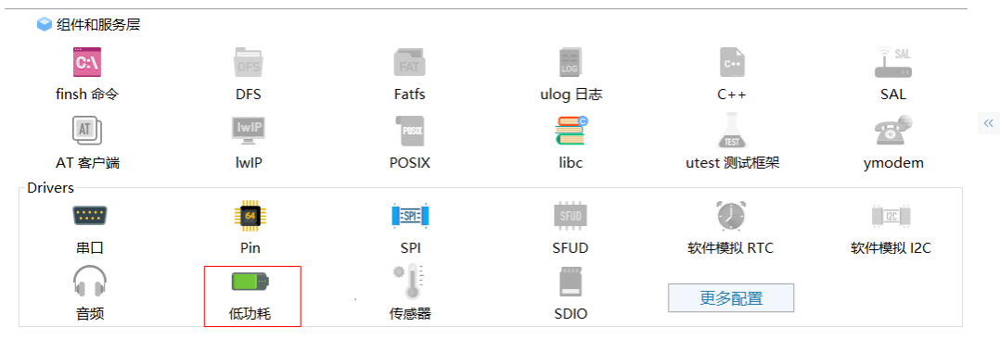
<a name="tyRlW"></a>

### 2.1.1 设置 IDLE_THREAD_STACK_SIZE
使用PM组件，要求IDLE_THREAD_STACK_SIZE大于256 Byte<br />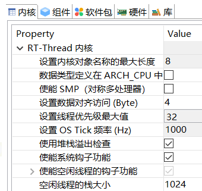<br />

<a name="7dbfb25a1c0eb6f5594e0b9849fc80a2"></a>
## 2.2 使能lorawan-ed-stack软件包
使能lorawan-ed-stack软件包，根据接入的LoRaWAN网络，配置lorawan-ed-stack协议栈的相关参数。<br />详细查看

   - [《lorawan-ed-stack软件包使用说明》](https://github.com/Forest-Rain/lorawan-ed-stack/tree/master/doc)
      - [https://github.com/Forest-Rain/lorawan-ed-stack/tree/master/doc](https://github.com/Forest-Rain/lorawan-ed-stack/tree/master/doc)
   - 基于ART-Pi与LRS007的LoRaWAN_ED_Stack软件包应用笔记
      - [https://club.rt-thread.org/ask/article/2541.html](https://club.rt-thread.org/ask/article/2541.html)

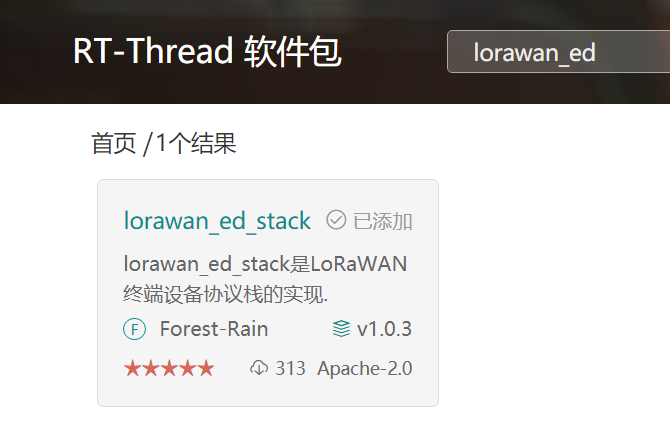
> - Regional参数
>    - CN470同频 
>       - 上行=下行(RX1)
>          - 475.3、475.5、475.7、475.9、476.1、476.3、476.5、476.7
>    - 或者CN470(异频) 
>       - 上行
>          - 475.1、475.3、475.5、475.7、475.9、476.1、476.3、476.5
>       - 下行（RX1）
>          - 505.1、505.3、505.5、505.7、505.9、505.1、505.3、505.5


<a name="xWzAM"></a>
### 2.1.1 lora-radio-driver软件包
使能lorawan-ed-stack软件包，会自动使能lora-radio-driver软件包。然后根据实际使用的LoRa模块，配置lora-radio-driver参数。<br />具体参考

   - [《LoRa-Radio-Driver软件包使用说明》](https://github.com/Forest-Rain/lora-radio-driver/tree/master/doc)
      - [https://github.com/Forest-Rain/lora-radio-driver/tree/master/doc](https://github.com/Forest-Rain/lora-radio-driver/tree/master/doc)
   - 基于APT-Pi与LRS007的LoRa-Radio-Driver软件包应用笔记 
      - [https://club.rt-thread.org/ask/article/2540.html](https://club.rt-thread.org/ask/article/2540.html)
<a name="y4KMs"></a>
### 2.1.1 multi-rtimer软件包
LoRaWAN Class A低功耗应用需要使用低功耗的定时器外设，当前定时服务使用的是multi-rtimer软件包，其依赖的是STM32硬件RTC。<br />具体参考 [multi-rtimer软件包](multi-rtimer软件包)

   - [https://github.com/Forest-Rain/multi-rtimer](https://github.com/Forest-Rain/multi-rtimer)

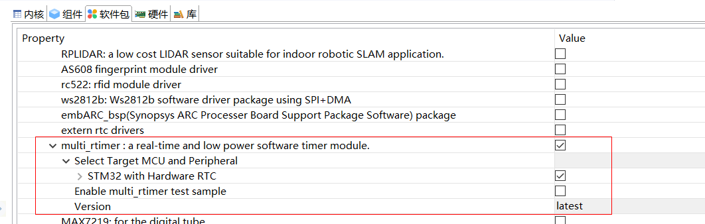
<a name="jSusT"></a>

## 2.3 STM32CubeMX设置
<a name="L7J24"></a>
### 2.3.1 配置STM32L4的LSE与RTC
multi_rtimer软件包使用硬件RTC，同时为了获取更高时间精度，以满足Class A设备通信要求，需要使用低频晶振（LSE）。<br />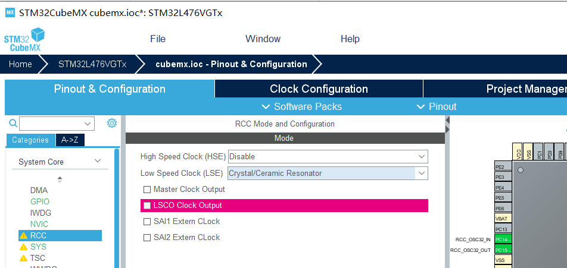<br />RCC使能LSE<br />
<br />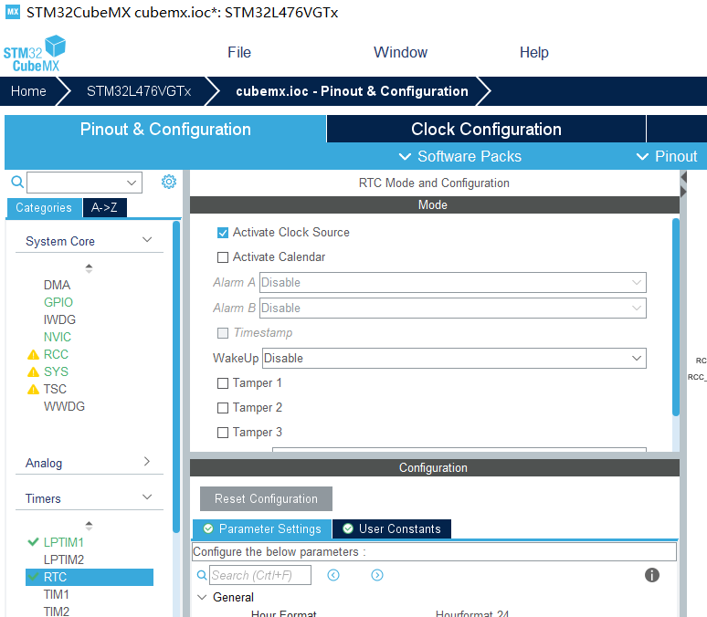<br />使能RTC<br />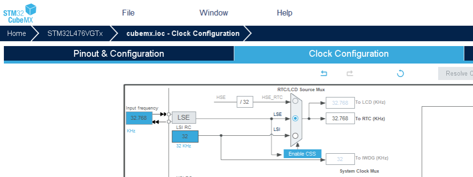<br />RTC时钟源设置为LSE<br />
<br />

<a name="S3bsD"></a>
### 2.3.2 配置LPTIM1
STM32L4平台，RT-Thread PM2.0组件使用了LPTIM1来提供Tickless机制。<br />注：当前在drv_lptim.c驱动里面已经默认实现LPTIM1的开启，因此此处也可以忽略该步骤。<br />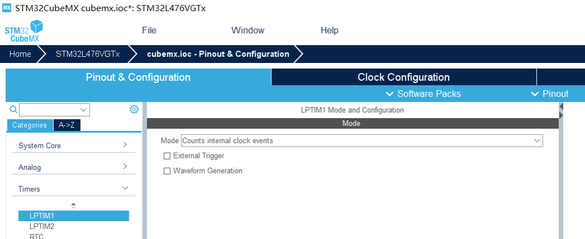<br />使能LPTIM1<br />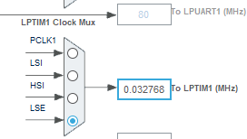<br />LPTIM1时钟源设置为LSE，也可以设置来自LSI
<a name="653cd9386c7cf2182df9bf919ad54b34"></a>

# 4 功耗测试结果
将[ STM32L562E-DK](https://www.st.com/en/evaluation-tools/stm32l562e-dk.html)的JP7接口连接到测试 [LSD4RF-TEST2002[STM32L4]](http://bbs.lierda.com/forum.php?mod=viewthread&tid=9729&highlight=test2002&_dsign=25cd8f70) 的J2接口,如下图所示<br />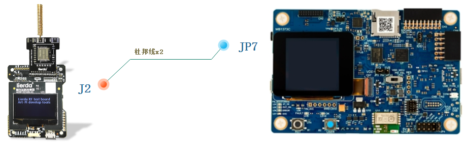<br />搭建LSD4RF-TEST2002[STM32L4]功耗测试台
<a name="4f90dc611266d89dd229ef894d7f04c4"></a>

## 4.1 OTAA入网功耗测试

1. 设备上电后，随机延时后，开始入网

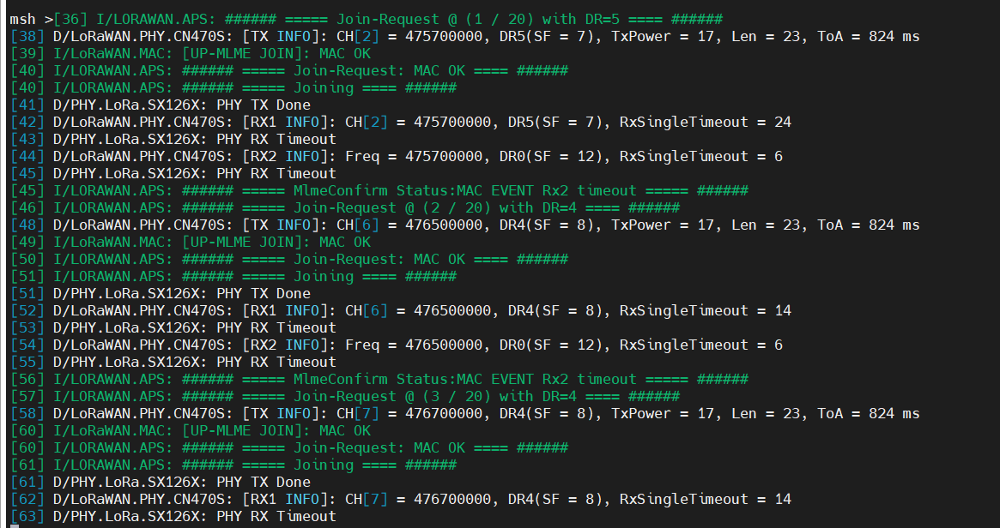<br />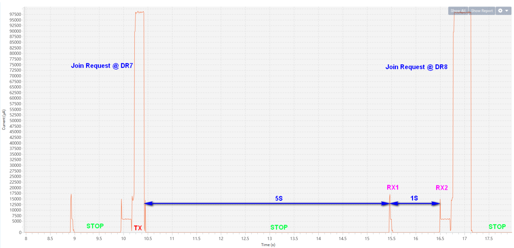<br />设备OTAA入网<br />

<a name="e6606b661533640deb8b05f3cc0f28f6"></a>

## 4.2 LoRaWAN数据通信功耗测试
LoRaWAN数据通信，无下行数据情况

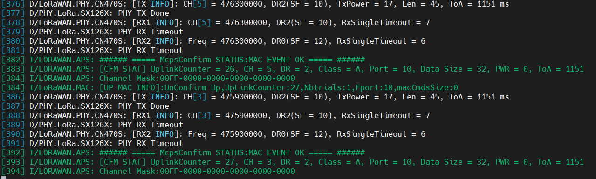)

<br />
<br />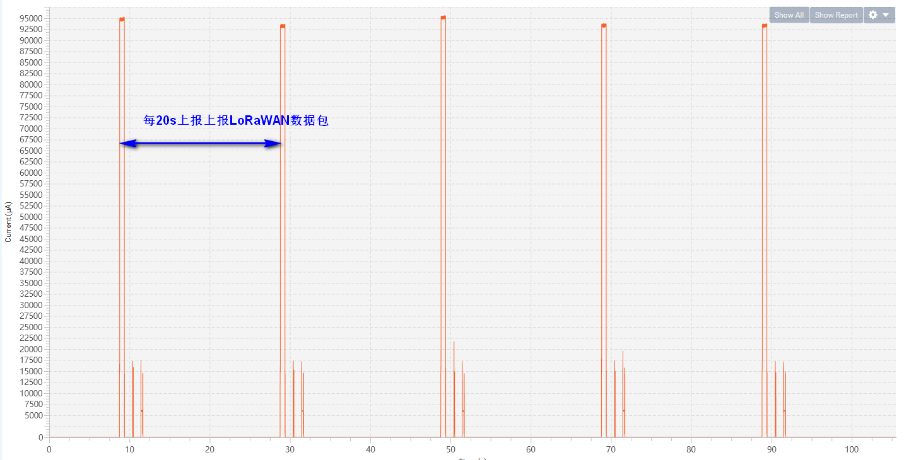)<br />周期性Class A数据上报(无下行数据)<br />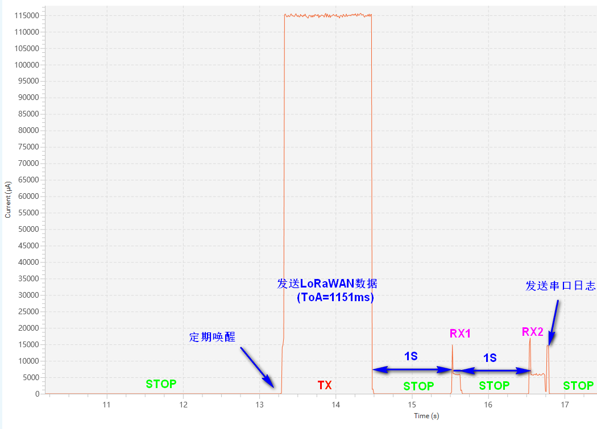)单次Class A数据通信功耗曲线(无下行数据)<br />

LoRaWAN数据通信，有下行数据情况

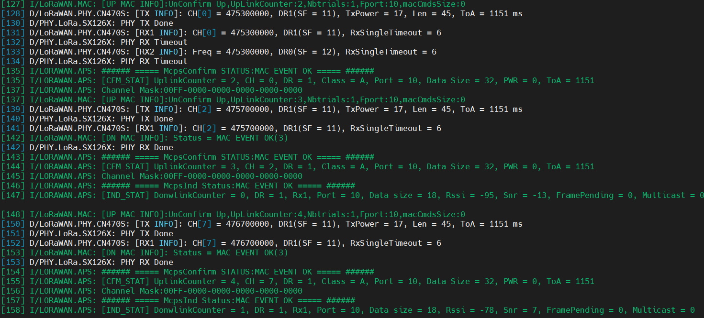)<br />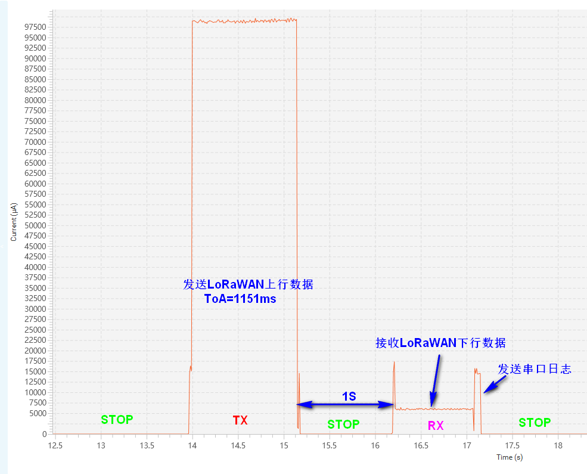)<br />单次Class A数据通信功耗曲线(有下行数据）
<a name="22272bb76042704254d56c620e312fcb"></a>

# 5 参考

- RT-Thread操作系统
   - [https://github.com/RT-Thread/rt-thread](https://github.com/RT-Thread/rt-thread)
- lora-radio-driver软件包
   - lora spi驱动
   - [https://github.com/forest-rain/lora-radio-driver](https://github.com/forest-rain/lora-radio-driver)
- multi-rtimer软件包
   - 低功耗RTC定时模块
   - [https://github.com/Forest-Rain/multi-rtimer](https://github.com/Forest-Rain/multi-rtimer)
- lorawan-ed-stack软件包
   - lorawan终端设备协议栈
   - [https://github.com/Forest-Rain/lorawan-ed-stack](https://github.com/Forest-Rain/lorawan-ed-stack)
- [ART-Pi LoRa开发套件](https://mp.weixin.qq.com/s/v_0raF-5KlEOjxc5_dui3Q) 产品介绍
   - [http://wsn.lierda.com/index.php/Home/product/detail/id/113.html](http://wsn.lierda.com/index.php/Home/product/detail/id/113.html)
- 基于ART-Pi与LRS007的LoRaWAN_ED_Stack软件包应用笔记
   - [https://club.rt-thread.org/ask/article/2541.html](https://club.rt-thread.org/ask/article/2541.html)
- 基于APT-Pi与LRS007的LoRa-Radio-Driver软件包应用笔记 
   - [https://club.rt-thread.org/ask/article/2540.html](https://club.rt-thread.org/ask/article/2540.html)
