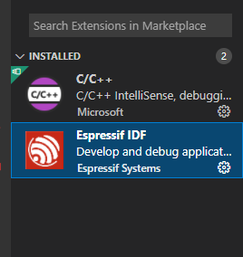
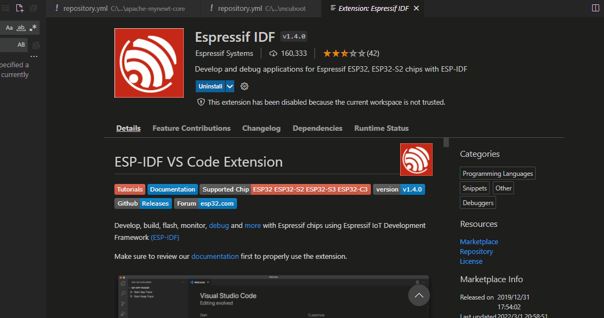
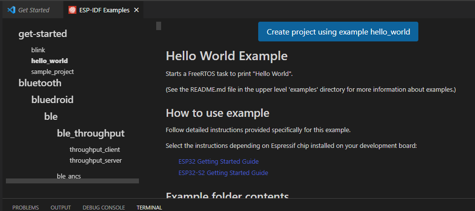
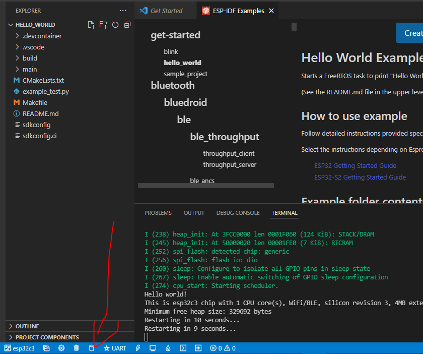
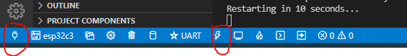

#  ESP-IDF 一键式搭建环境

##  ESP-IDF 简介

esp-idf是乐鑫公司开发的IDE。这个IDF只能用于乐鑫，官方的参考文档见[link](https://docs.espressif.com/projects/esp-idf/zh_CN/latest/esp32c3/get-started/linux-macos-setup.html)

想要跑乐鑫官方的example，和开发ESP32的代码，大部分需要安装IDF。 官方的教程已经写得非常详细了，照着一步一步来就可以了。不过这篇文章主要讲，如何一键式搭建IDF，这也是我总结下来的。我们用到的工具是一款跨平台的工具vscode。

而且现在很多方法需要访问github，这就需要科学上网，这篇文章不需要大家访问github就可以搭建起来编译和应用平台

## 安装步骤

### 第一步 安装vscode

[vscode 官网](https://code.visualstudio.com/) 下载最新的STABLE即可，这一步应该不难

###  第二步 下载ESP-IDF 插件

### 第三步 配置IDF

这一步特别重要，需要注意是这边下载源可以选择github或者乐鑫官网，如果你是在中国国内的话，选择乐鑫官网可以下载很快，之后选择文件夹一个是存放ESP-IDF的[git](https://github.com/espressif/esp-idf) 的文件夹（主要代码）,一个是存放tool-chain等其他工具的文件夹，大家可以自行根据自己经常用的文件夹存放这两个文件夹（这两个文件夹基本不需要修改和移动，而且比较大）

### 第四步 开始下载
接下来就是休息时间了，vscode会自己自行下载的，这里下载就看你宽带的带宽了。都是自动的，不需要人为干预，大概半个小时左右。基本就装好了。

这个时候进度条走完就装好了

### 第五步 测试hello world

新建一个工程，首先打开`VSCODE`，然后按下`F1`然后输入 `ESP-IDF:Show Examples Projects`，然后选择一个你想要创建的工程，这里以**hello world**这个工程为例：

###  第六步编译

编译选择左下角的build图标即可

###  第七步烧入

烧入的时候要选择一下串口，然后点右边闪电一样的图标，烧入即可。

