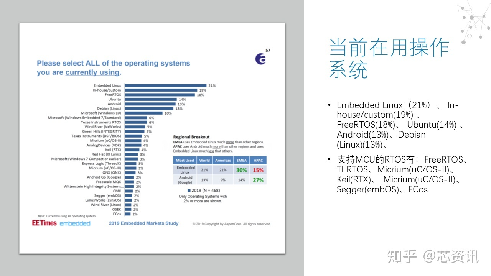
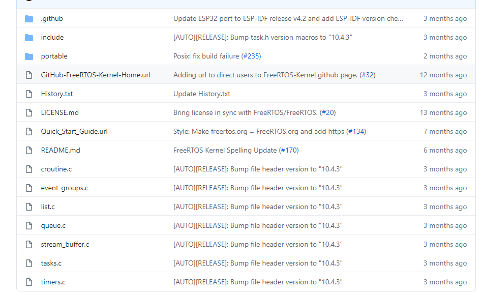
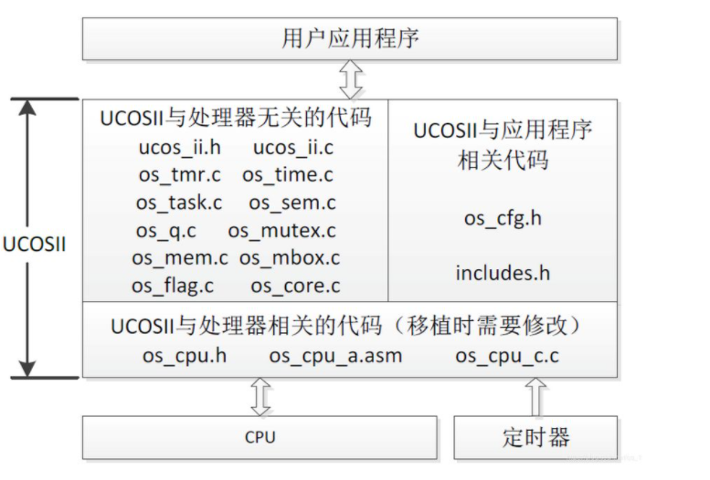
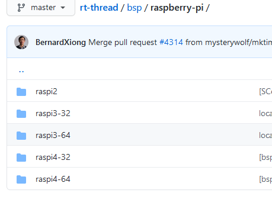
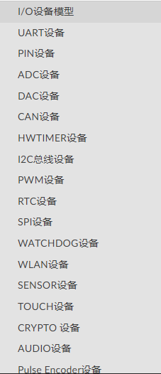
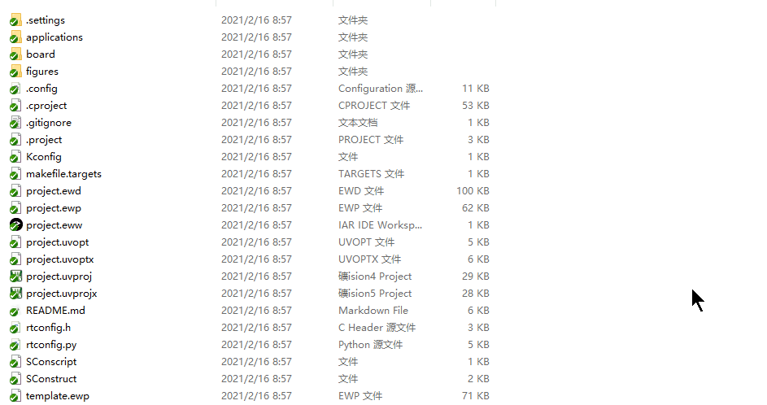
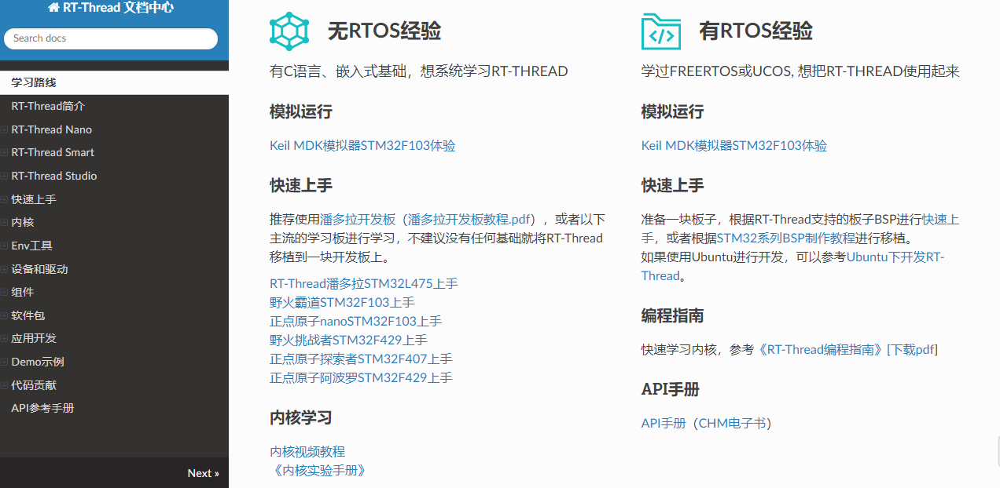

# RT-THREAD ----国产开源之光

[TOC]

## 主流的RTOS

### Embedded Linux

Linux系统极其庞大，里面的架构极其复杂，大部分都是必须要有MMU才行，而有些比较便宜的硬件，就用不了Linux，虽然后面开发了个ucLinux，但是用的人确实不多。Embedded Linux也就是Linux。当然，如果你的设备支持linux，需要裁减的时候也是极其复杂的，里面会有很多你的工程上可能不需要的东西占据着内存和FLASH size。当然需要的开发人员学习的东西也极其复杂，需要上知天文，下知地理，因为这套系统是为服务器等级别的架构考虑的。

### FreeRTOS

这个操作系统在RTOS里面一直遥遥领先的，这个操作系统完全免费的，正因为完全免费，所以大家都用这个做为MCU操作系统，慢慢的就成为第一了。基本上各家厂商也都会支持，

这个操作系统小，内核只有一点点，基本上内核kernel 都推广出去了

整个核心代码就是list.c queue.c tasks.c timers.c croutine.c event_groups.c

一共就不超过10个文件就可以跑起来了，因为文件少，大家都用。

非常适合作为出厂的demo来演示。

但是同样缺点也是很明显的，就是一共就这些东西，学完用完就没了。

其他组件基本都是单独维护的，单独学习。

如果你想要拓展GUI， TCP/IP , 蓝牙等一些复杂一些的系统，都需要重新学习。

### uC/OS-II

这个操作系统和Freertos基本上平起平坐，但是这个操作系统在RTOS发展初期，由于这个操作系统并不是商用免费的，所以公司用的人少，教育用的比较多，相对于FREERTOS，这个操作系统内核是比较容易读懂的，Freertos不容易读懂。这个里面代码也比较少，我曾经仔细研究过里面的每一个细节代码，很简单。

### IOT-RTOS（Internet of things）

其他的像Zephyr, mbed OS, NuttX, Alios Things

这些小众的操作系统，我都用过，主要还是系统比较庞大，慢慢就越做越大了，而且用的人比较小众，而且有些是有一些针对性的，例如mbed OS 主要服务于ARM.

我就不展开介绍了。

### 国产操作系统

大家肯定都听过国产操作系统不叫上面这些名字，叫例如深度啊，凤凰，麒麟，UOS，红旗等等，这些严格意义上，并不是操作系统，只是一层gui，跟Android一样，都是基于Linux内核的。这些只是为了和Windows抢客户，你会看到都会有桌面两个字。

##  RT-THREAD

RT-Thread，全称是 Real Time-Thread，顾名思义，它是一个嵌入式实时多线程操作系统，基本属性之一是支持多任务，允许多个任务同时运行并不意味着处理器在同一时刻真地执行了多个任务。

事实上，一个处理器核心在某一时刻只能运行一个任务，由于每次对一个任务的执行时间很短、任务与任务之间通过任务调度器进行非常快速地切换（调度器根据优先级决定此刻该执行的任务），给人造成多个任务在一个时刻同时运行的错觉。在 RT-Thread 系统中，任务通过线程实现的，RT-Thread 中的线程调度器也就是以上提到的任务调度器。

RT-Thread 主要采用 C 语言编写，浅显易懂，方便移植。它把面向对象的设计方法应用到实时系统设计中，使得代码风格优雅、架构清晰、系统模块化并且可裁剪性非常好。针对资源受限的微控制器（MCU）系统，可通过方便易用的工具，裁剪出仅需要 **3KB Flash、1.2KB RAM** 内存资源的 NANO 版本（NANO 是 RT-Thread 官方于 2017 年 7 月份发布的一个极简版内核)；而对于资源丰富的物联网设备，RT-Thread 又能使用在线的**软件包管理**工具，配合系统配置工具实现直观快速的模块化裁剪，无缝地导入丰富的软件功能包，实现类似 Android 的图形界面及触摸滑动效果、智能语音交互效果等复杂功能。

相较于 Linux 操作系统，RT-Thread 体积小，成本低，功耗低、启动快速，除此以外 RT-Thread 还具有实时性高、占用资源小等特点，非常适用于各种资源受限（如成本、功耗限制等）的场合。虽然 32 位 MCU 是它的主要运行平台，实际上很多带有 MMU、基于 ARM9、ARM11 甚至 Cortex-A 系列级别 CPU 的应用处理器在特定应用场合也适合使用 RT-Thread。

RTTHREAD 号称也是IOT-RTOS。现在主打的口号是”小而美的物联网操作系统“

怎么理解呢?我的理解就是： 上可通天，下可入地。

最小内核**3KB Flash、1.2KB RAM**

### RT-Thread的特点

- 资源占用极低，超低功耗设计，最小内核（Nano版本）仅需1.2KB RAM，3KB Flash。
- 组件丰富，繁荣发展的**软件包生态** 。
- 简单易用 ，优雅的代码风格，易于阅读、掌握。
- 高度可伸缩，优质的可伸缩的软件架构，松耦合，模块化，易于裁剪和扩展。
- 强大，支持高性能应用。
- 跨平台、芯片支持广泛。

## 架构

### 支持的CPU架构

RT-Thread RTOS 支持许多架构，并且已经涵盖了当前应用中的主要架构。涉及的架构和芯片制造商有：

- ARM Cortex-M0/M0+：如芯片制造商 ST
- ARM Cortex-M3：如芯片制造商 ST、全志、灵动等.
- ARM Cortex-M4：如芯片制造商 ST、Nuvton、NXP、GigaDevice、Realtek、Ambiq Micro等
- ARM Cortex-M7：如芯片制造商 ST、NXP
- ARM Cortex-M23：如芯片制造商 GigaDevice
- ARM Cortex-R4
- ARM Cortex-A8/A9：如芯片制造商 NXP
- ARM7：如芯片制造商Samsung
- ARM9：如芯片制造商Allwinner、Xilinx 、GOKE
- ARM11：如芯片制造商Fullhan
- MIPS32：如芯片制造商loongson、Ingenic
- RISC-V：如芯片制造商Hifive、Kendryte、[芯来Nuclei](https://nucleisys.com/)
- ARC：如芯片制造商SYNOPSYS
- DSP：如芯片制造商 TI
- C-Sky
- x86

我举一些主流的开发板吧：

- stm32 全系列都支持，而且是目前支持的最好的

- 树莓派系列都支持以及最新的pico

- IMX6UL
- RISC-V : K210  HIFIVE
- Nordic 系列基本都支持
- ZYNQ系列都支持
- MINI2440, MINI4020

**为啥会有这么多的开发板呢？**

都是靠大家一点一点的积累来的，比如你手上有一块君正的X1000开发板，你可以通过github上提交你的bsp来让大家一起来维护，让大家一起来参与进来，一起来测代码。这个平台完全是开放的，简简单单就能提交上去，就可以自己来维护，也可以大家一起来维护，就像自己的孩子一样。提交代码的无论老少，即使你的小朋友，都可以参与进来，只要愿意学习bsp，然后签上你自己的艺名，以后别人就会知道你为这个板子做了贡献。

### 特色

从架构来看，RTOS内核和FREERTOS功能都是一样的。消息，邮箱，信号量，这些都是基本用法没多少差别。

但是有以下几个内核组件是比较重要的

#### 设备框架

RTTHREAD整理了各种MCU常见的设备框架，例如UART设备，IIC设备，PWM设备，RTC设备，SPI设备，Audio设备等等。

根据协议的不同，规定不同的设备框架，这样做的一个好处是，在RT-THREAD支持的设备上，可以平行移动，只要你的bsp是完善的，上层应用都可以通吃。

####   内核组件（FinSH控制台和POSIX API）

开发过Linux的人肯定知道什么是shell，什么是POSIX

shell就是敲的命令行，黑色的框框。 POSIX是一套在Linux上编程的接口像poll和select等接口

这些RTTHREAD都可以通过menuconfig的方式来支持

####  软件包

软件包可以说是RT-THREAD的精髓所在,我们来看看我整理的一些软件包目录

[RTTHREAD 软件包目录](https://blog.csdn.net/lt6210925/article/details/114433445?ops_request_misc=%257B%2522request%255Fid%2522%253A%2522161556257516780269887262%2522%252C%2522scm%2522%253A%252220140713.130102334.pc%255Fall.%2522%257D&request_id=161556257516780269887262&biz_id=0&utm_medium=distribute.pc_search_result.none-task-blog-2~all~first_rank_v2~rank_v29-1-114433445.first_rank_v2_pc_rank_v29&utm_term=RTTHREAD+%E8%BD%AF%E4%BB%B6%E5%8C%85%E7%9B%AE%E5%BD%95)

有以下几个主要的软件包，大部分的软件包都可以用在不同的平台上跑。就因为上面提到的两个组件

##### AI

Tensorflow Lite有支持

| 包名                                                         | 技术标签 | 依赖平台             | 备注                                                         | 分类 |
| ------------------------------------------------------------ | -------- | -------------------- | ------------------------------------------------------------ | ---- |
| [TensorflowLiteMicro](https://github.com/QingChuanWS/TensorflowLiteMicro) | AI       | ART-Pi               | 用于rt-thread操作系统的轻量级深度学习端侧推理框架Tensorflow Lite软件包。" |      |
| [rt-libann](https://github.com/wuhanstudio/rt-libann)        | AI       | ANY                  | 轻量级 ANN 库，可以训练，保存和导入模型                      |      |
| [nnom](https://github.com/majianjia/nnom)                    | AI       |                      | NNoM是一个专门为了神经网络在 MCU 上运行的框架                |      |
| [onnx-backend](https://github.com/wuhanstudio/onnx-backend)  | AI       | ******************** | 开源神经网络模型 onnx 后端，支持几乎所有主流机器学习模型     |      |
| [rt-onnx-parser](https://github.com/wuhanstudio/rt-onnx-parser) | AI       |                      | 开源神经网络模型 onnx 解析库                                 |      |

##### GUI 引擎软件包

常用的littlevgl有支持

| 包名                                                         | 技术标签    | 依赖平台 | 备注                                                         | 分类 |
| ------------------------------------------------------------ | ----------- | -------- | ------------------------------------------------------------ | ---- |
| [STemWin](https://github.com/loogg/STemWin)                  | STemWin,gui | ST       | STemWin在RT-Thread上的移植                                   |      |
| [lkdGui](https://github.com/guoweilkd/lkdGui)                | GUI         |          | lkdGui是一款为单色显示屏制作的图形化界面，用于设计简单漂亮的图形界面。 |      |
| [rt-u8g2](https://github.com/wuhanstudio/rt-u8g2)            | **          | u8g2     | U8g2 不同种类单色屏驱动在 RT-Thread 移植库                   |      |
| [LittlevGL2RTT](https://github.com/liu2guang/LittlevGL2RTT)  | GUI         | LITTVGL  | Littlevgl 是基于 RT-Thread 的图形库软件包                    |      |
| [cairo](https://github.com/RT-Thread-packages/cairo)         | GUI         | LCD      | 适用于多平台的 2D 图形软件包                                 |      |
| [persimmon](https://github.com/RT-Thread-packages/persimmon) | UI          | 柿饼     | RT-Thread 的柿饼 UI                                          |      |
| [nes](https://gitee.com/Ghazi_gq/nes)                        | GAME        | GUI      | nes模拟器c库                                                 |      |

#####  好玩的没有依赖的软件包

| 包名                                          | 技术标签 | 依赖 | 备注                                                         | 验证情况 | 分类 |
| --------------------------------------------- | -------- | ---- | ------------------------------------------------------------ | -------- | ---- |
| [vt100](https://github.com/wuhanstudio/vt100) | MSH      |      | 串口终端绘图库，可以在 msh 下画图                            | 已验证   | misc |
| games                                         | GAME     | ANY  | [c2048](https://github.com/mysterywolf/c2048)    、[俄罗斯方块](https://github.com/volatile-static/rtt_tetris)  、[贪吃蛇](https://github.com/mysterywolf/snake)、 [threes](https://github.com/mysterywolf/threes) |          | misc |

##### mini数据库

在操作系统上面的数据库

[FlashDB](https://github.com/armink/FlashDB)  FLASH  ALL  一款支持 KV 数据和时序数据的轻量级数据库

[SQLite](https://github.com/RT-Thread-packages/SQLite)  SQLITE  SQL  SQLite 是一个完备、高度可靠、嵌入型、全功能、公共领域的 SQL 数据库引擎",

##### micropython

在RTTHREAD上有个厉害的软件包，是可以在MCU上面写python或者JavaScript脚本的

等等等等，有很多各种各样的有趣的，实用的软件包在各种各样的人提供，具体可以参考软件包列表。

这些软件包你可以类比于Linux里面用命令`apt-get install`

只是这些软件包确实是相对于Linux有些少，不过这个软件包有个特点，只要你移植好了，可以让你自己来维护，也是一种宣传手段。不过大部分的都是够用的，你可以简单移植开源的软件移植到平台上，然后成为你自己的让你自己来维护。然后很自豪的跟别人讲，这个软件包是我移植的。

### 未介绍内容

其实还有很多内容没有介绍，因为暂时涉及不到

- AUDIO框架
- NETWORK框架
- Bluetooth框架
- RT- ROBOT框架
- Sensor 框架   https://blog.csdn.net/lt6210925/article/details/114779941

## license

当然和Linux一样，商用软件的话需要注意一些license的问题，如果自己学习的话，就不用考虑了。

目前RTTHREAD内核内部主要还是APACHE的license，可以随意使用，商用不用付费，但是有些bsp，软件包是维护人自己维护的，所以可以有不同的License。

但是同样，RTTHREAD也是一家公司，公司也要生存的，所以如果有公司愿意出钱，RTTHREAD公司可以负责提供整套解决方案。

当然如果大家觉得在RTTHREAD上面能够学到很多东西，也可以贡献自己的一份微薄力量，对自己的成长也是有帮助的，所不定哪天你的贡献就帮助到别人，或者帮助到自己。也可以让你的代码留存到北极，留存永久。

每个人都贡献一份微薄之力，这个国产开源就会慢慢壮大。

Linux目前相对来说比较完善了，没什么可以PR的了，贡献一份力量会很难。而目前RTTHREAD正处于发展阶段，初期会为了吸引大家来贡献，不会太高要求。

## 建议

学无止境，这些都是我利用闲暇时间来研究的一些内容，具体的可以看RTTHREAD官方文档，非常有用。任何人，只要你有时间，你有兴趣，都可以学习。也可以提交一些pull request，任何内容，错别字都可以提交，中国14亿人，每个人做一点点，都能把这个操作系统做的更完善。

