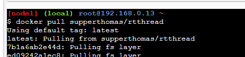
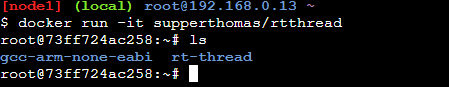
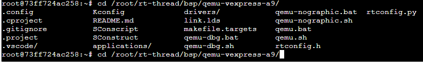
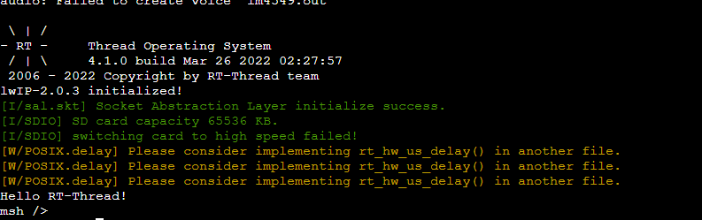

# 如何用docker来学习rtthread-qemu

## 背景介绍

相信有一些小伙伴对于搭环境来说是一件痛苦的事情，经常会遇到各种奇怪的问题

虽然文档中心对于快速上手rtthread已经讲的非常详细了：

有以下方法，我来总结一下

- [Keil 模拟器 STM32F103 上手指南](https://www.rt-thread.org/document/site/#/rt-thread-version/rt-thread-standard/tutorial/quick-start/stm32f103-simulator/stm32f103-simulator)

- [RT-Thread 潘多拉 STM32L475 上手指南](https://www.rt-thread.org/document/site/#/rt-thread-version/rt-thread-standard/tutorial/quick-start/iot_board/quick-start?id=rt-thread-潘多拉-stm32l475-上手指南)

- [在 Window 平台使用 QEMU 运行 RT-Thread](https://www.rt-thread.org/document/site/#/rt-thread-version/rt-thread-standard/application-note/setup/qemu/windows/an0006-qemu-windows?id=在-window-平台使用-qemu-运行-rt-thread)

- [在 Ubuntu 平台开发 RT-Thread](https://www.rt-thread.org/document/site/#/rt-thread-version/rt-thread-standard/application-note/setup/qemu/ubuntu/an0005-qemu-ubuntu?id=在-ubuntu-平台开发-rt-thread)

这篇文章主要介绍如何用docker来运行rtthread

使用docker有以下优势，

- 一键下载
- 对于linux用户或者mac用户友好
- 学习成本低

不过docker也同样有几大劣势：

- 网速较慢（需要科学上网）
- github访问比较麻烦
- 没有图形化界面

这篇文章呢，主要让大家体验以下docker带来的方便，可能实用性不一定很高。不过相信肯定有很多docker大佬，如果对于用docker学习有什么好的意见或者建议，也可以在评论区里面帮忙留言和建议。也帮我解决一些docker的问题。

我现在觉得主要是以下几个问题：

- docker 镜像下载比较慢
- Dockerfile里面的代码git clone的git地址现在国内由于访问不了github无法实现自动化。

本篇文章的学习仓库

github https://github.com/supperthomas/Dockerfiles.git  (欢迎star来交流)

gitee https://gitee.com/superThomas/Dockerfiles.git


## 实验步骤

### 实验环境

小伙伴们可以在windows和linux或者mac上安装docker

https://www.docker.com/

由于有些小伙伴可能本地镜像下载比较慢，这里我找到一个比较方便的快速实验本项目的网址：

https://labs.play-with-docker.com/

这个只要注册一个账号即可（可能需要科学上网）

直接新建一个docker container


### 拉取镜像

输入命令`docker pull supperthomas/rtthread` 这个要稍微等一会，不过这里已经比本地快很多了，因为服务器是在国外



然后输入命令`docker run -it supperthomas/rtthread`



到这里环境就已经弄好了

### qemu编译

接下来就可以根据文档中心的qemu的命令来操作了，输入命令`cd /root/rt-thread/bsp/qemu-vexpress-a9/`



执行命令`scons`


### qemu 运行

输入命令`./qemu-nographic.sh`

然后就可以看到hello world



## 总结

下面我提供几个我做的几个小一点的镜像，给需要的小伙伴pull

```
docker pull supperthomas/rtthread_mini:latest 这个没有gcc(非常小适合DIY)，没有arm-gcc(这个比较大)
docker pull supperthomas/rtthread_mini:v3 这个加了arm-gcc环境变量，无rtthread源码。（适合STM32 等arm-gcc环境）
docker pull supperthomas/rtthread_mini:v4 这个有gcc，加了rtthread源码自动下载。
docker pull supperthomas/rtthread_mini:v5 这个加了gcc，加了rtthread 源码，如果需要更新需要git pull
docker pull supperthomas/rtthread_mini:v6 这个在v5基础上加了qemu-system-arm 可以运行qemu
```

虽然看起来这篇文章比较简单，这也是我尝试了很多种复杂方法之后，总结出来的最简单的方法，希望大家感兴趣能够尝试一下，如果有什么好的建议也可以提一下。


