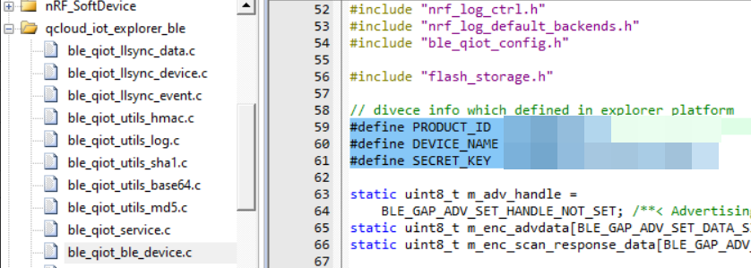

#  LLSYNC

## 简介

llsync是什么

llsync是一款智能家居产品，用于蓝牙相关的，通过蓝牙接入腾讯连连小程序的一款SDK。可以通过蓝牙来点灯，与其他的蓝牙example不同的是，这个可以移植到很多其他平台而不需要过多的porting，后续整理其他feature的时候，也可以尽量规范通用一些。

参考[DEMO](https://github.com/TencentCloud/tencentcloud-iot-explorer-ble-sdk-embedded-demo)

##  llsync DEMO如何使用

首先demo是基于ESP32和nrf52832两款芯片的。ESP32有WIFI和蓝牙两种连接智能家居的方式，nrf52832对于单蓝牙具有一定的代表性。

首先第一点就是这个demo怎么用呢？参考文档[蓝牙设备接入指引](https://cloud.tencent.com/document/product/1081/50969)

下面简单总结一下，首先准备一款nrf52832的开发板

### 准备软件环境

1. 前往 [NORDIC 官网](https://www.nordicsemi.com/Software-and-tools/Software/nRF5-SDK/Download) 下载 nRF5_SDK。

### 下载例程代码

1. 下载 [示例程序](https://github.com/tencentyun/qcloud-iot-explorer-BLE-sdk-embedded-demo)。
2. 拷贝 `qcloud-iot-ble-nrf52832` 文件夹至 nrf sdk 的示例程序目录下，例如 SDK\examples\ble_peripheral`。

### 代码修改与烧录

1. 打开工程 SDK\examples\ble_peripheral\qcloud-iot-ble-nrf52832\pca10040\s132\arm5_no_packs\ble_app_blinky_pca10040_s132.uvprojx`。
2. 打开文件 `ble_qiot_ble_device.c`，找到以下三个宏并修改为您自己的设备信息。

三个宏定义参考文档获取。

之后参考文档就可以使用了，手机端采用微信里面的腾讯连连小程序即可。先添加设备，然后配网。

### 烧入

第一次烧入最好先将芯片整个擦除，防止flash里面预留了一些配对信息。

先烧入softdevice  目录在 components\softdevice\s132\hex\s132_nrf52_7.2.0_softdevice.hex

然后再烧入llsync工程生成的代码

### 使用

打开腾讯连连小程序，连接设备即可。