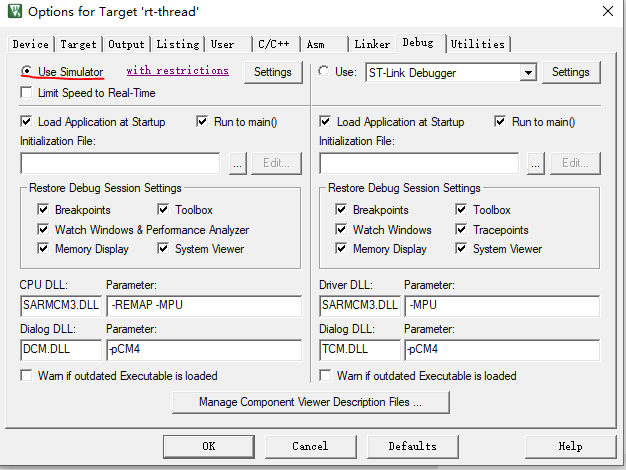
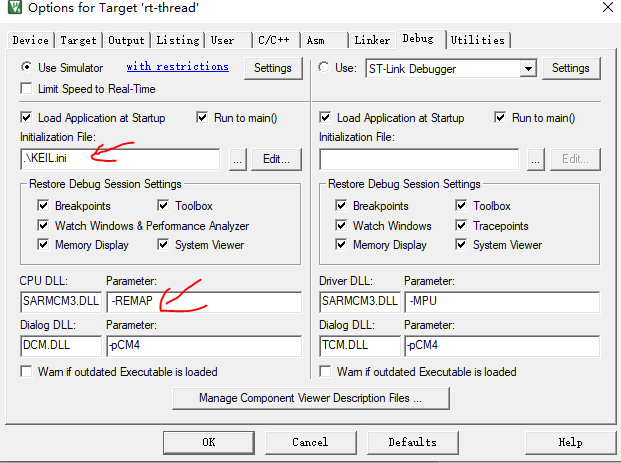
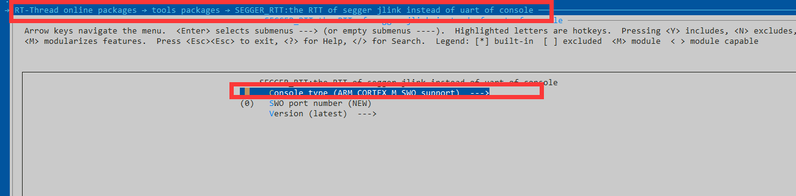
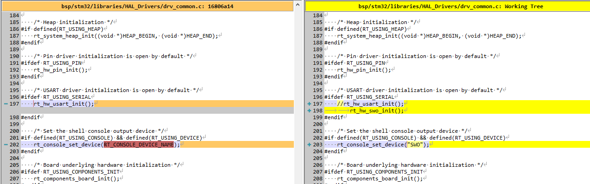
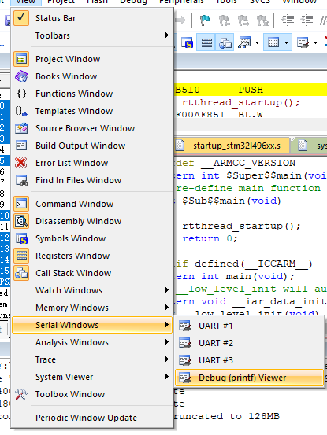
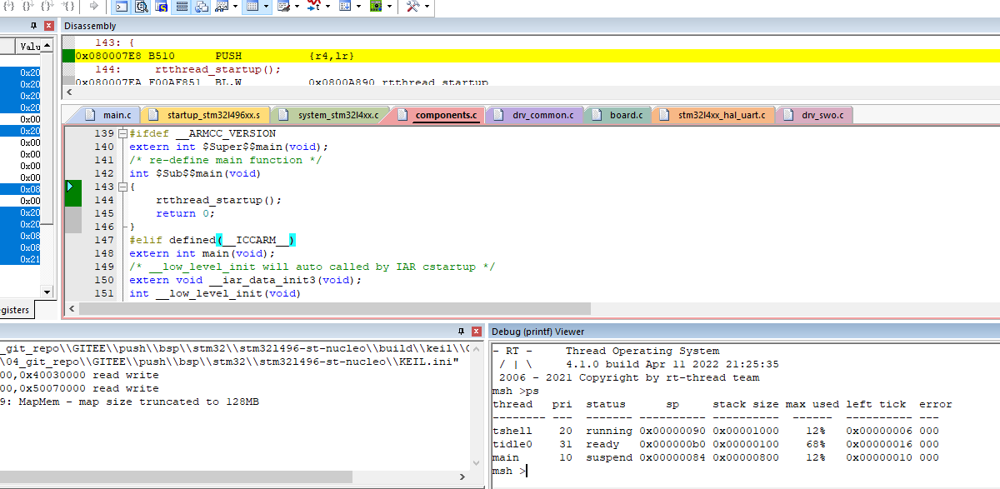

# 如何在keil中STM32L496 跑simulator 

事情还是得从RTTHREAD 官方的文档[Keil 模拟器 STM32F103 上手指南](https://www.rt-thread.org/document/site/#/rt-thread-version/rt-thread-standard/tutorial/quick-start/stm32f103-simulator/stm32f103-simulator?id=keil-模拟器-stm32f103-上手指南)

说起，用了很久的KEIL，相信大家很少有人用simulator功能，这个在我接触RTTHREAD之前也是没有用过的，看过官方的文档之后，觉得这个很神奇，不需要开发板就可以跑RT-THREAD。有一些简单的功能，比如一些纯软件的软件包也可以在simulator上面跑，正好STM32L496ZG bsp也是我提交的，是否可以使用simulator来测一下简单的功能呢？

## 试一下BSP/STM32/stm32l496zg

下载了最新RTTHREAD的master https://github.com/RT-Thread/rt-thread/tree/master/bsp/stm32/stm32l496-st-nucleo 上面的代码，选择simulator功能



结果发现，跑着跑着，就报了下面的error

```
*** error 65: access violation at 0x40021000 : no 'write' permission
```

找了好久的资料，发现在`initialzation File` 那边有一些猫腻，需要在这里添加寄存器的访问权限

下面我们新建一个ini文件，可以叫KEIL.ini  输入下面的命令，保存下来

```
MAP 0x40000000,0x40030000 read write
MAP 0x48000000,0x50070000 read write
```

然后加载进去，同时，**我们要把-MPU去掉，不加载**



这个时候我们会发现死在了_Error_Handler这个函数里面。尝试把while循环去掉看看。

再运行一次，发现死在了UART这个函数UART_WaitOnFlagUntilTimeout里面，这个就比较难查了，不过我想了下，可以用我最近开发的软件包[segger_rtt](https://github.com/supperthomas/RTTHREAD_SEGGER_TOOL)让SWO代替UART输出，看看正常的thread是否是好的。



然后用命令`pkgs --update`来更新软件包，用`scons --target=mdk5`来生成keil工程（记得需要将工程配置选用simulator，因为target命令重新覆盖了keil工程）

我们尝试按照segger_rtt 软件包里面的提示做如下修改将console口改为SWO：

修改如下所示



调试的时候，需要打开SWO监视窗口：



之后点击调试按钮



运行，就可以发现有如上的界面，这个时候不需要连接开发板，直接可以跑ps等命令。

我感觉比较神奇，就分享给大家，如果你在STM32L4平台上想用simulator功能的话，可以使用这个文档提供的方法。

##  simulator的优势和劣势

这边我稍微总结下simulator的优势和劣势：

优势：

- 可以不用硬件开发板体验：执行一些简单的操作逻辑。
- CI 支持： 可以支持支持自动化集成方案，可以测一些基本的软件function，比如一些跑分软件。
- 对硬件没有损害：可以避免出现一些烧板子的奇怪问题

劣势：

- 对于一些硬件外设相关的访问，可能会有异常行为，跑RTOS没问题
- 不能模拟一些带有SPI flash或者SDRAM等需要有外设的开发板


公众号


