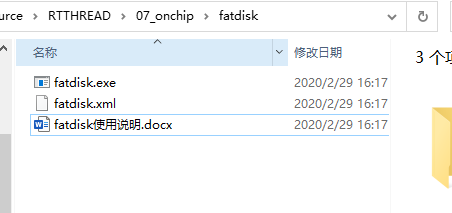
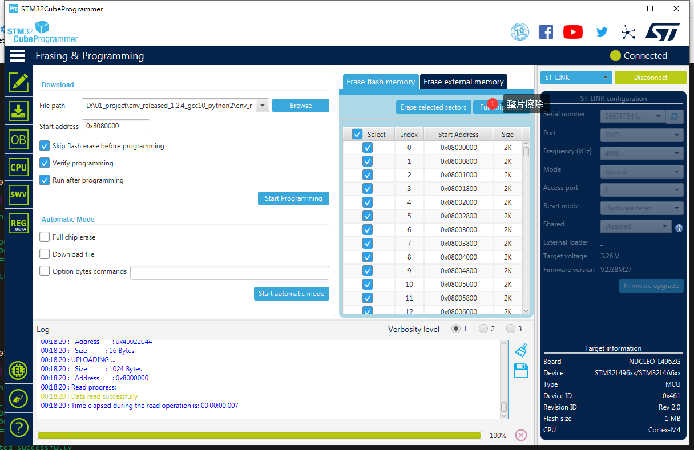
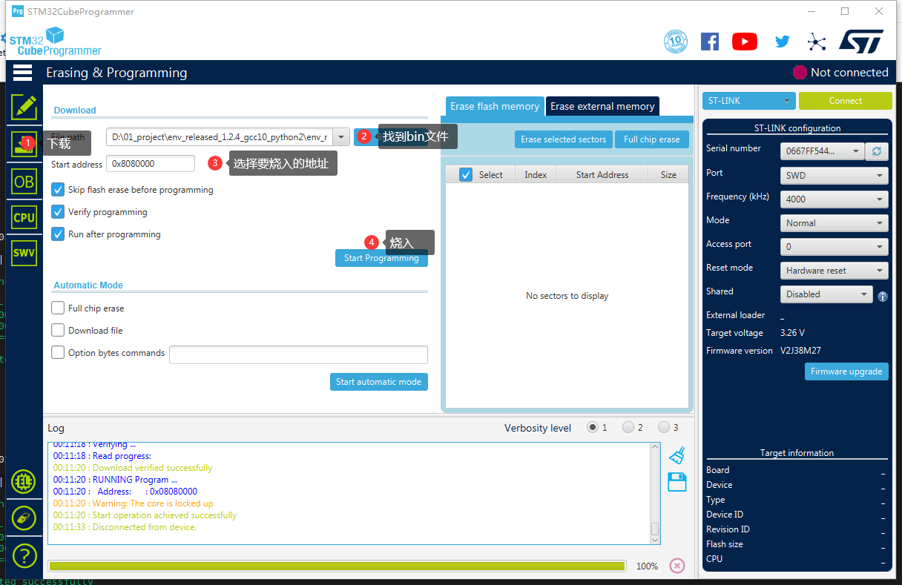
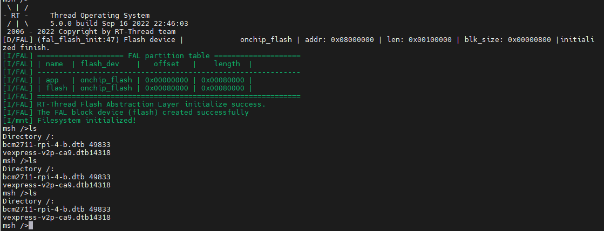

# STM32如何将文件放到内部flash里面

## 背景介绍

上一篇讲到如何将STM32的FLASH改成文件系统：

[如何不用外设在STM32片上FLASH做一个文件系统](https://club.rt-thread.org/ask/article/677bbf280fa0718f.html)

https://club.rt-thread.org/ask/article/677bbf280fa0718f.html

后来用了一下，发现文件系统是有了，怎么往里面存文件呢？难道每个文件都一个一个打么？

很多小伙伴在用micropython或者动态模块加载的时候，经常要把文件放到文件系统里面，这个时候有的小伙伴想到了用Ymodem来进行数据传输，当然这是一种方法, 不过这种方法在多文件的时候，就比较麻烦了。今天给大家介绍一个比较方便的方法，当然这个也是参考的文档中心的文档，受其启发，来运用到STM32等其他MCU中去

该文档目标人群：

- 希望比较方便的将文件烧入到片上或者片外FLASH上去的
- 希望能够将文件转化成bin烧入到flash中去
## 如何实现

那就要想办法如何将文件放到内部flash里面了。其实说出来很简单，只需要学会用一个exe文件即可。

### 第一步 使能文件系统

首先第一步做的是，我们要按照之前的教程，先把STM32片上文件系统这个功能搞出来，参考之前的文章。这个是前提条件，

 ###  第二步 将需要存放的文件放到目录中去

这个软件参考附件



可以在这里新建一个文件夹`root`  文件夹内放你需要的文件

这个时候双击一下`fatdisk.exe` 可以发现生成了一个`root.bin`文件，当然过程是这个过程，不过我们要根据不同的开发板来配置不同的xml文件。

### 第三步配置XML文件

打开`fatdisk.xml`文件，例子内容如下：

```
<?xml version="1.0" encoding="UTF-8"?>
<fatdisk>
   <disk_size>2048</disk_size>
   <sector_size>4096</sector_size>
   <root_dir>root</root_dir>
   <output>root.bin</output>
   <strip>1</strip>
</fatdisk>

```

- disk_size： 这个就是你最后想要生成的目标root.bin大小 单位是Kbytes.
- sector_size: 这个是bin的扇区大小，这个要根据自己开发板来，根据上一篇文章，不同芯片的扇区不一样，这里STM32L496ZG 扇区是2KB。 这里填2048
- root_dir就是指定要转换的目录名称
- output就是要生成的bin的名称
- strip： 这个如果是`1`就是代表会根据你文件夹里面的文件大小来进行缩减，就是你的文件夹多大最后生成的bin大小就是多大。如果是`0` 代表 后面空白数据填0xff, 填充到想要的大小。

好根据STM32L496ZG-NUCLEO的开发板，我们得出下面的配置：

```
<?xml version="1.0" encoding="UTF-8"?>
<fatdisk>
   <disk_size>512</disk_size>
   <sector_size>2048</sector_size>
   <root_dir>sd</root_dir>
   <output>sd.bin</output>
   <strip>1</strip>
</fatdisk>
```

最大512KB，生成的sd.bin大小为212KB.

双击fatdisk.exe 生成sd.bin

### 第四步烧入文件

很多工具可以烧入BIN文件，根据调试器的不同：

- STLINK 和IAP可以选stm32cubeprogrammer
- JLINK 可以选 jlink flash lite

这里我用STLINK 

打开stm32cubeprogrammer

先将芯片全部擦除（如果flash被写过的话，需要擦除才能烧入）



然后烧入bin，这里的地址要根据你FAL里面填的地址来选，这边我用的是FLASH偏移是`0x00080000` ,STM32的起始地址是0x08000000， 所以文件系统偏移是`0x8080000`



###  第五步烧入程序验证

这一步就要烧入上一篇讲的带有flash功能的的程序了，这里注意烧入的时候，不要整个芯片擦除，要选择`sector erase` ,一般默认是部分擦除。因为整个擦除就把文件系统也擦掉了

烧入之后输入命令`ls`



可以看到文件系统在里面。


## 参考：

- [ 使用 QEMU 运行动态模块组件](https://gitee.com/rtthread/docs-online/blob/master/rt-thread-version/rt-thread-standard/application-note/components/dlmodule/an0023-dlmodule.md)

https://gitee.com/rtthread/docs-online/blob/master/rt-thread-version/rt-thread-standard/application-note/components/dlmodule/an0023-dlmodule.md