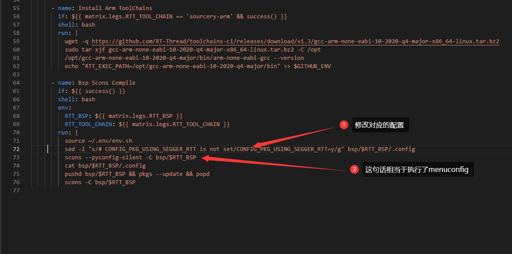
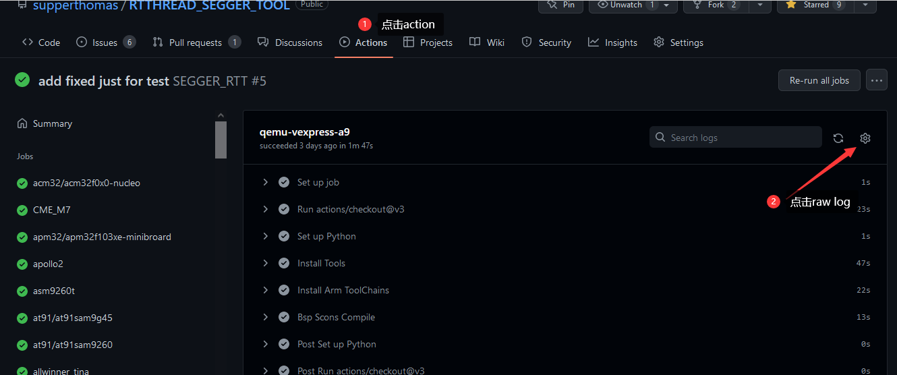

# 【github】【action】如何给软件包添加CI集成

## 简介

`github`有自己的CI集成工具 `action`, 很少有小伙伴关注到，如果你有自己的软件包，想要对其进行维护的话，添加CI集成能够方便你快速验证你的代码是否在RTT上可以顺利编译。

下面的链接是`github action`的帮助文档：

https://docs.github.com/cn/actions/automating-builds-and-tests/about-continuous-integration

本文会大概指导一下大家，如何在自己软件包上添加CI集成工具，由于每个软件包的配置都不相同，要根据下面的步骤，灵活的配置你自己的软件包。

添加CI 大概有以下作用：

- 可以验证你的软件包在不同的bsp下面的编译情况，可以告诉用户bsp是可以用你的软件包的。
- 在RTTHREAD升级的时候，可以通过触发CI来告诉作者，该软件包编译是否有问题。
- 可以学习如何自行部署action和调试action。
- 也可以间接的告诉作者如何使用你的软件包

## 背景

在我们PR的时候，经常会遇到CI不通过的情况，其实是RT-THREAD仓库里面的action 下面链接的文件起作用

https://github.com/RT-Thread/rt-thread/blob/master/.github/workflows/action.yml

受这个启发，我们把它整合到我们自己的软件包仓库下面。下面以我的仓库的软件包举例

https://github.com/supperthomas/RTTHREAD_SEGGER_TOOL

欢迎star

## 步骤

### 第一步 下载软件包

先把你的软件包下载下来

```
git clone git@github.com:supperthomas/RTTHREAD_SEGGER_TOOL.git
```

然后` git branch `  看下当前的分支是`main` 还是`master` 这个后面需要用到，我这里是`main`

然后新建一个分支，自己起任意名字，因为我们要发起PR到自己仓库，所以不能像以前一样直接PR到main分支

```
git checkout -b ci_test
```

### 第二步 添加action.yml

这里给大家提供一个模板，可以先尝试添加如下的模板在仓库的`.github` 文件夹下面新建一个`workflows`文件夹，下面添加`action.yml`。

```
name: SEGGER_RTT

# Controls when the action will run. Triggers the workflow on push or pull request
# events but only for the master branch
on:
  # Runs at 16:00 UTC (BeiJing 00:00) on the 1st of every month
  schedule:
    - cron:  '0 16 1 * *'
  push:
    branches:
      - main
    paths-ignore:
      - documentation/**
      - '**/README.md'
      - '**/README_zh.md'
  pull_request:
    branches:
      - main
    paths-ignore:
      - documentation/**
      - '**/README.md'
      - '**/README_zh.md'

jobs:
  build:
    runs-on: ubuntu-latest
    name: ${{ matrix.legs.RTT_BSP }}
    strategy:
      fail-fast: false
      matrix:
       legs:
         - {RTT_BSP: "qemu-vexpress-a9", RTT_TOOL_CHAIN: "sourcery-arm"}

         
    steps:
      - uses: actions/checkout@v3
        with:
          repository: RT-Thread/rt-thread
      - name: Set up Python
        uses: actions/setup-python@v3
        with:
          python-version: 3.8

      - name: Install Tools
        shell: bash
        run: |
          sudo apt-get update
          sudo apt-get -qq install gcc-multilib libsdl-dev libncurses5-dev scons
          sudo python -m pip install --upgrade pip -qq
          pip install requests -qq
          git config --global http.postBuffer 524288000
          python -c "import tools.menuconfig; tools.menuconfig.touch_env()"
          echo "RTT_ROOT=${{ github.workspace }}" >> $GITHUB_ENV
          echo "RTT_CC=gcc" >> $GITHUB_ENV

      - name: Install Arm ToolChains
        if: ${{ matrix.legs.RTT_TOOL_CHAIN == 'sourcery-arm' && success() }}
        shell: bash
        run: |
          wget -q https://github.com/RT-Thread/toolchains-ci/releases/download/v1.3/gcc-arm-none-eabi-10-2020-q4-major-x86_64-linux.tar.bz2
          sudo tar xjf gcc-arm-none-eabi-10-2020-q4-major-x86_64-linux.tar.bz2 -C /opt
          /opt/gcc-arm-none-eabi-10-2020-q4-major/bin/arm-none-eabi-gcc --version
          echo "RTT_EXEC_PATH=/opt/gcc-arm-none-eabi-10-2020-q4-major/bin" >> $GITHUB_ENV

      - name: Bsp Scons Compile
        if: ${{ success() }}
        shell: bash
        env:
          RTT_BSP: ${{ matrix.legs.RTT_BSP }}
          RTT_TOOL_CHAIN: ${{ matrix.legs.RTT_TOOL_CHAIN }}
        run: |
          source ~/.env/env.sh
          sed -i "s/# CONFIG_PKG_USING_SEGGER_RTT is not set/CONFIG_PKG_USING_SEGGER_RTT=y/g" bsp/$RTT_BSP/.config
          scons --pyconfig-silent -C bsp/$RTT_BSP
          cat bsp/$RTT_BSP/.config
          pushd bsp/$RTT_BSP && pkgs --update && popd
          scons -C bsp/$RTT_BSP

```

这个模板只保留了qemu，第一次先测一下qemu，后面再添加其他的action，可以直接参考rt-thread里面的放置。

新建完了之后需要根据你自己的软件包做如下修改：

#### 修改一：branch要对应main或者master


#### 修改二： .config要做对应修改

`.config`需要做对应的修改，首先要知道你的软件包要打开哪些配置，首先整个软件包有个大的宏，例如我的软件包就是`CONFIG_PKG_USING_SEGGER_RTT`   打开`.config`可以找到这个宏

用`sed`命令替换.config中的配置

从`# CONFIG_PKG_USING_SEGGER_RTT is not set` 替换为`CONFIG_PKG_USING_SEGGER_RTT=y`

```
sed -i "s/# CONFIG_PKG_USING_SEGGER_RTT is not set/CONFIG_PKG_USING_SEGGER_RTT=y/g" bsp/$RTT_BSP/.config
```

这个你可以通过`menuconfig`配置之后，查看`git diff` 查看。

这个修改之后就可以使能软件包了

后面那句话

```
scons --pyconfig-silent -C bsp/$RTT_BSP
```

相当于执行了menuconfig。



如果要修改其他配置的话，请在`scons --pyconfig-silent -C bsp/$RTT_BSP` 这个语句后面执行，因为有些配置只有在使能软件包之后才会有.config

最后一定要记得执行`scons --pyconfig-silent -C bsp/$RTT_BSP` 相当于保存配置。

到这里`action.yml` 已经修改好了，

### 第三步 PR测试

接下来就要提交你的PR了

``` 
git push origin ci_test
```

提交分支之后，点击PR按钮

执行PR，就可以看到对应的CI 开始跑了。

这个时候如果出现问题，需要点击下图中的`raw log` 查看



这里我通过命令`cat bsp/$RTT_BSP/.config`

将对应的`.config` 打印出来 你只要检查下.config内容和你用menuconfig内容有什么差异即可。

### 第四步 添加其他bsp

qemu添加ok之后，你就可以根据rt-thread中的action

https://github.com/RT-Thread/rt-thread/blob/master/.github/workflows/action.yml

中的bsp列表，添加所有的bsp了。

可能会遇到的问题，需要挑选对应的bsp：

- 可能有些`bsp` 的芯片`ROM`太小了, 你的软件包编译之后 代码越界了。
- 可能有些bsp的架构不适合你的软件包，比如我的SEGGER_RTT 就是只需要适配ARM相关的bsp即可。

欢迎大家提建议或者尝试在自己的软件包中添加CI集成。


