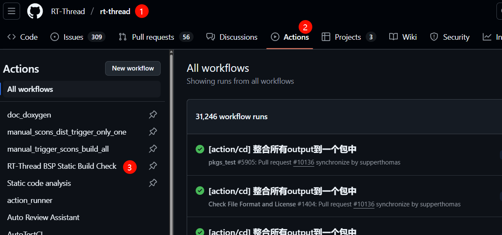

# RT-Thread CI编译产物artifacts自动上传功能介绍

近期在RT-Thread开源项目中，我们引入了一项实用的功能改进——将每次CI（持续集成）编译生成的产物（artifacts）自动上传到GitHub，方便开发者和用户能够更便捷地获取和测试最新的编译结果。

参考链接：https://github.com/RT-Thread/rt-thread/actions/runs/14015695988

如下图所示：

下面将为大家详细介绍这一功能。

## 一、功能背景

在软件开发过程中，持续集成是确保代码质量和项目顺利推进的重要环节。每次代码提交后，CI系统会自动进行编译和测试，生成相应的产物，称为artifacts。然而，之前这些产物仅在CI系统内部保存，开发者若想获取最新编译结果进行测试验证，则无法验证。而且之前的commit，需要下载代码，重新编译测试。

有了目前这个功能之后，每一笔commit提交，都会有对应的产物生产，为后续回溯问题，提供了比较方便的基础。

## 二、功能实现

通过GitHub Actions，我们在RT-Thread项目的CI流程中加入了产物上传的步骤。具体来说，每次CI编译成功后，系统会自动将生成的可执行文件elf，hex，bin文件，并上传到对应的GitHub Actions运行记录中。这一过程无需人工干预，确保了编译产物的及时性和准确性。

## 三、功能优势

1. **便捷获取最新编译结果**：开发者无需再手动寻找或请求他人提供最新的编译产物，只需访问GitHub Actions的运行结果页面，即可快速下载所需的文件进行测试。

2. **提高测试效率**：团队成员可以更快速地对新提交的代码进行测试验证，减少了因等待编译产物而导致的时间浪费，加快了问题发现和解决的节奏。不需要每次都选择对应的meuconfig生成对应的产物，直接可以下载对应的产物，只要将配置放到yml中即可。

以L496ZG为例，下载之后，可以得到所有的可执行文件

3. **方便后续测试和升级**：方便测试，测试人员可以直接测试hex文件，即可完成测试。

## 四、PR的时候如何使用

每次PR的时候，会进行CI检查，检查完成之后，会在workflow中，

1. 在相应的CI工作流运行记录中，拉到最下面，可以查看生成的产物列表。

3. 根据需要选择并下载对应的编译产物进行测试和验证。

这一功能的实现，是RT-Thread项目在开发流程优化上的又一进步，旨在为开发者提供更加高效、便捷的开发体验。我们期待这一功能能够帮助大家更好地参与到RT-Thread的开发和测试中，共同推动项目的持续发展。

如果你在使用过程中有任何疑问或建议，欢迎随时在项目的Issue区或社区论坛中与我们交流反馈。