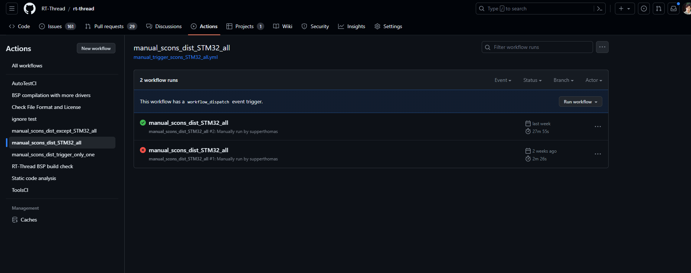
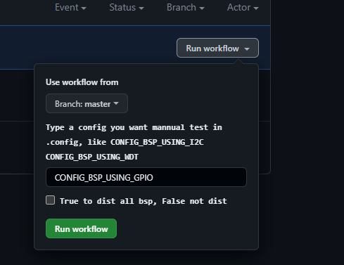
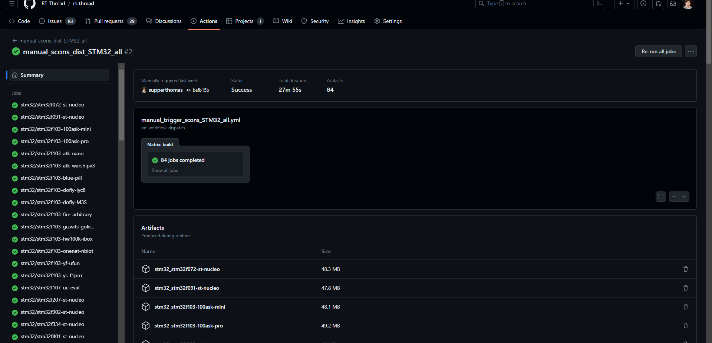

# [CI] 如何检查RT-THRED所有bsp编译情况

## 简介

大家都知道RTT上的bsp有非常多的厂商，每个有很多厂商的toolchain都不一样。具体有哪些厂商可以参考[readme](https://github.com/RT-Thread/rt-thread/blob/master/bsp/README.md)

那如果我们要尝试检查所有的bsp要怎么做呢？

官方有个`.github/action.yml` ,这个文件[action](https://github.com/RT-Thread/rt-thread/blob/master/.github/workflows/action.yml) 之前经过优化，可以每次PR都检查一下，当然这里的CI不是很全。

所以我想了一个办法，可以对所有bsp进行编译。

## 设计思路

理想情况肯定是可以让CI机器人对每个文件夹下面执行scons， 但是由于scons依赖tool chain，所以不同的bsp对scons的要求也不一样，这里并没有很明显的标记来识别该bsp需要使用哪个toolchain。

也许把所有toolchain都装上也是一种好的办法。

bsp中，最常见的是`arm-none-eabi-gcc`

所以我们先用arm来对所有bsp来编译一遍。然后看下有哪些编译错误，然后把这些编译错误的bsp再进行toolchain的修正，最后我们就会发现哪些bsp编译不通过了。

## 如何检查bsp编译情况

这边我采用了CI中的matrix数组来将所有bsp都列出来下面的格式：

```
      matrix:
       legs:
        - {RTT_BSP_NAME: "stm32_stm32f072-st-nucleo", RTT_TOOL_CHAIN: "sourcery-arm", RTT_BSP: "stm32/stm32f072-st-nucleo"}
        - {RTT_BSP_NAME: "stm32_stm32f091-st-nucleo", RTT_TOOL_CHAIN: "sourcery-arm", RTT_BSP: "stm32/stm32f091-st-nucleo"}
        - {RTT_BSP_NAME: "stm32_stm32f103-100ask-mini", RTT_TOOL_CHAIN: "sourcery-arm", RTT_BSP: "stm32/stm32f103-100ask-mini"}
```

这里包含bsp的toolchain信息也有了。这里的基本都是文本批量操作，也可以大伙帮忙搞个脚本来生成。前面的名字就是把`/` 换成`_`

在使用这个matrix的时候，有个特性，就是matrix的数量一次只能256（使用的时候发现的，因为rtt的bsp已经三百多个了）。

所以我尝试把STM32和其他bsp分开了。

如果想要编译STM32，可以选择manual_scons_dist_STM32_all，非STM32的可以选择manual_scons_dist_except_STM32_all

### 怎么做？

打开github 的action页面，参考下面的图片。

https://github.com/supperthomas/rt-thread/actions



之前有篇文章介绍了如何检查单个bsp的编译情况：[github] [action] RTT黑科技: 添加手动打包和编译特定bsp功能：https://club.rt-thread.org/ask/article/419a30e57384a239.html

操作类似，点击manual_scons_dist_STM32_all， 然后点击右边的`Run Workflow`(还是提醒，你要对该仓库有权限才可以触发这个按钮，如果发现没有按钮，请将仓库fork到自己账号，然后你就可以看到了)

下面的选项中，有以下内容：



- 第一个可以选择需要编译的branch或者tag，可以选master也可以选其他分支
- 添加编译配置，这个默认是GPIO（一般bsp都有的，可以改成其他的.config的配置）
- 下面的勾选按钮，是用来打包bsp的，就是bsp编译之后的文件是否需要`scons --dist`  便于下载。

然后直接点击绿色的`Run workflow` 就可以了。

这个编译所有bsp会比较久，也就是等待半个小时或者1个小时吧。因为所有bsp实在太多了。

当然你也可以使用之前打包好的：

https://github.com/RT-Thread/rt-thread/actions/runs/5459726060



这里右边的Artifacts就是之前文档将的bsp编译出来的文件和`scons --dist`的project.zip文件，可以用于检查编译情况。

上面这个是对所有STM32编译的情况，

下面这个是除了STM32所有bsp的编译情况：

https://github.com/RT-Thread/rt-thread/actions/runs/5473599379

当然这里我已经把编译不过的bsp都暂时注释掉了，如果小伙伴们熟悉相关BSP， **欢迎PR修复**

编译失败的bsp见下面的action

https://github.com/supperthomas/rt-thread/actions/runs/5503221678

编译失败的bsp如下所示：

```
gd32105c-eval
bouffalo_lab/bl61x
airm2m/air105
allwinner/d1s
essemi/es32f0654
fm33lc026
bf533
allwinner/d1
avr32uc3b0
core-v-mcu/core-v-cv32e40p
bouffalo_lab/bl808/m0
gd32107c-eval
essemi/es32f365x
bouffalo_lab/bl808/d0
ck802
amebaz
ft2004
gd32350r-eval
bouffalo_lab/bl808/lp
imxrt/imxrt1170-nxp-evk/m7
hk32/hk32f030c8-mini
Infineon/psoc6-pioneerkit_modus
lpc43xx/M4
hc32l136
lpc54608-LPCXpresso
juicevm
mini4020
lpc824
nios_ii
mm32l07x
mm32f327x
m16c62p
imx/imx6ull-smart
lpc43xx/M0
imxrt/imxrt1021-nxp-evk
ESP32_C3
microblaze
phytium/aarch32
raspberry-pi/raspi3-64
pic32ethernet
raspberry-pi/raspi4-64
nv32f100x
rv32m1_vega/ri5cy
sep6200
rx
tae32f5300
nuclei/nuclei_fpga_eval
raspberry-pi/raspi2
samd21
synopsys/boards
55
taihu
ti/c28x/tms320f28379d
thead-smart
rockchip/rk2108
tms320c6678
tkm32F499
upd70f3454
wch/arm/ch579m
wch/risc-v/ch32v103r-evt
wch/risc-v/ch569w-evt
w60x
x86
yichip/yc3121-pos
wh44b0
xplorer4330/M0
```

## 总结

这篇主要提供一种CI可以编译所有bsp的一种方法，主要想看下哪些bsp还没有支持`scons` ,如果支持gcc和scons，我们可以把这些bsp放到CI上，定期对其进行编译检查，让机器人帮我们完成一些手动操作，当然这个应该是平台做的事情，不过我们也可以尝试做一些，因为RTT来源于社区。

另外， 如果你熟悉的bsp在上面，出现编译不过的情况，你想修复，但是不是很会，可以尝试加入PR群。https://club.rt-thread.org/ask/article/e19f1f0f77fbd119.html

问出你的问题，可以提供一些支持。并且可以让你学到很多东西。

当然如果对这个感兴趣或者有一些更好的建议，可以在下面的评论区留言，非常欢迎。