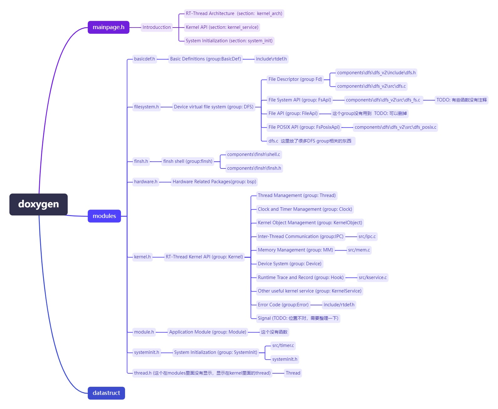

# RTTHREAD Doxygen 阅读

## 简介

本文主要介绍RT-THREAD doxygen如何进行阅读和方便查找。

之前做了几篇doxygen如何生成和自动CI的内容，觉得还是需要让读者在使用的时候，尽快的了解这个doxygen生成的文档如何阅读和使用。

[如何在线查看RT-THREAD的API 的注释](https://club.rt-thread.org/ask/article/0323c2c543515f29.html)

## 页面解析

依照RT-THREAD作为例子。

首先打开下面的[RTTHREAD_API](https://supperthomas.github.io/RTT_doxygen_API/index.html)

第一个页面mainpage.h


这里一共有三个模块，introduce，Modules(模块)， Data Structures(结构体)

### Introduce

这个主要内容在`rt-thread\documentation\doxygen\mainpage.h`里面

这里分了三个section ： `RT-Thread Architecture`  `Kernel API` `System Initialization`

这里的所有内容都在mainpage.h里面有些图片通过`images`来引用

这里主要介绍了RT-THREAD的一些大概内容，可以简单阅读一下。这里的页面基本都是固定的，所以这里基本上改动不大。

### Modules (主要内容)

模块这里内容比较丰富，也比较重要，如下图所示，这里也是通过doxygen下面的一些头文件来索引到对应的group

这里的group是个比较重要的索引概念，可以将不同文 件中的group都放到一起整理。


这里根据每个文档.h中的group，我们来整理出对应的关系图，如图所示


接下来就是modules里面的group了： `basic Definitions`, `Device virtual file system`, `finsh shell`,`Hardware Related Packages`, `RT-THREAD kernel API`, `Application module`, `System Initialization`

下面根据重要性依次简介一下这些模块。

#### Kernel (主要内容)

Kernel是最重要的这里包含，线程管理，时钟管理，内核结构体管理，线程间通信，内存管理，设备系统，实时跟踪和记录，其他kernel service， error code，等等。都是比较重要的模块

这个group名字叫`Kernel`


在kernel.h中又定义了几个group，然后在其他文件中`@addtogroup Hook` 就可以索引到这里的group中。这里的group在其他.c和.h中，这里就不一一列出了，src和include下面有很多.c和.h都包含了这些group。

#####  Thread  线程管理

线程管理常见函数以`rt_thread_` 打头的函数

##### Clock  时间和时钟管理

时间管理函数以`rt_tick_` 和`rt_timer_` 打头的函数

##### Object  对象管理

对象管理以`rt_object_` 打头的函数

##### Inter-Thread 线程间通信  (主要内容)

这里有`semaphore`, `Mutex`, `event`, `mailbox`,`messagequeue`,

#### Device Virtual File System


这个是文件系统，调用的是dfs_v2中的注释

#### finsh

这个是finsh系统


放的是finsh中的doxygen注释。

####  Hardware

这个是硬件libcpu中需要实现的一些函数，在hardware.h中。


### Data Structures

这个是数据结构体。自动生成的。


## PR 内容

这边检查过程中发现以下问题。

1. Signal 信号有两个，而且是空的，这是由于`addtogroup`的时候，看起来很不和谐，需要在kernel.h中添加如下机制


2. Inter-Thread communication 中，Mutex中的内容和下面的函数内容重复，


在doxygen/mainpage.h中

关键词`@mainpage Introduction`

这里用到了一个图片

`\* @image html System_Arch.png "Figure 1: RT-Thread Architecture"`


Signals在rtthread.h里面

Signal在主页中，看起来很不和谐，需要在kernel.h中添加如下机制

```
/**
 * @defgroup Signals Singal for thread
 * @brief signal is used for thread kill etc.
 *
 * A signal (also known as a soft interrupt signal), from a software perspective, 
 * is a simulation of interrupt mechanism. When it comes to its principle, 
 * thread receiving a signal is similar to processor receiving an interrupt request.
 */
```


显示所有文件列表：





参考：

https://blog.csdn.net/weixin_44567318/article/details/118579636#section__578


https://docs.zephyrproject.org/latest/doxygen/html/index.html


TODO LIST:

1. dfs 看起来有些乱，可以整理一下。 ok
2. 看上去头文件中没有doxygen的注释，都是在src中。
3. signal整理一下。ok
4. rt_event_init   这个在两个地方都有。已解决  ok
5. addtogroup 和ingroup的区别，  ingroup是在group里面有其他group， addtogroup表示加到当前group里面  ok
6. 


https://www.doxygen.nl/manual/index.html


RT-THREAD 参考手册

https://www.rt-thread.org/document/api/index.html

