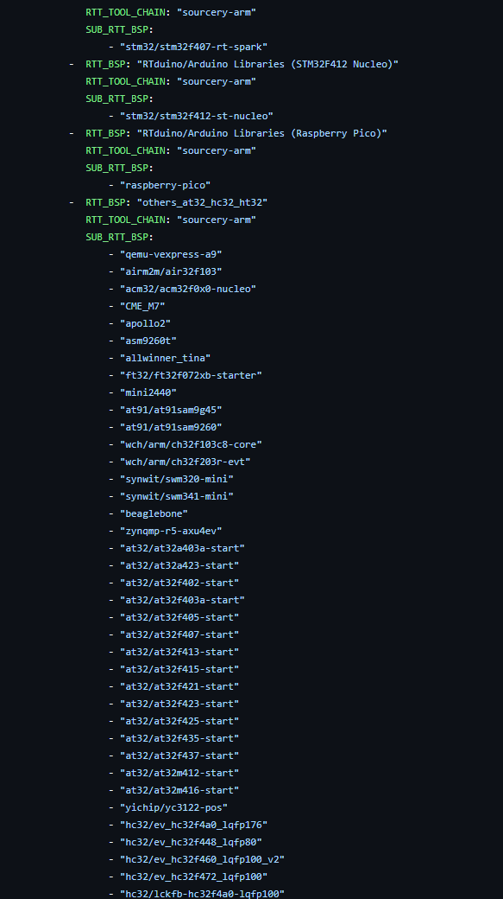
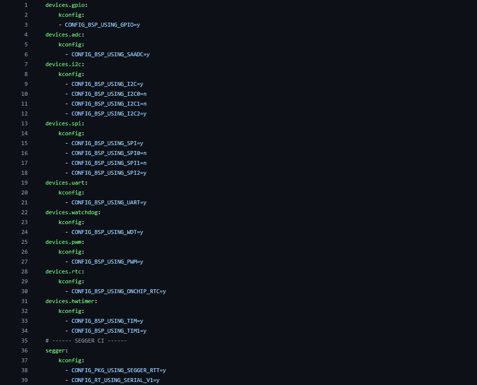
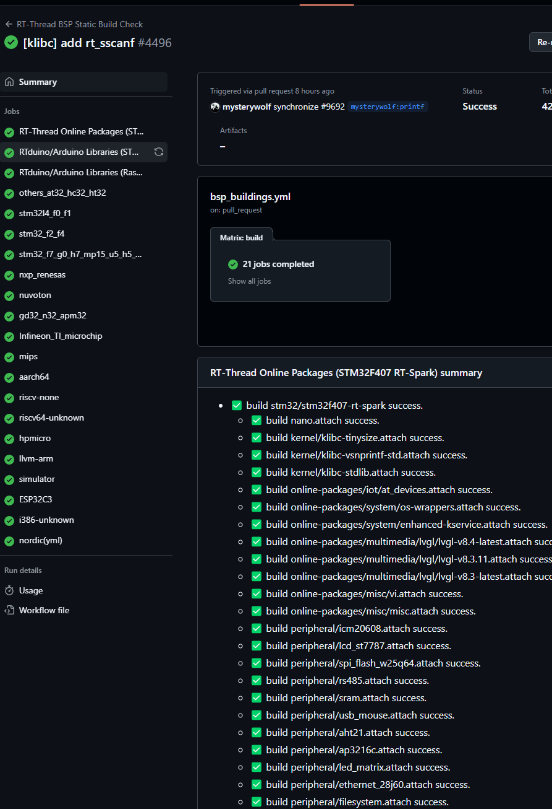
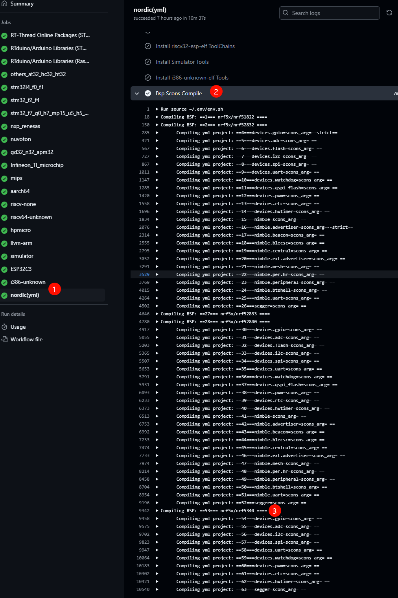
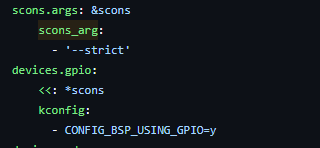

# 如何在master上的BSP中添加配置yml文件

## 问题

目前CI对BSP检查 默认都是只检查基本的GPIO UART的编译，并没有涉及到更多的文件的编译，添加bsp 的yml文件可以让CI去编译更多的配置，从而保护更多的配置。

## 简介

目前我们的RT-THREAD仓库上的bsp的CI检测，已经包含了大部分的bsp， CI [bsp_buildings.yml](https://github.com/RT-Thread/rt-thread/blob/master/.github/workflows/bsp_buildings.yml)



相信提过PR的小伙伴都有遇到过，当有新的BSP提交的时候，只要在这个yml文件里面添加某个bsp就可以了，参考之前的文章

https://club.rt-thread.org/ask/article/b3d7172e2b37cd0a.html

目前已经添加了300多个bsp，每次PR的时候都会进行检测。

但是，目前BSP覆盖的都是基本的bsp编译工程，通常这个配置会检测GPIO, UART，其他的配置不会开。这样的话，可能会导致一些.c文件漏查，出现问题。


之前的文章 介绍了attach文件如何添加，大家可以参考一下，基本目的差不多，都是为了让CI检查更多的配置，这样可以让CI来编译更多的.c ，

也可以把自己常用的配置上传上去。

【bsp】如何添加.ci，attach文件完善bsp编译

https://club.rt-thread.org/ask/article/5edd0f0940a57129.html

【1024】【ci】【github】【bsp】RT-THREAD中的attach文件使用(开启对应配置的CI检查)

https://club.rt-thread.org/ask/article/f129e62f91118746.html


## yml文件

这里我们做了个yml文件，包含所有配置，方便大家统一保存配置。

参考yml文件

https://github.com/RT-Thread/rt-thread/blob/master/bsp/nrf5x/nrf5340/.ci/attachconfig/ci.attachconfig.yml

以下是yml文件的主要内容。



基本上和attach文件功能相同，大家都可以用。

采用yml文件这里，我们觉得比较方便大家更改和管理，

## 如何添加yml文件

### 第一步添加ci.attachconfig.yml

在你常用的bsp下面添加文件`.ci/attachconfig/ci.attachconfig.yml`

比如`bsp/nrf5x/nrf5340/.ci/attachconfig/ci.attachconfig.yml`

https://github.com/RT-Thread/rt-thread/blob/master/bsp/nrf5x/nrf52840/.ci/attachconfig/ci.attachconfig.yml

注意这里的文件夹和文件名不要改变。

### 第二步，添加对应的CONFIG

这里的config就是每次menuconfig需要选中的步骤，比如你要测试segger_rtt的时候

参考

https://github.com/RT-Thread/rt-thread/blob/master/bsp/nrf5x/nrf52840/.ci/attachconfig/ci.attachconfig.yml

添加如下配置

```
segger:
    kconfig:
      - CONFIG_PKG_USING_SEGGER_RTT=y
      - CONFIG_RT_USING_SERIAL_V2=y
```

这里的配置就是差异的配置，你可以在menuconfig之后，查看`.config` 的差异，找到这些修改之后的配置。这里注意只需要填写主要的menuconfig的那个主配置，比如这里选中软件包`CONFIG_PKG_USING_SEGGER_RTT` 其他默认配置不需要添加，只添加修改的配置即可。

如果想要disable某个配置也是添加`CONFIG_RT_USING_SERIAL_V2=n`即可。

### 第三步，提PR验证

通常提交PR之后，会有一个对所有BSP的检测

https://github.com/RT-Thread/rt-thread/actions/workflows/bsp_buildings.yml

这里是所有bsp的检测



找到你的修改是否生效




这里可以看到编译是否通过，如果不通过，需要修改对应的.c文件

## 额外功能

### 添加scons 参数

另外如果需要加`--strict` 强制编译的话。

直接添加一个参数`    scons_arg:`

例如：

```
devices.gpio:
    scons_arg:
      - '--strict'
    kconfig:
      - CONFIG_BSP_USING_GPIO=y
```


### 添加依赖

如果想要复用之前的config，可以参考下图，添加`depends` 节点


###  添加引用

如果想复用之前的scons_arg: 参数也可以参考下面写法：

```
scons.args: &scons
    scons_arg:
      - '--strict'
devices.gpio:
    <<: *scons
    kconfig:
      - CONFIG_BSP_USING_GPIO=y
```




这个主体功能在`https://github.com/RT-Thread/rt-thread/blob/master/tools/ci/bsp_buildings.py` 中实现。

## 总结

主要引入yml， 方便大家保存一些常用的menuconfig配置，

经常大家 可能遇到自己常用的配置跑着跑着不能跑了，这种方式可以帮助大家用ci来维护对应的menuconfig配置。

建议添加yml的时候参考如下规则：

- 采用单独的yml文件放所有的配置，
- 每个配置名称尽量不同，如果相同请用`---` 号隔开，可以参考yml语法
- 尽量在kconfig中写出所有修改的配置，保证config配置能够尽可能方便验证。