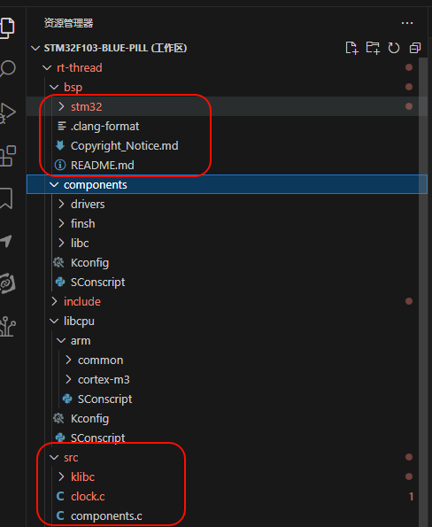
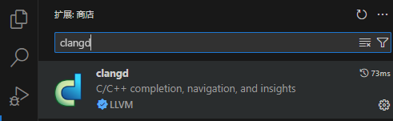
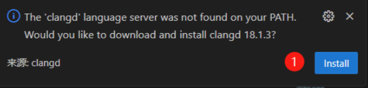
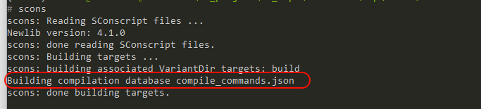
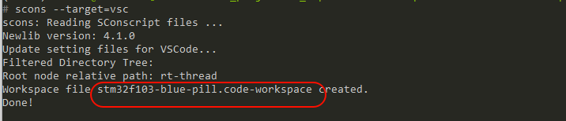
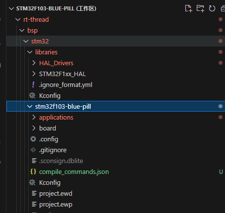
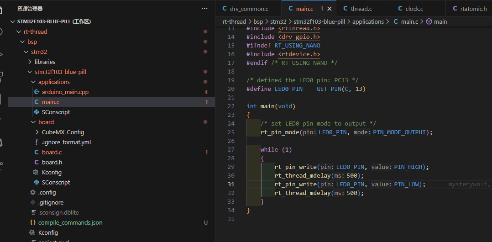
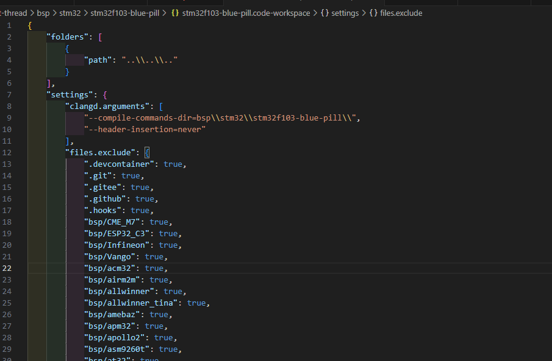

# 在用clangd开发RTT吗，快来试试如何简单获得清晰干净的工作区

## 简介

vscode 号称宇宙第一编辑器，但是在用master开发RT-THREAD的时候，大家似乎都会遇到以下问题：

- master上bsp下面的文件太多
- Keil开发起来倒是干净了很多，但上古的编辑器很不美观
- 想用vscode，在根目录打开的是，文件太多
- 在bsp打开vscode的时候，又不能看rtthread的src源码或者其他driver的文件
- `scons --dist` 到处单独的工程开发，又发现没有git版本控制了。
- clangd的方式，又不能看到所有文件

**是不是即想要在RT-THREAD的master上开发，又想要vscode来编辑，又要能函数鼠标一点就能跳转，而且还要搜索的时候，不要太多不相干的函数名？**

这个既要，又要，还要，还想要的如何满足呢？

如果想要可以按照下面的步骤来，你就可以

- 很干净的，像开发keil一样，只显示想要的文件。
- 在vscode上开发。
- 而且宏定义和跳转都是完全准确的，根据你的编译来的。

最近提交了一个PR， 来满足大家对于vscode的期待，可以算得上满足了大家对vscode的编译器的要求，效果如下所示：



想不想要有这样的干净的工作区？

是不是觉得这样的话，可能会很麻烦，在RT-THREAD上一点也不麻烦，只需要最简单的几个scons命令即可。

请用RT-THREAD以下commit之后的版本，后面如果不行了，可以重置到该版本试下。

https://github.com/RT-Thread/rt-thread/commit/7ff75e21fad3e851090a9f9fcb14d0411949f2f8

只要简单的几步就可以操作，

现在让我们跟随以下步骤来操作一下：

## 操作步骤

### 第一步 安装clangd

如果经常用clangd，或者已经装clangd的可以跳过这一步，



vscode插件商场上安装clangd，然后打开.c文件，会弹出下面的图标，点击install安装。



### 第二步 生成compile_compand.json 文件

这边参考了论坛中的其他文章，见最下面的引用。

只需要几个步骤即可。首先要确保你的`scons`是4.0以上的版本，执行`scons --version` 可以看到版本号, env更新到最新2.0的就可以，直接就可以用，不要安装。

```
# scons --version
SCons by Steven Knight et al.:
        SCons: v4.8.1.08661ed4c552323ef3a7f0ff1af38868cbabb05e, Tue, 03 Sep 2024 17:46:32 -0700, by bdbaddog on M1Dog2021
        SCons path: ['J:\\06_software\\01_green_software\\env-windows-v2.0.0\\env-windows\\.venv\\Lib\\site-packages\\SCons']
Copyright (c) 2001 - 2024 The SCons Foundation
```

然后找到你常用的bsp中的`SConstruct`

比如我这边进入下面的目录`bsp\stm32\stm32f103-blue-pill`

在文件`SConstruct`最下面添加下面两行即可，之后执行`scons` 即可以生成compile_compand.json

```
env.Tool('compilation_db')
env.CompilationDatabase()
```

添加的位置如下所示

```
objs.extend(SConscript(os.path.join(libraries_path_prefix, 'HAL_Drivers', 'SConscript'),variant_dir='build/libraries/'+'HAL_Drivers', duplicate=0))

env.Tool('compilation_db')
env.CompilationDatabase()

# make a building
DoBuilding(TARGET, objs)
```

记得这里执行一下`scons` 确认可以生成`compile_compand.json`



### 第三步 执行`scons --target=vsc`

最后一步很简单，执行一下`scosn --target=vsc` 为的是生成workspace

执行的时候会生成一个`code-workspace` 文件



### 第四步 打开stm32f103-blue-pill.code-workspace文件即可

最后双击打开`stm32f103-blue-pill.code-workspace`之后，vscode打开，就可以使用啦。这个时候，所有的引用都是根据`scons`编译来的



这个时候你就可以如下所示，愉快的跳转了，而且搜索的时候，也会排除其他bsp和libcpu.




## 添加文件夹

如果还想看其他文件夹，可以直接用vscode打开`stm32f103-blue-pill.code-workspace` 可以自行修改需要添加的文件，如果想加`.git` 只要把`file.exclude`中对应的文件夹删了，或者置`false`即可。



## 欢迎提建议

大家可以试用看看，如果有任何问题和建议，可以评论区讨论，也可以issue讨论。

### 这个功能最近用起来很酷哦，大家可以体验一下

## 参考链接

[1] 简单两步配置RTT源码阅读环境 vsc+clangd插件 https://club.rt-thread.org/ask/article/612660a972d45e43.html

[2] 在RT-Thread的scons基础上，使用clang-tidy做静态分析https://club.rt-thread.org/ask/article/1b1df03e18ffc73d.html

