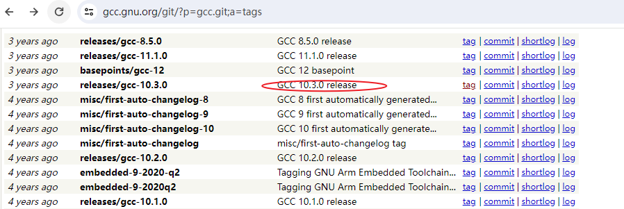
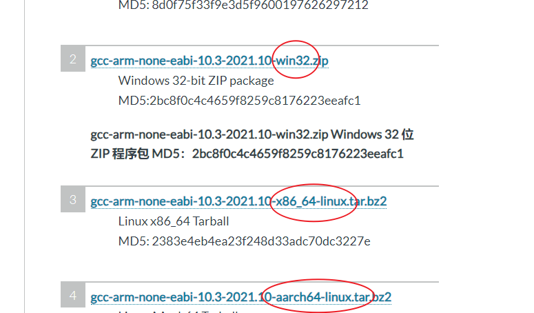
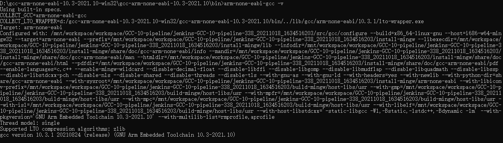
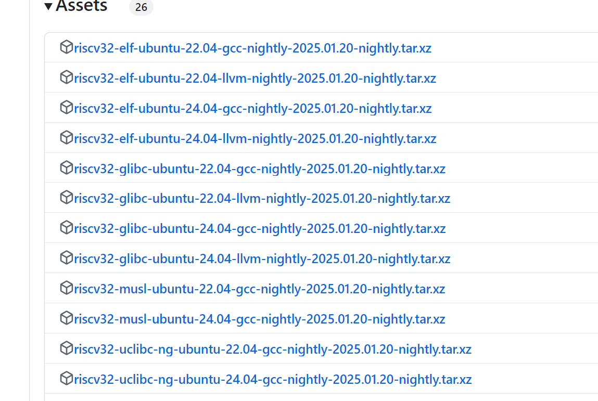
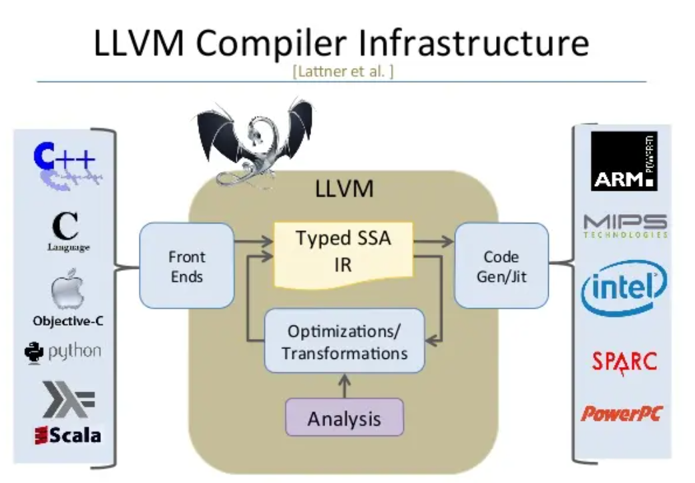

# 嵌入式TOOLchain工具 梳理

## 简介

本文总结和梳理一下一些toolchain的规则和原理，方便后续跨平台的时候，给大家使用toolchain做一个参考。

解释如何理解`arm-none-eabi-gcc`等含义，以及如何一看就知道该用什么编译器。

当然如果有哪里写的不是很正确的，欢迎评论区纠正，大家讨论讨论看看自己用的编译器什么含义。

## toolchain命名规则

首先我们根据最熟悉的`arm-none-eabi-gcc`  来理解命名规则，最后的gcc是工具，可能是gdb啥其他的，前面的

命名规则为：arch [-vendor] [-os] [-(gnu)eabi]

- arch - 体系架构，如ARM，MIPS
- vendor - 工具链提供商（这里如果没有厂商名称常用的是none和Unkonwn)
- os - 目标操作系统(这里可能是linux，或者其他OS平台等)
- eabi - 嵌入式应用二进制接口（Embedded Application Binary Interface）

仔细看这个命名规则,可以看到中间的os其实是可选项

第一个参数是arch架构，具体有哪些待会介绍。

第二个参数是`vendor` 这个具体厂商自己编译的toolchain 我们就不讲了，一般很多小公司会自己定义toolchain，

重点介绍常见的`none`和`unknown`  

- none： 通常指特别指明没有特定厂商， 通用的编译器
- unknown: 这里表示目标平台的 **操作系统未知** 或 **没有特定的操作系统** 这个是代码中的默认指，应该是即可能指没有os，也可能指没有厂商（很多可能自己编译，没有设置特定的值，就是该值）

例如：`arm-linux-gnueabi-gcc` 

看这个参数就带了linux的参数代表基于linux平台的编译器，通常用来编译liunx操作系统相关的bin。

## GCC源码

所有这些呢都来自于GCC源码：

https://gcc.gnu.org/git/gcc.git

我们来看下`arm-none-eabi-gcc`

官网

https://developer.arm.com/downloads/-/gnu-rm

官网中有介绍

```
Features:
All GCC 10.3 features.
```



所以大概率是基于10.3.0 的版本进行编译

另外从要下载的内容中可以看到最后一个参数是平台的相关参数，代表你要在windows上跑exe还是在linux上跑非exe的包，这里你要知道你的操作系统，windows只要下载win32即可。linux根据笔记本或者电脑芯片是ARM的还是x86的选择对应的，macos也有。




我们下载执行一下`-v`命令



这里有很多内容，具体哪里是我们需要参考的呢，这里有很多，大都是在用gcc编译的时候的参数


```
Configured
with:
/mnt/workspace/workspace/GCC-10-pipeline/jenkins-GCC-10-pipeline-338_20211018_1634516203/src/gcc/configure
--build=x86_64-linux-gnu
--host=i686-w64-mingw32
--target=arm-none-eabi
--prefix=/mnt/workspace/workspace/GCC-10-pipeline/jenkins-GCC-10-pipeline-338_20211018_1634516203/install-mingw
--libexecdir=/mnt/workspace/workspace/GCC-10-pipeline/jenkins-GCC-10-pipeline-338_20211018_1634516203/install-mingw/lib
--infodir=/mnt/workspace/workspace/GCC-10-pipeline/jenkins-GCC-10-pipeline-338_20211018_1634516203/install-mingw/share/doc/gcc-arm-none-eabi/info
--mandir=/mnt/workspace/workspace/GCC-10-pipeline/jenkins-GCC-10-pipeline-338_20211018_1634516203/install-mingw/share/doc/gcc-arm-none-eabi/man
--htmldir=/mnt/workspace/workspace/GCC-10-pipeline/jenkins-GCC-10-pipeline-338_20211018_1634516203/install-mingw/share/doc/gcc-arm-none-eabi/html
--pdfdir=/mnt/workspace/workspace/GCC-10-pipeline/jenkins-GCC-10-pipeline-338_20211018_1634516203/install-mingw/share/doc/gcc-arm-none-eabi/pdf
--enable-languages=c,c++
--enable-mingw-wildcard
--disable-decimal-float
--disable-libffi
--disable-libgomp
--disable-libmudflap
--disable-libquadmath
--disable-libssp
--disable-libstdcxx-pch
--disable-nls
--disable-shared
--disable-threads
--disable-tls
--with-gnu-as
--with-gnu-ld
--with-headers=yes
--with-newlib
--with-python-dir=share/gcc-arm-none-eabi
--with-sysroot=/mnt/workspace/workspace/GCC-10-pipeline/jenkins-GCC-10-pipeline-338_20211018_1634516203/install-mingw/arm-none-eabi
--with-libiconv-prefix=/mnt/workspace/workspace/GCC-10-pipeline/jenkins-GCC-10-pipeline-338_20211018_1634516203/build-mingw/host-libs/usr
--with-gmp=/mnt/workspace/workspace/GCC-10-pipeline/jenkins-GCC-10-pipeline-338_20211018_1634516203/build-mingw/host-libs/usr
--with-mpfr=/mnt/workspace/workspace/GCC-10-pipeline/jenkins-GCC-10-pipeline-338_20211018_1634516203/build-mingw/host-libs/usr
--with-mpc=/mnt/workspace/workspace/GCC-10-pipeline/jenkins-GCC-10-pipeline-338_20211018_1634516203/build-mingw/host-libs/usr
--with-isl=/mnt/workspace/workspace/GCC-10-pipeline/jenkins-GCC-10-pipeline-338_20211018_1634516203/build-mingw/host-libs/usr
--with-libelf=/mnt/workspace/workspace/GCC-10-pipeline/jenkins-GCC-10-pipeline-338_20211018_1634516203/build-mingw/host-libs/usr
--with-host-libstdcxx='-static-libgcc
-Wl,-Bstatic,-lstdc++,-Bdynamic
-lm'
--with-pkgversion='GNU
Arm
Embedded
Toolchain
10.3-2021.10'
--with-multilib-list=rmprofile,aprofile
```

我们用命令`arm-none-eabi-gcc -march=?`

结果如下

```
arm-none-eabi-gcc: error: unrecognized -march target: ?
arm-none-eabi-gcc: note: valid arguments are: armv4 armv4t armv5t armv5te armv5tej armv6 armv6j armv6k armv6z armv6kz armv6zk armv6t2 armv6-m armv6s-m armv7 armv7-a armv7ve armv7-r armv7-m armv7e-m armv8-a armv8.1-a armv8.2-a armv8.3-a armv8.4-a armv8.5-a armv8.6-a armv8-m.base armv8-m.main armv8-r armv8.1-m.main iwmmxt iwmmxt2
arm-none-eabi-gcc: error: missing argument to '-march='
arm-none-eabi-gcc: fatal error: no input files
compilation terminated.
```

大概了解这个支持这么多的架构,当然每种架构的芯片都有很多种，这个目前大部分是

## ARM

刚才的页面是嵌入式单独的页面，下面我们就来上强度，来个全一点的内容：

https://developer.arm.com/downloads/-/arm-gnu-toolchain-downloads

源码： https://git.gitlab.arm.com/tooling/gnu-devtools-for-arm.git

这里的toolchain 超级多，会不会有选择困难？理解下面几个概念

架构

- **AArch32**：
  - 是 32 位的 ARM 架构，适用于 ARMv7 及更早版本。
  - 主要用于低功耗、资源受限的嵌入式设备。
  - 一般就是类似于STM32F4,F1等系列的单片机
- **AArch64**：
  - 是 64 位的 ARM 架构，属于 ARMv8 及更高版本。
  - 提供更大的寻址空间和更高效的指令集。
  - 一般就是类似于RK3588的ARM的64bit的SOC

可执行文件

- **ELF (Executable and Linkable Format)**：
  - 是一种通用的文件格式，用于可执行文件、目标文件和共享库。
  - 适用于多种架构，包括 32 位和 64 位。
- **EABI (Embedded Application Binary Interface)**：
  - 是针对嵌入式系统的二进制接口规范。这个体积会更小
  - 定义了数据类型、寄存器使用、堆栈组织等标准。
  - 主要用于 32 位 ARM 架构。

简单理解就是： elf搭配aarch64 支持的架构更大，像64bit的寻址，elf的文件类型也更通用，当然需要的资源和编译出来的bin也就更大。

eabi搭配aarch32 则针对嵌入式的小型的32bit的系统寻址，eabi的接口规范编译出来的也更针对嵌入式，编译出来的会小一些，但是也就适合小型的系统。

- arm-none-eabi: 嵌入式的stm32之类的，无os的，32bit的MCU
- arm-none-linux-gnueabihf:  代表工具链生成的可执行文件，是运行在linux操作系统上的。none代表通用
- aarch64-none-elf:  这个支持更大的64bit的MCU，无os运行的，比如RK3588上直接执行裸机程序
- aarch64-none-linux-gnu: 这个是生成在linux上执行的bin文件

### host主机

host主机就是你当前希望编译器在哪颗CPU上运行，就是你当前用的电脑的架构

host主机分为以下几种：

- i686： 一种 32 位的 x86 架构，主要用于个人电脑和服务器，例如Pentium Pro、Pentium II、Pentium III、Pentium 4 等, i686 架构已逐渐被 64 位的 x86_64 架构逐步取代,所以不用关心
- x86_x64: 向后兼容 32 位应用程序，同时支持 64 位应用程序，这个是我们常见的intel和amd的cpu架构
- aarch64:  通常也有可能，比如你用RK3588当作小电脑来运行。
- linux/macos/windowns:  接下来就选择你常用的操作系统，通常是windows

所以常用的，就选择windows，ubuntu就选linux

> note 这里我们没有看到unknown字样，实际上我觉得这样理解：出现unknown基本都是编译的时候缺省值，不是官方或者正常发布toolchain机构发布的

接下来我们就知道当前如果是windows的话，想编译STM32等裸机的话，大概率用下面的编译器

arm-gnu-toolchain-14.2.rel1-mingw-w64-x86_64-arm-none-eabi.zip

如果遇到大型的linux嵌入式，大概率用下面的

arm-gnu-toolchain-14.2.rel1-mingw-w64-x86_64-arm-none-linux-gnueabihf.zip

mingw 主要是为了告诉你是在mingw里面进行编译的toolchain

`MinGW-w64` 是一个开源的编译器工具链，用于在 Windows 平台上开发原生的 C/C++ 程序。 它是 `MinGW`（Minimalist GNU for Windows）项目的扩展，提供了对 64 位和 32 位程序的支持

macos也分为`darwin-x86_64` (intel CPU) 和`darwin-arm64` (arm CPU m1) 

### GNU

另外对于linux平台还有下面的专业术语解释以下：

arm-none-linux-gnueabihf：
使用 硬件浮点（Hard Float），默认浮点运算使用浮点寄存器（-mfloat-abi=hard），性能更好。就是编译的时候，遇到浮点运算会帮你转成使用CPU中的浮点寄存器的汇编。
aarch64-none-linux-gnu：
默认也支持硬件浮点，但通常不需要显式指定浮点 ABI，因为 AArch64 架构本身都支持浮点运算。

gnu种eabihf代表支持硬件浮点，一般FPU,通常linuxarm 32位的话，默认支持硬件浮点寄存器。

GNU什么含义：

GNU 全称：GNU's Not Unix， GNU 提供了一系列用于开发和编译软件的工具，包括 GCC（GNU 编译器集合）、GDB（GNU 调试器）、Binutils（二进制工具集）等，

通常linux后面都跟着gnu， linux-gnu，估计用到LInux了，就支持更全的GNU

可以看到下面的toolchain，开头也有gnu字样，代表工具链里面的gcc，gdb等集成工具。

arm-gnu-toolchain-14.2.rel1-mingw-w64-x86_64-arm-none-eabi.zip

### EABI

EABI（Embedded Application Binary Interface，嵌入式应用二进制接口）是由 ARM 公司及其合作伙伴共同开发的标准。它定义了在 ARM 架构上，编译器、汇编器、链接器等工具如何生成目标文件和可执行文件，以确保不同编译器生成的代码可以在 ARM 系统上互操作。

##  RISCV

RISCV的比较官方的toolchain如下：

https://github.com/riscv-collab/riscv-gnu-toolchain

从仓库中可以看到，

有以下几个子仓库：

binutils

https://sourceware.org/git/binutils-gdb.git

GCC:

https://gcc.gnu.org/git/gcc.git

glibc:

https://sourceware.org/git/glibc.git

gdb:

https://sourceware.org/git/binutils-gdb.git

从网站https://toolchains.bootlin.com/

大概了解到，组成一个toolchain大概需要以下几个方面的内容：

```
binutils	2.41
gcc	13.3.0
gdb	14.2
glibc	2.39-74-g198632...
linux-headers	4.19.315
```

下面讲下这几部分基本的内容

- binutils：像平时用的除了gcc之外的addr2line， ar， objdump，objcopy，都是用这个仓库生成的bin。

```
* addr2line: (binutils)addr2line. Convert addresses to file and line.
* ar: (binutils)ar.               Create, modify, and extract from archives.
* c++filt: (binutils)c++filt.	  Filter to demangle encoded C++ symbols.
* cxxfilt: (binutils)c++filt.     MS-DOS name for c++filt.
* dlltool: (binutils)dlltool.	  Create files needed to build and use DLLs.
* nm: (binutils)nm.               List symbols from object files.
* objcopy: (binutils)objcopy.	  Copy and translate object files.
* objdump: (binutils)objdump.     Display information from object files.
* ranlib: (binutils)ranlib.       Generate index to archive contents.
* readelf: (binutils)readelf.	  Display the contents of ELF format files.
* size: (binutils)size.           List section sizes and total size.
* strings: (binutils)strings.     List printable strings from files.
* strip: (binutils)strip.         Discard symbols.
* elfedit: (binutils)elfedit.     Update ELF header and property of ELF files.
* windmc: (binutils)windmc.	  Generator for Windows message resources.
* windres: (binutils)windres.	  Manipulate Windows resources.
```

- gdb:gdb 其实也是binutils中的内容，只是gdb是和其他工具并列的，单独文件夹

- gcc: 这个之前讲了，其实就是生成bin中的gcc.exe的源码文件，用来编译出.o之类的,除了GCC还有个llvm

- glibc: 这个是libc部分， 对于linux，基本都是用glibc作为libc的内容。比较大的就是glibc，主要内容包含

  ​	libc的内容参考： https://www.rt-thread.org/document/site/#/rt-thread-version/rt-thread-standard/programming-manual/libc/introduction

  ​    大致就是我们平时用的一些类似于memcpy，strcpy等库函数的头文件和实现，头文件基本是相似的，实现很多不同有以下几种主流的：

     - Newlib:https://sourceware.org/git/newlib-cygwin.git 这个是ARM官方嵌入式32方面的默认libc
     - picolibc: https://github.com/picolibc/picolibc  这个也是一款适合嵌入式STM32的小型的libc，zephyr在推广和使用
     - glibc: https://sourceware.org/git/glibc.git   这个是linux官方所用的GNU的libc，大而全，出现在linux平台上
     - uclibc: https://github.com/wbx-github/uclibc-ng.git 与 glibc 兼容性较好 支持多种架构， LGPLv2.1
     - musl： https://git.musl-libc.org/cgit/musl ， 标准化程度高轻量级和高效 许可证友好 ：采用 MIT 许可证

- linux-headers 这个就不介绍了，根据linux系统的版本来，通常是一些linux系统的头文件。

从下面的途中看出，elf用的是newlib， glibc就是glibc，musl就是musl libc



## LLVM

LLVM是和GCC并列的东西，你可以认为GCC的竞品，源码如下：

https://github.com/llvm/llvm-project/tree/main

LLVM已经被Apple、Microsoft、Google、Facebook等各大公司采用。

LLVM是构架编译器(compiler)的框架系统，以C++编写而成，用于优化以任意程序语言编写的程序的编译时间(compile-time)、链接时间(link-time)、运行时间(run-time)以及空闲时间(idle-time)，对开发者保持开放，并兼容已有脚本。



LLVM的编译主要用`clang ` 不是gcc了

它的编译汇编都是用的clang，前缀是"llvm-"

    PREFIX = 'llvm-'
    CC = 'clang'
    AS = 'clang'
    AR = PREFIX + 'ar'
    CXX = 'clang++'
    LINK = 'clang'
llvm是用来替代gcc的。

## LIBC 

下面列出一些常见的libc的使用场景和特点。

### glibc

- **特点** ：功能全面，包含大量标准和扩展功能；兼容性好，遵循 POSIX、ISO C 等标准；支持多种硬件架构和操作系统；性能优化较好，适用于通用计算场景。
- **使用场景** ：广泛应用于各种主流 Linux 发行版，如桌面、服务器等，当需要使用丰富的标准库函数和良好的兼容性时，glibc 是常见选择。

### musl

- **特点** ：轻量级，代码量小、资源占用少；严格遵循 POSIX 和 ISO C 标准，注重代码正确性和简洁性；许可证友好，采用 MIT 许可证，适合商业应用。
- **使用场景** ：适用于对标准化要求高、资源受限的嵌入式系统，如物联网设备、小型嵌入式设备等，也适用于追求代码简洁高效、对启动速度和执行效率有严格要求的场景。

### uClibc-ng

- **特点** ：可移植性强，支持多种架构包括无内存管理单元的处理器；可配置性高，可根据需求裁剪功能模块；与 glibc 兼容性较好，大多数支持 glibc 的应用只需重新编译即可在 uClibc-ng 上运行。
- **使用场景** ：常用于资源受限的嵌入式 Linux 系统，如物联网设备、路由器、智能家电等，能有效减少系统占用空间，优化启动时间和功耗。

### dietlibc

- **特点** ：体积非常小，静态链接的最小程序体积可达到极低水平；注重性能优化，在某些操作上具有较高的效率；主要关注基本的 C 库功能，较少支持复杂的扩展功能。
- **使用场景** ：适用于对程序体积要求极小的嵌入式系统或特定的优化场景，如小型嵌入式设备、对启动速度和程序体积有极致要求的应用。

### newlib

- **特点** ：功能较为全面，包含一些适合嵌入式系统的功能，如网络协议栈支持；可移植性好，支持多种嵌入式架构；具有良好的稳定性和可靠性。
- **使用场景** ：常用于开发嵌入式系统，如小型路由器、工业控制设备等，也常用于需要网络功能的嵌入式应用中。

### Picolibc

- **特点** ：专为小型嵌入式系统设计，轻量级且高效；基于 Newlib 和 AVR Libc 开发，继承了其优点并进行了优化；支持多种架构，包括 ARM、RISC-V、MIPS 等。
- **使用场景** ：适用于资源有限的嵌入式设备，如物联网设备、智能家居产品、传感器节点、微控制器应用等。

### Cosmopolitan Libc

- **特点** ：轻量级、高度可配置；通过模块化和层次化设计，实现跨平台兼容性，可在不同操作系统和硬件平台上无缝切换。
- **使用场景** ：适用于需要跨平台部署的 C 语言应用，如嵌入式系统开发、云计算和分布式系统等

## 制作和发布toolchain的公司


https://developer.arm.com/downloads/-/arm-gnu-toolchain-downloads

- sourcery: 西门子http://www.codesourcery.com/  这个已经不存在了，

- linaro: 已经不更新 https://releases.linaro.org/components/toolchain/binaries/

参考：

[riscv 各种版本GCC](https://www.cnblogs.com/ppqppl/articles/18077030)

## 总结

本文基本把toolchain的一些基本参数都讲到了，肯定有一些不足支持，如果大家有各种补充也可以提建议，

不知道对于toolchain大家还有哪些疑问？可以提出来，我可以一一解答。