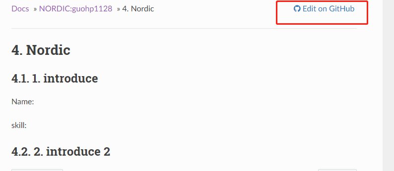
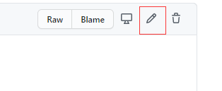
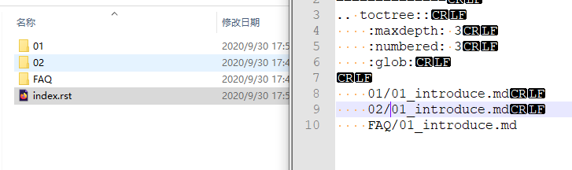
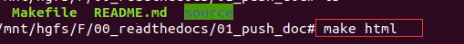

# WIKI FAQ

### 1. 如何修改markdown

如果只是修改markdown的里面的文字的话，推荐使用github里面自带的编译器来编辑，直接保存就可以提交commit了。



然后直接点击



### 2. 如何在本地新建文件以及如何验证

如果不是特别必要，请最好不要操作这些步骤，直接使用上述用github直接编辑的方式比较好。

本地新建文件需要添加索引路径到index.rst上面，可以参考其他文件夹的添加方法：



新建文件夹和文件要注意以下几点：

- 文件夹和文件名不能有中文

- 文件夹和文件名不能有空格

- 文件夹要和index.rst里面完全匹配

- 图片路径尽量用左斜杠`/`

- 图片路径写法``

  新建和改好自己的文件一定要本地验证一下再上传提交PR

**如何验证**

  #### STEP 1
  
  找一个linux的环境, 比如ubuntu虚拟机, 需要有python3 git vim pip 环境
  需要修改软件源的自行百度。

  ```
  sudo apt-get install python3
  sudo apt-get install git
  sudo apt-get install vim
  sudo apt-get install python3-pip 
  ```
  
  #### STEP 2
  pip如果是国内需要改源速度才能快一些
  
  新建一个文件touch ~/.pip/pip.conf  写入下面的数据
  
  ```
  [global]
  index-url = https://pypi.tuna.tsinghua.edu.cn/simple
  [install]
  trusted-host=mirrors.aliyun.com
  ```
  
  #### STEP 3
  还需要将python3作为默认的python, pip3作为默认的python
 
  输入cmd
  ```
  sudo update-alternatives --install /usr/bin/python python /usr/bin/python3 150
  sudo ln -s /usr/bin/pip3 /usr/bin/pip
  ```
  

  #### STEP 4
  
  安装Sphinx，命令安装对应的包: 

  ```
  pip install sphinx
  pip install sphinx-autobuild
  pip install sphinx_rtd_theme
  pip install recommonmark
  pip install sphinx_markdown_tables
  ```

- git clone所有文件

- 在有Makefile文件的目录下面敲命令 `make html`



- 最后看下编译有没有自己新建文件的相关的error，没有error说明没有问题，有error请检查下error
- 然后打开根目录下面的`build/html/index.html`   打开之后查看下自己添加的页面是否可以正常显示。
- 提交的时候一定要把添加的所有文件一起提交。
