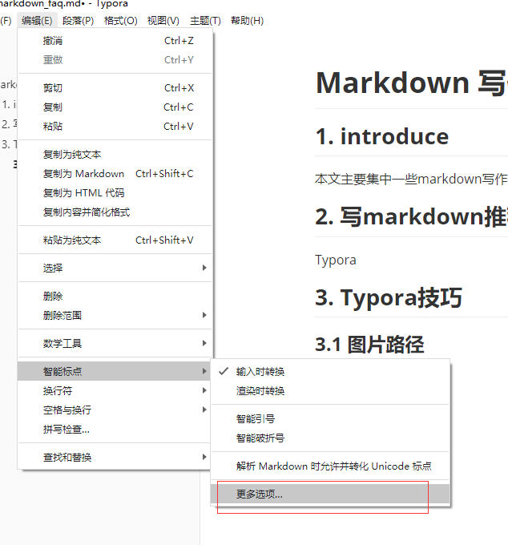
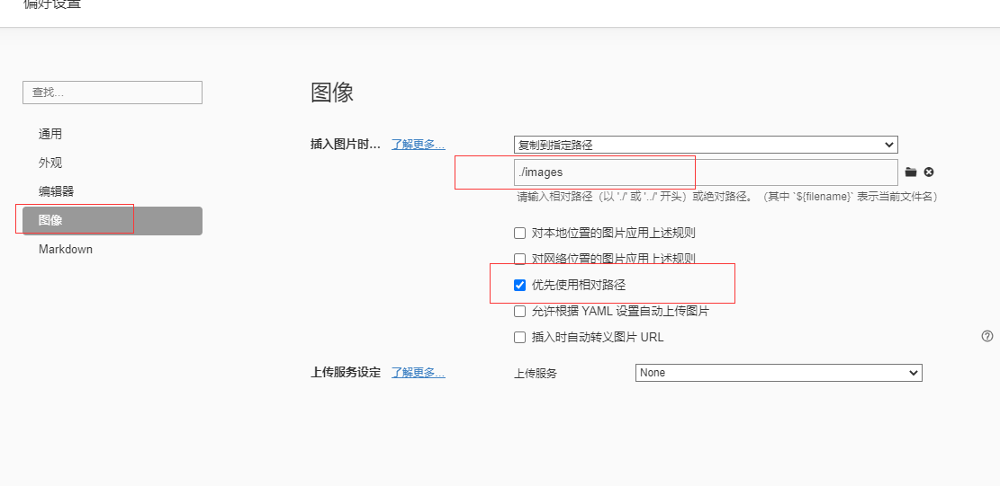
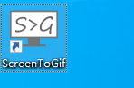
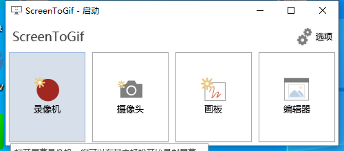
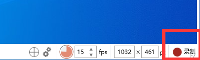
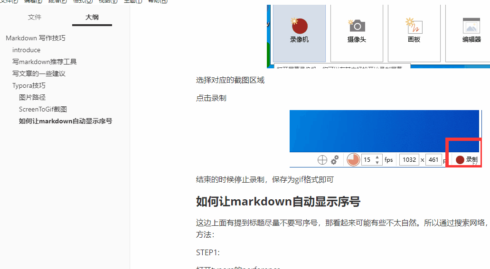
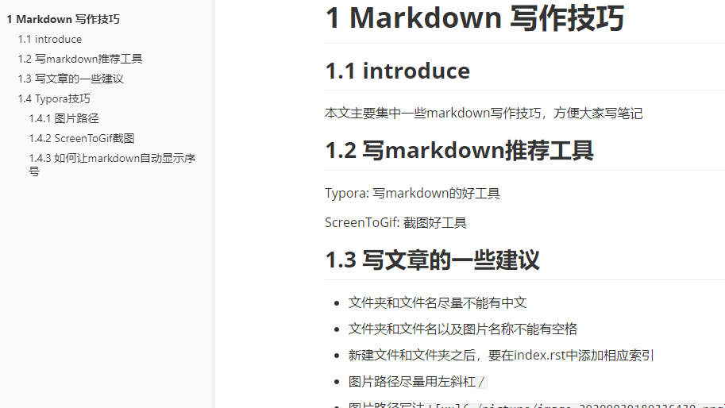

# Markdown 写作技巧

## introduce

本文主要集中一些markdown写作技巧，方便大家写笔记

## 写markdown推荐工具

Typora: 写markdown的好工具

ScreenToGif: 截图好工具

## 写文章的一些建议

- 文件夹和文件名尽量不能有中文
- 文件夹和文件名以及图片名称不能有空格
- 新建文件和文件夹之后，要在index.rst中添加相应索引
- 图片路径尽量用左斜杠`/`
- 图片路径写法``  (xx会显示在网页上面)
- 一级标题在网页中会作为文件名来显示，请不要将一级标题放到markdown中的章节来使用，markdown里面章节用二级标题，其余顺延
- 标题之间请不要添加序号例如`1. （一）` 该wiki网页会自动生成序号，两个会重叠。而且加入序号之后不利于增删章节，可以通过查看大纲的方式来进行编排，大纲中可以清楚的看到一级标题还是二级标题
- 图片为了美观尽量放到一个文件夹中，方便管理，存储的时候可以参考下面图片路径章节。
- 在截图的时候，稍微注意下图片的大小，通常建议图片大小在100KB以内即可，如果太大了，建议压缩一下再放上去，因为图片越多会导致git目录下面的文件会越来越多，别人下载的时候会需要很久。所以如果有时间的话，图片尽量少一些，可以采用gif图片的方式将几张图片折叠到一起。
- 一篇单独的文章尽量将图片和markdown放到一个文件夹里面，这样方便管理者移动文章，因为有些文章路径只是暂时的。而且也方便作者将文章发表到其他的平台上，比如CSDN，获取一些流量。切记发自己写的文章。
- 尽量不要放markdown文档没用到的文件，因为携带不方便，可以用网盘的方式来进行存放。
- 文章尽量少图片，一些可能没什么作用的中间图片尽量少的引用。
- 再强调一下，一篇文章图片和markdown尽量放一个文件夹内，尽量分的开一些。


## Typora技巧

### 图片路径

图片路径建议放到本地，

配置如下，打开配置路径



修改配置如下：



其他人可以根据自己的喜好配置

### ScreenToGif截图

打开工具



点击录像机



选择对应的截图区域

点击录制



结束的时候停止录制，保存为gif格式即可

### 如何让markdown自动显示序号

这边上面有提到标题尽量不要写序号，那看起来可能有些不太自然。所以通过搜索网络，提供一种看起来有标号的方法：

**STEP1:**

打开typora的perference,打开theme 文件夹



**STEP2:** 

创建一个名为base.user.css的文件

**STEP3:**

添加内容如下：

```javascript
.sidebar-content {
    counter-reset: h1
}
 
.outline-h1 {
    counter-reset: h2
}
 
.outline-h2 {
    counter-reset: h3
}
 
.outline-h3 {
    counter-reset: h4
}
 
.outline-h4 {
    counter-reset: h5
}
 
.outline-h5 {
    counter-reset: h6
}
 
.outline-h1>.outline-item>.outline-label:before {
    counter-increment: h1;
    content: " "
}
 
.outline-h2>.outline-item>.outline-label:before {
    counter-increment: h2;
    content: counter(h2) " "
}
 
.outline-h3>.outline-item>.outline-label:before {
    counter-increment: h3;
    content: counter(h2) "." counter(h3) " "
}
 
.outline-h4>.outline-item>.outline-label:before {
    counter-increment: h4;
    content: counter(h2) "." counter(h3) "." counter(h4) " "
}
 
.outline-h5>.outline-item>.outline-label:before {
    counter-increment: h5;
    content: counter(h2) "." counter(h3) "." counter(h4) "." counter(h5) " "
}
 
.outline-h6>.outline-item>.outline-label:before {
    counter-increment: h6;
    content: counter(h2) "." counter(h3) "." counter(h4) "." counter(h5) "." counter(h6) " "
}


/** initialize css counter */
#write {
counter-reset: h1
}
h1 {
counter-reset: h2
}
h2 {
counter-reset: h3
}
h3 {
counter-reset: h4
}
h4 {
counter-reset: h5
}
h5 {
counter-reset: h6
}
/** put counter result into headings */
#write h1:before {
counter-increment: h1;
content: " "
}#write h2:before {
counter-increment: h2;
content: counter(h2) " "
}
#write h3:before,
h3.md-focus.md-heading:before /** override the default style for focused headings */ {
counter-increment: h3;
content: counter(h2) "." counter(h3) " "
}
#write h4:before,
h4.md-focus.md-heading:before {
counter-increment: h4;
content: counter(h2) "." counter(h3) "." counter(h4) " "
}
#write h5:before,
h5.md-focus.md-heading:before {
counter-increment: h5;
content: counter(h2) "." counter(h3) "." counter(h4) "." counter(h5) " "
}
#write h6:before,
h6.md-focus.md-heading:before {
counter-increment: h6;
content: counter(h2) "." counter(h3) "." counter(h4) "." counter(h5) "." counter(h6) " "
}
/** override the default style for focused headings */
#write>h3.md-focus:before,
#write>h4.md-focus:before,
#write>h5.md-focus:before,
#write>h6.md-focus:before,
h3.md-focus:before,
h4.md-focus:before,
h5.md-focus:before,
h6.md-focus:before {
color: inherit;
border: inherit;
border-radius: inherit;
position: inherit;
left:initial;
float: none;
top:initial;
font-size: inherit;
padding-left: inherit;
padding-right: inherit;
vertical-align: inherit;
font-weight: inherit;
line-height: inherit;
}
```

这个时候重启typora就可以看到标题了，并且源代码里面是没有标题的，生成pdf是可以有标题的。



