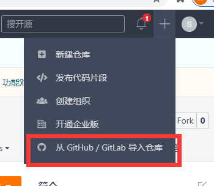

# GIT 技巧总结

[官方文档](https://training.github.com/downloads/zh_CN/github-git-cheat-sheet/)

##  如何将自己fork的代码更新到最新的代码

作者[Thomas]

我们经常会遇到自己之前做的项目突然就跟不上主分支了。这个时候我们只要按照以下步骤来操作即可。

我们以RT-Thread来举例说明

第一步，将RT-Thread官方路径添加到upstream中

```
git remote add upstream https://github.com/RT-Thread/rt-thread.git
```

第二步，将官方的最新代码更新下来

```
git fetch upstream
```

第三步，将最新的代码下载同步下来，

```
git checkout upstream/master
```

第四步，创建一个本地的分支

```
git checkout -b new_master
```

第五步，这个时候我们就拥有了最新的代码的分支，提交到github上面去

```
git push origin new_master:old_master
```

这边需要注意的是，上面的命令old_master如果是你fork仓库中已经有的分支，需要加-f来强制push。如果是一个新的分支则你的fork仓库会创建一个分支，这个时候就是最新的代码了。

第六步，**以下可以操作，也可以不用操作**。并不是必须的，强迫症患者可以看下。

如果你有强迫症的话，想让你fork仓库的master更新到最新的话。

```
git push origin new_master:master -f    
```

如果还有强迫症的话，可能需要把本地的master分支给删了（因为这个是旧的）

```
git branch -D master
```

如果你还有强迫症的话，可以删除调upstream，看起来似乎干净一些

```
git remote remove upstream
```

-----------

## TODO

### git如何删除远端分支

当遇到github上面远端分支需要删除的时候，我们使用下面命令

1. 找到对应的branch

```
git branch -a              
```

2. 删除远端branch

```
git push origin --delete xxx_dev
```

## git如何添加submodule

如果引用第三方库的话，可以使用下面命令添加submodule

```
git submodule add https://xxx.git
```


删除第三方库：

```
git submodule deinit <submodule-name>
```


## github国内如何快速更新代码

本章节主要通过gitee快速方便的更新代码

### 情况一：第一次下载

第一次下载的时候，比如RTTHREAD master上面的源码，

可以先在gitee上面建个仓库



从这里导入仓库地址  https://github.com/RT-Thread/rt-thread.git

导入之后就可以下载了

### 情况二， PR一次之后如果需要将RTTHREAD更新到最新的

可以按照上面的来更新到最新的branch

### 情况三，本地fork的分支已经在远端更新了，但是本地git pull太慢

这种情况，主要原因是因为github没有同步按钮，先将gitee上面的老的分支先同步一下，


然后把gitee的branch先fetch下来

```
git fetch giteestream
```

这样本地就有新的代码了，

之后再执行git pull

会发现很快就更新完成了。


### git如何合并之前的提交

有时候PR的时候，我们会有很多无用的提交，这些提交如果保留也会增大codesize的，所以尽量PR的时候尽可能少的commit提交。

git rebase命令格式：

```
git rebase -i [startpoint] [endpoint]
```

先要合并可以用下面的命令：

```
//合并当前的head 到某个commit XXXX
git rebase -i xxxx

//合并最近两次提交

git rebase -i HEAD~2
```

执行这个命令之后，有个vi编辑器

里面有提示

里面的提示有：
pick：保留该commit（缩写:p）
reword：保留该commit，但我需要修改该commit的注释（缩写:r）
edit：保留该commit, 但我要停下来修改该提交(不仅仅修改注释)（缩写:e）
squash：将该commit和前一个commit合并（缩写:s）
fixup：将该commit和前一个commit合并，但我不要保留该提交的注释信息（缩写:f）
exec：执行shell命令（缩写:x）
drop：我要丢弃该commit（缩写:d）


**把pick改为squash就是可以把commit合并到前面一个commit**

其他的可以根据提示修改。

然后`:wq`保存就可以了。

修改commit的时候一定要小心，不要把别人的commit修改了。看清楚那几个commit要合并的。


### github如何贡献代码

### github如何修改代码之后再次提交

这个只要PR之后，在原来分支上直接提交。PR的时候也会

### git如何正确使用分支

### git的原理本质

### git如何正确管理自己的仓库和分支

原则一： 将比较大的repo仓库统一管理，方便维护

### git通用行为准则

- 每次提交新的代码之前，最好先下载最新的代码，git pull，之后再提交。

- 完成功能的可以是一个仓库，提交代码的可以是一个仓库（防止错改），代码提交PR之后，就可以删掉原来的仓库了。通常可以两个仓库来回切换

- 代码提交完了或者merge之后，自我验证一下，防止有些文件没有add上去。

- 代码的commit尽量整理修改为有效的commit（删掉一些无用的commit，这些会占codesize），参考上面[如何修改提交](#git如何合并之前的提交)。

- 尽量新建一个branch添加功能

- PR之后，自己先检查一遍文件是否正确（尽量不要直接等审核人员检查，因为有些文件，可能只有你自己知道是否正确）

###  GIT PR之后如何修改作者名称

如果遇到PR之后，签CLA一直签不了，用下面命令

```
git commit --amend --no-edit --author="User Name <user@exmaple.com>"
```
  

  ## 参考教程

   [Git及GitHub教程](https://www.githubs.cn/post/git-tutorial)

  

