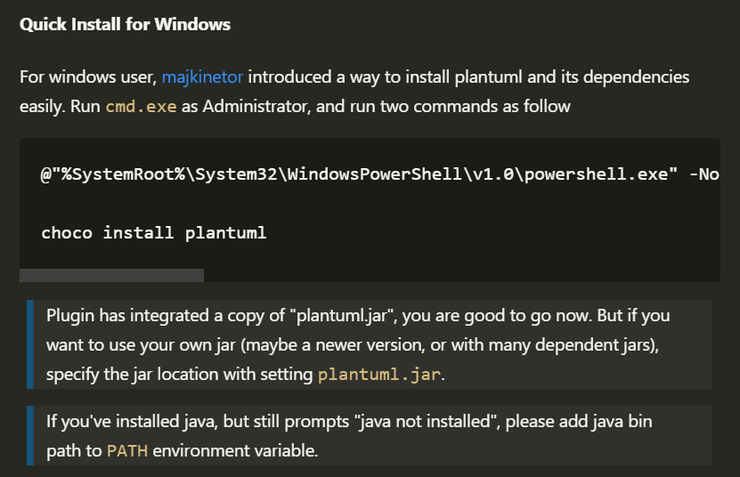
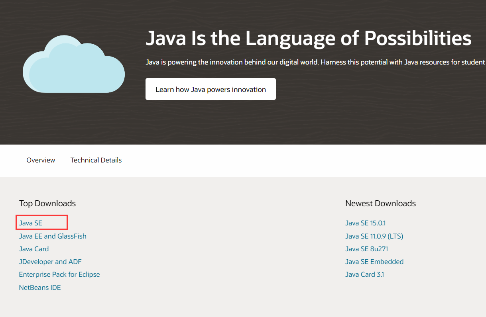
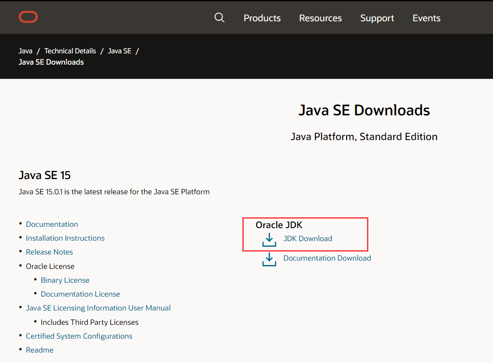
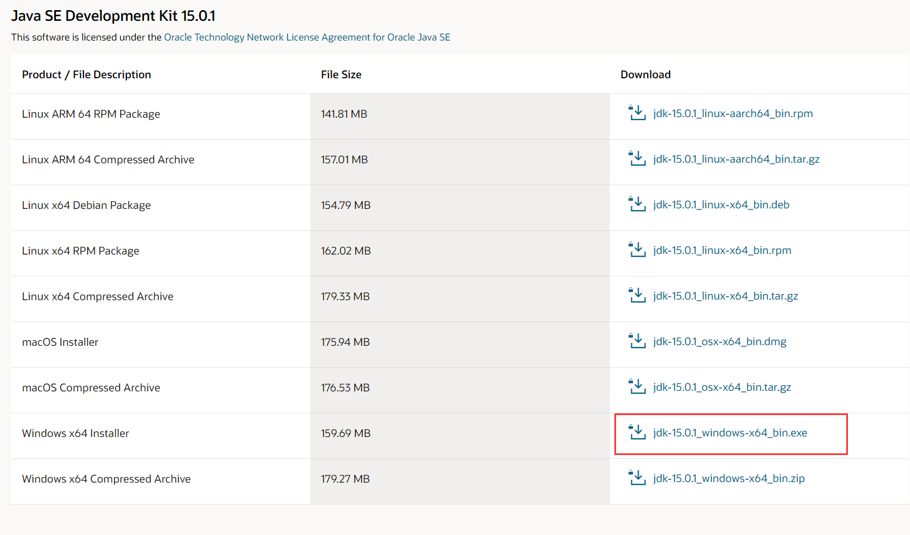
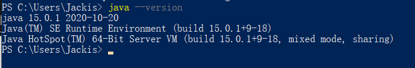
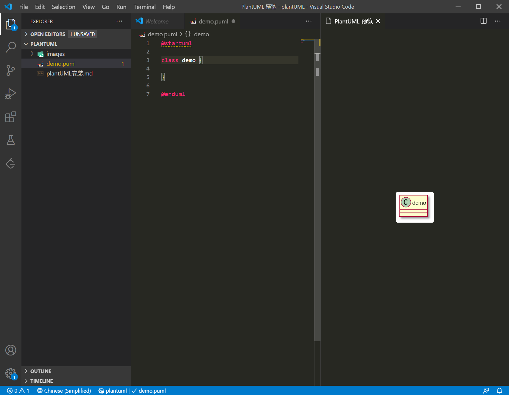
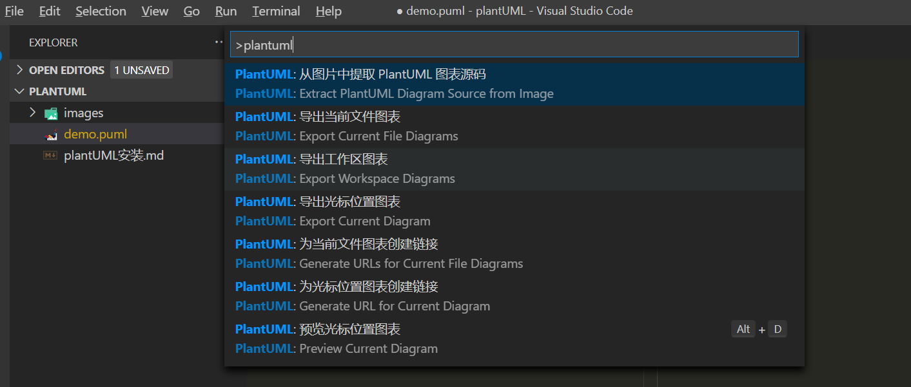

# plantUML 安装教程


## VSCode 安装 plantUML 插件

在 VSCode 的插件商店输入 PlantUML，并点击安装。

## plantUML 本地环境安装

### 快速安装方法

plantUML 依赖 JavaSE 和 graphviz ，因此需要安装相关环境。VSCode 里的 plantUML 插件提供了一种快速安装环境的方法。



首先以管理员身份运行 cmd.exe ，然后运行下述两行命令，会自动完成依赖环境的安装。

```
@"%SystemRoot%\System32\WindowsPowerShell\v1.0\powershell.exe" -NoProfile -ExecutionPolicy Bypass -Command "iex ((New-Object System.Net.WebClient).DownloadString('https://chocolatey.org/install.ps1'))" && SET "PATH=%PATH%;%ALLUSERSPROFILE%\chocolatey\bin"

choco install plantuml
```

在运行过程中如果提示需要输入 Y / N 的地方，一律输入 Y 并回车。

### 常规安装方法

若上述方法安装成功，则无需进行下述操作。

#### 安装 Java 环境

进入 [官方网址](https://www.oracle.com/java/technologies/)，点击 Java SE ，



然后点击 JDK Download ，



在弹出来的界面选择 Windows x64 Installer，



下载完成后点击安装，安装路径可以自己选择，我这里选择的是 D:\Program Files\Java\jdk-15.0.1 。

然后在需要在系统环境变量里添加 JAVA_HOME 的值为 JDK 安装路径。我这里为 `"JAVA_HOME": "D:\Program Files\Java\jdk-15.0.1"` 。


测试 Java SE 是否安装正确，打开命令行（cmd 或 PowerShell），输入 `java --version`，会出现如下结果：



#### 安装 graphviz 环境

#### 下载 plantUML


## VSCode plantUML 插件简单使用

该插件支持的文件格式有

```
*.wsd, *.pu, *.puml., *.plantuml, *.iuml
```

参考 [plantUML 文档](https://plantuml.com/zh/sitemap-language-specification) 写出相应图的代码，然后按 Alt + D 即可在侧栏实时看见所绘图像。如下图所示：



按 Ctrl + Shift + P，然后输入 plantuml，可以在下拉框里选择如何导出图像。

