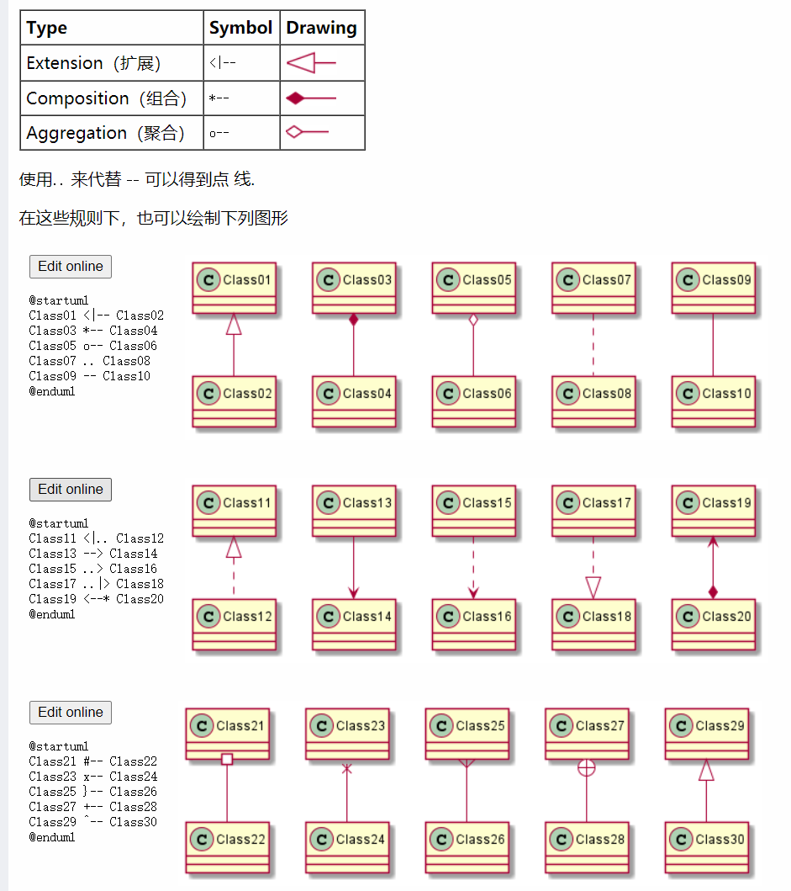
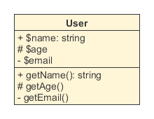

# plantUML 绘图简介

plantUML 支持绘制的图像有很多种，UML 图都支持，还支持一些非 UML 图，常用的有甘特图，思维导图等。具体的可以在[官网](https://plantuml.com/zh/)查看。

## plantUML 类图语法

plantUML 类图的绘制代码格式很简单，基本上可以达到看图写代码的程度，因此不需要专门学习，需要用的时候去查找[类图文档](https://plantuml.com/zh/class-diagram)即可。

画类图重点是理清楚我们的思维，工具只是将我们的思维展示了出来，下面我简单介绍一下常用的类图元素。

## UML 类图

UML类图是一种结构图，用于描述一个系统的**静态结构**。类图以反映**类结构和类之间关系**为目的，用以描述软件系统的结构，是一种静态建模方法。类图中的类，与面向对象语言中的类的概念是对应的。

类图也是一门语言，也有自己的语法，只不过它的语法是箭头，线段，虚线等等。

类图包括两大内容：**类结构**和**类与类之间的关系**。

### 类结构

主要包括

- 类名：一般类的类名用正常字体粗体表示；抽象类名用斜体字粗体，如 *User*，接口则需在上方加上`<<interface>>`。
- 属性：**可见性  名称 ：类型 [ = 缺省值]**
- 方法：**可见性  名称(参数列表) [ ： 返回类型]**

中括弧里的内容是可选的。

可见性及可见性符号，`+`代表`public`，`#`代表`protected`（friendly也归入这类），`-`代表`private`。

另外，还可以用冒号`:`表明属性的类型和方法的返回类型。

### 类与类之间的关系

类与类之间的关系主要有六种：**继承**、**实现**、**组合**、**聚合**、**关联**和**依赖**，这六种关系的箭头表示如下，

各种类关系的学习可以参考资料：https://www.jianshu.com/p/57620b762160

