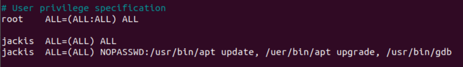

# VSCode 调试

更全面的信息可以参考官方 [调试手册](https://code.visualstudio.com/docs/editor/debugging#_launch-configurations) ，以下记录我用 VSCode 调试的一些经验。

## 调试配置

想要在 VSCode 里调试，需要配置两个文件 `tasks.json` 和 `launch.json` 。

- tasks.json：用于构建任务，也就是编译链接程序。
- launch.json：用于配置调试环境，例如调试器（gdb），可执行文件路径等。

这两个文件按 `F5` 后会自动在 .vscode 目录下生成。

### tasks.json

一般默认生成的 tasks.json 文件如下：

```json
{
	"version": "2.0.0",
	"tasks": [
		{
			"type": "shell",
			"label": "C/C++: gcc build active file",
			"command": "/usr/bin/gcc",
			"args": [
				"-g",
				"${file}",
				"-o",
				"${fileDirname}/${fileBasenameNoExtension}"
			],
			"options": {
				"cwd": "${workspaceFolder}"
			},
			"problemMatcher": [
				"$gcc"
			],
			"group": "build"
		}
	]
}
```

我们需要关注的选项有：

- "lable"：任务标签，需与 "preLaunchTask" 保持一致。
- "command"：需要执行的命令，可以是一个外部程序或者 Shell 命令。
- "args"：传递给 "command" 的参数。

深入理解 tasks.json 文件的作用与 "command" 选项的用法，我们就能灵活地配置构建工程。

tasks.json 文件是用来构建工程的，当我们按 `F5` 进行调试时，VSCode 首先会执行 tasks.json 文件里 "command" 选项后的命令，并传入 "args" 参数，这样整个工程就被重新编译链接一遍了。

以 hello.c 文件和上述 tasks.json 为例，按 `F5` 进行调试时，最终会在命令行执行下述命令构建工程：

```shel
/usr/bin/gcc -g main.c -o main
```

当然，如果一个工程有多个文件，"command" 就不能是简单的 gcc 了，需要根据实际的构建系统选择。

如果构建系统使用的是 Makefile ，那我们可以配置

```json
{ 
	"command": "make",
    "args": []
}
```

这样在构建项目时就会使用命令

```shell
make
```

这跟我们平时使用 make 构建项目是一致的。

又比如配置 Zephyr 环境，

```json
{
	"command": "west",
     "args": [
         "build",
         "-b",
         "native_posix",
     ]
}
```

这样在构建项目时相当于执行命令

```shell
west build -b native_posix
```

### launch.json

launch.json 文件用于配置调试环境。一般默认生成的文件如下：

```json
{
    "version": "0.2.0",
    "configurations": [
        {
            "name": "gcc - Build and debug active file",
            "type": "cppdbg",
            "request": "launch",
            "program": "${fileDirname}/${fileBasenameNoExtension}",
            "args": [],
            "stopAtEntry": false,
            "cwd": "${workspaceFolder}",
            "environment": [],
            "externalConsole": false,
            "MIMode": "gdb",
            "setupCommands": [
                {
                    "description": "Enable pretty-printing for gdb",
                    "text": "-enable-pretty-printing",
                    "ignoreFailures": true
                }
            ],
            "preLaunchTask": "C/C++: gcc build active file",
            "miDebuggerPath": "/usr/bin/gdb"
        }
    ]
}
```

我们需要关注的选项有：

- "program"：可执行文件的的路径，相对路径或绝对路径都可以。
- "args"：运行程序时传递的参数。
- "stopAtEntry"：是否在入口处停止，若为 true 在调试时会默认在 main() 处停止。
- "environment"：配置程序运行的环境变量。
- "preLaunchTask"：调试会话启动前运行的任务，需与 tasks.json 里的 "label" 一致。若没有该选项，则按 `F5` 时会直接使用 "program" 程序调试，不会再试图重新编译一次。
- "miDebuggerPath"：调试器的路径，用途在后面有介绍。

VSCode 预定义了一些变量，可以在 [Variables Reference](https://code.visualstudio.com/docs/editor/variables-reference) 查看意思。

## 调试技巧

### VSCode 以 root 权限运行程序

有时候我们的程序需要访问硬件资源，这一般需要 root 权限，而 VSCode 一般是在用户权限下启动的，这就需要特殊配置 VSCode 才能调试程序。

下面介绍如何利用 VSCode 以 root 权限调试程序。

首先需要注意到 launch.json 文件里的 "miDebuggerPath" 这个选项，它是调试器的路径，如果这个调试器可以以 root 权限运行，那么就达成了我们的目的了。

在 `/home/user_name` 目录下创建文件 gdb，user_name 需要替换为实际的用户名。

然后编辑该文件 `vim gdb`，加入下述内容：

```
sudo /usr/bin/gdb "$@"
```

给 gdb 添加执行权限，

```
chmod +x gdb
```

在修改 "miDebuggerPath" 成为

```json
{
    "miDebuggerPath": "/home/jackis/gdb"
}
```

即可。这样我们就可以在 VSCode 里以 root 权限调试程序了，只不过每次都需要输入密码，因为有一个 sudo 过程。

为了解决这个麻烦，我又在网上找到了方法，将 /home/user_name/gdb 加入 sudo 的免密认证即可。

输入

```
sudo cp /etc/sudoers ~/sudoers.bak
sudo visudo
```

编辑 /etc/sudoers 文件，修改成下述内容即可，



其中 jackis 是我的用户名，需要根据实际用户名替换。

`NOPASSWD:`后的命令 sudo 时都不需要密码。


----

参考：

[用VS Code开发STM32（三）——调试](https://zhuanlan.zhihu.com/p/61541590)

[How to Run sudo Commands Without Password](https://linuxhandbook.com/sudo-without-password/)