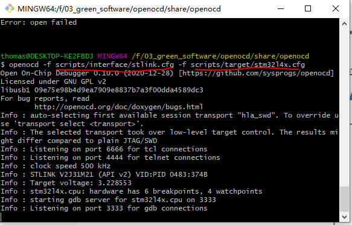
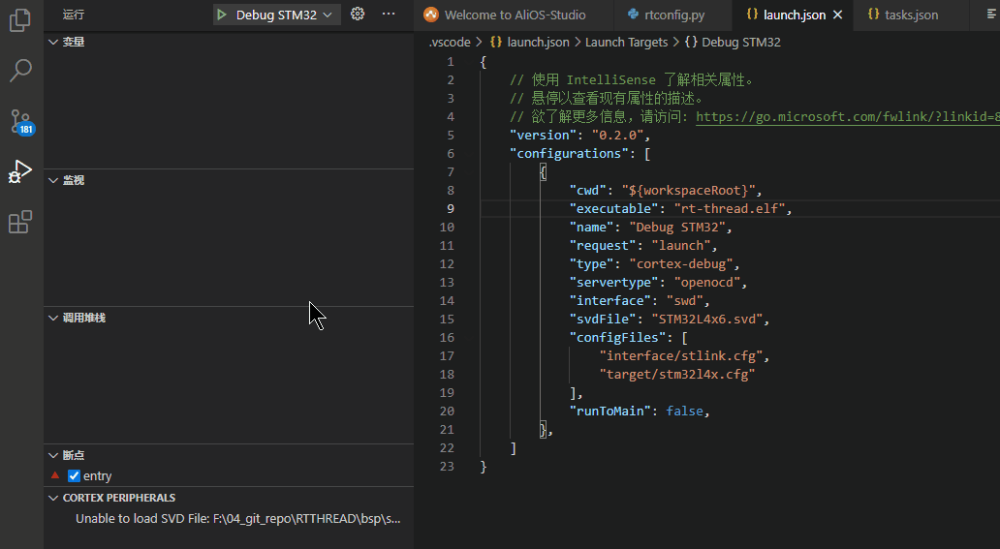
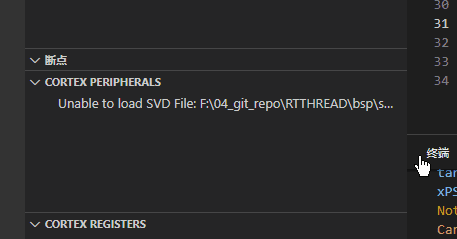
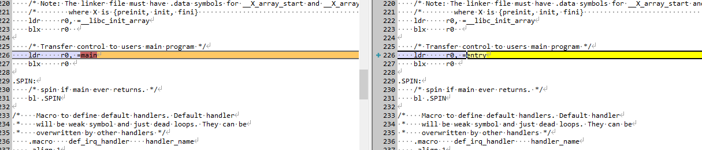

# VSCode 小技巧

更全面的信息可以参考官方 [调试手册](https://code.visualstudio.com/docs/editor/debugging#_launch-configurations) ，

## 快捷键

- ctrl + shift + p  显示命令
- ctrl + alt + F 格式化文件

## stm32 调试RT-THREAD

RT-THREAD  如何用vscode来调试代码呢？

写代码分为以下两步

- 编译 clean  这个的配置在task.json里面，快捷键是ctrl + shift + b
- 调试 这个是在launch.json里面配置，这个配置完了之后，在debug哪里可以看到相应的配置，快捷键F5

### 调试

我们先来看看有ARM哪些调试器

- Segger J-Link GDB Server ([https://www.segger.com/](https://www.segger.com/products/debug-probes/j-link/tools/j-link-gdb-server/about-j-link-gdb-server/)) (https://wiki.segger.com/J-Link_Visual_Studio_Code)
- PE-Micro GDB Server ([http://www.pemicro.com](http://www.pemicro.com/))
- Texane's St-Link Utils (https://github.com/stlink-org/stlink)
- Black Magic Probe Embedded GDB server (https://github.com/blacksphere/blackmagic/wiki)
- PyOCD (https://github.com/mbedmicro/pyOCD)
- OpenOCD (Note: Please use the latest version, 0.11.0-rc1 when writing this, [prebuilt binaries for windows](https://github.com/ntfreak/openocd/suites/1638965716/artifacts/30318150))
- QEMU Emulated Environment


J-link就是那个黑黑的盒子

st-link是STM32公司特有的

openocd  是一款开源的比较强大的软件


怎么理解呢，可以这么理解segger jlink和st-link以及openocd都是一家公司，你理解为一家公司，每个公司都会为一种特定的芯片商服务，比如jlink就对黑色的jlink比较擅长，st-link就是对stm32的芯片比较擅长。

而openocd既可以适配jlink也可以适配st-link

OpenOCD（Open On-Chip Debugger）开源片上调试器，是一款开源软件，最初是由Dominic Rath同学还在大学期间发起的（2005年）项目。OpenOCD旨在提供针对嵌入式设备的调试、系统编程和边界扫描功能。

### 调试原理


一般如果采用GDB调试的时候，一般需要开一个GDB server，比如j-link里面的GDB server。 ST-LINK SERVER

GDB client端就是我们常用的arm-none-eabi-gdb或者gdb一个client端。

server通常会开一个端口来接收client端的连接，所以先开server，开server的时候，如下图



这个时候可以从info里面看到port 3333 这个时候server就起来了。

后面我们就要起一个client端


输入命令： `target remote localhost:3333`

这个时候，就可以连上远端了。这个GDB server端，可以是segger jlink公司的，也可以是openocd公司的，也可以是st-link公司的GDB server。这个就是上层调试软件的目的。

而client端的GDB client，都是arm-none-eabi.gdb.exe 直接连接，通过端口号或者其他口都可以连接上。所以也可以远程连接。

所以，对于你如果既要用st-link又要用jlink等操作，你可以直接学习下openocd的GDB server，这个是对大部分的调试器都支持的。不管你手上的是ST-LINK还是j-link还是CMSIS-DAP。

都可以支持，

openocd的官方文件也是超级全的。

https://blog.csdn.net/wxh0000mm/article/details/84788128

http://openocd.org/doc-release/html/GDB-and-OpenOCD.html#Sample-GDB-session-startup

### CMSIS-DAP

什么是CMSIS-DAP呢，这个是DAPLINK的，是mbed，就是ARM公司自己研发的一种调试器，这种调试器对于大部分的ARM都是可以适配的。

[CMSIS-DAP](https://github.com/ARMmbed/DAPLink)

### segger- JLINK

这个是一家公司，也比较有名，生态也非常好。

[segger](https://www.segger.com/downloads/jlink)

### ST- LINK

ST-LINK是专门服务于STM32的

[st-link](https://github.com/stlink-org/stlink)

### vscode 配置  launch.json

首先如果使用的是cortex的话，可以下载一个vscode插件cortex-debug

下完之后，如下点击，选择openocd，这个是支持st-link和jlink的。

launch.json

然后我们就需要填好配置了

```
{
    // 使用 IntelliSense 了解相关属性。 
    // 悬停以查看现有属性的描述。
    // 欲了解更多信息，请访问: https://go.microsoft.com/fwlink/?linkid=830387
    "version": "0.2.0",
    "configurations": [
        {
            "cwd": "${workspaceRoot}",
            "executable": "rt-thread.elf",
            "name": "Debug STM32",
            "request": "launch",
            "type": "cortex-debug",
            "servertype": "openocd",
            "interface": "swd",
            "svdFile": "STM32L4x6.svd",
            "configFiles": [
                "interface/stlink.cfg",
                "target/stm32l4x.cfg"
            ],
            "runToMain": false,
        },
    ]
}
```

主要填写的有

- executable ： 可以执行的elf文件（注意这个编译的时候最好带-g， 不然断点调试不到代码）
- name ： 这个是在小虫子那里显示的名称
- interface:  这个是选择swd或者jtag
- svdFile： 这个是芯片的外设文件，加上这个文件可以看到外设寄存器地址和名称，这个文件可以在keil里面找到
- configFiles： 这个就要选择stlink的配置和芯片target的配置这个都是在openocd目录下面有相应的配置的，如果没有，可以去厂商寻找，一般eclipse都是支持openocd，都会有
- runToMain： 这个是否跑到main


其他参数可以参考地址 [launch config](https://code.visualstudio.com/docs/editor/debugging#_launch-configurations)

配置好这些之后，就可以按F5进入调试了。

这边有个加断点的小技巧，很方便



Once a debug session starts, the **Debug toolbar** will appear on the top of the editor.


- Continue / Pause F5
- Step Over F10
- Step Into F11
- Step Out Shift+F11
- Restart Ctrl+Shift+F5
- Stop Shift+F5

#### 汇编调试

汇编显示在调试控制台里面输入命令`disassemble`可以显示

disass
汇编执行下一个命令
si


FAQ

### 单步进行汇编调试

vscode按F5进入debug单步调试


在GDB中

使用si和ni。与s与n的区别在于：s与n是C语言级别的单步调试，si与ni是汇编级别的单步调试。

F11相当于s

F10相当于n


### 能够实时看到寄存器值的变化。

使用gdb时增加-tui选项，打开gdb后运行`layout regs`命令。注意最好加上-tui，否则很大可能会出现花屏现象。


## Cortex debug

[github cortex debug](https://github.com/Marus/cortex-debug)


## 支持新的ARM开发板到RTTHREAD上的GCC 需要注意事项

当你的芯片是ARM的时候，而需要支持GCC的时候，在调试方面可以采用vscode来操作。

主要会遇到一些坑，我这边先记下来

### entry

入口函数，通常ARM官方给的都是main为入口函数，我们需要在starupxxxx.S里面将main改成entry



### ld特定标号

在board/linker_scripts/link.lds  中FLASH中需要添加如下标号

```
        /* section information for finsh shell */
        . = ALIGN(4);
        __fsymtab_start = .;
        KEEP(*(FSymTab))
        __fsymtab_end = .;

        . = ALIGN(4);
        __vsymtab_start = .;
        KEEP(*(VSymTab))
        __vsymtab_end = .;

        /* section information for initial. */
        . = ALIGN(4);
        __rt_init_start = .;
        KEEP(*(SORT(.rti_fn*)))
        __rt_init_end = .;
        
        . = ALIGN(4);

        PROVIDE(__ctors_start__ = .);
        KEEP (*(SORT(.init_array.*)))
        KEEP (*(.init_array))
        PROVIDE(__ctors_end__ = .);

        . = ALIGN(4);
```

这些标号是和初始化以及一些finish cmd相关的。

### rtconfig.py

这个文件夹里面gcc是用来编译的编译选项，这边要设置arm-none-eabi-gcc的路径


EXEC_PATH   = r'.'

这边需要注意的是，尽量少用

` -ffunction-sections -fdata-sections`

这个有可能会优化一些symbol

### 生成hex文件

如果你要生成hex文件的话，需要添加如下命令

```
POST_ACTION = OBJCPY + ' -O ihex $TARGET rtthread.hex\n' + SIZE + ' $TARGET \n'
```

## printf

代码里面千万不能有printf，不然调试起来会比较麻烦。


----

参考：

[Cortex-debug 调试器使用介绍](https://blog.csdn.net/qq_40833810/article/details/106713462)

[How to Run sudo Commands Without Password](https://linuxhandbook.com/sudo-without-password/)
