# BLE 广播和扫描

## 广播基本知识介绍

查看本篇文章，大家可以知道以下内容：

- ble是如何打广播的，让对方发现自己的。
- 广播数据如何修改

### 基本概念

BLE的物理层这边简单提一些。


ble的信道和BR/EDR的信道是完全不一样的。但是范围是相同的，差不多也都是2.4Ghz的频道。可以简单理解为空中有40个信道0~39信道。两个设备在相同的信道里面可以进行相互通信。

而这些信道SIG又重新编号：


这个编号就是把37 38 39。 3个信道抽出来，作为广播信道，其他都是数据信道。这篇文章主要讲广播，所以基本数据信息都是围绕37 38 39这三个信道上面的通信来讲的。

我们可以看到这3个信道是分散排列的。大家可以思考下为什么。

其实看下面一张图就知道了。


### core spec的内容

 本文所讲的内容主要在

BLUETOOTH CORE SPECIFICATION Version 5.2 | Vol 6, Part B  

2.3 ADVERTISING PHYSICAL CHANNEL PDU  

章节中，想要仔细研究的可以研究该章节，本文会将比较常用的内容展示给大家。

GAP中也有部分定义广播相关的内容

BLUETOOTH CORE SPECIFICATION Version 5.2 | Vol 3, Part C  

9 OPERATIONAL MODES AND PROCEDURES – LE
PHYSICAL TRANSPORT  

### 基本理解

我们使用手机蓝牙通常会搜索设备。搜到的设备有两种，ble和BR/EDR的设备，BR/EDR是和 经典蓝牙相关的，本文今天不介绍，下面来介绍ble相关的操作。其实仔细思考一下手机搜索ble设备的时候，手机其实就充当一个观察者（observer），ble设备其实就是一个广播者（broadcaster)。

大家可以用手机下载一个apk应用，nrf connect.apk。苹果手机，可以使用lightblue


## 广播内容（adv data）

我们先来理解一下最基本的广播ADV_IND

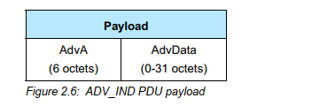

这张图的大概意思是：ADV_IND广播有两部分组成，1. 广播地址（就是广播者的地址，占6个字节）2. 广播数据（0-31个字节）（今天讲的主要内容一共就31个字节，听起来是不是很简单）

从上面nrf connect的软件中可以看到蓝牙地址，这个地址就是广播的地址，其他的所有你能看到的内容都在后面的31个字节里面。如果能理解这31个字节的内容，基本上你就可以熟练的使用蓝牙广播功能了。

这31个字节里面内容，


图中的data就是31个byte。

这个adv_data中都是由一个一个的小元素组成的。称之为AD Structure。

每个元素里面有两个要素：1. 长度（length)， 2. 数据(data)

每个数据里面又包含两个元素：1. 类型（type), 2. 数据

总结一下就是一个L T V模型（length， type， data）

这个length代表的是后面数据有多长，不包含length的长度。

我们拿一个常见的广播数据来讲一下即可。

这个广播数据可以用nrf connect 来获取。


点击RAW，可以看到数据：

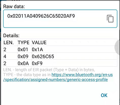

```c
0x02 0x01 0x1a 
0x04 0x09 0x62 0x6c 0x65
0x02 0x0a 0xf9
```

这里面一共放了3个信息。

第一个byte是长度，第二个byte是ad type。

这边可能你就要像知道ad type到底是什么意思呢？

其实软件已经帮您解释出来了。而且core spec里面其实也没有ad type是什么意思的完全解释。

记住这点，core spec里面没有解释。

那哪里有呢？其实细心一点你可以发现：


这个网址比较旧了。https://www.bluetooth.com/specifications/assigned-numbers/generic-access-profile/

可以访问这个网址。

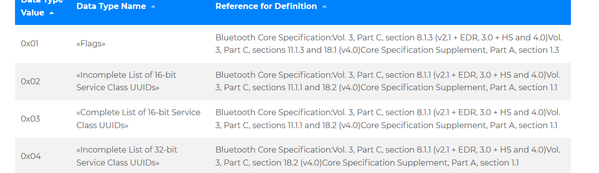

我们这里看到了0x01代表的是flags。而这个flags里面值代表什么含义呢？

后面提供了索引信息(但是这个索引信息有一些旧了，建议大家不用参考)。

主要参考一份文档

https://www.bluetooth.com/specifications/bluetooth-core-specification/

这个文档中有所有AD TYPE的类型描述，下面我就简单讲下上面所提到的3个常用的AD TYPE

- 0x01 FLAGS 

  这个是标志该设备是哪一种类型的，有LE 和BR/EDR NOT SUPPORT是常见的，其他的不太常用，这个值也不太常需要改变


- 0x09  complelte local name

  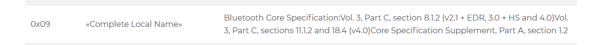

这个现实的是名称，就是你要给手机显示的名字，后面3个byte ascii就是“ble”

所以app上面会显示该名称，这个也不用查手册，后面就是具体的名称，长度在第一个字节0x04里面有体现

- 0x0a  tx power level

  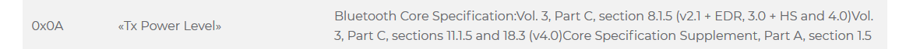


这里面就很明显了，上面那个值是0xF9 代表的是-7dm（这个是补码显示的）

在app上面也有体现：

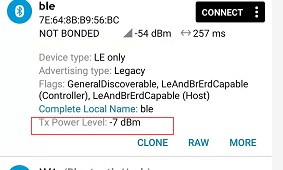

熟悉了上面的内容，基本就可以知道广播内容是如何显示，以及31个字节是如何写的了，这个相当于是应用层，接下来，会深入介绍协议栈层是如何设置之类的。

## 广播参数和HCI 命令（ADV）

​          上面讲到了广播内容的设定，但是这些内容要怎么展现呢？这就需要了解本章节了。

### adv enable

​        先讲一下这个是能命令，有了这个命令就可以开始打广播了


这个命令有一个参数，

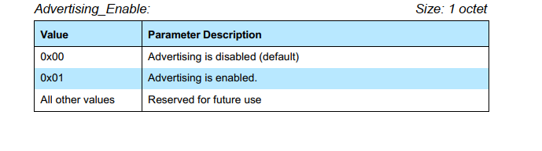

有了这个命令你就可以打广播了，广播内容可能为空也可能是默认值，不管如何，总之有了这一条命令你就可以控制是否开始打广播了。


```
01 0a 20 01 01
```

通过HCI 给卡片发这条命令，就可以用nrf connect扫描看到设备了。

### set adv data

​       设置广播数据内容


参数：

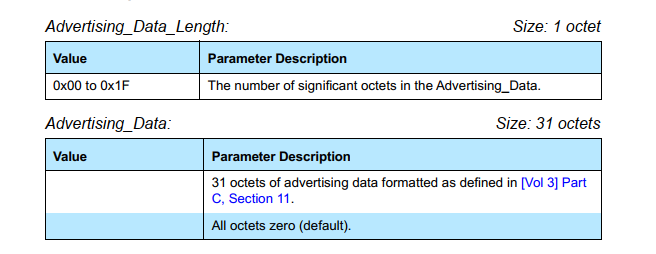

这个也很好理解，就是上一章讲到的广播内容（adv data），这个就是设置广播内容的命令。参数就是内容的长度和内容的数据，最大也就31个字节。

### set adv param

这个广播参数就相对来说比较复杂一些了，不过可以先留个印象，后面看空气包的时候可以结合一起来看。

命令：


参数：

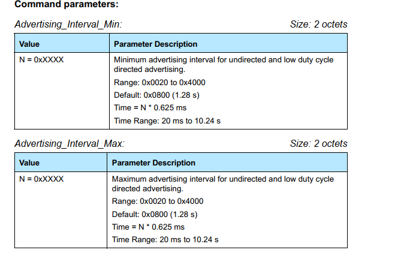


这个实在是太多了，我就不一一讲了，记住这边会有一个很多的参数，后面讲空气包的时候会联系到这边一起讲。

最主要的理解这3个就可以了，可能还有一些其他连带的命令，比如tx power之类的，其他的都是协议栈内容。

## 空中传输


当发送命令adv enable的时候，蓝牙卡片就会在3个通道（37， 38，39）上发送数据，其实就是在3个通道上面发送数据，发送的数据就是这个广播什么类型，以及广播内容（就是上面讲到的adv data）

在空气中，这个包空气中如何发送，以及以多大的间隔发送，都是根据set adv param。

### set adv param举例：

我们来举个例子看看


```
adv intreval min: 30ms(48 slot)
adv interval max: 60ms(96 slot)
adv type : connectable undirected advertising
own address type: public
direct address type: public
direct address: 00:00:00:00:00:00
adv channel map: 37 38 39 enable
adv filter policy: scan request from any,connect request from any
```

看下时间间隔


简单理解一下：

```
1. adv interval 这个是指示的每次发送广播的时间间隔，这边设置的是30~60ms，从空中看有一次是33ms，就是发送广播的时间间隔，看上去也是符合的。
2. adv type： 这个是广播类型，不同的广播类型，发送的广播类型不一样，主机认识的类型也不一样，下一个章节会介绍一些常见的类型，
3. own address type: 本机的蓝牙地址类型，public的，这个涉及到蓝牙地址类型的知识，不展开了。
4. direct adress: 发送direct广播的时候需要参考这个地址，也分类型和地址
5. adv channel: 这个就是37 38 39 需要在哪几个通道里面，基本上默认都是全通道打的。
6. adv filter policy： 这个就是响应哪些请求。
```

通常我们常用的就是adv interval，这个可以控制打广播的时间间隔，具体每次打的时间间隔底层根据范围随机来设置的。控制这个时间间隔可以降低打广播时候的功耗。

## 广播的种类

介绍几种常用的广播类型，这个涉及到的参数就是adv param中的adv type

### ADV_IND

​    这个比较常用的，可以连接的，非定向的，任何设备都可以搜到的。

### ADV_DIRECT_IND

​    定向广播，这个就只能特定设备才能搜到该广播，也就是地址是direct address的设备才能搜到该广播，（实际上空气中还是会有的，只是对端HOST不会上报）

### ADV_NONCONN_IND

​     非定向不可连接的广播，这个就是告诉对端，该设备不可连接，在nrf connect上面也会看到设备是没有connect按钮的。

### SCAN_REQ

​        这个也是一种广播，不过这种广播是请求对端的scan response data， scan response 数据可以理解成广播数据的补充。可以不同，也可以相同。

### SCAN_RESPONSE

​         这个和6.4相对应，作为回应，回复的也是scan response的数据。有些重要的数据可以放到scan req中，非重要的数据可以放到sccan response中。

## beacon

其实对于协议栈来说，发什么广播数据都不用关心。31个byte怎么传输都可以，所以这个beacon相对来说，当需要开发相应的应用的时候需要非常了解，不开发的话也可以不用了解，这个我确实也不是特别了解里面的内容，大部分自成体系的。我就摘抄网上讲的比较好的记录一下：


​       目前主流的三种帧格式分别为苹果公司的iBeacon，Radius Networks公司的AltBeacon以及谷歌公司的Eddystone。

### Ibeacon

iBeacon使用了称为厂商数据字段的标准AD Type结构。如下图所示，为iBeacon的广播包，按AD Type结构进行分割如下：

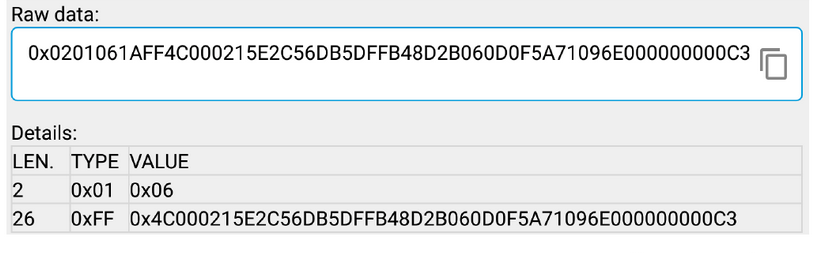


 厂商数据字段的数据域前2字节为公司识别码。由蓝牙SIG组织分配给各公司，指示后续数据的解码方式。在上图中，0x004C为苹果公司的ID。0x02指明该设备为“proximity  beacon”，该值在iBeacon设备中均为0x02。UUID指明拥有该beacon设备的机构。主次字段用来编码位置信息，通常主字段指明某个建筑，而次字段指明在这栋建筑中的特定位置。例如“伦敦中心商场，运动产品区”。发送功率字段帮助应用进行距离估算。有关iBeacon的详细内容可以参考[Getting started with iBeacon](https://developer.apple.com/ibeacon/Getting-Started-with-iBeacon.pdf)

 ### Altbeacon


### eddystone

  谷歌公司的Eddystone与iBeacon及AltBeacon有所不同。它没用使用所谓的厂商数据字段，而是使用16位服务UUID字段以及服务数据字段。Eddystone还定义了如下图所示的子类型，具体内容可以参考[eddystone](https://github.com/google/eddystone)：


这边提供一个blog供需要的人参考吧。

https://blog.csdn.net/bi_jian/article/details/82927904

可以这样理解，其实beacon的一些应用不太需要协议栈的一些链路内容，只要可以打广播即可。

补充说明：其实beacon字面意思理解就是一个信标。现在很多2.4GHz的芯片都可以模拟BLE发送一个beacon信号而不用跑BLE协议栈。这样能最大程度的降低芯片成本。关于beacon的应用有如下几个场合
1. 室内导航，商场的室内是搜索不到GPS信号的，但是预先在各个位置放一些经过编码的ibeacon设备，手机经过的时候就会收到该信号，然后结合应用层就可以做室内导航了。
2. 打广告，和ibeacon类似，Google的eddstone可以在数据字段承载一个网址，这样你在一家装了eddstone信标的商城就会扫描到这个店家的网址，从而直接访问。

## 主机scan扫描

通常扫描是作为主机端来控制的，就是我们通常的手机端，所以这部分放到最后，可能只做丛机有不需要了解下面的内容。

### scan相关的HCI 命令和event

跟上面广播命令相对应。

#### scan enable

这个命令就是扫描的开关了，打开扫描，


两个参数：

- scan enable

  

- filter_dumplicate

  这个参数就是是否过滤重复的信息，默认是打开的，如果不打开，scan到一次就会上报一次，不过滤重复地址。

  

#### set scan data

这个和上面的adv data内容差不多


#### set scan param

参数和adv param类似：


#### EVENT  LE adv report

 做扫描，扫描到设备的时候，会上报该条event

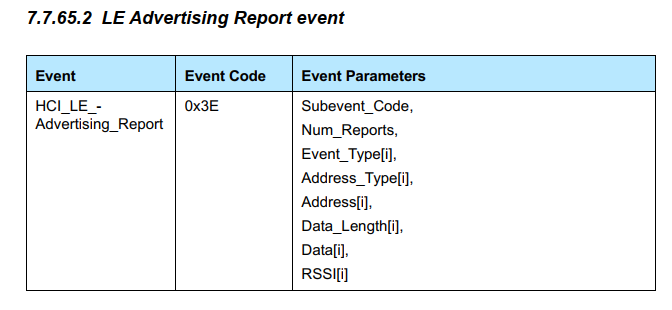

这个里面有以下参数：


### SCAN 类型

 scan分为Passive scan和Active scan

#### 被动扫描（passive scan）


被动扫描，这个主要看上面这个流程，对方发广播了，扫描到了，就回报给host。

#### 主动扫描（Active scan）


这个主动扫描，就是开启扫描之后，如果搜到了广播，发送SCAN_REQ请求，之后搜到SCAN_RSP之后再上报信息。

### SCAN 参数

scan在空气中实际上是不太能看到的，因为主机处于被动接收,所以空气包中也看不到scan的参数，

下面画一张图让大家理解scan window和scan interval的意思。主机会在同一个频道内，听一个scan window，一个scan interval换一次频率。


常用的就是这个interval和window，居然时间可以参考上面的手册。

### mesh

其实理解了上面的大部分内容，基本上mesh可以做adv相关的承载了。其实mesh有了上面的知识，基本上就可以跑了。其他的都可以暂时不用看。

### ble 5.0 & ble 4.0

上面讲的只是蓝牙4.0的广播基本信息，实际上这里只讲了一小部分，还有很多内容未讲，实际上只是带大家入门，知道如何去看剩下的信息。ble5.0又引入了adv extend广播，就不止发31个字节。这些都是比较新的feature，通常安卓手机都是支持的。
