# GATT & ATT

## ATT简介

ATT（attribute protocol） 这个是一个protocol，是用于搜索发现和读写对端设备属性的通信协议。

### 协议内容：

有两种角色： Service role 和client role。这个是标准的CS模型。

每个属性由4部分组成：

* 属性type，由UUID设定，UUID，由[Assigned Numbe](https://www.bluetooth.com/specifications/assigned-numbers)r
* 属性handle
* 一系列的权限permission。
* value值

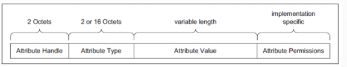

### ATT 定义

#### attribute TYPE

type类型，都是由UUID来标志的。

UUID:

(Universally Unique IDentifier):唯一标识符

uuid有16bit，也有32bit，也有128bit的。

总体来讲，最后都会变成128bit。比如16bit，这个会嵌入到一个通用的蓝牙基准UUID

比如battery电池服务是0x180F

转换成128bit就是：

000000180f-0000-1000-8000-00805f9b34fb.

可以这么理解，16bit只是方便一些标志的profile设置uuid，但是最终如果解析不出来或者central不认识这个profile，会以128bit显示给客户告知客户这个uuid不认识。

#### ATT HANDLE

handle的取值范围0x0001-0xFFFF， 0xFFFF就是最大的handle值了，这个有2个byte来代表。

#### ATT handl grouping

这个用的不是很多，暂时不介绍

#### ATT value

ATT的值，也就是每个属性里面的值，通常是由UUID决定的TYPE来决定的，如果uuid未定义，或者自行定义的一个UUID，则双方协商好即可，实际上黑盒的情况下，client端是无法知道这个值的长度的，只能通过read 读出来看看，长度是怎样的。write的时候，实际上也是可以随便写的，由service端判断数据的正确性，当然要符合MTU size大小。

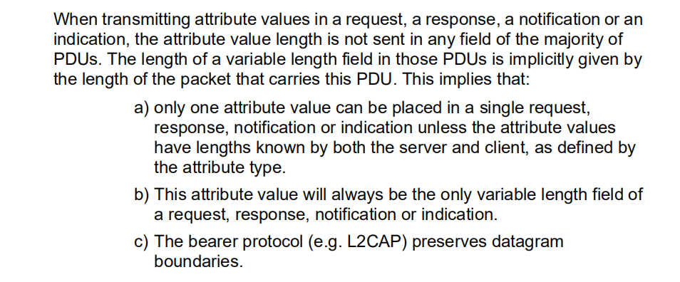

#### ATT 权限

service端的ATT权限并不能被client获取到，只能client来读取的时候，service端反馈给client端，该ATT是否需要权限，如果有权限需要加密，则返回client端没有权限，返回ERROR权限不够，这个时候client端会去做bond相关的动作以达到权限。

权限分为以下等级：

##### 访问权限

* 可读
* 可写
* 可读可写

当读取属性值时，需要判断这个属性值是否可读。如果不可读。服务器会返回一个属性不可读的状态。当写入属性值时，也需要检测这个属性是否可写，否则会收到属性值不可写的状态信息

##### encryption 权限

* 需要加密
* 不需要加密
##### authentication权限

* 需要认证
* 不需要认证
##### authorization 权限

* 需要授权
* 不需要授权

再次强调：属性许可不能通过属性协议访问到这个 handle属性值的权限，这个权限只有当客户端访问服务器时才会将需要访问这个属性权限的条件(错误码)返回给服务器，进而服务器做出相应的处理。

#### exchange MTU size

MTU(max transmission unit）最大传输单元， 这个是两边协商得来的。

连上之后通常第一笔ATT包就要两边相互协商好MTU size。

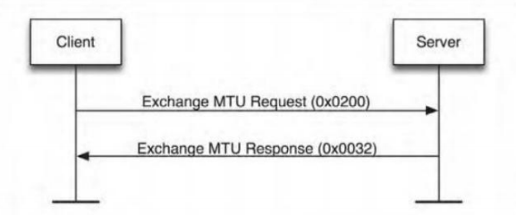

* client端发送如下图

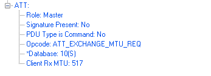

Master告诉对端自己的RX能力是517 Byte

* service 回复如下：

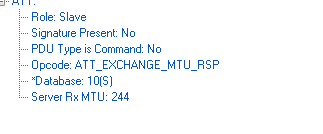

service 回复自己的RX能力是244。

在低功耗蓝牙连接中，属性协议默认的 MTU 为 23 字节。一般客户端是不会发起这个请求的，它的默认值就是 23，当双方交换的值不同时，用较小的那个作为最终使用的值。

通常这个MTU 默认值是23.

#### Control-Point Attibutes

一种特殊的属性，不可被读，可以被写

#### long attribute value

一个att最长是MTU-1，如果长度大于该值，如果要读整个value值，就要使用ATT_READ_BLOB_REQ。如果只读第一个ATT_MTU-1就可以用ATT_READ_REQ

#### Find information reqeust/ response

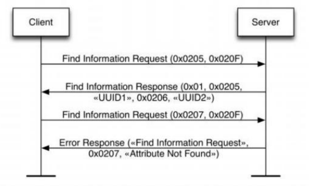

       查找信息请求和回复用来查找一系列属性的句柄和类型信息。这是唯一一个能让客户端发现任意属性类型的消息。查找信息请求包含有两个句柄：起始句柄和结束句柄。它们定义了该请求用到的属性句柄范围。为了找到所有数值的属性，该请求的起始句柄将是 0x0001，结束句柄设为 0xFFFF。但是回复的信息中因为长度限制，并不能包含所有的属性，所以需要再次请求，只是将起始句柄改为查找到的最大句柄的后一个句柄开始。

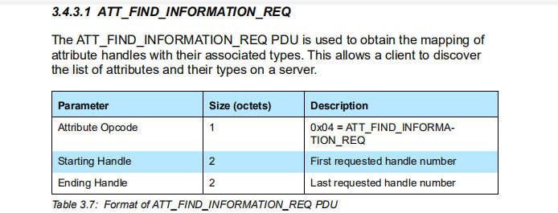

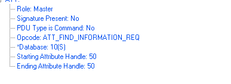

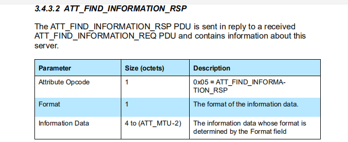

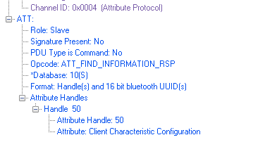

#### find information by type value/response

根据类型值查找information/应答

这个就是比上面多了一个type value类型，可以根据类型查找。

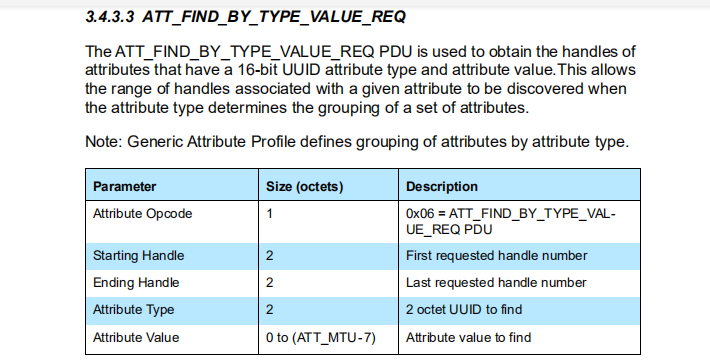

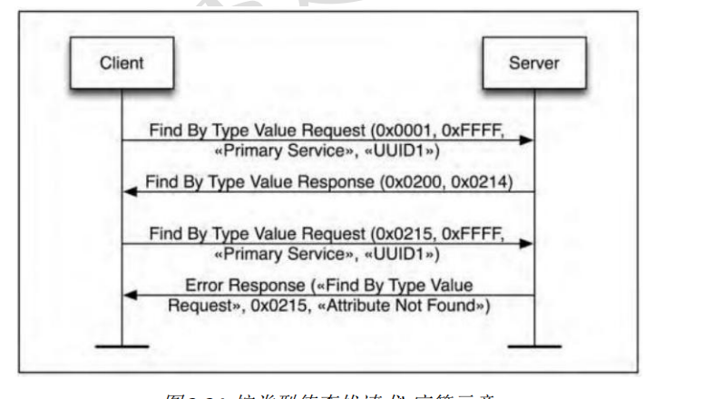

#### read by type request /response

这个通常根据type来读取该属性的value值。

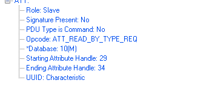

返回：

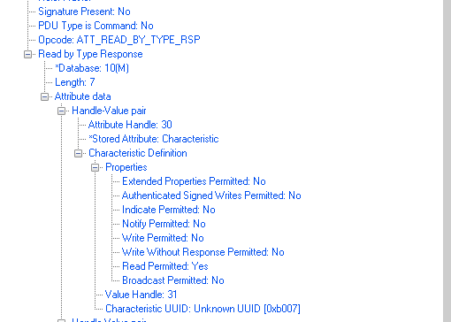

### ATT PDU

有6种PDU 类型：

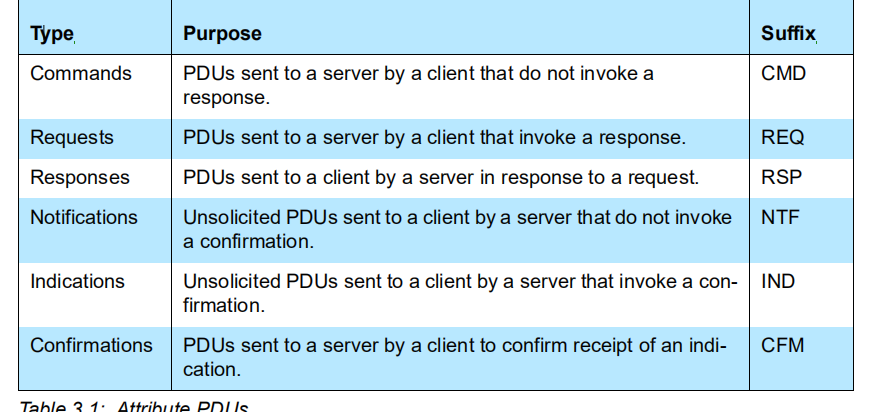

* commands - client -> server
* requests     - client->server  需要有回复
* responses  - server->client 回复，和request是一对
* Notification  -    server->client 发送通知。
* indications  -    server->client 这个和notify作用一样，但是要等到client端回复。
* confirmations - client-> server，这个和indications是一对。
1. ERROR CODE

每一个error code都是由4部分组成

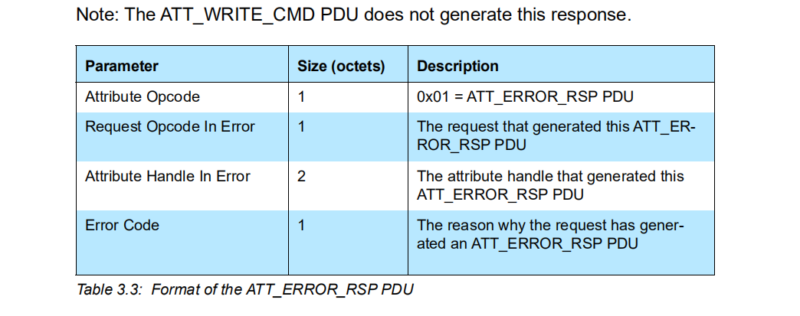

* ATT OPCODE                                      必须为0x01 ATT_ERROR_RSP 
* REQUEST OPCODE IN ERROR        上一次request的OPCODE
* ATTRIBUTE HANDLE INERROR        操作的handle
* ERROR CODE                                    错误码
* 

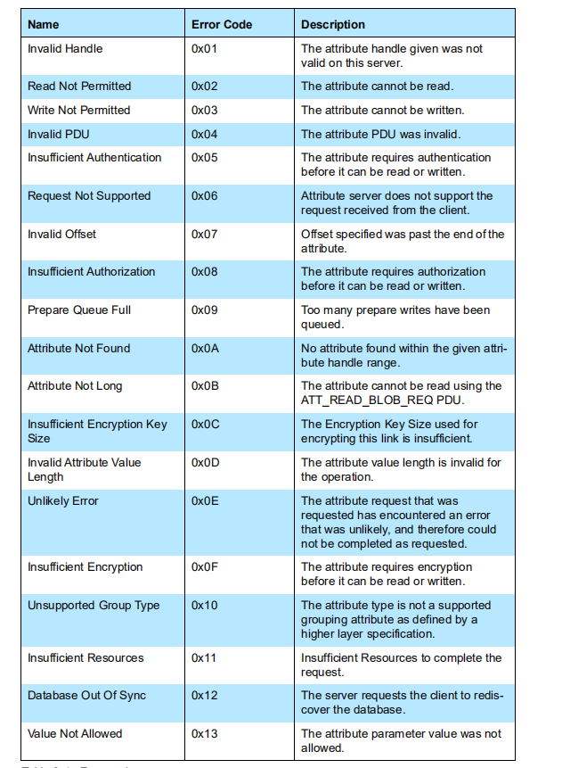

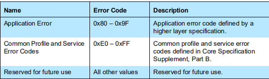

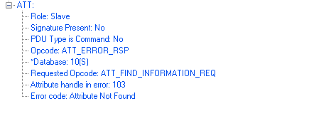

## GATT 简介

### GATT 

Generic attribute profile规定了一个profile并用att protocol来进行处理两边设备的交互。

这个是GATT 和GAP的一个简单的关系

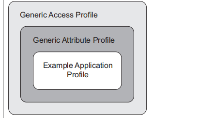

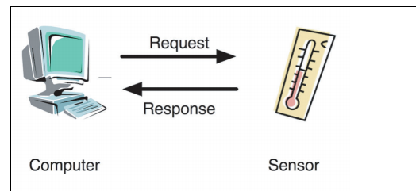

这个是两个角色通常：

client： 通常手机或者电脑这些由人操作的设备都是client端

servcie：通常sensor 温度计这种就是service端。

### 框架结构：

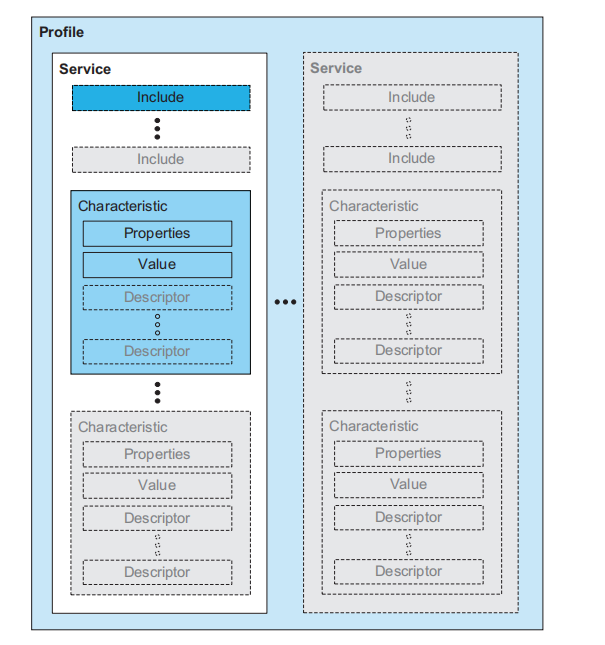

* service
* include
* characteristic

一个service 代表一个profile，比如电池服务，配网服务。

一个include 代表这个service需要包含其他服务才能工作。（这个用的不多）

characteristic 这个是属性的真实值，这张表中每个属性叫做characteristic，每个characteristic都会有一个properites（就是属性的属性值，这个值是有规范的，下面讲，）

value：就是该属性代表的值

desriptor: 这个可有可无，用来描述该属性的。

### service 的定义

 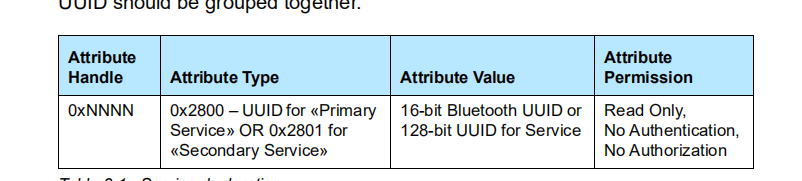

对于service，只有有个uuid即可。通常service为primary service，这个是主服务。

比如：

handle：0x0001

attribute type: 0x2800 (这个代表是primary service 的uuid)

attribute value: (这里存放的是uuid，可以是16bit，或者128bit的)

permission: service 的permission默认是read only

### include 定义：

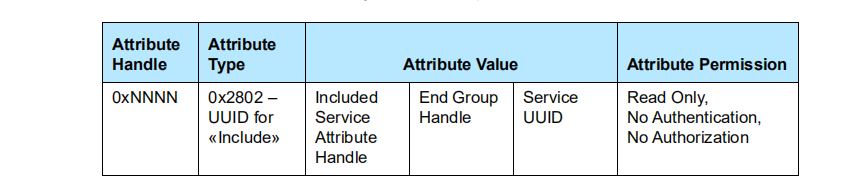

这个用的比较少，就不详细说了，就是这个attribute value会指示这个service里面的多少到多少是include 的service

### characteristic 定义：

这个比较重要：

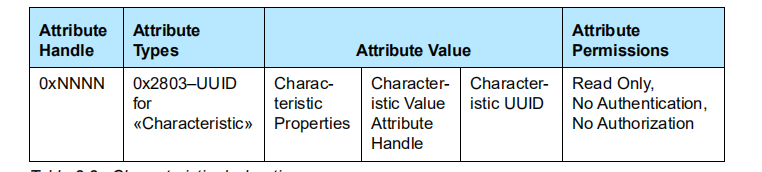

#### properties

这个是该属性的初步的是否可以读写的属性（注意，并不是该属性是否需要建立加密信息的标志），这个是给client端，告诉他，你可以对这个属性做哪些基本操作。

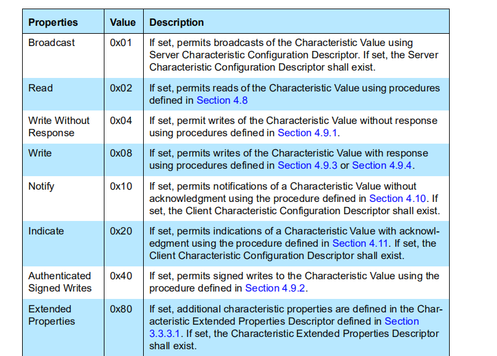

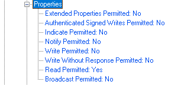

这里面每一位代表一些意思：

* broadcast：这个用的比较少，应该跟广播相关
* read permitted：允许读
* write without response ：允许write cmd
* wirte ： 可以write
* notify：可以notify
* indicated： 可以indicated
* authenticated signed writes: 需要签名才可以写。
* extened properits： 额外的属性需要设置(用的比较少）
#### handle

charactertistic 的handle值，基本上是GATT比较精髓的地方。

#### uuid

这个表示该属性的类型uuid，和身份证号码差不多。

### value 定义：

为啥要有个value定义呢，就是每个专门的属性需要一个handle来存放具体的value值，最后read或者write都是对这个value 的定义来操作，上面characteristic也占一个handle，用来表示这个value的有哪些操作可以做。

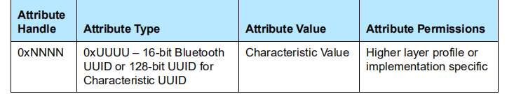

### descriptor 定义

descriptor的定义和上面属性不同，大体上意思就是这个descritor就是用来修饰上面的characteristic属性的。比如你自定义某个uuid的时候，蓝牙SIG没有规定这个uuid是哪个profile。但是你又想要告诉对端这个uuid显示成哪个字符串，就可以加 一个descriptor来修饰一下上面的characteristic。

另外description有个重要的作用：

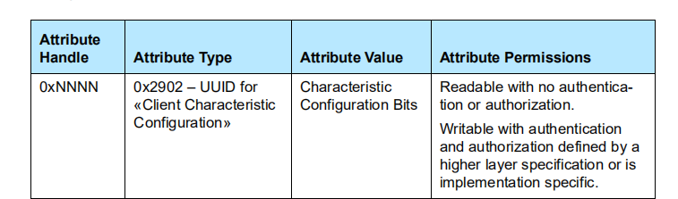

这个可以修饰该characteristic是否可以让service发数据给client端。

一共有两个BIT

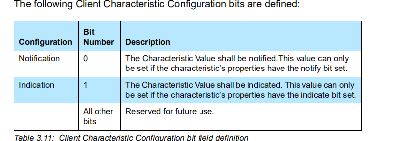

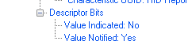

这个通常简称是CCCD， 是用来给service的属性来开关的额，只有当这个属性值写yes的时候，service才能发送对应的notify。

所以理论上，手机和sensor连上之后，sensor是不允许发数据给手机的。只能手机通过打开这个开关，sensor才能发数据给手机（协议上是这样规定的）。

这个标志在上面properties就有对应的说明，

用手机上nrf connect连上之后，这个由上角的3个箭头的，就是CCCD，点击就是打开，

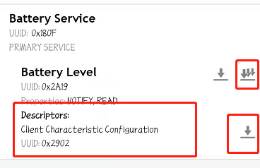

打开之后，就可以看到service 端发数据过来，也能看到notify enable了：

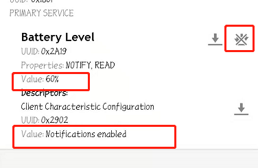

### GATT常用类型：

GATT profile规定了以下类型：

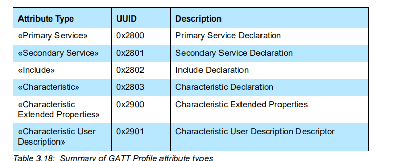

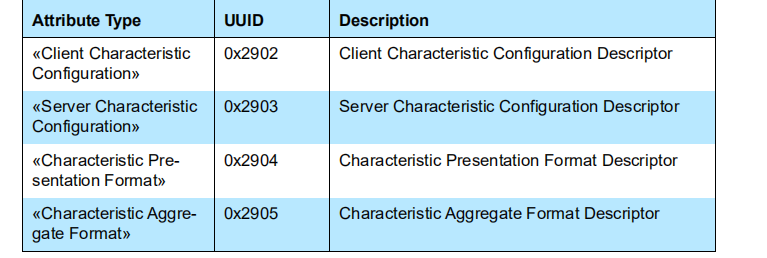

这些都是特定的uuid，在SIG中明确规定：

常用的就是以下几个：

* primary service 0x2800
* secondary service 0x2801
* include    0x2802
* characteristic   0x2803
* client charcteristic config  0x2902

其他不是特别常用，就不介绍了。

讲了这么多，最好能举个例子：

我们就以最简单的电池管理协议（battery service）

电池管理协议就一个属性：

电池level： 0~100

一个byte：

蓝牙规定了两个UUID:

0x180F: 电池管理服务 battery service 

0x2A19: battery level 电池电量属性

我们来看下spec：

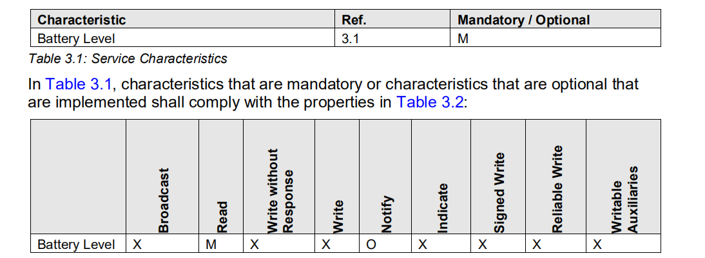

这个servie就一个可以read的属性battery level

notify属性是可选的。可以有，可以没有：

可以这么理解：

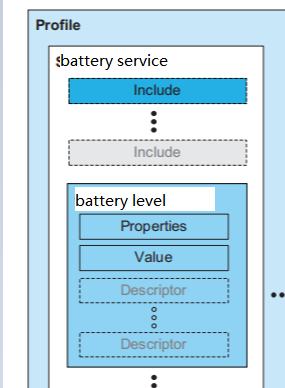

我们先来看下一些协议栈对这张表如何来写：

比如nimble：

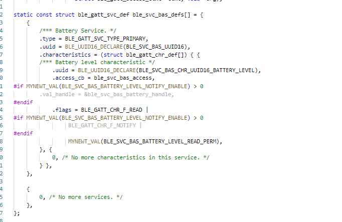

其实这张表的本质和精髓就是handle，我们可以从handle上面理解。

(当然这个handle是根据不同service会有所变化的，我们现在就以只有一个battery service的sensor为例)

* handle: 0x0001 

type: primary servive  (0x2800)

value: 0x180f(battery service uuid)

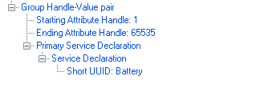

* handle 0x0002

type: charactertistic (0x2803)

properties: notify(yes), read(yes)

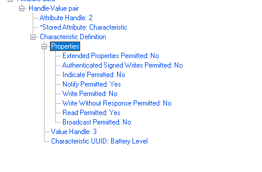

* handle 0x0003

type: uuid：0x2A19

这是一个value

* handle 0x0004

type: uuid:  0x2902(CCCD)

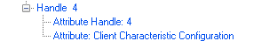

value:这个实际上没有值，都是由client端来保存的。

当client端需要来读电池电量的值时，只要发read request给对端，要读handle为0x0003的值，service端即把值通过read response返回给client端。

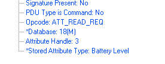

如果要打开CCCD，打开之后，service 就可以主动给client端发送电量数据，可以通过send notify 这个PDU 来发送，用handle 0x0003即可：

### GATT常规操作：

对于GATT service而言，就是把上面那张表注册到协议栈即可，后续的client端来读写数据，都是根据handle来的。我们先来讲一下CS如何读写数据，这边就要和ATT相联系起来了。

### client读value数据：

读写操作都是根据handle来的，只要知道handle，就可以读数据：

读值

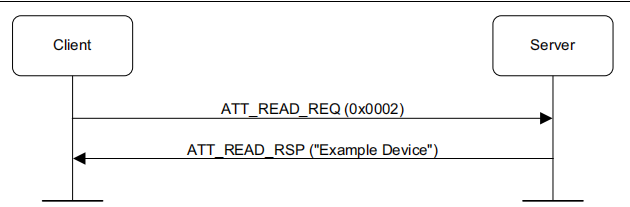

如果数据太长的话，后面要用BLOB来读。

### client写数据：

####  write with no response 

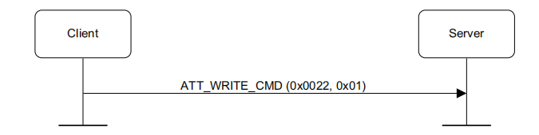

write cmd就是不需要对端回应的cmd

#### write request

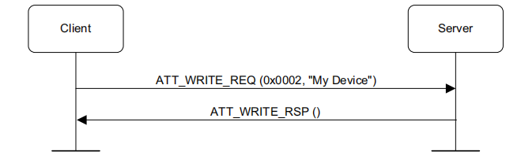

write request 就是需要对端回response的，让service知道的操作。

#### service 写数据：

service 写数据分两种notify和indicated，（和write cmd reqest类似）。

#### notify

notify是不需要做出响应的：

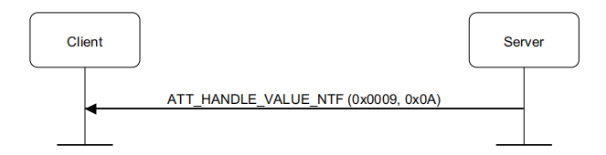

#### indicate

indicated是需要做出响应的：

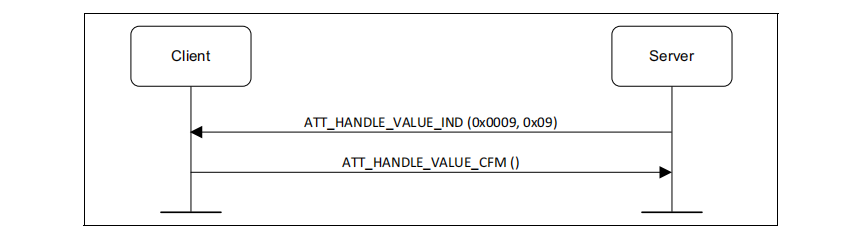

主要就是上面的基本操作，其他的都是拓展出来的，比较多，这边就不展开介绍了。理解这几个概念比较常用了。

## client搜索服务

剩下的操作就是client搜索服务了。client端刚连上service的时候，会需要获取到这张表，这张表怎么获取就因表而异了。比如central端可以只搜索特定的服务，也可以把整张表都查出来。这个流程比较繁琐。拿个表稍微讲下即可。

1. 各个协议栈对handle的操作：

通常常规做法，都是分治思想，每个service 管理自己的handle。但是这个handle又是动态的，所以有两种处理方法：

* 由协议栈返回相对handle，offset_handle， profile提供对应的callback处理函数，处理offset_handle
* 由协议栈返回绝对handle，这个时候各个profile就要拿一个全局变量来保存这个handle。

  

