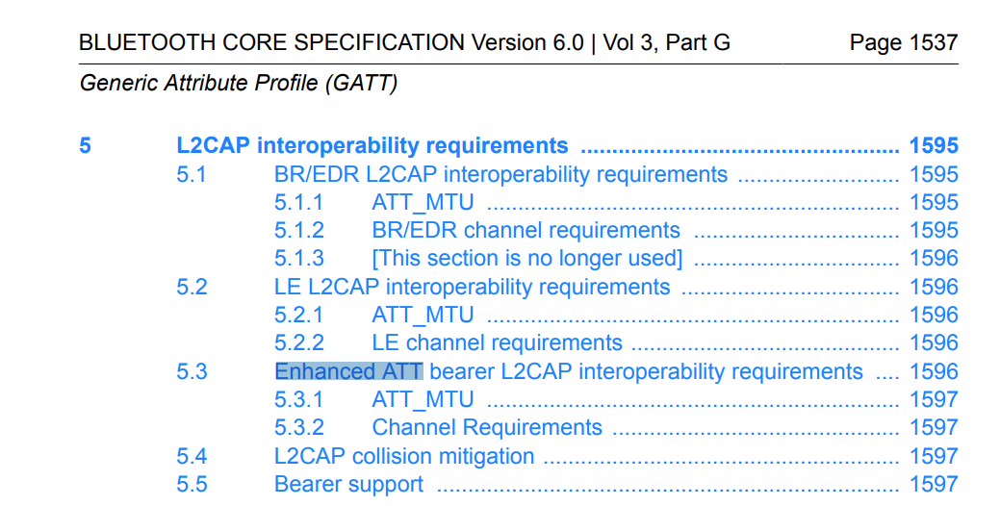
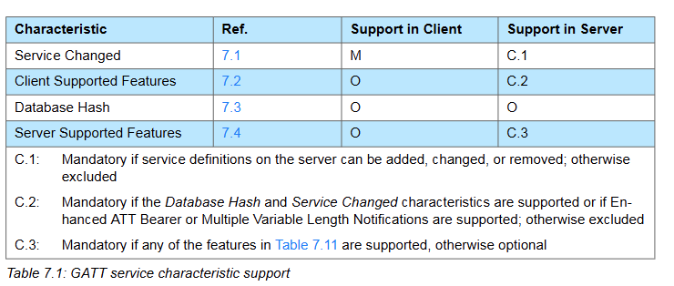
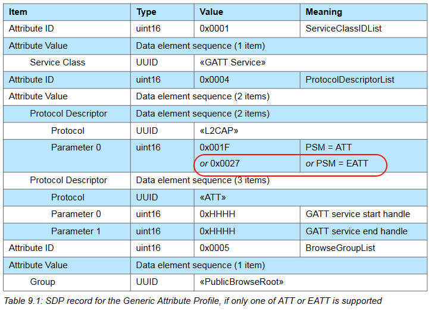
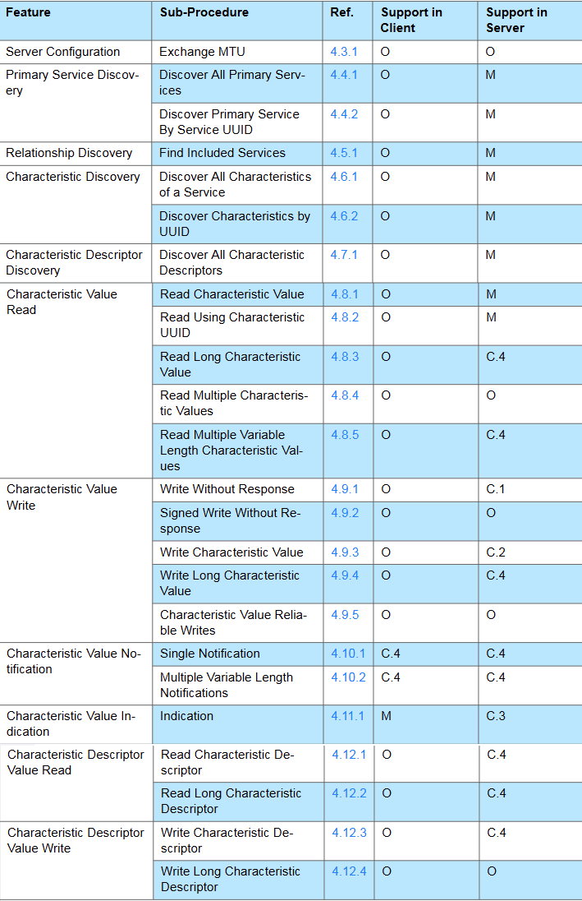

# EATT

## 简介

EATT（Enhanced Attribute Protocol）和ATT（Attribute Protocol）都是蓝牙技术中用于数据交换的协议，但它们在性能和特性上有所不同：

1. **ATT（Attribute Protocol）**：
   - ATT是蓝牙低功耗（BLE）的核心协议，用于在客户端和服务器之间发现、读取和写入属性。
   - 它使用L2CAP（Logical Link Control and Adaptation Protocol）通道来传输数据，并且有一个固定的通道号（ATTBearer）。
   - ATT支持有限的数据包大小（ATT_MTU），默认值为23字节，但可以通过MTU交换过程协商更大的值。
   - ATT不支持重新传输，这意味着它不保证数据的可靠传输，特别是在数据包丢失的情况下。
2. **EATT（Enhanced Attribute Protocol）**：
   - EATT是ATT的增强版本，旨在提高数据传输的可靠性和效率。
   - 它使用L2CAP的增强信用基础流控制（Enhanced Credit Based Flow Control）模式，允许更高效的数据传输。
   - EATT支持更大的MTU值，最小值为64字节，这允许更大的数据载荷，减少了需要传输的PDU（协议数据单元）数量。
   - EATT支持可靠的数据传输，包括数据包的重新传输，这有助于提高数据传输的可靠性。
   - EATT还支持多个并行的L2CAP通道，这意味着可以同时进行多个数据传输，提高了并行处理能力。
3. BR/EDR
   - BR/EDR的MTU size是48个字节

总的来说，EATT提供了比ATT更高的数据传输效率和可靠性，特别是在需要处理大量数据或需要可靠传输的场景中。EATT是在蓝牙5.0及以后的版本中引入的，而ATT则是BLE的基础协议。

在蓝牙的Generic Access Profile (GAP)中，定义了一些特性（characteristics），这些特性用于描述设备的基本信息和功能。以下是GAP服务中常见的特性：

1. **Device Name (0x2A00)**：
   - 描述设备的用户友好名称。
   - 该特性值为UTF-8字符串，长度可达248字节。
2. **Appearance (0x2A01)**：
   - 描述设备的外观，通常用于映射到图标或字符串，以便在设备发现过程中向用户展示设备的物理外观。
   - 该特性值为16位数字，表示设备的外观类型。
3. **Peripheral Preferred Connection Parameters (0x2A04)**：
   - 描述外设的首选连接参数，包括最小和最大连接间隔、连接延迟和超时。
   - 该特性值为8字节，包含连接参数的具体值。
4. **Central Address Resolution (0x2AA6)**：
   - 指示设备是否支持地址解析功能，以便在使用可解析私有地址时进行连接。
   - 该特性值为1字节，0表示不支持，1表示支持。
5. **Resolvable Private Address Only (0x2AC9)**：
   - 指示设备在配对后是否仅使用可解析私有地址。
   - 该特性值为1字节，0表示设备将使用可解析私有地址，其他值保留。
6. **Encrypted Data Key Material (0x2B88)**：
   - 允许使用密钥材料对与GAP服务相关的广告数据进行解密和验证。
   - 该特性值为128位，包含会话密钥和初始化向量（IV）。
7. **LE GATT Security Levels (0x2BF5)**：
   - 包含GATT服务器在LE连接中操作时的最高安全要求。
   - 该特性值为序列化的安全级别要求。

这些特性帮助设备在蓝牙网络中进行基本的身份识别、连接管理和安全性设置。具体的实现和支持可能因设备而异。

在蓝牙技术中，Generic Attribute Profile (GATT) 定义了一系列的特性（Characteristics），这些特性用于在设备之间共享和传输数据。以下是GATT中一些常见的特性：

1. **Service Changed (0x2A05)**：
   - 用于指示GATT服务中发生的变化，如添加、删除或修改了服务或特性。
2. **Client Supported Features (0x2B29)**：
   - 客户端使用此特性来通知服务器它支持的功能。
3. **Database Hash (0x2B2A)**：
   - 包含GATT数据库的哈希值，用于检测数据库的变化。
4. **Server Supported Features (0x2B3A)**：
   - 服务器使用此特性来指示它支持的功能。
5. **Device Name (0x2A00)**：
   - 设备的友好名称，用于识别设备。
6. **Appearance (0x2A01)**：
   - 描述设备的外观设计，通常映射到一个图标或字符串。
7. **Peripheral Preferred Connection Parameters (0x2A04)**：
   - 外设的首选连接参数，包括连接间隔、延迟和超时。
8. **Central Address Resolution (0x2AA6)**：
   - 指示设备是否支持地址解析。
9. **Resolvable Private Address Only (0x2AC9)**：
   - 指示设备是否仅使用可解析私有地址。
10. **Encrypted Data Key Material (0x2B88)**：
    - 提供用于解密和验证加密广告数据的密钥材料。
11. **LE GATT Security Levels (0x2BF5)**：
    - 包含GATT服务器在LE连接中操作时的最高安全要求。

这些特性是GATT框架的一部分，它们允许不同的蓝牙设备发现、读取、写入和通知服务和特性的值。GATT特性通常由一个或多个属性（Attributes）组成，包括特性声明、特性值、特性配置描述符等。具体的服务和特性可能会根据具体的应用和设备有所不同。

**Server Supported Features**

在蓝牙的Generic Attribute Profile (GATT)中，**Server Supported Features**特性用于指示服务器支持的功能。该特性具有一个特定的UUID（0x2B3A），并且其特性值通常是一个字节数组，每个字节代表不同的功能支持。以下是一些常见的功能位（bit）：

1. **EATT Supported (Bit 0)**：
   - 如果设置为1，表示服务器支持增强的属性协议（EATT）。

2. **Multiple Handle Value Notifications Supported (Bit 1)**：
   - 如果设置为1，表示服务器支持多个句柄值通知（ATT_MULTIPLE_HANDLE_VALUE_NTF）。

3. **Privacy Feature Supported (Bit 2)**：
   - 如果设置为1，表示服务器支持隐私特性，包括可解析私有地址的生成和解析。

4. **Reliable Writes Supported (Bit 3)**：
   - 如果设置为1，表示服务器支持可靠写入特性，这通常涉及到在写操作中确保数据的完整性。

5. **Other Features**：
   - 可能还有其他特性位，具体取决于实现和版本，通常会留出一些位以供未来使用。

### 特性值格式

- **长度**：特性值的长度通常是可变的，具体取决于支持的功能数量。
- **每个字节**：每个字节的每个位（bit）对应于不同的功能支持，未使用的位通常保留为0。

### 使用场景

客户端在连接到服务器时可以读取**Server Supported Features**特性，以确定服务器是否支持特定的功能。这有助于客户端在进行交互时做出相应的处理，例如根据服务器的功能进行优化或选择合适的操作。

具体的位分配和功能支持可能会在相关的蓝牙规范文档中详细列出。用户可以参考蓝牙SIG的官方文档以获取最新和完整的信息。

在蓝牙GATT（Generic Attribute Profile）中，Characteristic是一种属性，它包含了一个值以及与该值相关的属性和配置信息。Characteristic的属性（Characteristic Properties）是一个位字段（bit field），用于描述Characteristic Value的使用方式或访问权限。以下是Characteristic Properties中每个bit的含义：

1. **Broadcast (0x01)**：如果设置，允许使用Server Characteristic Configuration Descriptor广播Characteristic Value。如果设置，Server Characteristic Configuration Descriptor必须存在。
2. **Read (0x02)**：如果设置，允许使用定义在GATT第4.8节的程序读取Characteristic Value。
3. **Write Without Response (0x04)**：如果设置，允许使用定义在GATT第4.9.1节的程序无响应地写入Characteristic Value。
4. **Write (0x08)**：如果设置，允许使用定义在GATT第4.9.3节或第4.9.4节的程序有响应地写入Characteristic Value。
5. **Notify (0x10)**：如果设置，允许无需确认地使用Client Characteristic Configuration Descriptor通知Characteristic Value。如果设置，Client Characteristic Configuration Descriptor必须存在。
6. **Indicate (0x20)**：如果设置，允许需要确认地使用Client Characteristic Configuration Descriptor指示Characteristic Value。如果设置，Client Characteristic Configuration Descriptor必须存在。
7. **Authenticated Signed Writes (0x40)**：如果设置，允许使用定义在GATT第4.9.2节的程序进行签名写入Characteristic Value。
8. **Extended Properties (0x80)**：如果设置，额外的Characteristic Properties定义在Characteristic Extended Properties Descriptor中。如果设置，Characteristic Extended Properties Descriptor必须存在。

这些属性定义了Characteristic Value的不同访问和使用方式，例如是否支持通知、指示、读写等。每个bit独立设置，允许一个Characteristic同时支持多种操作。

1. **Characteristic User Description**:
   - **文件**: Core_v6.0_GATT.pdf
   - **章节**: 3.3.3.2 Characteristic User Description
   - **描述**: 这部分定义了一个可选的特性描述符（Characteristic Descriptor），它包含了一个UTF-8字符串，用于提供Characteristic Value的用户文本描述。如果Characteristic Extended Properties中的Writable Auxiliaries位被设置，则此描述符可以被写入。这个描述符可以出现在特性定义的任何位置，在Characteristic Value之后。每个特性定义中只能有一个Characteristic User Description声明。
2. **Characteristic Presentation Format**:
   - **文件**: Core_v6.0_GATT.pdf
   - **章节**: 3.3.3.5 Characteristic Presentation Format
   - **描述**: 这部分定义了一个可选的特性描述符，用于定义Characteristic Value的格式。这个描述符可以出现在特性定义的任何位置，在Characteristic Value之后。如果一个特性定义中存在多个Characteristic Presentation Format声明，则必须存在一个Characteristic Aggregate Format声明。这个描述符定义了如何显示或表示Characteristic Value。

这两个特性描述符都是GATT特性的一部分，用于提供关于特性值的额外信息，如用户友好的描述和值的格式。这些信息有助于客户端更好地理解和使用服务中的特性。

GATTprofile主要内容：

1. **引言（Introduction）**
   - 描述了GATT的目的和范围，以及与其他配置文件的依赖关系。
2. **配置文件概述（Profile Overview）**
   - 介绍了GATT的协议栈、配置和角色、用户需求和场景，以及配置文件的基础知识。
3. **服务互操作性要求（Service Interoperability Requirements）**
   - 详细说明了服务定义、包含定义和特性定义，包括特性声明、特性值声明和特性描述符声明。
4. **GATT功能要求（GATT Feature Requirements）**
   - 描述了GATT的11个功能，包括服务器配置、主服务发现、关系发现、特性发现、特性描述符发现、特性值读取、特性值写入、特性值通知、特性值指示、特性描述符读取和写入。
5. **L2CAP互操作性要求（L2CAP Interoperability Requirements）**
   - 涉及BR/EDR和LE物理传输的L2CAP通道配置和要求。
6. **GAP互操作性要求（GAP Interoperability Requirements）**
   - 描述了GATT在GAP层面的互操作性要求，包括连接建立和断开事件。
7. **定义的通用属性配置文件服务（Defined Generic Attribute Profile Service）**
   - 介绍了GATT服务中定义的一些特定特性，如服务更改、客户端支持的特性、数据库哈希和服务器支持的特性。
8. **安全考虑（Security Considerations）**
   - 讨论了GATT中认证和授权的要求。
9. **SDP互操作性要求（SDP Interoperability Requirements）**
   - 涉及GATT服务在SDP中的发布和发现。
10. **参考资料（References）**
    - 提供了相关规范和文档的引用。

PSM是“Protocol/Service Multiplexer”的缩写，意为协议/服务多路复用器。在蓝牙技术中，PSM是一个用于逻辑传输通道的协议标识符，它用于在L2CAP（Logical Link Control and Adaptation Protocol）层为不同的服务分配固定的通道。每个PSM都对应一个特定的服务，确保数据能够正确地路由到对应的服务。

例如，在蓝牙经典（BR/EDR）模式中，ATT（Attribute Protocol）协议使用PSM值为0x001F来标识其服务。这意味着当L2CAP层需要为ATT协议建立一个通道时，它会使用这个PSM值来设置通道，以便数据能够被正确地路由到ATT服务。PSM使得不同的服务能够在共享的通信通道上区分自己的数据，从而实现有效的数据传输和多路复用。

