# HFP 1.9
[TOC]

## 简介

这里主要是翻译HFP1.9的内容

### 范围

本文件定义了实施 Hands-Free 配置的设备应使用的协议和程序。

此类设备的最常见示例是与手机配合使用的车载免提设备或无线耳机。

该配置定义了两个支持 Hands-Free 配置的设备在点对点层面上的交互方式。

Hands-Free 配置的实现通常使耳机或嵌入式免提单元能够通过无线连接与手机连接，以充当手机的音频输入和输出设备，并允许执行典型的电话功能，而无需访问实际的手机。

### profile 依赖

描述了蓝牙配置文件结构和配置文件之间的依赖关系。如果一个概要文件通过显式引用来重用另一个概要文件的部分，那么它依赖于另一个概要文件。依赖关系如图所示

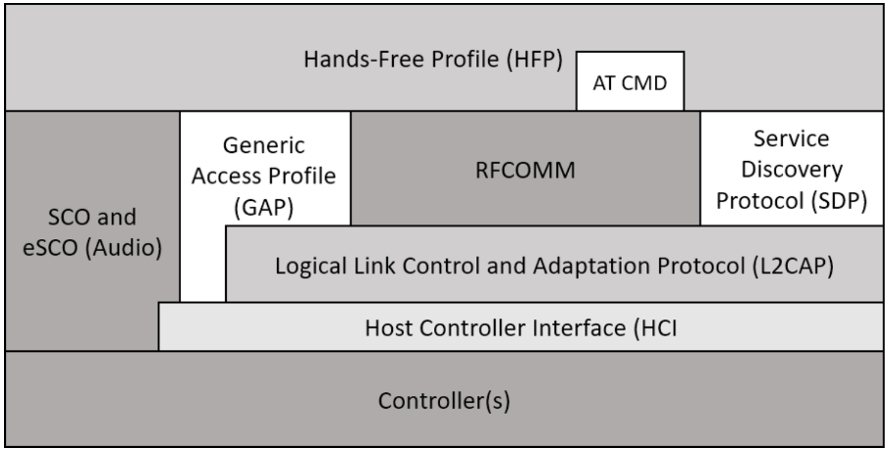

HFP是基于RFCOMM和GAP， 第6章和第7章有详细介绍

## Profile 大概

### protocol stack

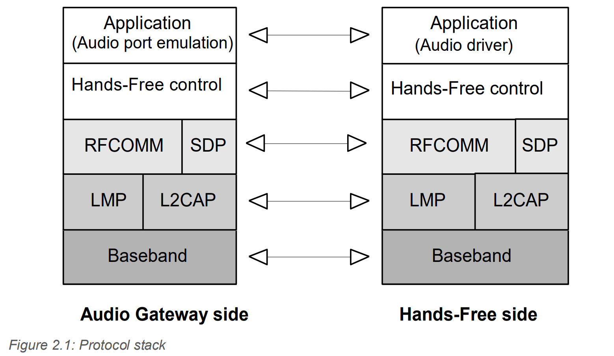

基带、LMP 和 L2CAP 是 OSI 第 1 层和第 2 层蓝牙协议。RFCOMM 是蓝牙串口仿真实体。SDP 是蓝牙服务发现协议。有关更多信息，请参阅 [1]
有关这些主题的详细信息。免提控制是负责免提单元特定控制信令的实体；此信令是基于 AT 命令。
尽管上面的模型中没有显示，但此配置文件假定免提控制具有访问权限到一些较低层的过程（例如，同步连接SCO建立）。
图 2.1 所示的音频端口仿真层是在 Audio 上仿真音频端口的实体
网关，音频驱动是免提单元中的驱动软件。

### 配置和角色

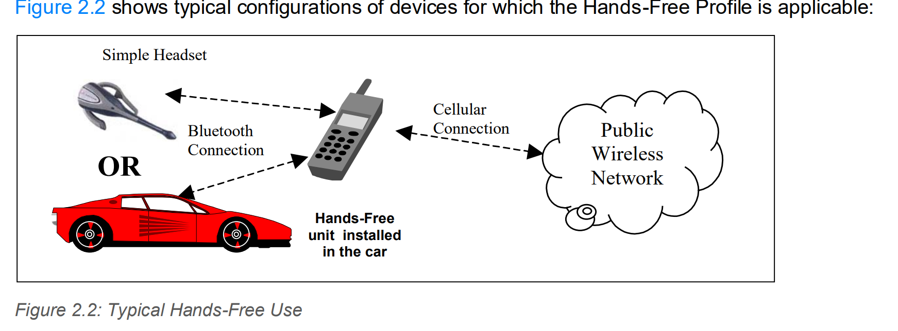

为此配置文件定义了以下角色：
音频网关（AG）- 这是用于输入和输出的音频网关设备。充当音频网关的典型设备是蜂窝电话
免提单元（HF）- 这是充当 AudioGateway 的远程音频输入和输出的设备机制。它还提供了一些远程控制手段。
本文档的其余部分使用这些术语来指定这些角色

### 用户配置和场景

以下规则适用于此配置文件:

a)配置文件规定了在音频网关和免提单元中激活“免提配置文件”时的强制性和可选特性。

B)配置文件规定使用CVSD(参见第2卷，B部分，[1]中的第9节)进行音频传输(通过蓝牙链接)。由此产生的音频是单音的，在正常情况下，其质量不会被感知到音频降级。

c)在免提单元和音频网关之间，每个服务级别连接一次只支持一个音频连接。

d)音频网关和免提单元都可以启动音频连接的建立和释放。音频连接建立后，同步连接上双向均存在有效的语音数据。由于只有终端用户才知道应该使用宽带语音还是超宽带语音，因此始终应该由终端用户建立与所需编解码的同步连接。

e)只要存在“音频连接”，就应该存在相关的“服务级别连接”。

f)“服务级别连接”的存在并不意味着存在“音频连接”。发布“服务水平连接”也应发布与之相关的任何现有“音频连接”。

###  profile  基础

如果在免提单元和音频网关之间还没有建立LMP链路，则应该在执行任何其他步骤之前建立LMP链路。
配置文件中没有固定的Central或Peripheral角色。音频网关和免提单元提供串口仿真。
对于串口仿真，使用RFCOMM(参见[4])。串口仿真用于将用户数据(包括调制解调器控制信号和AT命令)从免提单元传输到音频网关。
音频网关解析AT命令，并通过蓝牙串口连接将响应发送到免提设备。

### 一致性
本规范中的每个功能都应以指定的方式支持。本规范可能提供设计灵活性的选项，因为，例如，一些产品不实现规范中的每个部分。对于支持的每个实现选项，都应按指定的方式支持。

## 应用层

下面显示HFP的feature 选项

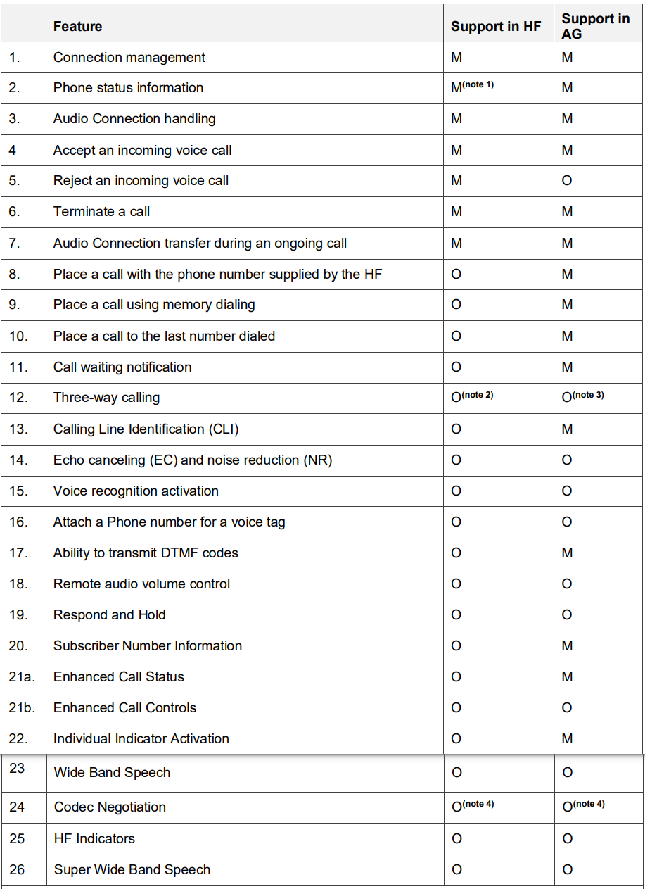

下面的图显示的是feature的流程图。

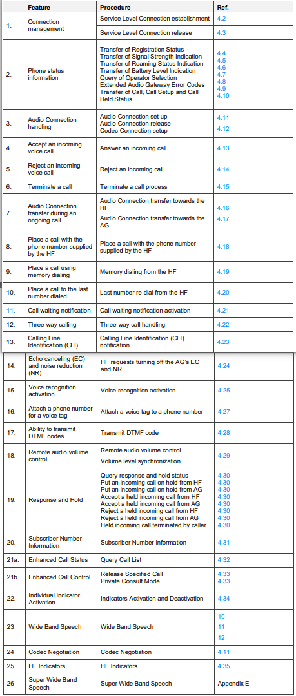

下图显示codec的值

下图显示codec的link 需求。

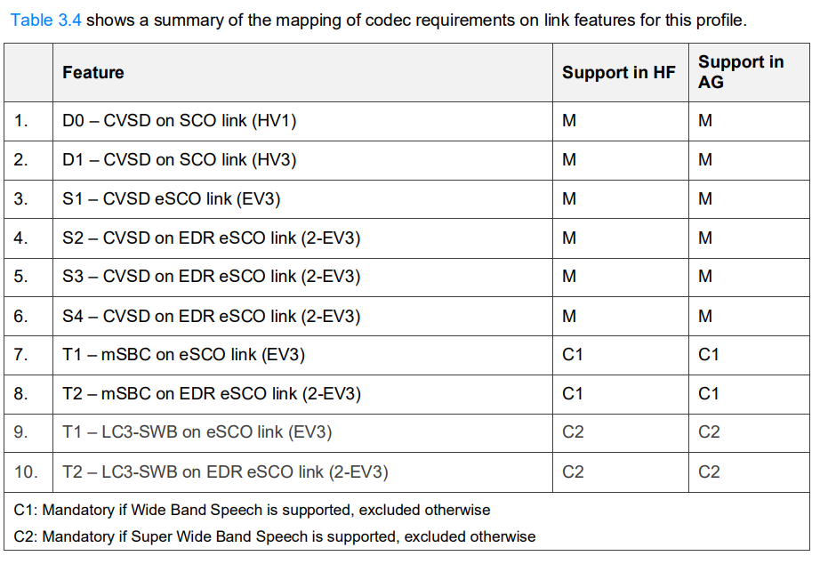

## hand-free 互操作性需求

### 导言
免提控制实体的互操作性要求完全包含在本节中。第4.2节至第4.29节规定了与应用程序层功能直接相关的程序的要求。
本节中列出的程序主要基于使用一组最少的AT命令作为控制协议，第5节指定这些AT命令及其结果代码。
第 4.2 节概述了如何处理服务级别连接，并特别说明了如何使用免提控制实体下面的层来建立和释放服务级别连接。

### 服务级连接的建立
在用户操作或内部事件发生时，HF或AG都可以启动服务级连接建立过程。
业务级连接的建立需要RFCOMM连接的存在，即HF和AG之间的RFCOMM数据链路信道。HF和AG均可启动 RFCOMM 连接建立，如果AG与HF之间没有 RFCOMM 会话，启动装置应首先启动RFCOMM .RFCOMM 连接的建立应按照通用访问配置文件(卷3，C部分，[11]第7.3节和第6.1.1节中描述的那样执行。

#### 初始化服务级连接
当RFCOMM连接建立后，应执行服务级别连接初始化过程。

##### 支持特性交换

首先，在初始化过程中，HF向AG发送AT+BRSF=<HF支持的特征>命令，通知AG, HF中支持的特征，并使用+BRSF结果码检索AG中支持的特征
##### 编解码器协商
其次，在初始化过程中，如果HF支持CodecNegotiation特性，则需要检查AG的AT+BRSF命令响应是否表示支持CodecNegotiation特性。如果HF和AG都支持编解码器协商功能，则HF应向AG发送AT+BAC=<HF可用编解码器>命令，通知AG HF.2中可用编解码器
#####  AG 发起者
在检索到AG中支持的特征后，HF应确定AG支持哪些指标，以及支持指标的顺序。这是因为，根据3GPP27.007规范[21，AG可以支持标准未提供的其他指标

免提配置文件，因为指标的顺序是具体实现的。HF使用AT+CIND=?Test命令检索有关支持的发起者及其排序的信
息。一旦HF有了必要的支持指标和订购信息，它应使用AT+CIND检索AG中指标的当前状态。读命令。在检索到AG中指示器的状态后，HF应通过发出AT+CMER命令启用AG中的“指示器状态更新”功能，AG应响应OK因此，当业务、呼叫或呼叫建立状态发生变化时，AG应发送带有相应指标值的+CIEV非请求结果码。当呼叫指标和呼叫建立指标都需要更新时，在发送呼叫建立指标+CIEV非请求结果码之前，应先发送呼叫建立指标+CIEV非请求结果码。HF应使用+CIEV代码提供的信息更新其内部和/或外部适应症。一旦启用“发起者状态更新”功能，主控板应保持该功能的启用状态，直到发出AT+CMER命令禁用该功能，或者主控板与HF之间的当前服务水平连接因任何原因被断开。HF在AG中开启“发起者状态更新”功能后，如果HF和AG都在支持的特性位图中设置了“呼叫等待和3路呼叫”位HF发出AT+CHLD=?test命令，获取AG中如何支持呼叫保持和多方业务的信息。HF不得出具AT+CHLD=?如果HF或AG不支持“三方呼叫”功能，请使用test命令。

##### HF 发起者

如果HF支持HF发起者特性，则应检查+BRSF响应，以确定AG是否也支持HF发起者特性。
如果HF和AG都支持HF发起者特性，则HF应向AG发送AT+BIND=<HF支持的HF发起者>命令，通知AG在HF中支持的发起者分配的编号。总检察长应回复OK。
在向AG提供其支持的HF发起者后，HF应发送AT+BIND=?请求由总商会支持的HF指标。AG应回复+BIND响应列出其支持的所有HF指标，然后是OK。
HF接收到AG支持的HF指标列表后，HF应发送AT+BIND?命令，确定哪些HF发起者已使能。AG应响应一个或多个+BIND响应。董事会以“OK”终止名单。(参见4.35.3节)。
从此以后，只要使能的HE发起者发生变化，HE就可以发送AT+BIEV命令，并带有相应的HF指标值
0
AG可以随时通过使用+BIND主动响应启用或禁用任何HF指示器的通知(参见第4.35.4节)。

##### 完成service level 链路建立

在下列任何一种情况下，HF应认为服务水平连接完全初始化，从而建立起来:

- HF成功检索到AG当前启用的HF指示器信息后，使用AT+BIND?命令，当且仅当HF支持的特性位图和AG支持的特性位图通过+BRSF命令交换时设置了“HF indicators”位。

- 当且仅当在HF和AG的SDP记录的SupportedFeatures属性中设置了“呼叫等待和3路呼叫”位时，HF成功地检索到关于AG如何使用AT+CHLD命令支持呼叫保持和多方业务的信息。当通过+交换的HF或AG支持的功能位图中没有设置“HF指示位时，此情况将适用。BRSF指挥部。
- 在 HF 成功地使用 AT+CMER 命令启用“指示符状态更新”后，当 HF 或 AG 的SDP 记录的 SupportedFeatures 属性中未设置“呼叫等待和三向呼叫”位，A当通过 +BRSF 命令交换的 HF 或 AG 的支持功能位图中未设置“HF 指示符”位时，应使用此情况。

- 如果HF从AG接收到当前正在进行的呼叫的指示，则HF可以通过查询AG的响应和保留状态来确定当前是否有一个未接通的呼叫被搁置(参见第4.30.1节)。
  在下列任何一种情况下，AG应认为服务级连接已完全初始化并由此建立:
- 当且仅当通过+BRSF命令在HF支持的特征位图和AG支持的特征位图中设置了“HF指示符”位时，AG使用+BIND成功地响应关于在AG上启用HF指示符的信息并响应OK。
- 当且仅当在SDP属性的支持特性中设置了“呼叫等待和三方呼叫”位时，AG成功地响应了使用+CHLD在AG中如何支持呼叫等待和多方服务的信息，并且应OK。AG.当通过+BRSF命令交换的HF或AG支持的功能位图中没有设置“HF指示”位时，此情况将适用。
- 在 AG 成功响应 AT+CMER命令(启用“指示符状态更新”功能)后，当 HF或 AG的受支持功能位图中未设置“呼叫等待和三方呼叫”位，且通过+BRSF命令交换的HF 或 AG 的支持功能位图中未设置为“HF 指示符”位时，应适用此情况。

##### service level 建立框图

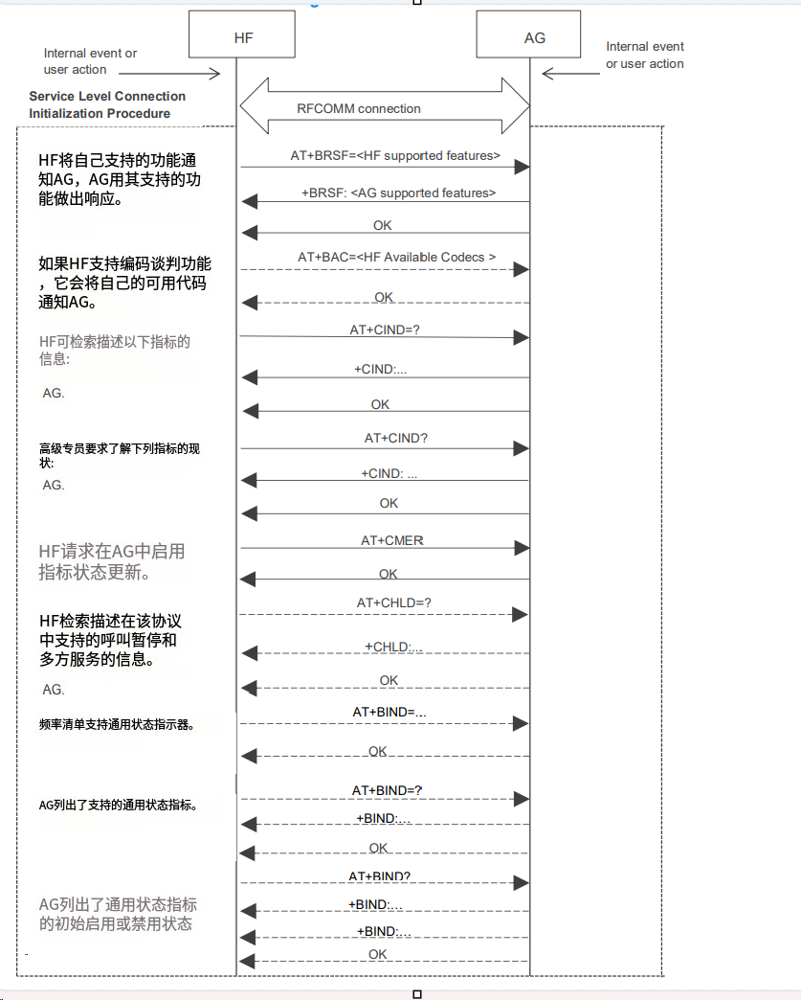

#### 链路恢复

本节讨论从HF恢复链路损坏。当蓝牙链路损耗时，HF可以与AG重新连接。
当服务级别连接因一端(使用“服务连接释放”如服务级别连接释放部分所述)而断开时，则两个设备(AG和HF)应在尝试重新建立服务级别连接之前等待用户的显式操作。
如果HF确定由于链路监视超时导致服务级别连接断开，则HF可以执行第4.2节中描述的“服务级别连接建立”程序，以建立到AG的新服务级别连接。在由于链路监视超时而导致链路丢失后，HF不应假定以前连接的服务级别连接状态(例如呼叫状态，服务状态)有效。

### service level connection 释放

该章节介绍释放服务级别连接的操作步骤。
服务级连接的断开应导致HF和AG之间相应的RFCOMM数据链路通道立即被移除。
此外，由于删除了服务级别连接，必须删除现有的音频连接。
删除L2CAP和链路层LMP是可选的。
已建立的服务级别连接应通过“服务级别连接移除”程序解除。

- HF或AG应根据明确的用户请求启动“服务水平连接释放”程序。
- 如果蓝牙功能在HF或AG中被禁用，则应启动“服务级别连接释放”程序。
- 如果第4.17节中所述的“向AG的音频连接传输”在AG正在进行的呼叫期间执行，则可以启动“服务级别连接释放”程序。
- 在服务级别连接被删除的情况下，一旦呼叫被删除，代理应尝试重新建立服务级别连接。
  作为此程序的先决条件，在总机和HF之间应存在持续的服务水平连接。

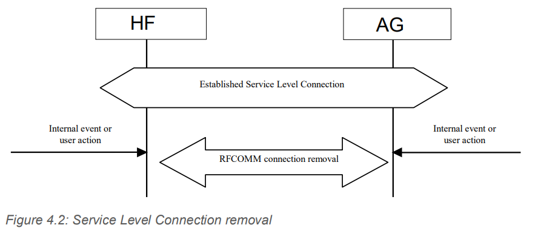

### 注册状态的传递

如第5节所述，AT+CMER命令可在AG中启用“注册状态更新”功能。
如第5.3节所述，AT+BIA命令允许HF停用/重新激活单个指示器。
当 CMER功能启用且 AT+BIA命令未禁用注册状态指示符时，AG 应在注册状态更改时发送 +CIEV 自愿结果代码，其中包含相应的服务指示符和值。HF 能够解释 +CIEV 结果代码提供的信息，以确定第 5.2 节中列出的服务可用性状态。
如果CMER功能被禁用或指示器被AT+BIA命令禁用，AG不得发送未经请求的结果代码。

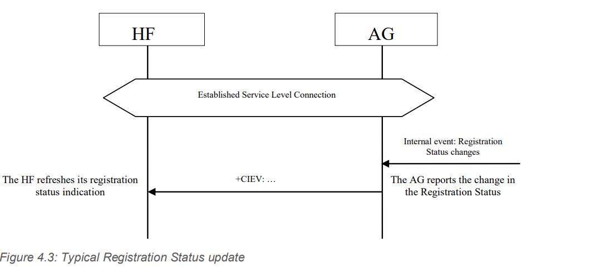

### 信号强度传递

如第5节所述，AT+CMER命令可在AG中启用“信号强度指示”功能。
如第5.3节所述，AT+BIA命令允许HF停用/重新激活单个指示器。
当 CMER功能启用且指示器未被 AT+BIA命令停用时，AG 应在信号强度发生变化时发送带有相应信号强度指示符和值的 +CIEV 自发结果代码。HF应能够解释 +CIEV结果代码提供的信息，以确定第 5.2 节所列的信号强度。
如果CMER功能被禁用或指示器被AT+BIA命令禁用，AG不得发送未经请求的结果代码。

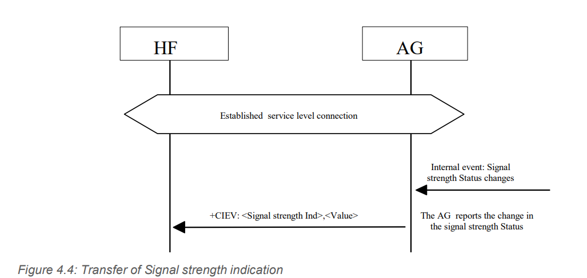

因此，当AG的信号强度发生变化时，AG应发送带有相应信号强度值的+CIEV主动结果代码。

###  漫游状态传递

如第5节所述，AT+CMER命令可在AG中启用“漫游状态指示”功能。
如第5.3节所述，AT+BIA命令允许HF停用/重新激活单个指示器。
当 CMER功能启用且指示器未被 AT+BIA 命令停用时，每当 AG 的漫游状态更改时AG 均应发送 +CIEV 自发结果代码，其中包含相应的漫游状态指示符和值。HF 应能够解释 +CIEV 结果代码提供的信息，以确定第5.2节中列出的漫游状态。
如果CMER功能被禁用或指示器被AT+BIA命令禁用，AG不得发送未经请求的结果代码。

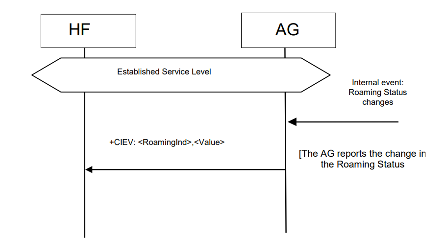

### AG端电池level传递

如第5节所述，AT+CMER命令使“电池电量指示”功能在AG.
如第5.3节所述，AT+BIA命令允许HF停用/重新激活单个指示器。
当 CMER功能启用且指示器未被 AT+BIA 命令停用时，每当 AG 的电池电量发生变化时，AG 均应发送带有相应电池电量指示符和值的 +CIEV 主动结果代码。HF 应能够解释 +CIEV 结果代码提供的信息，以确定第 5.2 节中列出的电池电量。
如果CMER功能被禁用或指示器被AT+BIA命令禁用，AG不得发送未经请求的结果代码。

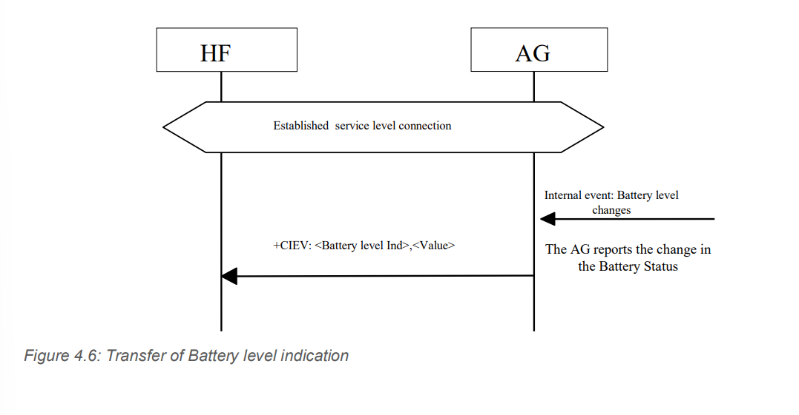

### 查询运算符选择

HF应执行此程序，以通过以下方式查明当前选定的网络运营商的名称:AG.
下列先决条件适用于此程序:
AG 和 HF 之间应保持持续的连接。如果不存在这种连接，AG 应使用第 4.2 节中描述的“服务级别连接设置”程序建立连接。

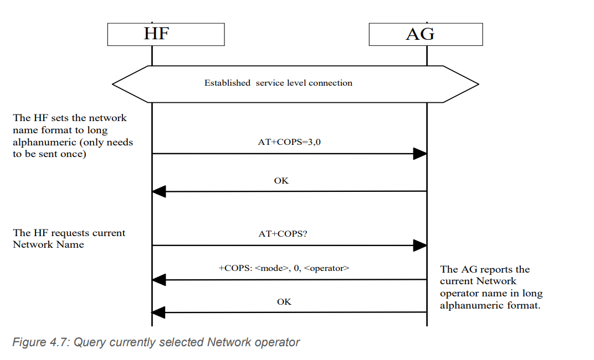

- HF 应发送 AT+COPS=3,0 命令，将名称格式设置为长字母数字。长字母数字定义为最多 16 个字符。第一个参数3的值表示此命令仅影响格式参数(第二个参数)。第二个参数 0是将格式设置为“长字母数字”所需的值。
- 在发生内部事件或用户启动的操作时，HF应发送AT+COPS?(Read)命令以查找当前选定的操作符。
- AG应以+COPS响应来响应，表示当前选择的操作符。如果没有选择操作符，则省略<格式>和<操作符>。

### 报告拓展的AG错误代码

HF应执行此过程以启用/禁用扩展音频网关错误结果代码AG.

下列先决条件适用于此程序:

- AG 和 HF 之间应保持持续连接。如果此连接不存在，则 AG 应使用第 4.2 节中描述的“服务级别连接设置”程序建立连接。

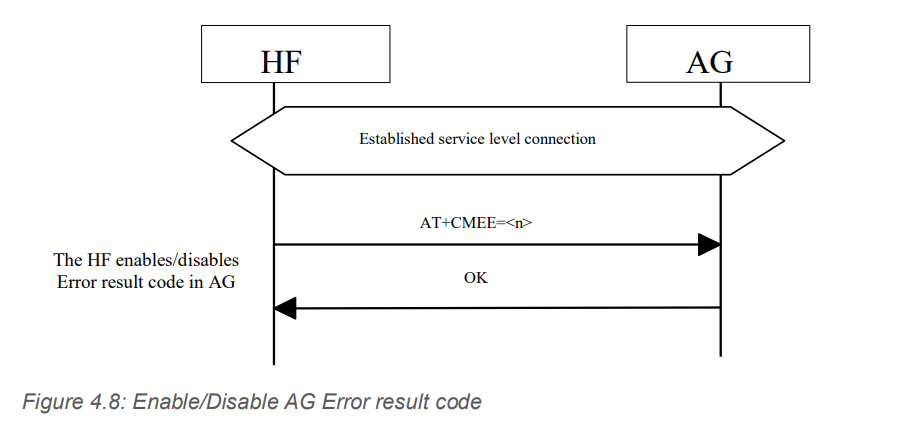

HF应发出AT+CMEE命令，以启用/禁用AG中的“扩展音频网关错误结果代码”参数<n>控制“扩展错误结果代码”通知的激活/停用。
当AG由于AT命令而出现与AG功能相关的错误时，AG应向HF发送+CMEERROR:<err>响应

### 电话的传输建立和hold状态

如第5节所述，AT+CMER命令可在AG中启用“呼叫状态指示符更新”功能。
第 5.3 节中描述的 AT+BIA 命令允许 HF 停用/重新启用单个指标。AT+BIA 命令对呼叫、呼叫设置或保留呼叫指标没有影响。这些指标不能使用 AT+BIA 指令停用。
当CMER功能启用时，每当 AG的当前呼叫状态更改时，AG应发送带有相应呼叫指示符和值的 +CIEV 非请求结果代码。同样，每当AG的当前建立呼叫状态更改时，应发送带有相应呼叫建立指示符和值的 +CIEV非请求结果代码。每当 AG的当前保持呼叫状态更改时，还应发送带有相应呼叫保持指示符和值的+CIEV 非请求结果代码
如果CMER功能被禁用，AG不应发送未经请求的结果代码。
HF应能够解释+CIEV结果代码所提供的信息，以确定第5.2节所列的呼叫状态。
此外，HF还可以解释由第5.2节所列的+CIEV结果代码提供的可选呼叫设置状态信息。
HF应能接受+CIEV结果代码所提供的未知指标，HF可忽略+CIEV的结果代码所提供的不可知指标。

注:虽然HF需要解析+CIEV结果代码，HF不需要为+CIEV的结果代码提供用户界面指示符。

#### 传输电话状态

当AG中的任何呼叫状态发生变化时，AG应执行此程序，以通知当前呼叫状态变化的HF。呼叫指示符的值为:
	0=没有通话(已通话或未通话)
	1=呼叫在场(活动或进行中)
下列先决条件适用于此程序:

- HF应已在AG中启用"指标状态更新"功能。
- AG和HF设备之间应存在服务级连接。

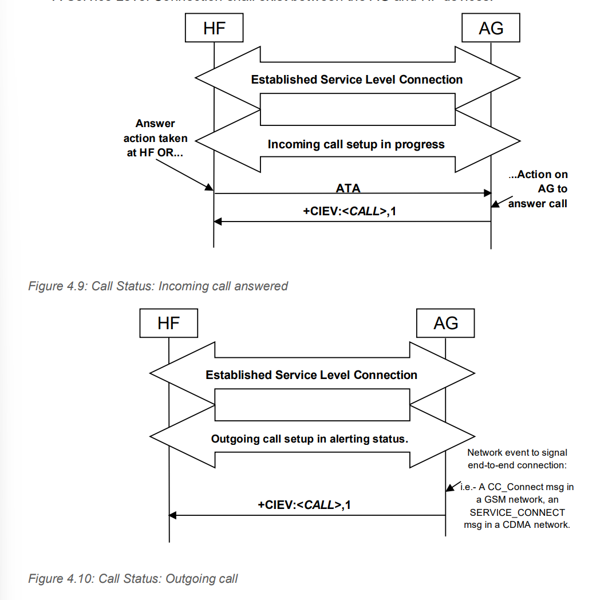

因此，在释放任何将 AG 置于 AG上不存在呼叫的状态的呼叫时，无论是通过 AG、网络事件还是 HF 的操作，AG均应发布带有呼叫指示符值为“0”的+CIEV 自愿结果代码。

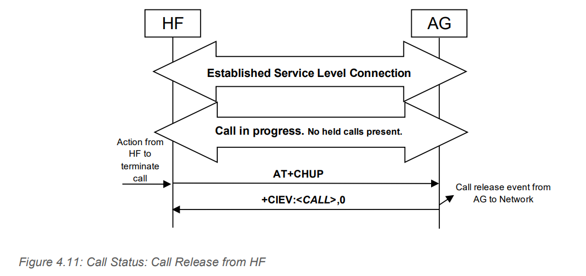

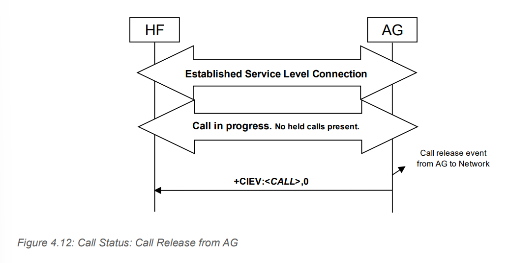

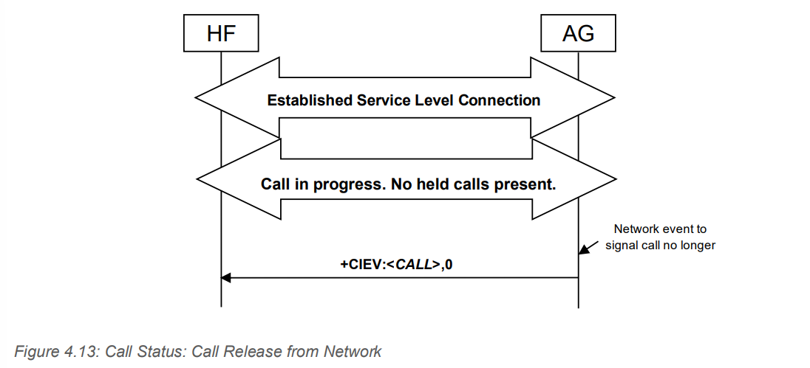

#### 通话建立状态的传输

当AG的呼叫设置状态发生变化时，AG应执行此程序，以通知当前呼叫设置状况变化的HF。呼叫设置指示符的值为:
	0=没有正在进行呼叫设置。
	1=正在进行来电设置。
	2=拨号状态下的出呼设置。
	3=处于报警状态的出线呼叫设置。
下列先决条件适用于此程序:

- HF已在AG中启用“指标状态更新”

- AG和HF设备之间应存在服务级连接。

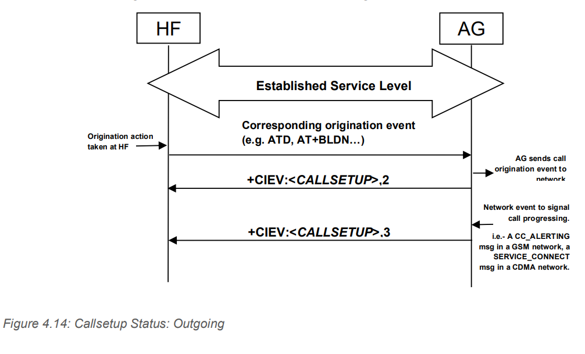

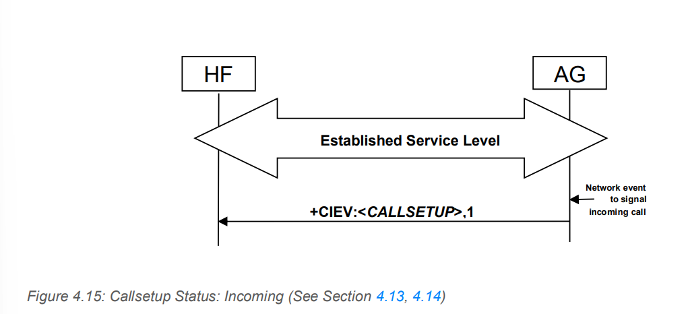

一旦通过任何适用的网络功能通知 AG，该呼叫已达到端到端连接状态，则应重置呼叫设置指示符，以指示没有正在进行的呼叫设置程序。

#### held 通话的状态的发起

当AG中任何被搁置呼叫的状态发生变化时，AG应执行此程序，以告知被搁置的呼叫状态的HF。呼叫搁置指示符的值为:
	0=没有通话
	1=呼叫被搁置或已激活/已停用呼叫被交换
	(AG既有活期呼叫，也有暂停呼叫)
	2=暂停通话，无主动通话
下列先决条件适用于此程序:

- HF应已启用AG中的呼叫状态指示器功能。

- AG和HF设备之间应存在服务级连接。

每当一个有效的呼叫被搁置，使得 AG现在有一个有效的和搁置的呼叫，或者通过 HF 的请求或 AG 的行动来交换有效的/搁置的呼叫位置，AG 应该发出 +CIEV 自愿结果代码，带有“1”的呼叫搁置指示符值。

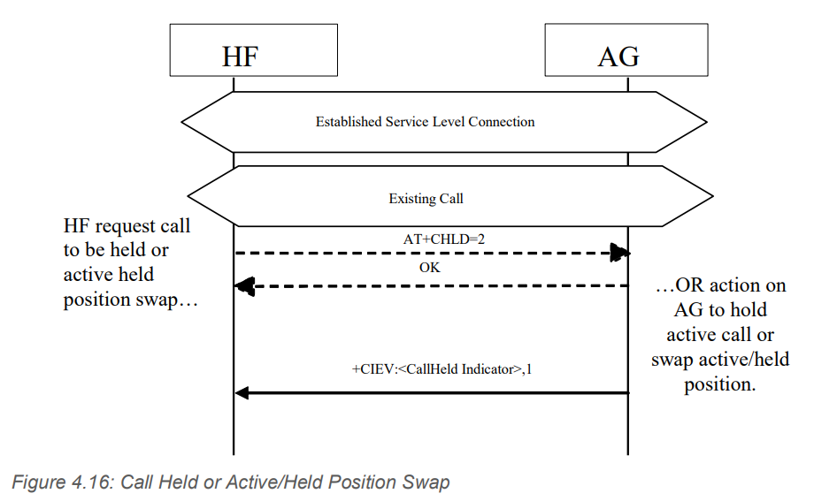

因此，在 HF、AG 或网络事件释放任何挂起的呼叫，或HF或 AG 采取行动检索挂起的呼叫时，AG 应发出 +CIEV 自愿结果代码，其中包含“0”的呼叫挂起指示符值。

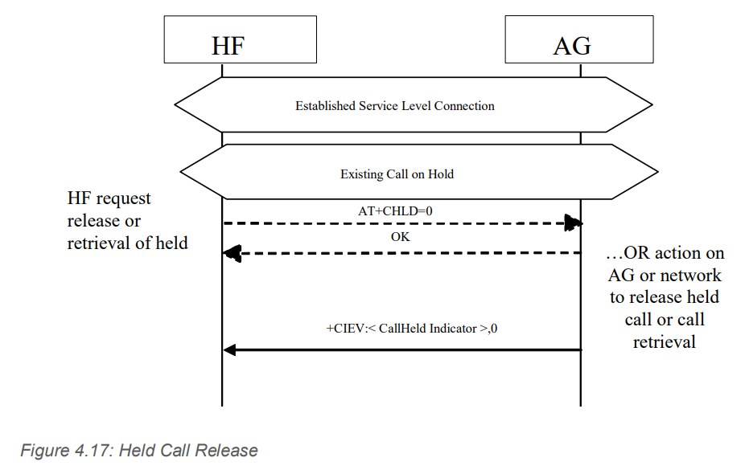

如果在主动呼叫被终止或单个主动呼叫暂停时，呼叫仍处于被搁置状态，AG应发出一个+CIEV 主动结果代码，其呼叫搁置指示值为“2”。

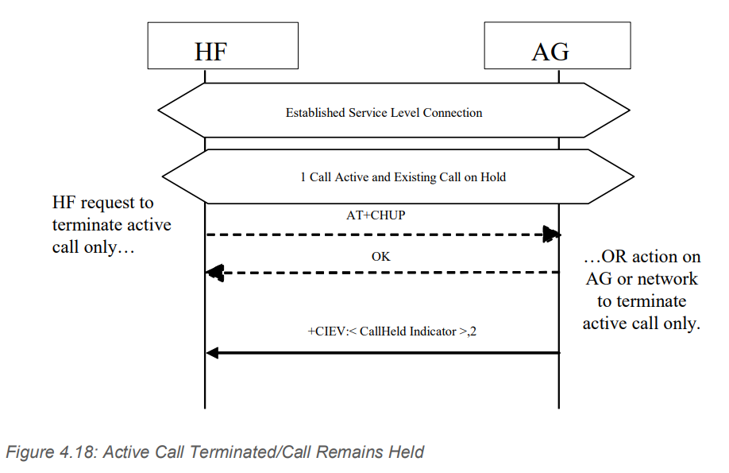

###  Audio链路建立

在用户操作或内部事件发生时，HF或AG可以根据需要启动音频连接的建立。HF或AG可能需要进一步执行内部操作，以内部路由、修改音频路径的采样率、帧和/或样本对齐。更正式地说，音频连接建立的要求是:

- HF应能够在呼叫过程中启动音频连接。

- 在没有呼叫时，HF可以启动音频连接。

- AG应能够在呼叫过程中启动音频连接。

- AG可以在没有呼叫时启动音频连接。

第4.12节进一步描述了来电音频处理。

第4.17节、第4.18节和第4.19节进一步描述了离线呼叫音频处理。

音频连接设置过程始终意味着建立同步连接，并且它始终与现有服务级连接相关联。

原则上，使用本节中描述的程序设置音频连接不一定与任何呼叫过程相关。

作为此过程的先决条件，AG和HF之间应存在持续的服务级别连接。如果不存在此连接则该过程的发起者应使用第 4.2 节中描述的正确程序自主建立服务级别连接。

发起者和接受者均应通知新音频连接的存在。

####  AG端建立音频链路

当AG要设置音频连接时，如果服务级别谈判表明双方都支持此功能，则AG应启动编解码连接设置流程

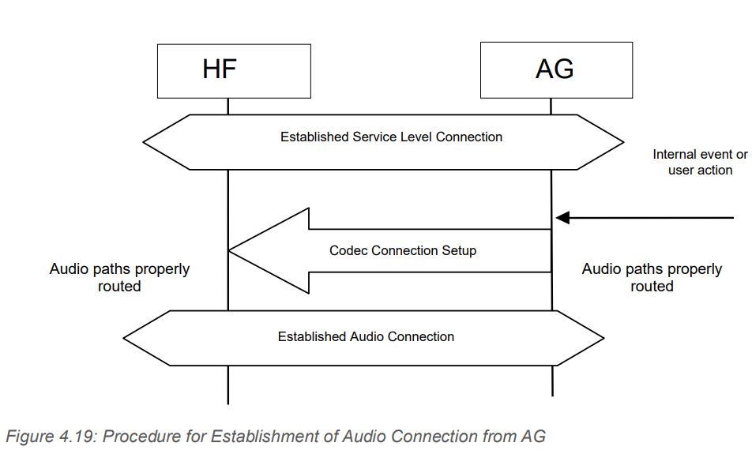

 #### HF端建立音频链路

对于所有 HF 发起的音频连接建立，如果双方支持编解码器协商功能，则 HF 应触发AG 建立编解码器连接。这是必要的，因为只有 AG 知道网络的编解码器选择和设置

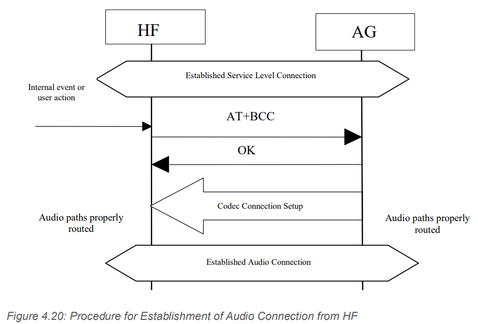

当HF触发建立编解码器连接时，它应向AG发送AT命令AT+BCC。如果AG将开始编解码器连接过程，则应回复OK，如果无法开始编解码器连接程序，则应回复ERROR。
在AG发送OK响应后，AG将启动编解码器连接设置过程。

本程序中建立的同步连接的类型和使用的设置取决于将通过该连接传输的媒体格式并可在第 4.2.1 和 6.7.2 节中找到。

####  codec 链路建立

在用户操作或内部事件发生时，HF或AG可以在必要时启动CodecConnection Setup 过程。HF或 AG 可能需要进一步内部操作，以内部路由、修改音频路径的采样率、帧和/或采样对齐。
虽然音频连接可以由 AG 或 HF触发，但编解码器连接和同步连接始终应由 AG建立(除非其中一个设备是遗留设备)。
只有当 HF 表示支持 Codec协商功能并在当前服务级别连接上发送至少一个 AT+BAC时，AG 才应启动 Codec连接。在选择用于Codec连接的编解码器时，AG 应使用最近收到的 AT+BAC 中提供的 HF 中可用的编解码器信息。
AG应在建立同步连接之前通知HF将使用哪种编解码器ID。如果在当前服务级别连接上已成功选择编解码器至少一次，则AG不需要通知HF使用哪种编解码器，除非下一个同步连接需要更改编解码器。如果在完成服务级别连接程序后，HF已发送了附加的AT+BAC，则可能需要重新选择编解码器。

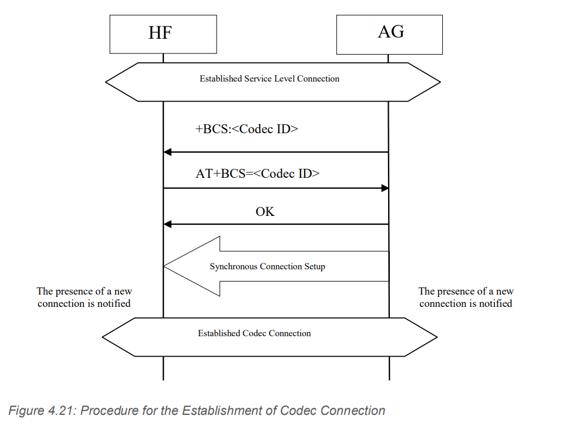

对输入的主动响应作出响应。ID应为AG应向HF发送一个+BCS=<codec ID>的主动响应。HF随后应以AT命令AT+BCS='<codec ID>>

ID 应该与支持的ID 想通。如果接收到的ID不可用，HF应使用AT+BAC回复其可用的编解码器。
如果AT+BCS中接收到的ID与发送的ID相同，AG应始终回复OK，否则应回复ERROR。如果在发送+BCS后没有收到AT+BCS，而是收到了AT+BAC，则程序应结束，但AG可以根据刚刚收到的AT+BAC中的信息重新选择编解码器ID，然后重新开始。
发送 OK 响应后，AG 应使用由 ID 确定的设置打开同步连接。HF 应在发送 AT 命令AT+BCS=<CodeclD>后立即准备好接受同步连接的建立。
同步连接建立后，建立编解码器连接。使用+BCS命令选择编解码器实际上也适用于此连接以及随后的编解码器连接。
如果在建立同步连接之前，编解码器连接建立程序失败，则应在建立任何同步连接之前重新启动编解码器连接建立过程。
如果根据所选编解码器所需的参数无法建立(e)SCO链路(例如，尽管已选择宽带或超宽带编解码器，但重传链路的基带协商失败)，AG应重新启动编解码器连接建立过程，以选择可以使用的编解码器。在 AG 放弃尝试建立编解码器连接之前，应使用强制窄带编解码器(CVSD)
本程序中建立的同步连接的字体设置取决于将通过音频连接传输的媒体格式，并可在第 6.7.2 节中找到。

#### 可用的codec 更新

在任何已建立的服务级别连接上，只要双方支持编解码器协商功能，HF就可以发送AT+BAC，以通知AG可用编解码器集中的动态变化，这并不要求关闭任何现有的音频连接。如果AG已经启动了编解码器连接设置程序，当所选编解码器不可用时，HF应发送AT+BAC以响应AG的+BCS主动响应。
如果最后一个选定的编解码器不可用，HE应向AG发送AT+BAC，以提示AG在下一次编解码器连接设置之前重新选择编解码器，AG应在开始建立同步连接之前主动发送+BCS响应。
强制窄带编解码器应始终在AT+BAC命令中列出，因此，AT+BAC不应为空列表;这提供了一个备用选项，始终可用于设置音频连接。
如果支持强制性的宽带编解码器或强制性的超宽带编解码器，则还应始终在 AT+BAC命令中列出，除非支持宽带语音或超宽带语音暂时不可用。如果 HF先前在其 AT+BAC指令中指示其支持宽带语音或超宽语音，则 AG应将其解释为分别暂时暂停宽带语音或超宽带音支持，直到 HF发送下一个 AT+BAC为止。如果AT+BAC命令中没有包含强制性的宽带语音编解码器，则不应包含其他宽带语音解码器。如果强制性的Super

AT+BAC命令中不包含宽带WBS，则不应包含其他SWBS

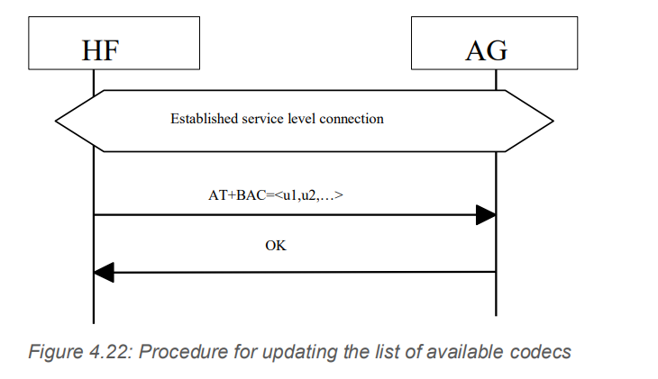

#### CODEC 重新协商

当 AG 建立音频连接时，它将根据最近 AT+BAC 命令交换期间传输的可用编解码器列表决定使用什么编解码器。然后，所选的蓝牙编解码器将应用于正在进行的同步连接无论 AG 或 HF 侧的连接是否发生变化。要更改所选蓝牙编解码器，AG 可以启动编解码器连接设置程序。通过此编解码器重新协商选择的新编解码器将应用于下一个音频连接。

### Audio 链路释放

在用户操作或内部事件发生时，HF或AG可以释放现有音频连接。更正式地说，音频连接释放的要求是:

- HF应能在通话过程中释放音频连接。
- 如果HF能够在没有呼叫的情况下建立音频连接，则HF应能够在没有进行呼叫的情况下释放音频连接。
  AG应能够在通话过程中释放音频连接。
- 如果AG能够在没有呼叫的情况下设置音频连接，则AG应能够在没有进行呼叫的情况下释放音频连接

作为此过程的先决条件，AG和HF之间应存在持续的音频连接。

音频连接的解除始终意味着其相应的同步连接的断开。

当音频连接被释放时，音频路径将被路由到AG。

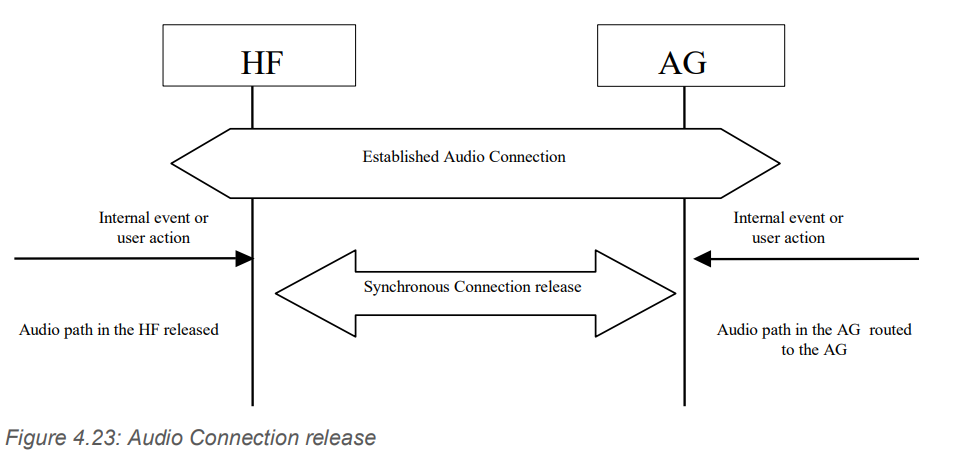

### 接听来电

收到来电后，AG应向HF发送一系列自发的 RING 响铃。只要呼叫接受尚未完成，或者直到来电因任何原因中断，RING 响铃应重复发送。
HF应响应RING产生局部响铃。
如果AG的SDP记录(或+BRSF消息)指示支持“带内铃声”，则AG应发送带内铃音，除非随后使用第4.13.4节定义的程序进行更改。AG可以在必要时中止接入呼叫，然后停止向HF发送RING响铃。

#### HF端接听来电 - 带响铃

可选地，AG可以提供带内铃声。
如图 4.24 所示，此情况的前提条件是 AG 和 HF 之间持续存在服务级别连接。如果不存在此连接，则 AG 应使用第 4.2 节中描述的正确程序自动建立服务级别连接。
如下图所示，如果使用带内环音，AG应通过建立的音频连接将环音发送到高频。

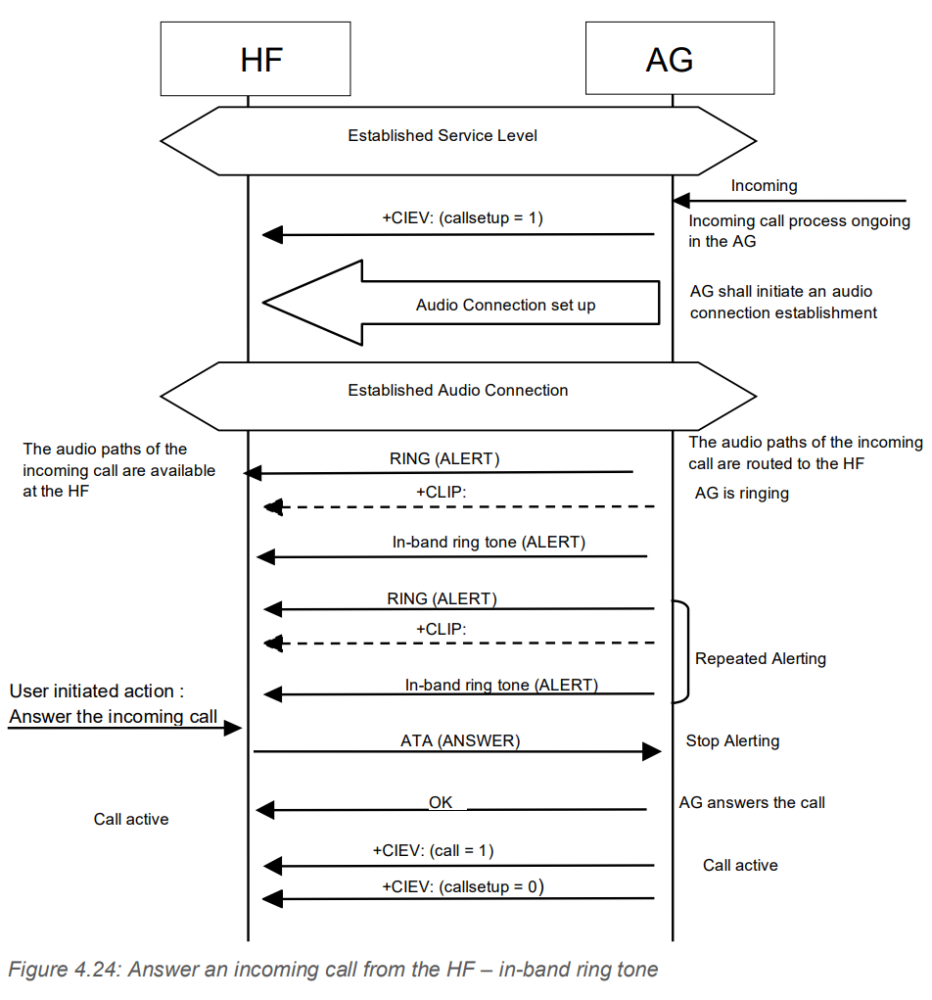

用户通过使用HF提供的适当手段来接受传入的语音呼叫。然后，HF应将ATA命令(见第5节)发送到AG。然后，AG应开始接受传入呼叫的程序。
如果正常的来电程序因任何原因中断，AG应发出+CIEV结果代码，其值表示(calsetup=0)，以通知HF此条件(另请参阅第4.14.2节)。

#### HF端接听来电- 不带响铃

作为前提条件，AG 和 HF 之间应存在持续的服务级别连接。如果不存在此连接，则AG 应使用第 4.2 节中描述的正确程序自动建立服务级别连接。
如下图所示，如果没有使用带内环音，也没有音频连接，AG应设置音频连接并在接听呼叫时将音频路径路由到HF。

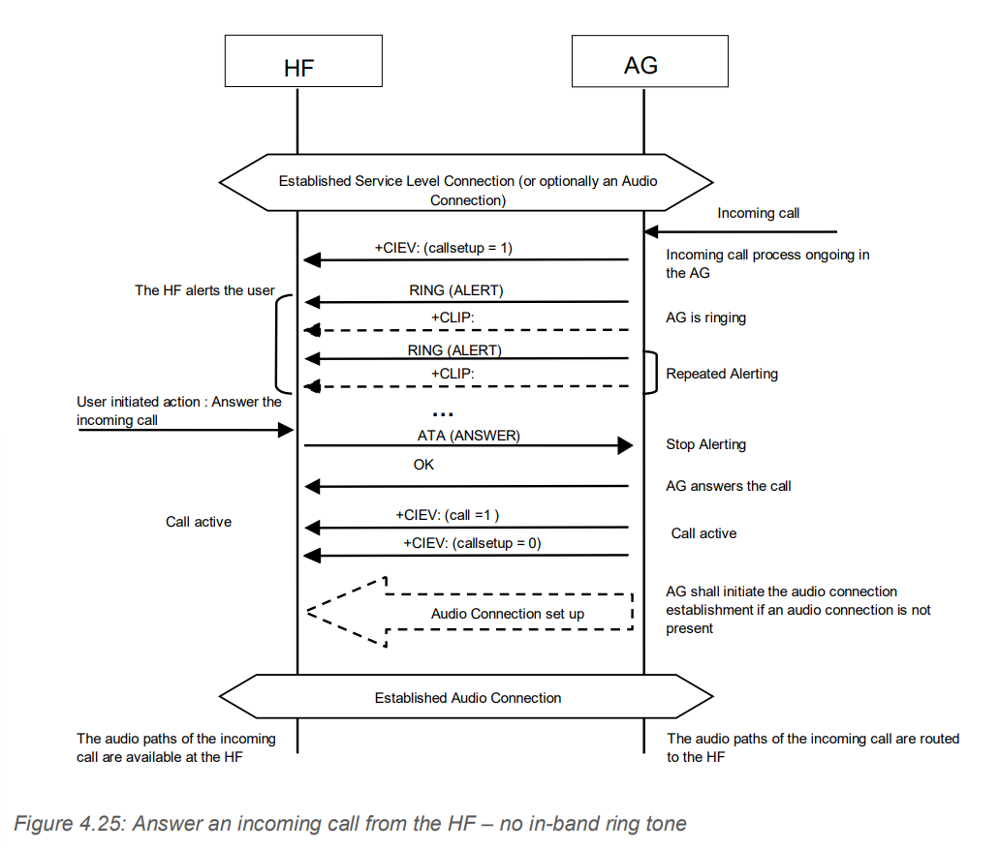

用户通过使用 HF 提供的适当手段来接受传入的语音呼叫。然后，HF 应将 ATA 命令见第5节)发送到 AG，如果不存在音频连接(参见第 4.10.1节)，则 AG 应开始接受传入呼叫并建立音频连接的过程。
如果正常的来电程序因任何原因中断，AG应发出+CIEV结果代码，其值表示(callsetup=0)，以通知HF此条件(另请参阅第4.14.2节)。

#### AG端接听来电

此程序适用下列先决条件:

- 作为此过程的先决条件，AG和HF之间应存在持续的服务级连接。
- AG应使用第4.13.1节和第4.13.2节所述的两种程序之一对HF进行响铃。
- HF应向用户发出响铃。

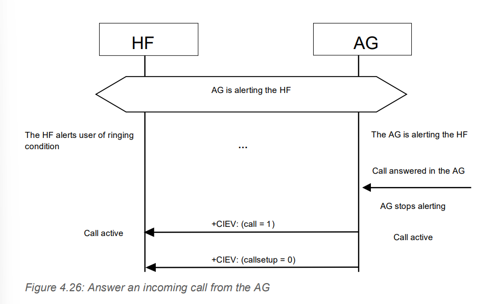

用户使用AG提供的适当手段接受来电呼叫。
如果正常的来电程序因任何原因中断，AG应发出+CIEV结果代码，其值表示(callsetup=0)，以通知HF此条件(另请参阅第4.14.2节)。

#### 改变带内响铃设置

SDP记录条目“In-band ringtone”的“Supported Features”记录(见表6.6)通知HF AG是否有能力发送In-band ringtone。如果AG有能力发送In-band ringtone，则应默认为发送In-band ringtone。AG随后可以更改此设置。
如果 AG 希望在正在进行的服务级别连接期间更改带内铃声设置，则应使用未请求的结果代码+BSIR(蓝牙设置带内铃声)通知 HF有关更改。有关详细信息，请参图4.27。
有关+BSIR非请求结果代码的更多信息，请参见第5节。在服务级连接期间，带内铃声设置可以多次更改。作为此过程的先决条件，AG 和 HF之间应存在持续的服务级别连接。如果不存在此连接，AG 应使用第 4.2 节中描述的正确程序自动建立服务级别连接。

### 拒绝来电

在接到呼叫时，AG应通过第4.13.1节和第4.13.2节所述的两种程序中的任一种通知HF。用户可通过HF或AG的用户操作来拒绝传入的呼叫过程，而不是接听呼叫。下面的章节将介绍这两个过程。

#### 由HF端拒绝来电

作为这一程序的先决条件，AG应使用第4.13.1节和第4.13.2节所述的两种程序之一向HF发出响铃。
用户通过使用免提单元上的用户界面拒绝传入的呼叫。然后，HF应向AG发送AT+CHUP命令(见第5节)。这可以在第4.13.1节和第4.13.2节所述程序的任何时间发生。
然后AG应停止向输入呼叫的HF发出响铃，并发送0K指示，随后是+CIEV结果代码，值指示(callsetup=0)

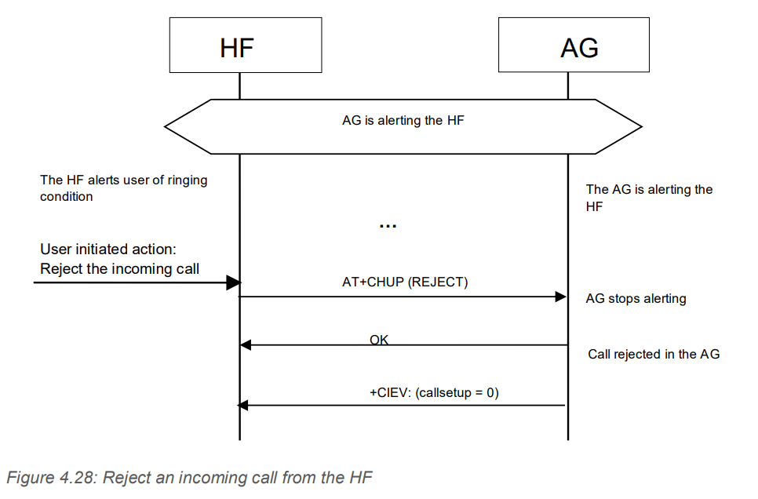

#### AG端拒绝来电

作为这一程序的先决条件，AG应使用第4.13.1节和第4.13.2节所述的两种程序之一向HF发出响铃

用户通过AG的用户界面拒绝传入呼叫。或者，AG中的传入呼喊过程可能由于任何其他原因而被中断。

因此，AG应发送带有值指示(callsetup=0)的+CIEV结果代码。HF应停止向用户发出响铃。
在第4.1.3节和第4.1.2节所述流程的任何时候，都可能发生这种情况。

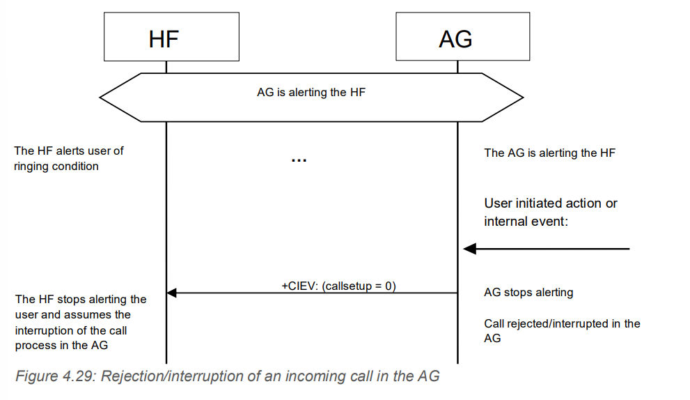

### 终止通话流程

通过用户操作或任何其他事件，可由HF或AG终止正在进行的呼叫过程。

此程序适用下列先决条件:

- AG 和 HF 之间应持续存在服务级别连接。如果不存在此连接，HF 应使用第 4.2 节中描述的正确程序自动建立服务级别连接。
- AG内部正在进行一项与通话有关的程序。

虽然呼叫终止过程不需要音频连接，但通常在HF和AG之间存在音频连接。

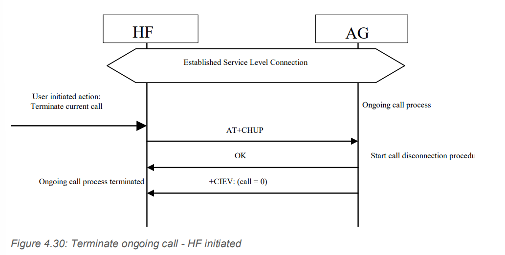

用户可以使用免提单元提供的任何手段终止正在进行的呼叫过程。HF应向AG发送AT+CH UP命令(见第5节)，然后AG应开始终止或中断当前呼叫过程的过程。然后，AG应发送OK指示，然后发送+CIEV结果代码，其值表示(呼叫=0)。
执行类似过程时，上面描述的AT+CHUP 命令也可用于中断正常的出线呼叫设置过程。

#### AG端终止通话

此程序适用下列先决条件:

- AG 和 HF 之间应持续存在服务级别连接。如果不存在此连接，AG 应使用第 4.2 节中描述的正确程序自动建立服务级别连接。
- AG正在进行与通话有关的程序。

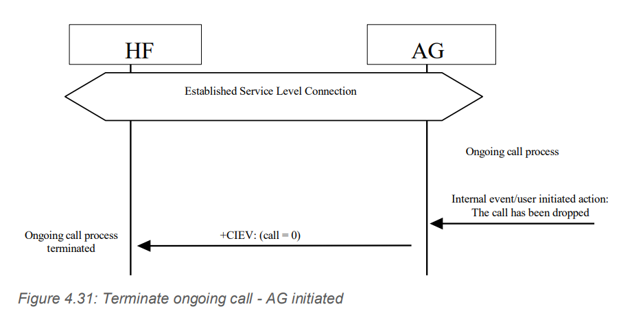

这一程序完全适用于AG正在进行的呼叫程序因任何原因中断的情况。
在这种情况下，AG应发送+CIEV结果代码，其值指示(调用=0)。

### HF端的audio 链接传输

可将正在进行的呼叫的音频路径从AG传输到HF。如第4.11节所述，此过程代表“设置音频连接过程的特定情况。
从AG到HF的呼叫连接传输是由用户在HF上或在HF上操作而启动的。
AG.这将导致HF或AG分别启动“设置音频连接”程序，将当前呼叫的音频路径路由到HF。
只有在 HF 和 AG 之间没有当前音频连接的情况下才能使用此过程。实际上，如果已经存在音频连接，则不需要此过程，因为假定 AG 的音频路径已经路由到 HF。
此程序适用下列先决条件:

- AG 和 HF 之间应存在持续的服务级别连接。如果不存在此连接，则“音频连接传输到 HF”过程的发起者应使用第 4.2 节中描述的正确程序自动建立服务级别连接。
- 正在进行的呼叫存在于AG中，音频路径被路由到AG设备。

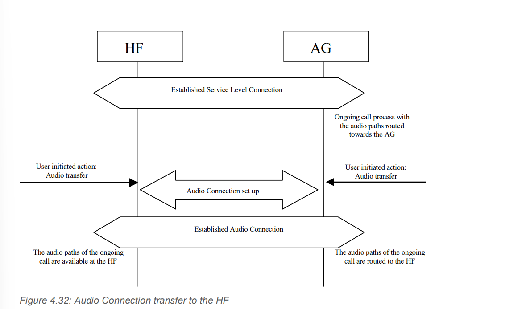

### 向AG端的audio 链路传输

可将正在进行的呼叫的音频路径从HF传输到AG。此过程代表“音频连接释放”过程的特定情况，如第4.12节所述
从 HF 到 AG 的呼叫连接转移是由 HF 中的用户操作或由于 AG 中的内部事件或用户操作引起的。这会导致 HF 或 AG 分别启动“音频连接释放”程序，保留当前呼叫并将其音频路径路由到 AG。
如果作为 HF 发起的“音频连接传输到 AG”程序的结果，现有服务级别连接被AG 自动删除，则当前呼叫结束后，AG应尝试重新建立服务级别连接。
作为此过程的先决条件，AG中应存在一个正在进行的呼叫过程。正在进行的呼叫的音频路径应通过AG和HF之间建立的音频连接在HF中可用。

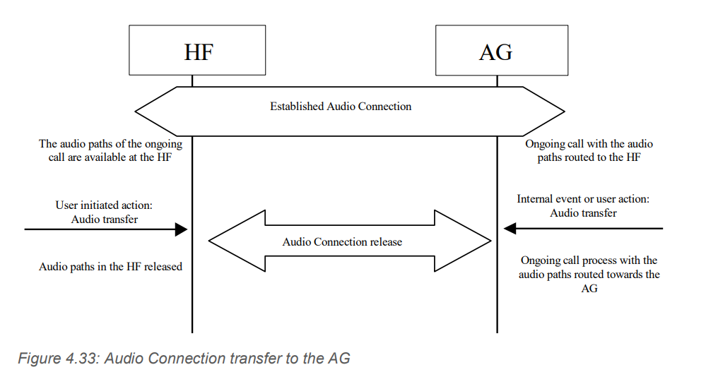

### 使用HF端提供的电话号码打电话

HF可以通过向AG提供电话号码来启动出站语音呼叫。要开始呼叫设置，HF应启动服务级别连接建立(如果需要)并向AG发送适当的ATDdd..dd;命令。然后，AG应使用从HF接收到的电话号码开始呼叫建立过程，并发出+CIEV结果代码，其值为(callsetup=2)，以通知HF呼叫设置已成功启动。
有关ATDdd...dd;命令的详细信息，请参见第5节。
作为此过程的前提条件，AG和HF之间应存在持续的服务水平连接。如果不存在此连接HF应使用第 4.2 节中描述的正确程序自动建立服务水平连接。
如果音频连接没有建立，AG应建立适当的音频连接，并在正在进行的呼叫设置程序开始之后立即将出站呼叫的音频路径路由到HF。
一旦 AG 被告知远程方已发出响铃，则 AG 应发出 +CIEV结果代码，其值表示(callsetup=3)。如果无线网络不向 AG 提供远程方发出响铃的指示，则AG可能不发送此指示。
在呼叫连接时，AG应发送+CIEV结果代码，其值指示(呼叫=1)。如果正常的呼出呼叫建立程序因任何原因中断，AG应发出+CIEV结果代码，其值表示(callsetup=0)，以通知HF这种情况(见第4.15.2节)
如果 AG 支持“三方通话”功能，并且在 AG 中正在进行通话，则执行此操作将导致向第三方发起新的通话，当前正在进行的通话将被挂起。有关如何处理多方通话的详细信息，请参阅第 4.22.2
节。

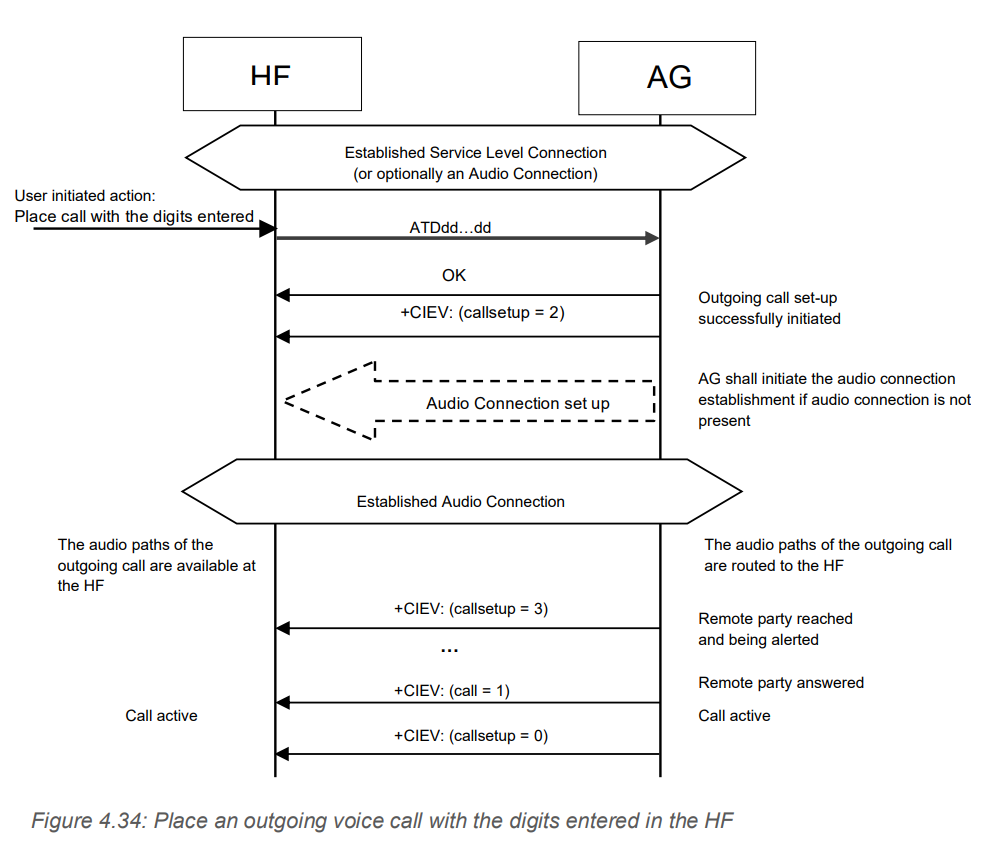

### HF端的内存中拨号

HF可以使用AG的存储拨号功能发起外出语音呼叫。要开始呼叫设置，HF应发起服务级别连接建立(如果需要)并向AG发送ATD>Nan.;命令。然后，AG应使用Nan.;给出的AG存储位置中存储的电话号码开始呼叫建立过程，，并发出+CIEV结果代码，其值为(call setup=2)，以通知HF已成功发起呼叫设置。
有关ATD>nn...命令的更多信息，请参见第5节。
作为此过程的前提条件，AG和HF之间应存在持续的服务水平连接。如果不存在此连接HF应使用第 4.2 节中描述的正确程序自动建立服务水平连接。
如果音频连接没有建立，AG应建立适当的音频连接，并在正在进行的呼叫设置程序开始之后立即将出站呼叫的音频路径路由到HF。
一旦远程方开始响铃，AG应发出+CIEV结果代码，其值指示(callset=3)
在呼叫连接时，AG应发送+CIEV结果代码，其值指示(呼叫=1)。
如果正常的呼出呼叫建立程序因任何原因中断，AG应发出+CIEV结果代码，其值表示(call setup=0)，以通知HF这种情况(见第4.15.2节)。

如果 AG 支持“三方通话”功能，并且在 AG 中正在进行通话，则执行此操作将导致向第三方发起新的通话，当前正在进行的通话将被挂起。有关如何处理多方通话的详细信息，请参阅第4.22.2ザ。
如果没有为HF给出的存储位置存储数字，AG应以ERROR响应。

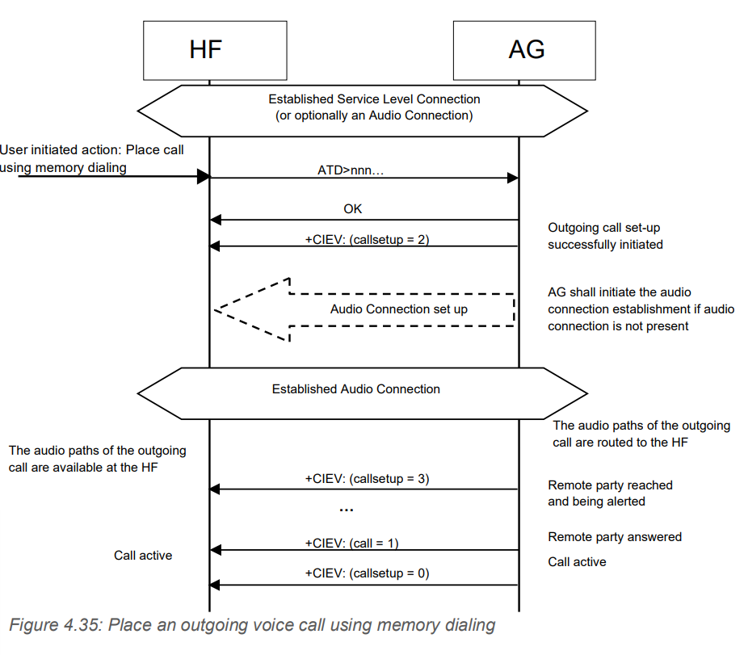

### HF端拨打上一次的电话号码

HF可以通过回忆AG拨出的最后一个号码来发起外出语音呼叫。要开始呼叫设置，HF应发起服务级别连接建立(如果需要)并向AG发送AT+BLDN命令。然后，AG应使用AG拨出的最后一个电话号码开始呼叫建立过程，并发出+CIEV结果代码，其值为(callsetup=2)，以通知HF呼叫设置已成功启动。
有关AT+BLDN 命令的详细信息，请参见第5节。
作为此过程的前提条件，AG和HF之间应存在持续的服务水平连接。如果不存在此连接HF应使用第 4.2 节中描述的正确程序自动建立服务水平连接。
如果音频连接没有建立，AG应建立适当的音频连接，并在正在进行的呼叫设置程开始之后立即将出站呼叫的音频路径路由到HF。
一旦远程方开始响铃，AG应发出+CIEV结果代码，其值指示(callset=3)。

在呼叫连接时，AG应发送+CIEV结果代码，其值指示(呼叫=1)如果正常的呼出呼叫建立程序因任何原因中断，AG应发出+CIEV结果代码，其值表示(callsetup=0)，以通知HF这种情况(见第4.15.2节)。
如果 AG 支持“三方通话”功能，并且在 AG 中正在进行通话，则执行此操作将导致向第三方发起新的通话，当前正在进行的通话将被挂起。有关如何处理多方通话的详细信息，请参阅第 4.22.2节。
如果没有为HF给出的存储位置存储数字，AG应以ERROR响应。

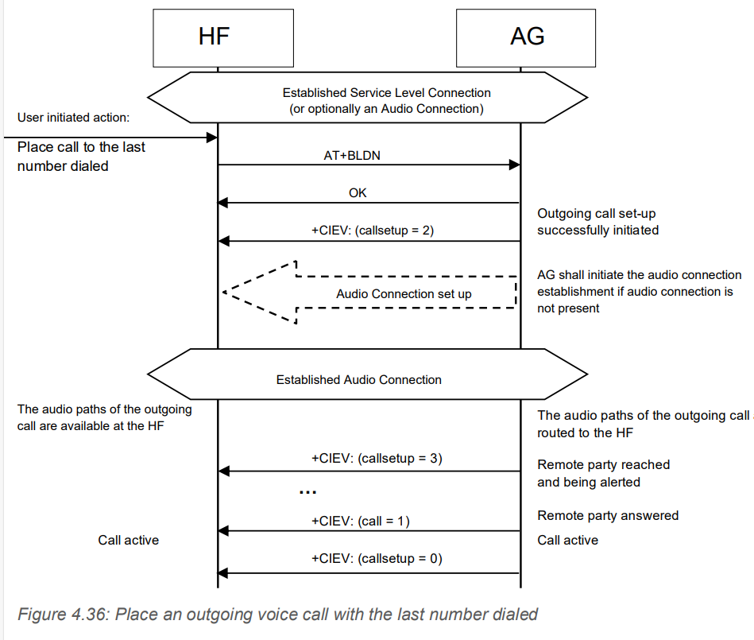

### 呼叫等待通知激活

HF可以向AG发送AT+CCWA命令，以启用“呼叫等待通知”功能。一旦“呼叫等待通知”被启用，当正在进行的呼叫期间有来电等待时，AG应向HF发送相应的+CCWA非请求结果代码。始终假定“呼叫等待”服务已在网络中激活。
一旦HF发出AT+CCWA命令，AG应回复OK。然后，它应保持“呼叫等待通知”处于活动状态，直到向HF发出AT+CCW A命令以禁用“呼叫等待通知”，或者AG和HF之间的当前服务级别连接因任何原因被丢弃。
有关AT+CCWA命令的更多信息，请参见第5节。

作为此过程的前提条件，AG和HF之间应存在持续的服务水平连接。如果不存在此连接，HF应使用第 4.2 节中描述的正确程序自动建立服务水平连接。

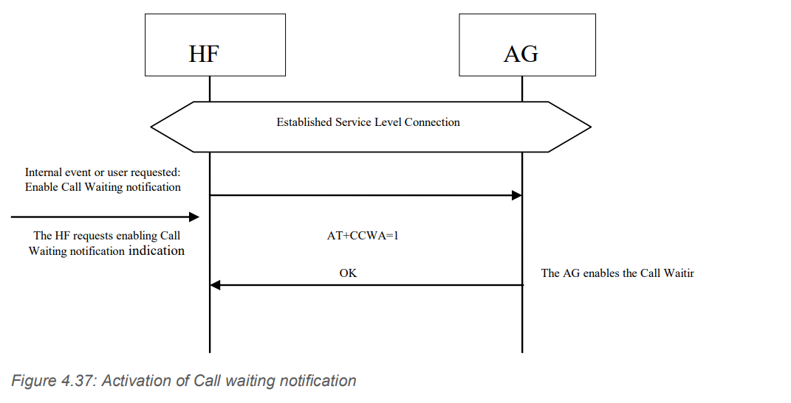

### 三方通话处理

对多个并发呼叫的适当管理应通过执行下述程序来完成:[2]但具有本规范中所述的某些限制。有关详细信息请参见第5节。
HF设备不能总是假设网络中提供“呼叫保持和/或多方”服务。如果 AG 确定由于网络无法支持该功能或缺少用户订阅，HF设备请求的操作无法执行，则 AG应返回 +CME错误。
有两个+CME ERROR代码用于指示HF的网络相关故障原因:
30-没有网络服务。表示由于网络限制，AT+CHLD命令无法执行。
31-网络超时。表示由于网络问题，AT+CHLD命令无法执行。
当用户处理多个并发呼叫时，HF应发出相应的AT+CHLD命令作为用户操般来说，作的结果。该命令允许控制多个并发呼叫，并提供保持呼叫、释放呼叫、在两个呼叫之间切换以及将呼叫添加到多方会议的手段。
当支持此功能时，HF和AG只被要求执行“基本三通呼叫”命令AT+CHLD=1和2。
本节包括两个案例。在第一个案例中，第三方呼叫在 AG 中接收，并通过呼叫等待通知发送到 HF。在第二个案例中，第三方呼叫从 HF放置。有关AT+CHLD命令的更多信息，请参见第5节。这些流程适用以下先决条件:

- 作为此过程的先决条件，AG和HF之间应存在持续的服务级别连接。如果不存在此连接则该过程的发起者应使用第 4.2 节中描述的正确程序自主建立服务级别连接。
- AG的持续呼叫应存在。

#### 三方通话呼叫等待通知

除了前面所述的两个先决条件外，AG中已启用向HF发出呼叫等待通知(即已执行第4.21节所述的
程序)。

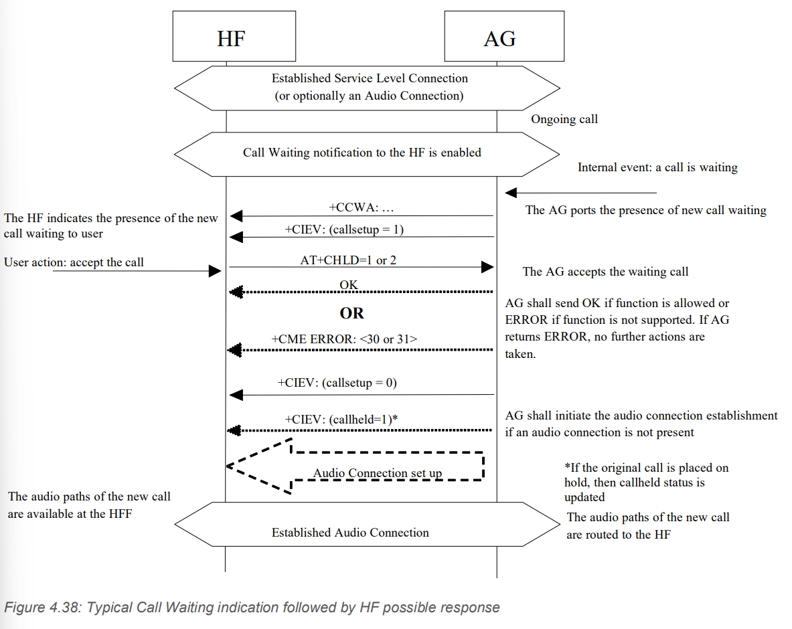

如果AG接收到第三方呼叫，应向HF发送呼叫等待通知+CCWA和+CIEV结果代码，并标明值(callsetup=1)。
如果用户拒绝HF的呼叫，HF应将参数为0的AT+CHLD命令发送到AG.然后AG应拒绝呼叫并以OK响应，并发出带有值指示的+CIEV结果代码(callsetup=0)。
如果用户在HF接听电话，则HF应向AG发送带有参数1或2的AT+CHLD。HF不能通过单个AT+CHLD命令将等待呼叫添加为电话会议;但如果需要，HF可以通过首先发出 AT+CHLD=2命令，然后发出 AT+CHLD=3 命令。AG 随后将接受等待中的呼叫，并以 OK 响应，并发出 +CI EV结果代码，其值表示(callsetup=0)。如果 HF选择发送AT+CHLD=2(将原始呼叫挂起)，则AG 应当发送 +CIEV结果码，其值表示已挂起的呼叫(callheld=1)C
可选地，HF随后可以使用AT+CHLD命令来更改被保持呼叫和活动呼叫的状态。
如果正常的来电程序因任何原因中断，AG应发出+CIEV结果代码，其值表示(callsetup=0)，以通知HF这种情况(见第4.14.2节)。

#### 三方通话由HF发起的三方通话

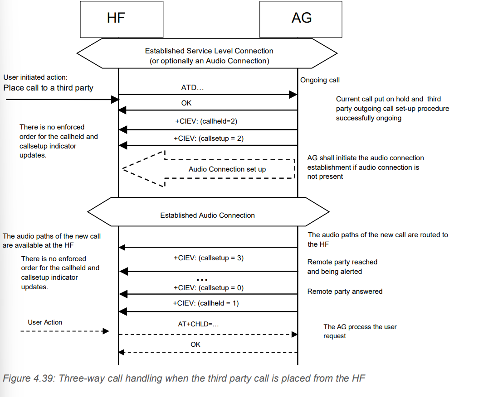

如果使用 ATD 命令从 HF 发起第三方呼叫，AG 应向 HF 发送 OK指示和两个 +CIEV 结果代码，一个表示(call setup=2)，另一个表示(callheld=2)。允许 AG 以任意顺序发送这两个 +CIEV 结果码，因为 AG 中事件的时间安排可能因实现和网络类型而异。如果接通了远程方并发出警报，AG应发出+CIEV结果，其值为(callsetup=3)。如果无线网络不提供向远程方发出警报的指示的AG，AG就不能发送该指示。
如果远程方接听电话，AG应发出+CIEV结果代码，其值表示(callsetup=0)和(callheld=1)。与以前一样，这两个+CIEV结果代码没有强制顺序。

可选地，HF 可以使用 AT+CHLD 命令来更改保留和活动呼叫的状态。如果 AT+CHLD导致保留呼叫状态发生变化，AG 应该使用 +CIEV结果代码提供状态指示，其中值表示呼叫保留状态(callheld=<0,1,2>)
如果正常呼出程序因任何原因中断，AG应发出+CIEV结果代码，其值表示(callsetup=0)，以通知HF这种情况(见第4.15.2节)。然后，AG应更新callheld状态以指示原始(held)呼叫状态的变化，基于以下两种情况之一:
·AG可以选择暂停原有呼叫。在这种情况下，AG应发出带值(呼叫暂停=2)的+CIEV结果代
码。
或者，AG可以自主地检索被保持的呼叫，从而改变状态并发送+CIEV指示符(呼叫被保持为0)。
无论哪种情况，+CIEV 响应代码(呼叫=1)应保持不变。

### 呼叫线路识别(CLI) 提醒

可选地，HF 可以使用 AT+CHLD 命令来更改保留和活动呼叫的状态。如果 AT+CHLD导致保留呼叫状态发生变化，AG 应该使用 +CIEV结果代码提供状态指示，其中值表示呼叫保留状态(callheld=<0,1,2>)
如果正常呼出程序因任何原因中断，AG应发出+CIEV结果代码，其值表示(callsetup=0)，以通知HF这种情况(见第4.15.2节)。然后，AG应更新callheld状态以指示原始(held)呼叫状态的变化，基于以下两种情况之一:
·AG可以选择暂停原有呼叫。在这种情况下，AG应发出带值(呼叫暂停=2)的+CIEV结果代
码。
或者，AG可以自主地检索被保持的呼叫，从而改变状态并发送+CIEV指示符(呼叫被保持为0)。
无论哪种情况，+CIEV 响应代码(呼叫=1)应保持不变。

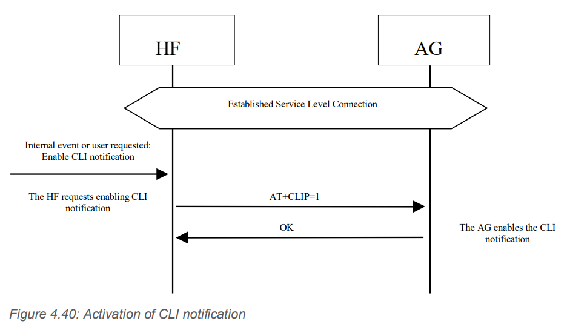

### HF 请求关闭AG端的EC和NR

HF可通过AT+NREC命令禁用AG中驻留的回声消除(EC)和噪声降低功能(NR)。
如果HF支持嵌入式EC和/或NR功能，则应支持本节程序中描述的AT+NREC命令。此外如果HF启用了这些功能，则应在HF和AG之间建立任何音频连接之前执行此程序。
默认情况下，如果 AG 支持自己的嵌入式回声抵消和/或降噪功能，则应激活这些功能，直到接收到 AT+NREC命令。从那时起，直到AG和 HF之间的当前服务级别连接因任何原因被丢弃，AG 每次使用 HF和 AG 之间的音频连接进行音频路由时，都应禁用这些功能。
如果AG不支持任何回声消除和噪声降低功能，则在接收AT+NREC命令时，AG应以ERROR指示符响应。
有关AT+NREC命令的详细信息，请参见第5节。
作为此过程的前提条件，AG和HF之间应存在持续的服务水平连接。如果不存在此连接，HF应使用第 4.2 节中描述的正确程序自动建立服务水平连接。

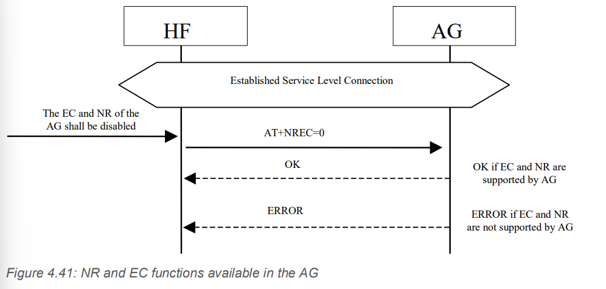

HF发送AT+NREC命令，AG以OK或ERROR指示进行确认。

### 语音识别(VR)激活/增强语音识别(EVR)激活

HF可以通过AT+BVRA命令或AG自动激活/停用AG中的语音识别功能。增强型语音识别状态和语音识别文本功能增强了AT+BVRA命令的使用。第5.3节对此进行了详细介绍。除了音频路由和语音识别激活功能外，语音识别功能的其余部分取决于实现。
每当AG支持语音识别功能时，它应支持本节程序中描述的AT+BVRA命令

如果HF发出AT+BVRA命令，AG如果支持语音识别，则应回复OK结果代码，然后启动到HF的音频连接(如果音频连接不存在)并开始语音输入序列。
如果AG不支持语音识别，AG应以ERROR指示响应。
当从 AG 激活语音识别功能时，它应通过 +BVRA:1自发结果代码向 HF 发出通知，AG 应启动与 HF的音频连接(如果尚未存在音频连接)并开始语音输入序列。
一旦激活，根据语音识别实施方式，AG随后应保持语音识别功能处于启用状态:

- 对于实施所支持的时间长度(“瞬时启动”语音识别实施)。在这种情况下AG应通过发送+BVRA:0的主动结果代码通知HF。
- 或者直到AT+BVRA命令被发出以禁用来自HF的语音识别。
- 或直到AG与HF之间的当前服务级连接因任何原因而中断。

有关AT+BVRA命令和+BVRA结果代码的更多信息，请参见第5节。
如果支持增强语音识别状态或语音识别文本功能，则AT+BVRA命令将扩展为值2。只有当AG和HF都支持增强语音识别状态功能时，才应使用值2。它表示当音频连接首次建立时，HF已准备好接收音频。
在正在进行的VR(语音识别)会话期间，HF可以发送此值，以终止AG的音频输出(如果有的话)并为AG准备新的音频输入。
  +BVRA命令的语法扩展为<vrecstate>和<text Representation>。例如，5(b101)的<vrecstate>表示AG正在同时听取音频输入和处理

在文本表示方面相互建立的示例:
1.+BVRA:1，1，12AA，1，1，"Message 1 from Janina":一个新的文本从AG发送到HF。

AG现在有文本:
12AA:Message 1 from Janina
2.+BVRA:1，1，12AB，1，1，““Message 2 from Melissa”:一个新的文本从AG发送到HF与一个新的<textlD>。

AG现在有文本:
12AA:Message 1 from Janina

112AB:Message 2 from Melissa
3.+BVRA: 1.1,12AB,1.2,"Message3from Melissa":AG向 HF发送了与示例2相同的<textlD>的新文本。由于文本 ID 与示例2中相同，并且操作是替换，因此示例2中的文本被新文本替换。

因此，AG 现在具有以下文本:
12AA:Message 1 from Janina
12AB:Message 3 from Melissa

4.+BVRA: 1,1,12AB,1,3,"带有新内容":AG 向 HF发送新文本，并将其附加到旧文本上。由于textlD 与示例3中的相同，并且操作是附加的，因此新文本附加到示例3的文本上。AG 现在有文本
12AA:Message 1 from Janina
12AB: Message 3 from Melissa with new stuff

有关详细信息，请参见第5.3节。
这些程序的先决条件是 AG 和 HF之间应存在持续的服务级别连接。如果不存在此连接，则该程序的发起者应使用第 4.2 节中描述的正确程序自动建立服务级别连接。

#### HF 发起的语音识别

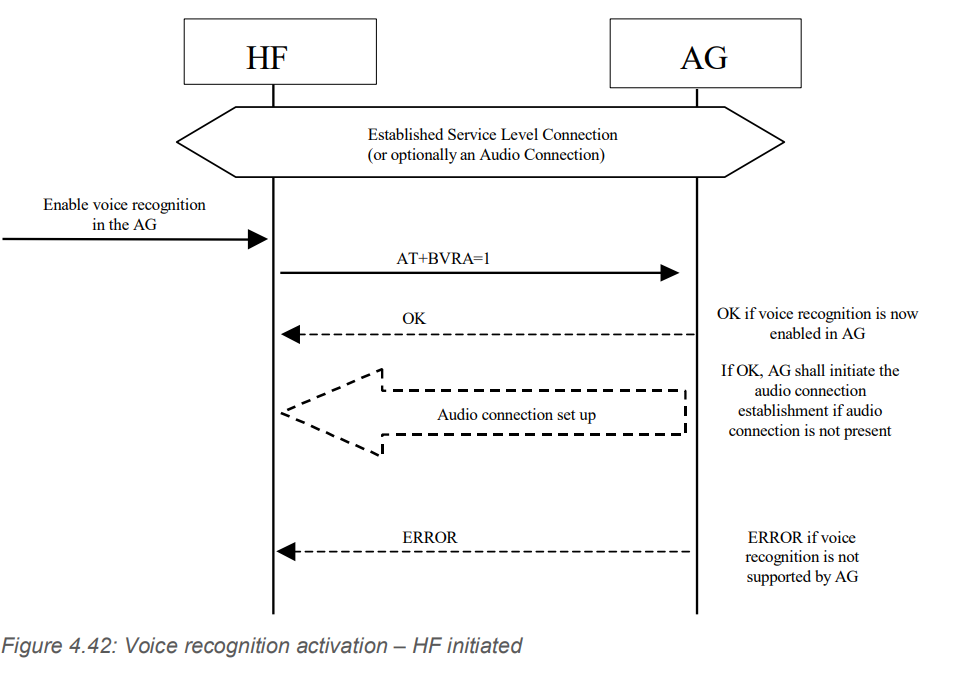

#### AG 端发起的语音识别

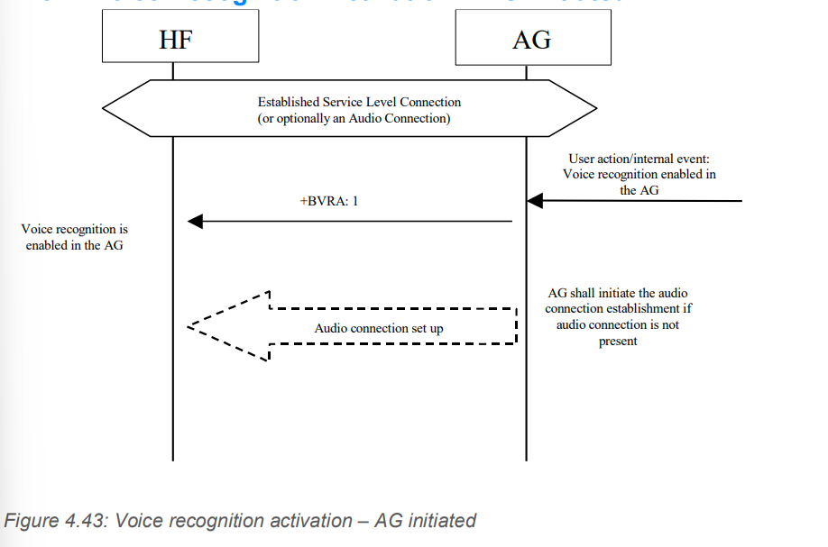

#### 语音识别检测

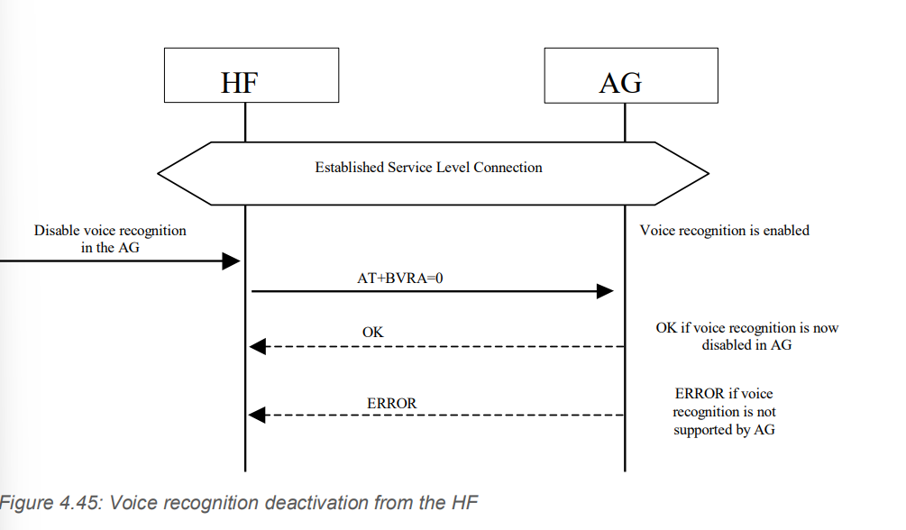

#### 增强语音识别活跃流程

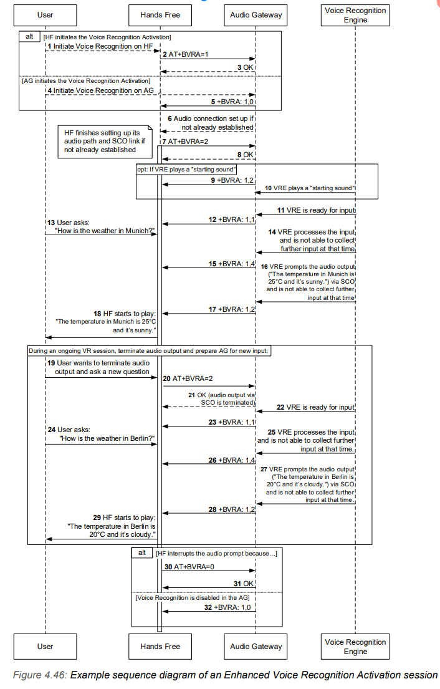

### 具有文本表示的增强语音识别激活

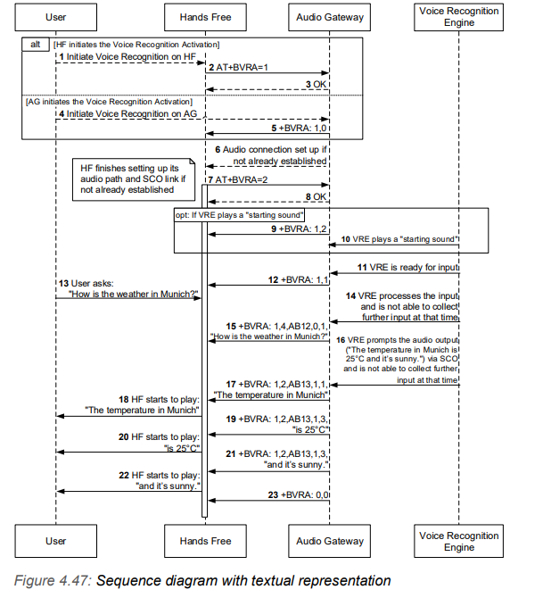

### 将电话号码存储为voice 标签

该程序适用于支持内部语音识别功能的HF。它提供了一种从AG读取数字的方法，用于创建唯一的语音标签，并将数字及其链接的语音标签存储在HF的存储器中。然后，当使用第 4.18 节中描述的“使用 HF提供的电话号码拨打电话”程序识别语音标签时，HF 可以使用其内部语音识别功能拨打电话号码。
当发生内部事件或用户操作时，HF可以通过发出AT+BINP=1命令从 AG 请求电话号码。根据 AG 的当前状态，它可能会接受或拒绝此请求。
如果AG接受请求，它应获取一个电话号码，并通过发出+BINP响应将该电话号码发送回HE。
如果AG拒绝HF的请求，应向HF发出错误结果代码，以表明此情况。

当此过程执行多次(以检索多个要链接到语音标签的AG 电话号码)时，每次执行此过程时，AG 都有责任提供下一个要传递给 HF的电话号码。
有关AT+BINP命令和+BINP响应的更多信息，请参见第5节。
作为此过程的前提条件，AG和HF之间应存在持续的服务水平连接。如果不存在此连接，HF应使用第 4.2 节中描述的正确程序自动建立服务水平连接。

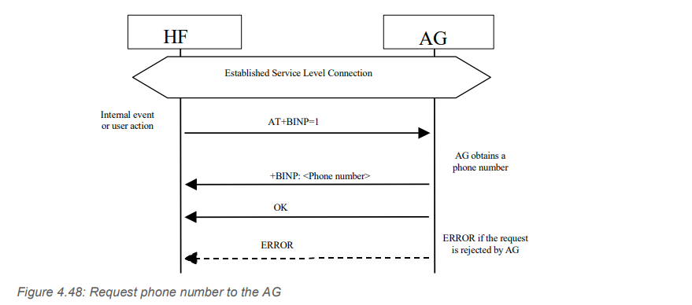

### 传输DTMF 代码

在持续呼叫期间，HF发送AT+VTS命令，指示AG将特定DTMF码发送到其网络连接。
有关AT+VTS命令的更多信息，请参见第5节。此程序适用下列先决条件:

- AG 和 HF之间应持续存在服务级别连接。如果不存在此连接，HF 应使用第 4.2节所述的正确程序自动建立服务级别连接。
- AG的呼叫正在进行中。

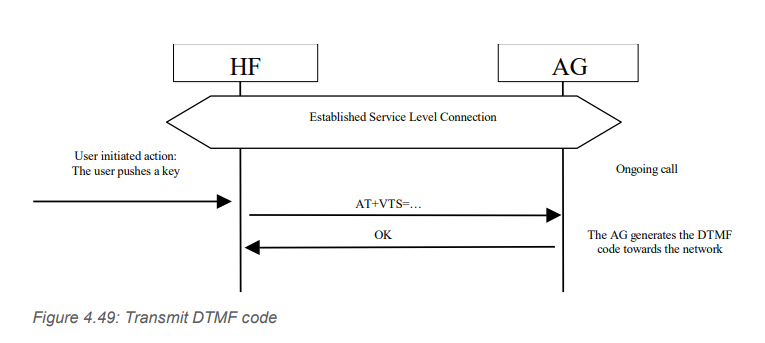

### 远程音频音量控制

#### 音频音量控制

此过程允许用户从下列位置修改高频扬声器音量和麦克风增益:AG.
AG可通过分别发送不请求的结果码+VGM和+VGS来控制短波的麦克风和扬声器的增益，结果码的数量和顺序没有限制。
如果在高频设备中支持远程音频音量控制功能，则至少应支持扬声器音量的远程控制。
作为此过程的先决条件，AG和 HF之间应存在持续的服务级别连接。如果不存在此连接，AG 应使用第 4.2 节中描述的正确程序自动建立服务级别连接。
音频连接不是此功能的必要先决条件。

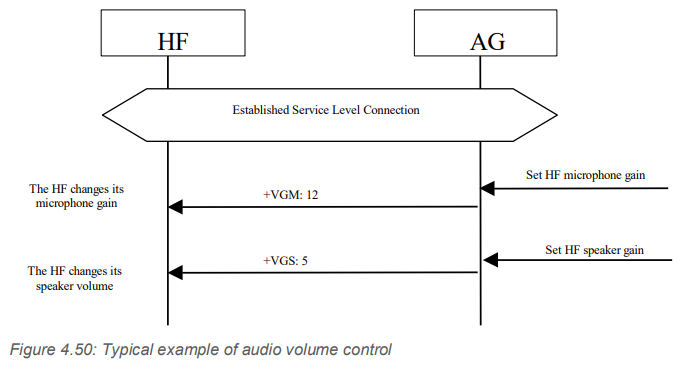

扬声器和麦克风的增益都表示为+VGS和+VGM的参数，范围从0到15。这些值是绝对的与HF控制的特定音量级别(与实现相关)有关。
有关这些命令和非请求结果代码的详细信息，请参见第5节。

#### 音频水平同步

该过程允许高频器将与高频器的扬声器音量和麦克风增益相对应的电流增益设置通知AG。
在建立服务级连接时，HF应始终使用AT命令AT+VGS和AT+VGM将其当前增益设置通知AG。
如果在HF上实施本地装置来控制增益设置，HF还应使用AT命令AT+VGS和AT+VGM来永久更新这些增
益设置变化的AG。
在所有情况下，增益设置都应在当前Service Levelconnection的持续时间内存储在两端。此外如果服务级别连接是由于 HF启动的“向 AG 的音频连接传输”而被释放的，如第 4.17节所述HF还应保留增益设置，并在重新建立服务级别连接时重新存储它们。
当HF支持远程扬声器增益控制时，应支持扬声器增加同步。当HF支持远程麦克风增益控制时，它应支持麦克风的增益同步。作为此过程的前提条件，AG和HF之间应存在持续的服务水平连接。如果不存在此连接，HF应使用第 4.2节中描述的正确程序自动建立服务水平连接。

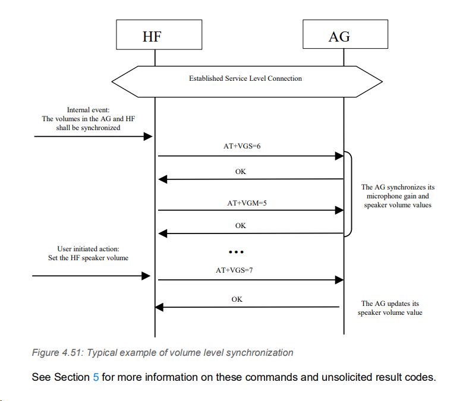

### 响应和保持

该程序允许用户将传入的呼叫挂起，然后接受或拒绝来自HF或AG的呼叫。此功能仅适用于PDC和CDMA网络支持此功能的有限市场。

#### 询问响应和保持状态

HF应执行此流程以查询AG的“响应和保持”状态的状态。

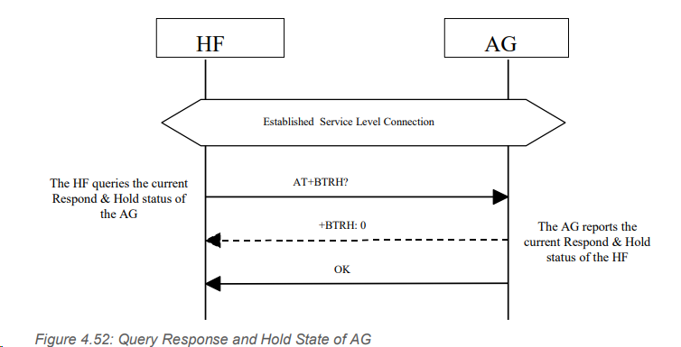

HF应发出AT+BTRH?命令来查询AG当前的“响应和保持”状态。
如果 AG 当前处于任何响应和保持状态，则 AG 应发送带有参数设置为0的 +BTRH:响应。如果 AG不在响应和保持状态，那么不应发送任何响应。
AG应对AT+BTRH?命令的信号完成发送OK响应。

#### HF端通话保持

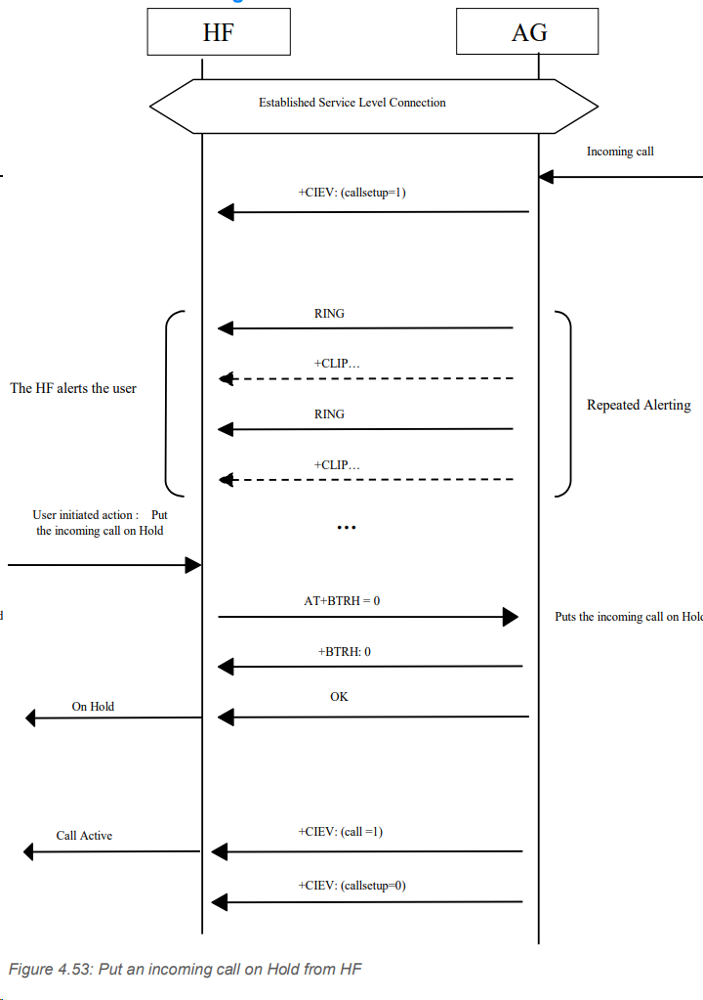

- 作为这一程序的先决条件，AG不得进行主动呼叫或暂停呼叫。
- AG应向HF发送一组主动的RING警报。该RING警报应重复进行，直至HF接受来电呼叫或直至来电呼喊因任何原因中断为止。
- 如果HF启用了呼叫线路识别[CLI]，AG应向HF发送一个+CLIP响应。
- 用户可以使用HF提供的适当方法将传入的语音呼叫挂起。然后，HF应发送带有参数n>设置为0的AT+BTRH命令。然后，AG应开始将传入的呼叫挂起的程序。
- 一旦暂停传入呼叫，AG应立即发送参数设置为0的+BTRH响应。
- 当通过AT+BTRH=0消息保持呼叫时，不应发送+CIEV:(callheld=2)消息。
- AG应发送+CIEV 响应，呼叫状态设置为1。
- AG应发送+CIEV响应，调用设置状态设置为0。

#### AG端将通话保持

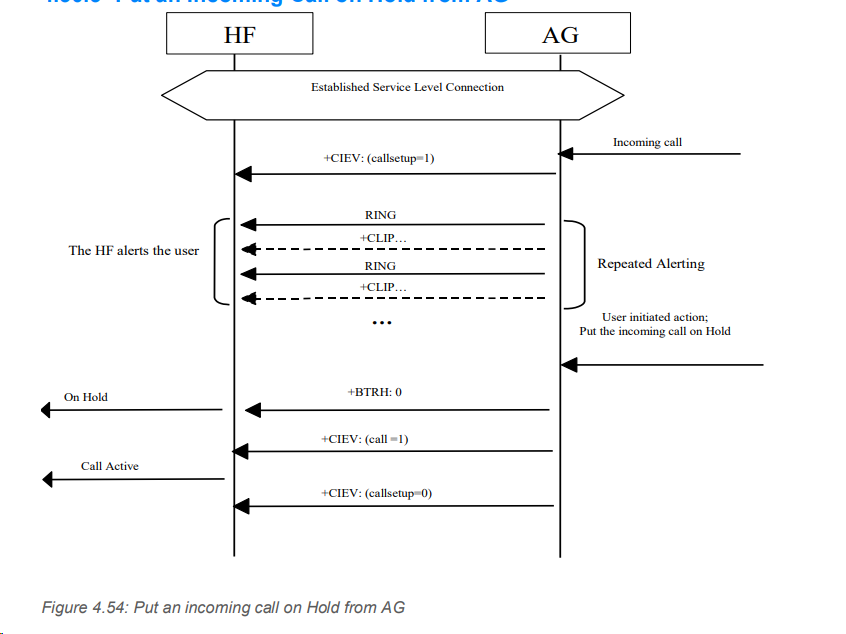

作为这一程序的先决条件，AG不得进行主动呼叫或暂停呼叫。

- AG应向HF发送一组主动的RING警报。RING警报应重复进行，直到HF接受来电呼叫或直到来电呼喊因任何原因被中断为止。

- 如果HF启用了呼叫线路识别[CLI]，AG应向HF发送一个+CLIP响应。
- 用户可以使用AG单元提供的适当手段将传入的语音呼叫挂起，然后AG应发送。带有参数<n>设置为0的+BTRH响应，以指示传入的呼叫处于挂起状态。
- 当音频网关通过响应和保持方法保持呼叫时，音频网管不得发送+CIEV:(callheld=2)消息。
- 根据是否启用带内振铃，HF和AG之间可能建立同步连接，也可能不建立同步连接。当来电被挂起时，同步连接状态(启用或禁用)不应改变。
- AG应发送+CIEV 响应，呼叫状态设置为1。
- AG应发送+CIEV响应，调用设置状态设置为0。

#### HF端接受呼叫保持的来电

下列附加先决条件适用于此程序:

- 一个来电被保持了。

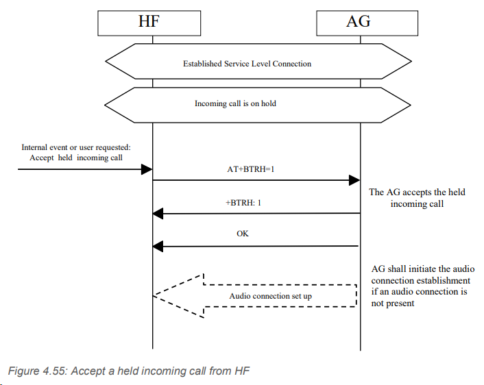

- 用户可以使用 HF提供的适当方法接受挂起的传入语音呼叫。然后，HF应该发送 AT+BTRH命令，其中参数<n>设置为 1。然后，AG 应该开始接受挂起的传入呼叫的流程。

- AG随后将参数<n>设置为1的+BTRH 响应发送给HF，通知HF已接受所持的传入呼叫。
- AG应启动建立音频连接的程序，只有在音频连接未建立的情况下，才将音频路径路由至高频。

#### AG端接受呼叫保持的来电

下列附加先决条件适用于此程序:

- 一个来电保持了。

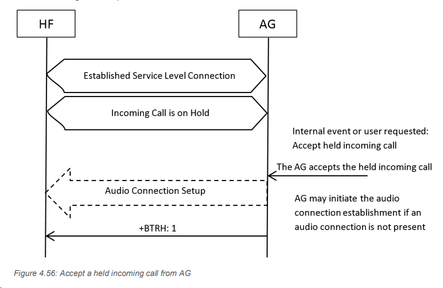

用户可以使用AG单元提供的适当方法来接受挂起的传入语音呼叫。然后，AG应发送带有参数<n>设置为1的+BTRH响应，以通知HF已接受挂起的传入呼叫。

#### HF拒绝一个保持的来电

下列附加先决条件适用于此程序:

- 一个来电被搁置了。

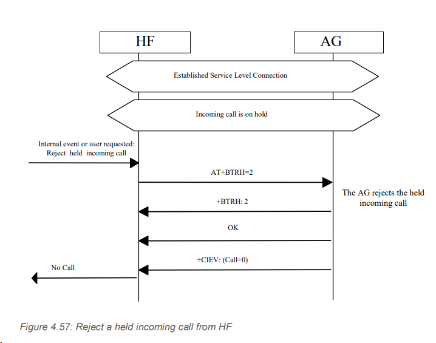

- 用户可使用频率控制器提供的适当方法拒绝接入的语音呼叫。频率控制和AG允许下列两种顺序之一:

    - HF可以发送带有参数<n>设置为2的AT+BTRH命令。然后，AG应开始拒绝已挂起的传入呼叫的程序。AG应发送带有参数<n>设置为2的+BTRH响应，以通知HF拒绝已挂起的传入电话。
    - HF可以发送AT+CHUP 命令来拒绝被阻止的接入呼叫。AG应拒绝被阻止呼叫并向HF发送OK指示。

- AG应发送将呼叫状态设置为0的+CIEV 响应。

#### AG端拒绝一个held的来电

下列附加先决条件适用于此程序:
一个来电被搁置了。

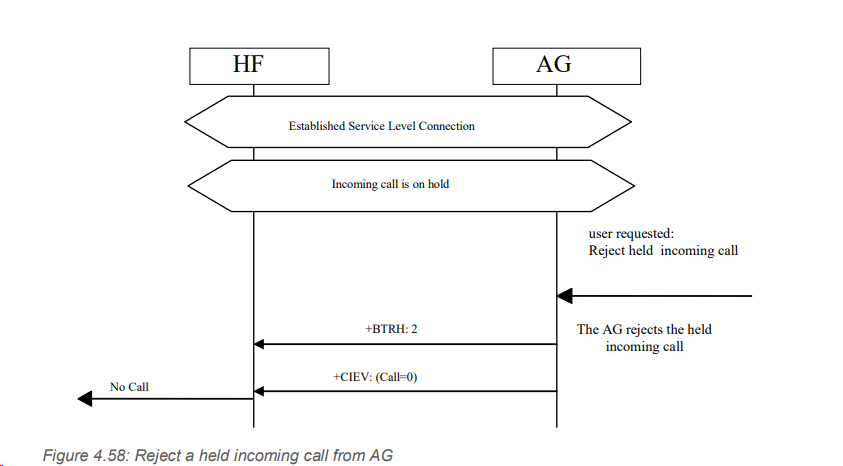

用户可以使用AG单元提供的适当方法挂起传入的语音呼叫。然后，AG应发送带有参数<n>设置为2的+BTRH响应，以通知HF挂起的传入呼叫被拒绝。
AG还应发送将呼叫状态参数设置为0的+CIEV响应，以指示AG当前未在呼叫中

#### 由对端挂断一个held的来电

下列附加先决条件适用于此程序:
一个来电被搁置了。

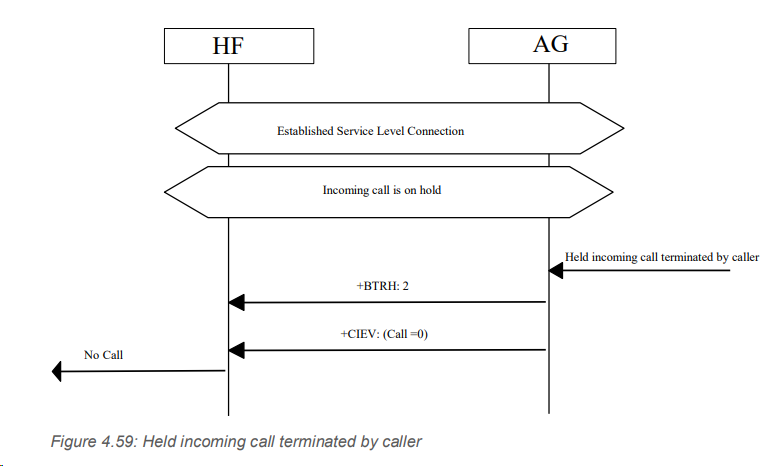

呼叫方可终止所持的传入呼叫。AG随后发送将参数<n>设置为2的+BTRH响应，通知HF所持的呼叫已终止。
AG应发送将呼叫状态参数设置为0的+CIEV响应，以指示AG当前未在呼叫中

### 订阅通信录信息

此过程允许HF查询AG用户号码。

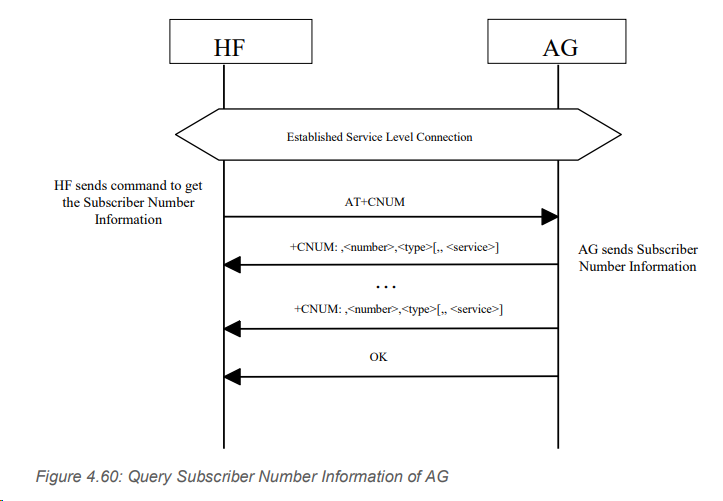

下列先决条件适用于此程序:

- HF和AG之间应持续存在服务级别连接。如果不存在此连接，则HF应使用第4.2节中描述的“服务级别连接设置”程序建立连接。

- HF应发送AT+CNUM命令查询AG用户号码信息。
- 如果有订阅者号码信息，AG应以 +CNUM 响应。如果有多个号码，AG应为每个可用的号码发送单独的 +CNUM 响应
- AG应以OK响应来表示AT+CNUM动作命令的完成。在+CNUM响应出现零次或更多次之后，OK将出现。(见图4.57和图4.58)。

### 增强来电状态机

#### 端询问当前在AG端的通话

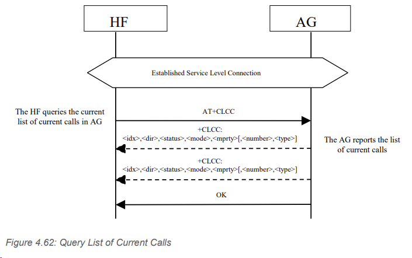

HF应执行此过程以查询AG中的当前呼叫列表。下列先决条件适用于此程序:
:AG和HF设备之间存在服务级连接。如果当前没有服务级连接，HF应首先启动一个。

HF应通过发送AT+CLCC命令来查找AG中的当前呼叫列表。
如果命令成功，并且AG中存在一个外呼(Mobile Originated)或内呼(Mobile Terminated)呼叫,AG应向HF发送一个包含适当参数的+CLCC响应。
如果没有可用的呼叫，则不会向HF发送+CLCC响应。
AG应始终向HF发送OK响应。

### 增强来电控制机制

如前所述，增强型呼叫控制机制只是当前 AT+CHLD 命令的扩展。这些扩展被定义为 AT+CHLD指令的附加参数。该指令的新参数包括 +CLCC响应中指定的特定呼叫的索引。

#### 释放特殊的来电序号

HF应执行此程序以在AG中发布特定呼叫。下列先决条件适用于此程序:
。AG和HF设备之间存在服务级连接。如果当前没有服务级连接，HF应首先启动一个。

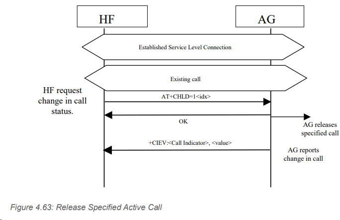

HF应发送AT+CHLD=1<idx>命令以释放特定的主动呼叫。
AG应发布指定的通话。
呼叫状态发生变化的，AG应报告呼叫状态的变化;被叫呼叫状态出现变化的，AG应报告被叫呼唤状态的变化。
如果索引(<idx>)无效，AG应报告正确的错误代码。

#### 私人咨询模式

HF应执行此程序，将多方通话的所有当事方暂停，但指定的通话除外。
下列先决条件适用于此程序:

- AG和HF设备之间存在服务级连接。如果当前没有服务级连接，HF应首先启动一个。
- 现有的多方呼叫在AG中很活跃。

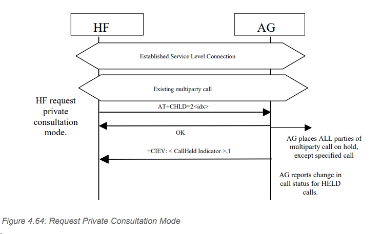

- HF应发送AT+CHLD=2<idx>命令以请求私人咨询模式。
- AG应暂停所有其他请求方的请求。
- AG应报告被控股方地位的变化。
- 如果索引(<idx>)无效，AG应以正确的错误代码作出回应。

### 发起的活动和检查

HF应执行这一程序，以更改AG应送交的指标分组。此程序适用下列先决条件:
AG 和 HF之间应持续存在服务级别连接。如果不存在此连接，HF 应使用第 4.2节中描述的正确程序自动建立服务级别连接。

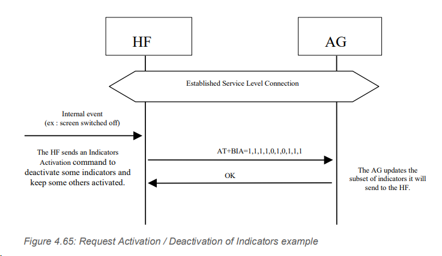

图4.65并不暗示CIND字段的强制流程，也不暗示一组强制性的CIND指标字段。
如果HF需要更改AG中指示器的激活/停用状态，则应发出AT+BIA命令。
AG在处理了格式正确的命令后，将OK结果代码发送给HF。如果命令格式不正确，AG应将ERROR结果代码发送给HF在成功处理AT+BIA命令后，AG不得发送被停用的指示器。
只有在启用事件报告功能时，AG才会发送已激活的指标响应。
AT+BIA命令的效果仅在当前服务级别连接期间有效。当服务级别连接终止并建立新的服务级别连接时，所有指标默认为激活状态。
在事件报告被禁用时发送 AT+BIA命令是有效的。如果在服务级别连接终止之前启用事件报告，AG 仅应发送最近处理的 AT+BIA指令所激活的指标。
如果禁用事件报告(CMER)，然后重新启用，AG将仅发送最近处理的AT+BIA命令激活的指标，或者在HF未发送AT+BIA的情况下发送所有指标。
AT+BIA命令对“AT+CIND?”读取命令的响应没有影响(参见第5.2节)。
AT+BIA命令的限制适用于指示器呼叫、呼叫状态和保持呼叫。AG应始终认为这些指示器已激活，即使HF要求将其停用
AG必须支持AT+BIA指挥部。
HF可选地支持AT+BIA命令。

对于HF设备，可以选择使用AT+BIA命令。
有关AT+CMER(事件报告)命令的更多信息，请参见第5.2节:

### HF 发起

HF指示器功能用于允许免提设备将某些 HF指示器的值通知给音频网关。HF 可以使用此功能共享诸如电池电量或增强驾驶员安全开/关之类的信息。
如第4.2.1节所述，设备应通过验证遥控器的 BRSF位来确定是否支持HF指示器功能。

#### 支持HF 发起的传输

在服务级别连接建立过程中(见第 4.2.1 节)，HF 应向 AG 发送支持的 HF 指标列表。这些指标应使用分配给 16 位的适当编号表示，分配给 16 位数中的每个编号。[8]httpswww.bluetooth.com/specifications/assigned-numbers/上的网页。HF不得发送蓝牙SIG未定义的分配号码

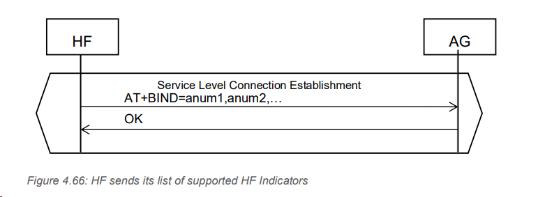

#### AG支持免提指示器的传输

一旦HF发送了其支持的HF指标列表，它应确定哪些指标由AG支持。HF应向AG发送AT+BIND=?命令。AG应以+BIND响应，指示哪些HF指标由AG支持

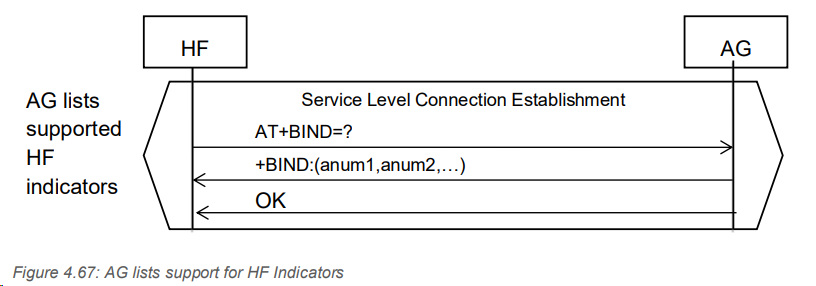

#### 从AG端使能免提指示器传输到HF端

一旦HF确定了AG支持的HF指标，如第4.35.2节所述，HF应确定AG通过发送AT+BIND?命令使其能够接收哪些HF指标。然后，AG应发送一个或多个+BIND:anum，state响应，其中包含每个支持的HF指标的分配编号和状态(0=禁用/1=启用)，后跟OK。

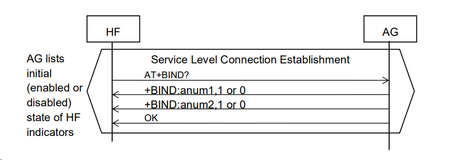

#### AG支持的HF指示器的激活/失活
AG 可以更改 HF 支持的任何 HF 指示符的启用/禁用状态。要更改状态，AG 应发送一个未请求的 +BIND:an um，state 响应代码。每当 HF从 AG 接收到未请求的 +BIND 指示符，将特定 HF指示符的状态从禁用更改为启用时，HF应该使用 +BIEV命令将该指示符的当前状态发送到 AG(参见第 4.35.5 节)。这将在设备之间同步 HF 指示符状态。

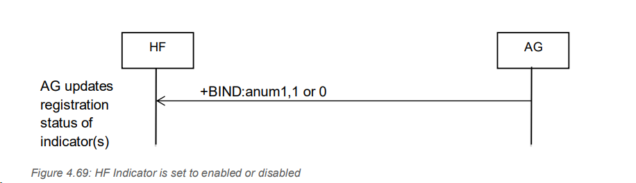

#### 免提指示器的传输
当HF内的环境条件发生变化时，HF应使用AT+BIEV=anum，value命令将值的变化通知AG。然后，AG应确认收到值更新，并返回OK。如果AG不支持HF报告的指标或禁用该指标，则AG应返回ERROR响应代码。
分配编号及其相关值由蓝牙SIG在分配编号中定义[8]网页。

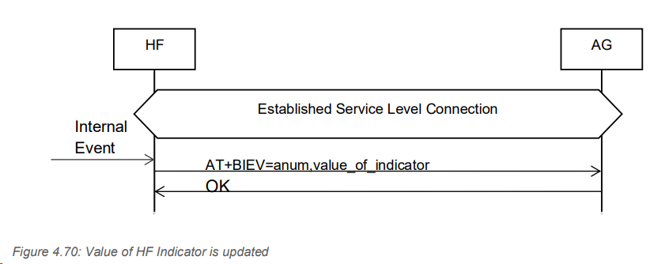

HF应仅为已设置为启用的HF指示器值提供更新。
AG.如果AG收到禁用或未知的HF指标或超出范围值的更新，则应以错误响应代码进行响应。

## AT 命令和返回值

### 总则

对于命令和非请求结果代码的交换，3GPP27.007的格式、语法和过程[2]应作为参考。下列规则特别适用于HFP规范:

- 每个命令行只需要一个命令(或非请求的结果代码)
- 默认情况下，AG不应回传命令字符。
- AG应始终使用详细的格式发送结果代码。
- 以下字符用于AT命令和结果代码格式化:
  - <cr>对应于回车符(0/13)，如[5].
  - <lf> 对应于 中所述的线馈送(0/10)[5].
- 从HF到AG的AT命令的格式应为:<AT命令><cr>
- 从AG到HF的OK代码的格式应为:<cr><lf>OK<cr></l>
- 从AG到HF的通用错误代码的格式应为:<cr><lf>错误<cr></If>
- AG向HF发送的非请求结果代码的格式应为:
    <cr><|f><result code><cr><|f>
- 免提配置文件使用现有标准的 AT命令和结果代码的子集;这些在5.2节中列出。5.3节列出了新的蓝牙定义的 AT命令和结果码，这些命令和结果码没有重新使用任何现有标准。
- 一般来说，AG应使用第5.2节中描述的OK代码来确认命令的正确执行，并对从HF接收到的任何未知命令做出适当的错误指示。
- AG必须正确响应任何错误条件，而HF必须正确处理从AG接收到的相应错误指示代码，第5.2节中描述的代码ERROR应作为此目的的错误指示。
- 对于本规范中定义的 AT命令，HF始终应忽略从 AG 接收到的任何未知或意外指示代码。未在本规范中定义的 AT指令的处理留给实现。唯一的例外是 AG 使用 +CME ERROR结果代码(见[2]在这种情况下，HF应以通用错误代码的方式解释此结果代码。
- 一般规则是，当实现本规范的 AT命令或结果代码时，除非在每种特定情况下另有明确规定，否则应认为支持本规范中描述的相关参数及其所有相应可能的值是强制性的。

### AT 从GSM 07.07和 3GPP 27.007 复用的功能

下面列出了用于实现本规范中描述的功能的重新使用的AT命令和主动生成的结果代码:
**ATA**
标准呼叫回答AT命令。参见附件G[2].
**ATDdd...dd;**
标准AT命令，用于对某个电话号码进行呼叫。本规范仅涵盖语音呼叫。请参阅[2].
**ATD>nnn..;**
标准ATD命令的扩展，用于内存拨号。本规范仅涵盖语音呼叫。请参[2].
**ERROR**
标准错误指示代码。应在检测到任何语法、格式或程序错误条件时发出。以下包含“移动设备错误”报告代码“+CME ERROR:。见附件B。[2].
**OK**
命令执行的标准确认。参见附件B中的[2].
**NO CARRIER, BUSY, NO ANSWER, DELAYED, REMOVED FROM THE NETWORK**
AT命令的扩展响应指示代码。这些代码应由AG向HF发出，作为HF向AG发出AT命令的响应，或者由AG作为自发结果代码发出。这些代码是+CMEERROR:响应的补充。
 **RING**
标准的“来电”指示。参见附件B[2]
**AT+CCWA**
标准“呼叫等待通知”AT命令。在AT+CCWA=【<n>【,<mode>【<class>】】】命令中，本规范仅涵盖使用<n>参数启用/禁用呼叫等待通知非请求结果代码+CCWA。请参阅第7.12节。[21.
**+CCWA**
标准的“呼叫等待通知”未请求的结果代码。
在+CCWA 结果代码中，本规范仅涵盖<number>和<type>参数，其他参数被认为与本规范无关，HF应忽略
<number>参数应为文本字符串，且应始终包含在双引号中。<type>字段指定所提供的电话号码的格式，可以是以下值之一:

值128-143:电话号码格式可以是国家或国际格式，可以包含前缀和/或逃逸数字。不需要更改号码显示。
值 144-159:电话号码格式是国际号码，包括国家代码前缀。如果加号(“+”)不包括在号码中，则应由 AG 根据需要添加。
值 160-175:国家编号。不包括前缀或逃逸数字。
**AT+CHLD**
标准呼叫保持和多方处理AT命令。在AT+CHLD=<n>命令中，此规范仅涵盖0、1、1<idx>、2、2<idx>、3和4中的<n>的值，其中:
-0=释放所有保留的呼叫或为等待呼叫设置用户确定用户繁忙(UDUB)。
1=释放所有活跃的呼叫(如果存在的话)，并接受其他(保持或等待的)呼叫。
1<idx>=释放具有指定索引(<idx>)的调用。
2=暂停所有正在通话(如果有的话)并接听其他(已暂停或等待)通话。
2<idx>=请求使用指定呼叫(<idx>)的私人咨询模式。(将所有呼叫都暂停，除非<idx>指示的呼叫。)
3=将暂停通话添加到会话中。
4=连接两个呼叫并断开用户与两个呼叫的连接(显式呼叫传输)。对于HF来说，支持此值及其相关功能是可选的。
如果同时存在被叫通话和等待通话，在冲突的情况下，上述程序应适用于等待通话(即不适用于被叫通电话)。
测试命令AT+CHLD=?可用于检索AG中可用的呼叫保持和多方服务的信息(参见第4.2.1节)。
见《core sepec》第7.13节[2]和第4.5.5.1节中的[6]了解详情。
**AT+CHUP**
标准挂机 AT命令。执行命令会导致AG终止当前正在进行的呼叫。除了使用第4.30.6节中定义的 Respond和 Hold功能挂起的呼叫外，该命令对保留的呼叫状态没有影响。
参见《[2].
AT+CHUP 也被用作在接听之前拒绝任何传入呼叫的命令。
**AT+CIND**
标准指示器更新AT命令。本规范仅要求读取命令AT+CIND?和测试命令AT+CIND=?
。
AT+CIND?read命令用于获取AG指标的当前状态。
AG应返回AT+CIND=?命令中所列的所有指标。

使用AT+BIA命令使任何指示器失活不应影响AG对AT+CIND?读取命令的响应。
AT+CIND=?测试命令用于检索AG支持的每个指标与其相应的范围和顺序索引之间的映射，在使用任何与此类指标相关的其他命令(AT+CIND?或AT+CMER)之前，应至少发出一次此命令。
Hands Free Profile规范将AG返回的指标数量限制在最多20个。
本规范涵盖以下指标:
服务:服务可用性指示，其中:
<value>=0表示没有服务。没有可用的家庭/漫游网络。
<值>=1表示服务存在。Home/Roam网络可用。
呼叫:标准呼叫状态指示符，其中:
<value>=0表示没有正在进行的调用
<value>=1表示至少有一个调用正在进行中
call setup:蓝牙专有呼叫设置状态指示符4.对于 HF，支持该指示符是可选的。当支持时，该指示符应与标准呼叫指示符一起使用，并作为标准呼叫指示符的扩展。可能的值如下:
<value>=0表示当前未设置呼叫设置。
<value>=1表示正在进行的传入呼叫进程。
<value>=2表示设置的出线呼叫正在进行中。
<value>=3表示远程方在出线呼叫中收到警报。
-call hold:蓝牙专有呼叫保持状态指示器。AG必须支持此指示器，HF可选。可能的值如下:
0=没有通话
1=呼叫被搁置或已激活/已停用呼叫被交换
(AG既有活期呼叫，也有暂停呼叫)
2=暂停通话，无主动通话
信号:信号强度指示器，其中:
<value>=范围从0到5
roaming:漫游状态指示符，其中:
<value>=0表示漫游不活跃

<value>=1表示漫游已激活
battchg: AG 的电池充电指示灯，其中:
<value>=从0到5的范围
+CIND
当前电话指示灯的标准列表。参见《[2].
AT+CLCC
标准的列出当前调用命令。请参见《[2].
+CLCC
标准列出当前调用结果代码。请参见《[2].
支持的参数如下:
-idx=由被服务的订户看到的建立或接收呼叫(活动、保持或等待)的序列给出的呼叫的编号(从1开始)。呼叫保留他们的编号，直到他们被释放。新呼叫采用可用的最低编号。
地址=0(输出)，1(输入)
status=
o0=活动
o 1=Held
o2=拨号(仅限外呼)
o3=警报(仅用于拨打外呼)
o4=来电(仅限来电)
o5=等待(仅接入呼叫)
o6=呼叫被响应和保持
模式=0(语音)，1(数据)，2(传真)
mpty=
0-此呼叫不是多方(会议)呼叫的成员
1-本次通话属于多方(会议)通话的一部分。
number(可选)=<number>参数应为文本字符串，且应始终包含在双引号中。
type(可选)=<type>参数指定所提供的电话号码的格式。<type>字段可以是下列值之一:
值128至143:电话号码格式可以是国家或国际格式，可以包含前缀和/或逃逸数字。无需更改号码显小。
-值 144到 159:电话号码格式是国际电话号码格式，包括国家代码前缀。如果加号(“+”)不包括在号码中，则AG应按需添加加号(“+”)。

值160至175:电话号码格式为国家号码格式，不包括前或逃逸数字。
如果未提供<number>参数，则应排除<type>参数。

**AT+COPS**
AT+COPS=3,0应在发送 AT+COPS?命令。AT+COPS=3,0 将网络运营商字符串的格式设置为长格式
字母数字。
AT+COPS?命令用于读取网络运营商。该配置文件应仅支持“读取”网络运营商的名称。AG对该命令的响应应返回+COPS:<mode>，<format>，<operator>，其中:
<mode>包含当前模式，不提供有关操作员名称的信息。
<format>指定<operator>参数字符串的格式，对于该规范，该格式应始终为0。
<operator>指定以字母数字格式表示网络操作员名称的引用字符串。该字符串不得超过16个字符。
请参阅[2].
**AT+CMEE**
标准AT命令用于启用结果代码+CMEERROR:<err>作为与AG功能有关的错误的指示。
设置命令AT+CMEE=1包含在本规范中。
**+CME ERROR** 
这是扩展音频网关错误结果代码的响应。响应的格式为:+CMEERROR:<err>。在本规范中，<err>的格式应为数字。本规范中<err>的可能值如下所述。可以使用这些错误代码代替标准ERROR响应代码，以向HF提供其他信息。在使用扩展音频网关错误结果码时，仍可使用ERROR响应代码。
+CME 错误:0-AG 故障
+CME 错误:1-无法连接到电话
+CME错误:3-不允许操作
+CME错误:4-不支持操作
+CME错误:5-需要PH-SIM PIN
+CME 错误:10-SIM 未插入
+CME 错误:11-需要SIM PIN
+CME 错误:12-需要SIM卡
+CME错误:13-SIM 故障
+CME 错误:14-SIM 繁忙

+CME 错误:16-密码错误
+CME 错误:17-需要SIM PIN2
+CME错误:18-需要SIM PUK2
+CME错误:20-内存已满
+CME错误:21-索引无效
+CME错误:23-内存故障
+CME错误:24-文本字符串太长
+CME错误:25-文本字符串中的字符无效
+CME 错误:26-拨号字符串太长
+CME错误:27-拨号字符串中的字符无效
+CME 错误:30-没有网络服务
+CME错误:31-网络超时。
+CME错误:32-不允许使用网络-仅限紧急呼叫

**AT+CLIP**
标准的“呼叫线标识通知”激活AT命令。它启用/禁用呼叫线识别通知的主动结果代码+CLIP。参见第7.6节[2].
**+CLIP**
标准的“呼叫线路识别通知”非请求结果代码。
在+CLIP:<number>,type>【,<subaddr>,<satype>【【<alpha>】【<CLlvalidity>】】】结果代码中。本规范仅涵盖<number>和<type>参数。本规范不考虑其他参数的相关性，HF应忽略这些参数
<number>参数应为文本字符串，且应始终包含在双引号中。
<type>字段指定所提供的电话号码的格式，可以是以下值之一:
值128-143:电话号码格式可以是国家或国际格式，可以包含前缀和/或逃逸数字。不需要更改号码显示。
值 144-159:电话号码格式是国际号码，包括国家代码前缀。如果加号(“+”)不包括在号码中，则应由 AG 根据需要添加。
值 160-175:国家编号。不包括前缀或逃逸数字。
参见《[2].
**AT+CMER**
标准事件报告激活/停用AT命令。

在AT+CMER=[<mode>[,<keyp>[,<disp>[,<ind>[,<bfr>)]]]命令中，只有<mode>和<ind>参数与本规范相关。本规范只涵盖它们的值<mode>=(3)和<ind>=(0,1)。请参阅第 8.10 节。[2].
下面的示例显示如何使用AT+CMER命令激活或停用“指示器事件报告”结果代码:
AT+CMER=3，0，0，1激活“指示事件报告”
AT+CMER=3，0，0，0停用"指示器事件报告"
**+CIEV**
标准的“指标事件报告”非主动结果代码。
在+CIEV:<ind>，<value>结果代码中，只有上述AT+CIND命令中所述的指标与本规范相关，其中:
-<ind>:使用AT+CIND=?命令从AG中检索的列表中的指示符顺序索引。列表的第一个元素应具有<ind>=1。
-<值>:指标的当前状态。
如果短波器接收到未知的指示器或值，应将其忽略。
参见《[2].
**AT+VTS**
标准DTMF生成AT命令。本规范仅涵盖AT+VTS=<DTMF>命令格式:
见附件C.2.11中的附件[2].
**AT+CNUM**
语法:
AT+CNUM(检索订户号码信息)
说明:
AT+CNUM=?(测试用户号码信息-未实现)
HF为AG中的“用户号码信息”功能发布命令。
只使用操作命令AT+CNUM格式。
**+CNUM**
语法:
+CNUM:[<alpha>]，<number>，<type>,[<speed>，<service>](AT+CNUM的响应)
说明:
标准响应用于将“用户号码信息”从AG发送到HF。
AG应发送+CNUM:HF对AT+CNUM的响应。
价值观:
-<alpha>:不支持此可选字段，应保持空白。

-<number>:引用的字符串，以<type>指定的格式包含电话号码。
.<type>字段指定所提供的电话号码的格式，可以是以下值之一:
值128-143:电话号码格式可以是国家或国际格式，可以包含前缀和/或逃逸数字。不需要更改号码显示。
值 144-159:电话号码格式是国际号码，包括国家代码前缀。如果加号(“”)不包括在号码中，则应由 AG 根据需要添加。
值 160-175:国家编号。不包括前缀或逃逸数字。
<speed>:不支持此可选字段，应保持空白。
<服务>:指示此电话号码与何种服务有关。应为4(语音)或5(传真)
例子:
+CNUM: ,"5551212",129,,4
见第7.1节中的[2].

### 蓝牙定义的AT 特性

GSM 07.07[2]格式和语法规则应作为这些命令的参考。
新的蓝牙特定AT功能列出如下:
**AT+BIA(**蓝牙指示器激活)
语法:AT+BIA=[[<indrep 1>][,[][,.[, [<indrep n>]]]说明:
单独激活或停用指标。指标的映射由“AT+CIND=?”测试命令提供(参见第5.2节)
<indrep x>:报告指标x的状态。1表示激活，0表示停用。
如果逗号之间省略了指示符状态，则该指示符的当前报告状态不应改变。例如，如果 HF 发送命令“AT+BIA=，1，，0”，则只有第二个和第四个指示符可能受到影响，指示符一和三个的报告状态保持不变。
如果 AG 支持的指标数多于 HF 提供的指标报告状态数，则 AG 应保留这些指标的当前报告状态。例如，如果 AG 支持五个指标，而 HF发送的命令为“AT+BIA=10,1”，则只有前三个 AG 指标可能会受到该命令的影响。
呼叫、呼叫设置和保持呼叫指标已被定义为强制性指标。这意味着无论HF给出的报告状态如何，这些指标都应始终由AG保持激活。
AG应在结尾处优雅地忽略任何多余参数。
AG应默默无视取消强制性指标的请求。

前三点允许HF通过使用固定的串激活或停用除强制性指标以外的所有指标。
例如，如果最大指示数为20:
可以使用固定字符串将所有指标设置为活动:
AT+BIA=1,1,1,1,1,1,1,1,1,1,1,1,1,1,1,1,1,1,1,1,1,1,1,1,1,1,1,1，和使用以下方法处于非活动状态(始终处于活动状态的除外):
AT+BIA=0.0.0.0.0.0.0.0.0.0.0.0.0.0.0.0.0.0.0.0允许的指标的实际数量由AT+CIND命令定义。

AT+BINP(蓝牙输入)
语法:AT+BINP=<datarequest>
预期响应: +BINP:<datarespl>...<datarespn>
说明:
命令用于请求AG5输入某些特定数据。收到此命令后，AG应执行适当的操作，以便将请求的信息通过+BINP响应发送回HF。
HF 在 AG 返回的参数中预期的数据类型<dataresp>取决于在每种情况下请求的信息。
只有对执行命令的支持是强制性的，读取命令和测试命令都是强制性的。
价值观:
<datarequest>:l，其中
1=与HF中录制的最后一个语音标签相对应的电话号码。<dataresp1..n>:AG返回的数据参数。其内容取决于<datarequest>参数的值，如下所示:
<datarequest>值
<dataresp>参数<电话号码>:
AT+BLDN(蓝牙最后拨号)
语法:AT+BLDN
说明诳胥克渎皇戆
电话号码串(最多32位)。电话号码串的格式(地址类型)应符合下列规定:[5]，子章节10.5.4.7，如果拨号字符串包括国际访问代码字符“+”，则地址八进制类型的值(以整数格式)为145，否则为129。

用于呼叫最后拨打的电话号码的命令。AG在收到此命令后，应对最后拨打的那一个电话号码设置语音呼叫。
只有对执行命令的支持是强制性的，读取命令和测试命令都是强制性的。

AT+BVRA(蓝牙语音识别激活)
语法:AT+BVRA=< vrec>
说明:
启用/禁用 AG 中的语音识别功能。如果支持增强语音识别状态功能，则使用此命令向 AG 指示 HF 准备提供音频输出。
只支持执行命令。读命令和测试命令都不是强制性的。如果支持增强语音识别状态功能，则AG只有在之前从HF收到AT+BVRA=2并且建立了eSCO链路时，才应将音频传输到HF。
只有当AG和HF都支持增强语音识别状态功能时，才应使用值2。
价值观:
<vrec>:0、1或2，输入为整数值，其中
0 =
在AG中禁用语音识别。
如果支持增强语音识别状态功能，则此值将终止当前VR会话。
·如果支持增强语音识别状态功能，此值也可用于拒绝AG提出的启动新VR会话的+BVRA=1请求。
1=在AG中启用语音识别。
2=只有当 AG 和 HF都支持增强语音识别状态功能时，才能使用此值。此值表示在首次建立音频连接时，HF准备接收音频。只有当eSC0链路已经建立时，HF才应发送此值。
在正在进行的VR会话期间，HF可发送此值以终止AG的音频输出(如果有的话)，并为AG准备新的音频输入。
·+BVRA(蓝牙语音识别激活)
语法:+BVRA:<vrect>[，<vrecstate>][，<文本表示>]说明:
自发结果代码，用于在 AG 的语音识别功能从 AG 自动激活/停用时通知HF。如果支持增强语音识别状态功能，则此值还用于指示 AG的语音识别引擎的状态更改。

如果 HF启动了相应的语音识别激活，AG 不得向 HF 发送非请求的 +BVRA:1结果代码。同样，如果 HF启动了相应语音识别的停用，AG不得向H发送非请求的+ BVRA:0结果代码，无论哪一方启动了语音识别的激活。
如果支持增强语音识别状态功能，则只有当AG先前从HF接收到AT+BVRA=2且已建立eSCO链路时，AG才应向HF发送音频。
价值观:
<vrect>:0，输入为整数值，其中
0=AG中禁用了语音识别1=AG中启用了语音识别功能
<vrecstate>:
位掩码反映了 AG 上语音识别引擎的当前状态。当没有活动语音识别会话时，位0应设置为0。如果位0设置为 0，则所有其他位应设置为 0。
<vrecstate>如果 AG和 HF都支持增强语音识别状态功能，则应存在;否则，不应显示。

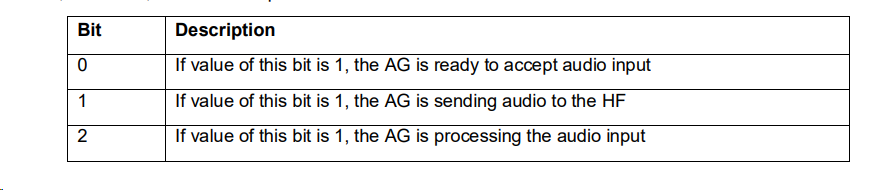

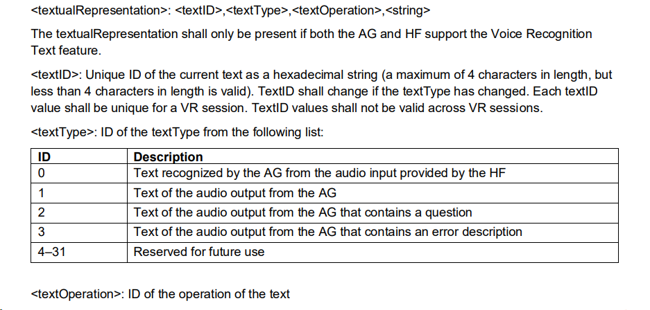

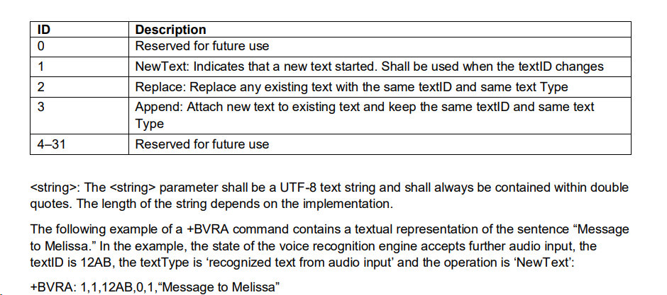

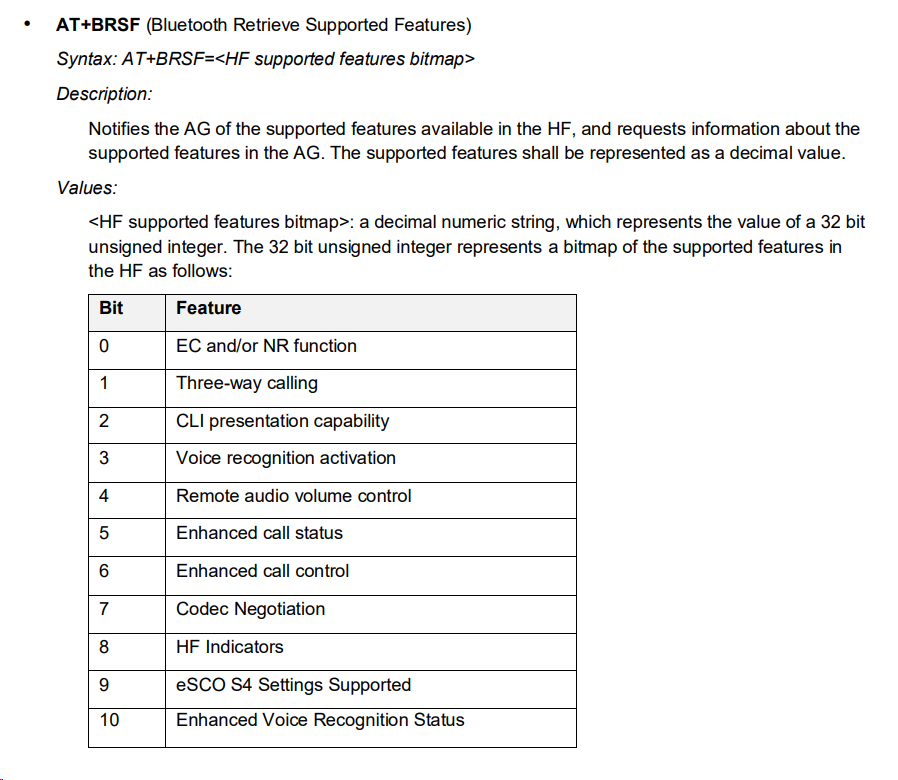

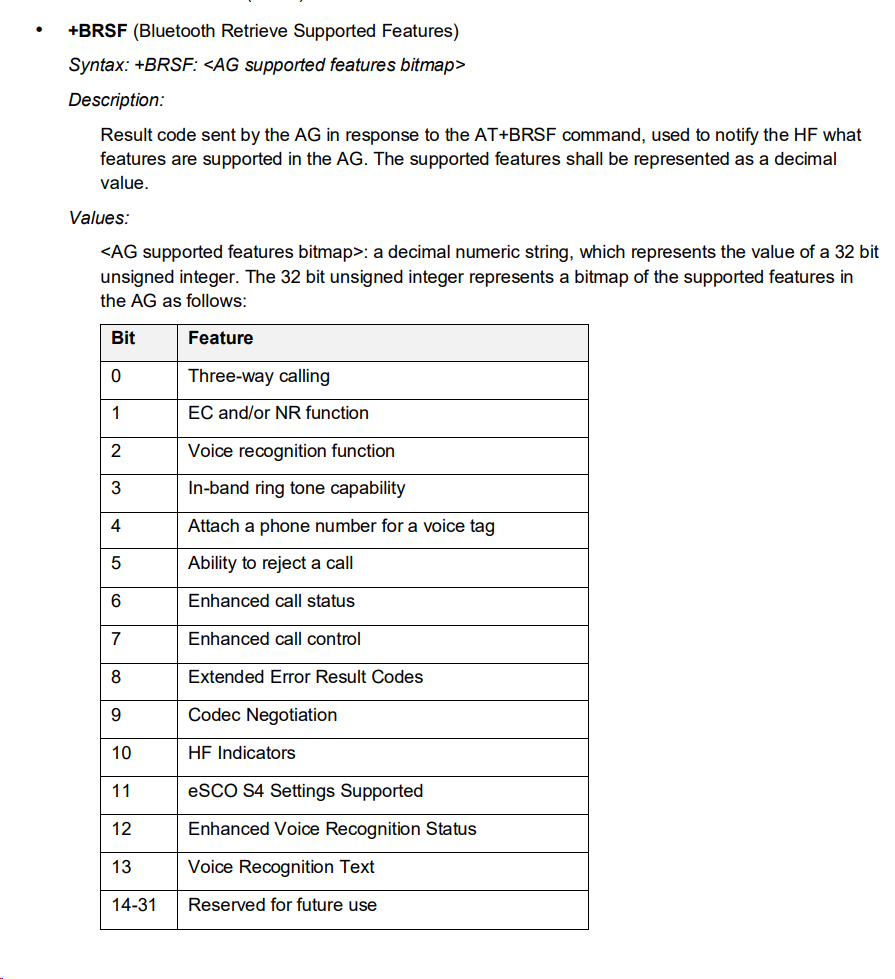

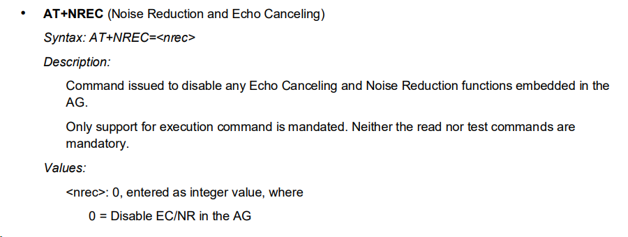

## RFCOMM

此简介要求符合RFCOMM标准[4].以下各小节连同相关小章节，除了RFCOMM中定义的要求外，还定义了与此配置文件有关的要求。

### RFCOMM互操作性要求

对于RFCOMM层，适用下列要求。
对于第4.2节定义的无手持配置文件，AG和HF都可启动RFCOMM连接的建立(见第6.1.1节)。
因此，为了读取RFCOMM[4]，AG和HF都可承担RFCOMM启动器的作用。
AG和HF应支持RFCOMM发起者的作用，如第9节所定义的[4].
AG和HF应支持 RFCOMM Acceptor角色，在 HFP 中定义为接受在DLLCI0 上建立RFCOMM 多路复用器控制信道的设备，如在第5.2.1节中定义的。[4].
AG和HF应支持RFCOMM客户角色，该角色定义在第9节中。[4].
AG和HF应支持RFCOMM服务器的作用，如在第9节中定义的[4].
表6.1概述了RFCOMM程序支持的超出RFCOMM定义的额外需求。[4].

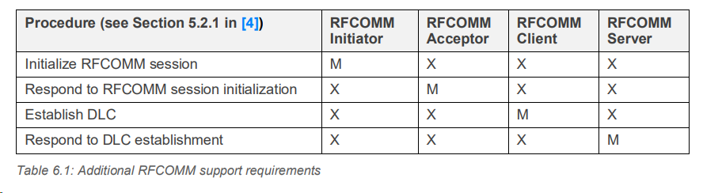

#### RFCOMM 链接建立

RFCOMM 连接建立是指第 5.2.1节中定义的 RFCOMM 多路复用器启动过程。[4]描述了在 DLCI0 上建立 RFCOMM 多路复用器控制通道。建立 RFCOMM 连接的设备应首先发现 HF 中定义的 SDP 服务记录和/或 AG 中定义的 SDP 服务记录的表 6.5，以发现对等设备暴露的 RFCOMM 服务器通道号。
建立 RFCOMM 连接的装置应启动第 6.2.1 节中定义的 L2CAP 通道建立过程，然后执行RFCOMM 多路复用器启动过程。当建立 RFCOMM 连接时，装置应继续执行第 4.2节中定义的服务级别连接建立过程，以在 SDP 服务记录发现期间发现的RFCOMM 服务器通道上建立服务级别连接。

### L2CAP 交互需求

对于 L2CAP 层，表6.2定义了与 RFCOMM [41]中定义的附加支持要求相同的要求。

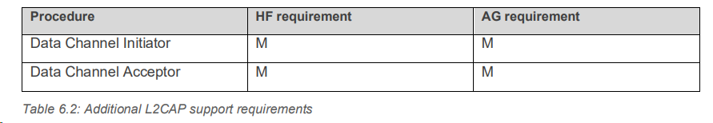

#### L2CAP channel 建立流程

第 6.1.1节中定义的建立 RFCOMM 连接的装置应发送 L2CAP 连接请求，并将 PSM 字段的值设置为 Bluetooth Assigned Numbers 中定义的 RFCOMM 值[8].

###  SDP 交互需求

下列服务记录是为免提配置文件定义的。其中一条服务记录适用于免提单元，另一条适用于音频网米
属性“SupportedFeatures”声明了每个设备支持的功能。此属性不编码为数据元素序列;它只是一个 16 位无符号整数。每个情况下支持的功能集在此属性中以是/否为基础进行位定义。功能与其在属性中相应位之间的映射在表6.4中列出，HF 在表 6.6 中列出。AG.如果设备表示支持某一特性，则它应以本简介所指定的方式支持该特性。
分配给 Value 列中使用的助记符的代码以及分配给属性标识符的代码(如果在 AttrlD 列中没有特别提到)，在 Bluetooth Assigned Numbers 中列出。[8]网页。
表6.4中给出的“SupportedFeatures”位图值应与AT命令AT+BRSF的位0到4的值相同(参见第5.3节)

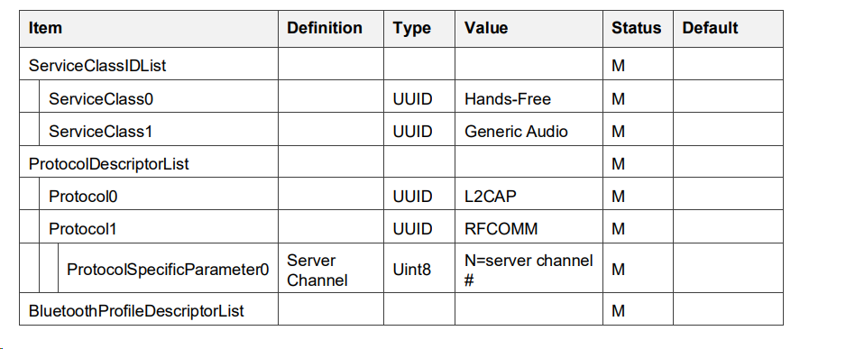

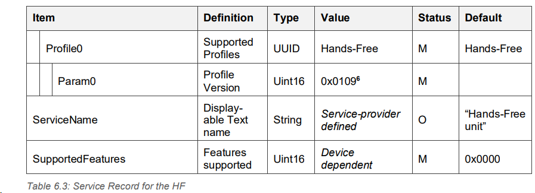

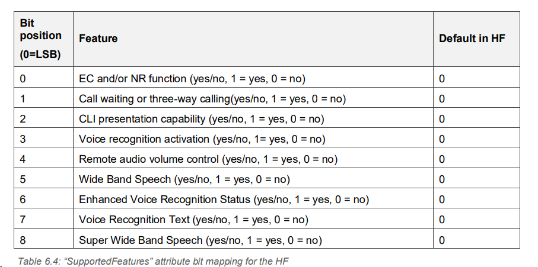

“网络”属性说明 AG 是否有能力拒绝传入的呼叫。该属性不编码为数据元素序列;它只是一个8位无符号整数。在“网络”属性中给出的信息与自发结果代码+BRSF的位5中给出的信息相同(见第5.3节)。将 0x00 的属性值转换为位值 0;将 0x01的属性值转换为位 1。
表6.6中给出的“SupportedFeatures”位图值应与未请求结果代码+BRSF的位0到4的值相同(参见第5.3节)。

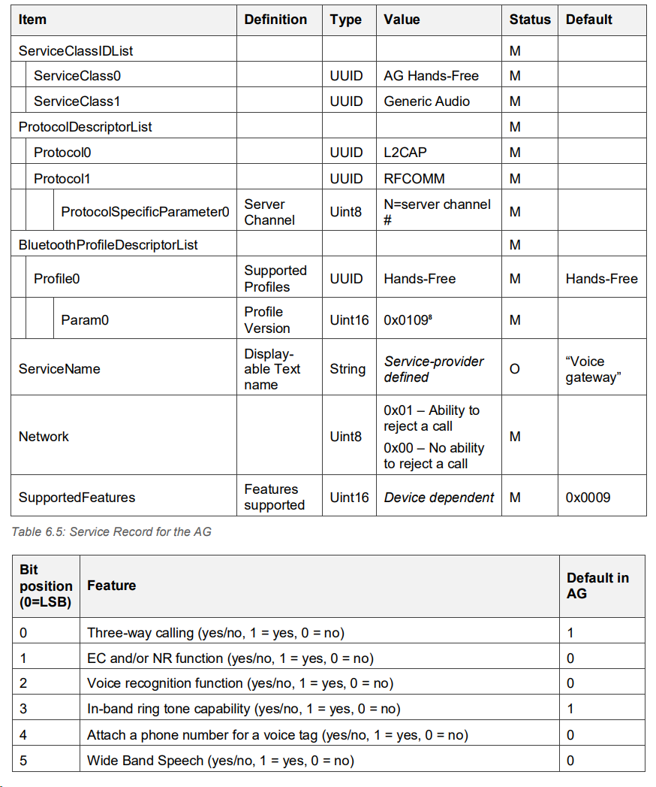

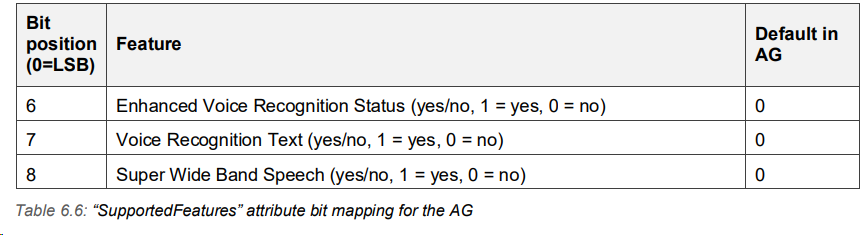

#### 与HFP Rev 0.96实现的交互

根据免提配置文件规范 Rev.0.96的 HF实现不会发送 AT+BRSF 命令。同样，根据免提配置文件 Rev.0.96 的 AG 实现无法对 AT+BRSF 使用 +BRSF 非请求结果代码进行响应。相反，它们将使用 ERROR 进行响应。
为了从不发送 AT+BRSF的 HF 中检索“SupportedFeatures”信息，AG 实现应使用服务发现。每当 HF服务记录中不存在“SupportedFeatures”属性，或者如果 AG不执行服务发现程序，则应假定表 6.4 中所述的默认值。
为了从不发送+BRSF的AG中检索“SupportedFeatures”和“Network”信息，HF实现应使用服务发现。每当AG服务记录中不存在“SupportedFeatures”属性，或者如果HF不执行服务发现程序，则应假定表6.6中规定的默认值。

#### 与HFP0.96、1.0和HFP1.5实现的交互

符合 Hands-Free Profile规格 Rev.0.96、1.0或1.5的HF实现不应显示对CodecNegotiation功能的支持，并且不应发送 AT+BAC命令或 AT+BCC命令以触发AG的音频连接建立。
符合 Hands-Free Profile 规格 Rev.0.96、1.0或 1.5 的 AG 实现不应表示支持 CodecNegotiation 功能，也不应向 HF 发送 +BCS 自发响应。
为了实现向后兼容性，HFP Rev.“x.y”实现应能够根据Free Hands Profile规范Rev.1.0或1.5来处理同步连接的建立。
HF应能接受从1.0或1.5AG的HFP建立同步连接。
AG应能够启动与HFP1.0或1.5HF的同步连接的建立。

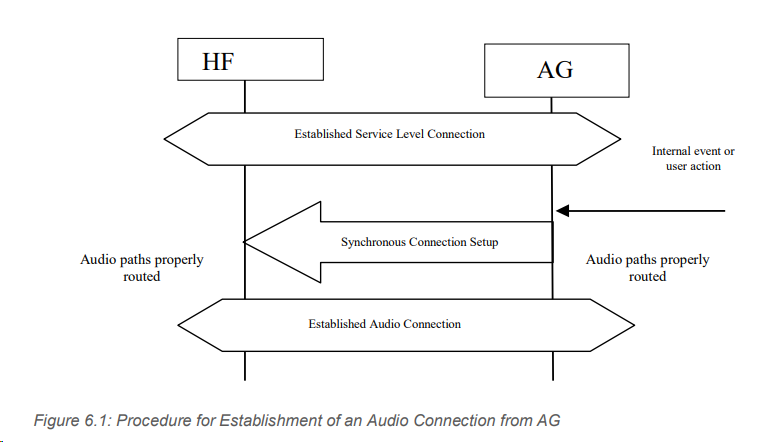

HF应能够启动与HFP1.0或1.5AG的同步连接的建立。

AG应能够接受从HFP1.0或者1.5HF的同步连接建立

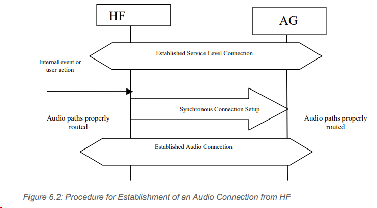

### LM 链路层交互需求

此配置文件要求支持链接管理器协议规范中定义的加密，该规范载于第2卷C部分3.5节。[1].
此外，本简介要求AG和HF器件都应支持同步逻辑传输，但须符合第6.6节的要求。

### 链路控制(LC) 交互需求

#### 设备的类型

实现 HFP 的 HF角色的设备应在服务类字段中设置“音频”位。如果 HF 打算被发现为“免提”，则它可以在设备类字段中使用以下值:
1.指定“音频”为主要设备类别。
2.将“HF”标记为小设备类别。
查询AG可以使用这些信息来筛选查询响应。

###  基带交互需求

如果支持宽带语音或超宽带语音，则应支持eSCO链路和空中模式“透明数据””，否则可选。
只有在支持核心2.1或更高版本的情况下，才能为宽带语音使用错误的数据传输。

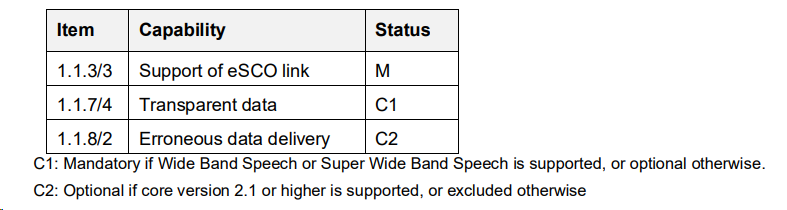

### codec 交互需求

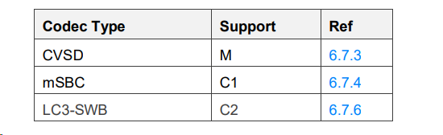

#### sco 交互需求

##### 同步传输选择

启动同步连接请求的设备称为发起者，接收请求的设备称为响应者。响应者可以接受或拒绝逻辑传输请求
为了选择要使用的同步传输类型(eSCO或SCO)，设备应遵循以下逻辑:

- 如果响应器支持eSC0，则应首先在eSCO逻辑传输上尝试同步连接。参见6.7.1.2节。
- 如果 eSCo 无法使用(例如，响应器不支持或链路建立失败)，并且SCO 当前未被禁止因为正在使用 BR/EDR 安全连接)，则发起方应打开SCO 逻辑连接。参见第6.7.1.3节。

##### eSCo配置参数的谈判

在本节中，给出了HCI层作为参考。在未包含HCI的系统上，应使用与这些HCI参数相对应的LMP级eSCO连接参数Tesco、Wesco和分组长度的等效值。以下要求适用于支持和使用eSCO逻辑传输，并基于参数集S1-S4和T1-T2:

- 发起者对 eSC0 传输的请求可能涉及与语音编解码器的双向吞吐量要求匹配的任何配置参数(见第6.5节)。如果该设备支持 HCI，则设置同步连接的请求可能包括在同一请求中掩蔽的单包或多包类型。
- 响应者可以选择接受或拒绝发起者的请求。它可以拒绝 eSCO传输请求，也可以接受与请求参数不匹配的参数。在这种情况下，发起者可以尝试使用不同的配置参数重新设置同步连接。
- 建议在使用 BR/EDR安全连接时使用S4或T2设置，当使用复杂的拓扑结构时，或者当设备想要提高与其他无线技术的共存性时。
- 如果 S4、S3 或 T2 请求失败，且发起者需要使用基于时间分割的解决方案实现MWS 共存，则发起者应尽最大努力重新配置其 MWS无线电，使其不再需要使用基干时间分割的方案实现 MWS 共存。例如，AG 可能有机会更改其使用的蜂窝频段，以便在同步连接期间关闭 MWS 共存功能。
- 当远程设备请求时，设备应接受使用 S4或T2设置。仅支持此配置文件1.7.1或更早版本的设备可能会拒绝 S4 设置，在这种情况下，发起设备应请求 S3 设置。

- 如果请求 eSC0 逻辑传输失败，发起者不得在未请求使用下表所述的“安全设置”的情况下放弃 eSCo 传输的设置:
- 如果请求 eSCo 逻辑传输失败，发起者不得在未请求使用下表所述的“安全设置”的情况下放弃
  eSCo 传输的设置:

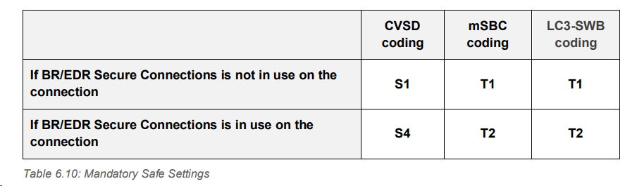

仅适用于基于 HCI 的设备:如果 Responder 不拒绝 eSCo 传输的请求，则在接受请求时，响应应始终包括与表 6.10 中指定的“安全设置”相对应的参数。如果发起者未能使用 S1 设置建立 eSCo 传输，则发起者应请求设置 SCO 传输，如果当前未因正在使用 BR/EDR 安全连接而被禁止。
如果Wide Band Speech或Super Wide BandSpeech得到支持，并且发起者未能使用T1设置建立eSCO传输，或者如果使用安全连接，发起者未能使用T2设置建立eSCO(或SCO传输)传输，则发起者应尝试使用窄带CVSD编解码器通过eSCO(或如果当前没有因使用BR/EDR安全连接而被禁止则通过SCO传输)建立编解码器连接。

##### SCO组成参数协商

参数集D0-D1涵盖了在允许使用SCO传输的条件下使用SCO链路的要求。

#### transparent Data 同步头

定义了两个同步标头;第一个标头只包含序列号，第二个标头同时包含同步字和序列号。
H1:带序号的头文件
图 6.3 显示了仅包含序列号的标题 H1的布局。一个字节的标题应包含4位序列号(SNO，…，SN3)。序列号由简单的重复代码保护(所有位都重复)。因此，序列号中的每对连续位始终为 00 或 11。

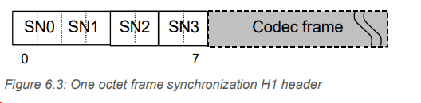

在使用错误数据交付功能时，H1报头中的序列号应始终与0不同，原因是错误数据交付功能将0设置为与丢失(e)SCO数据包相对应的有效载荷数据八位组。

H2:带同步字和序号的头文件
图 6.4显示了包含同步字和序列号的标题 H2的布局。两个八位字节的标题应包含一个12 位的同步字和两个2位的序列号(SN0、SN1)。后者由一个简单的重复代码保护(两个位都是重复的)。因此，序列号中的每一对位总是 00或 11。

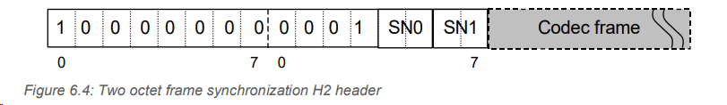

需要注意的是，当使用透明数据传输时，编码音频流帧(编解码器帧和同步字)与eSCo 数据包边界的对齐由实现决定。使用同步头使接收方能够恢复未对齐的编解码器音频帧。为了成功播放音频，接收方不应假定 eSCo 数据包中同步头的位置。接收方应能够播放接收到的音频。

#### CVSD 编码

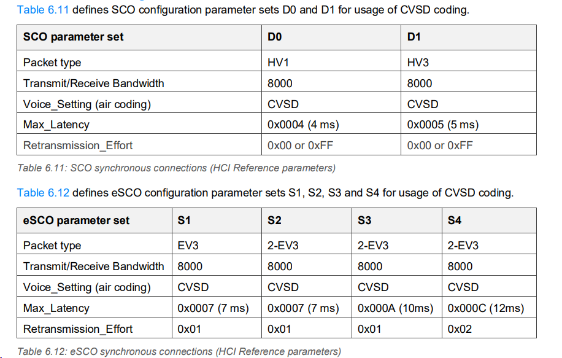

#### mSBC 编码

如果此配置文件支持宽带语音，则必须支持修改后的SBC编解码器(以下称为mSBC)。原始SBC编解解码器在A2DP中指定。[7].构成mSBC的对SBC的修改见本简介附录A。
此编解码器的各种强制性和可选设置在下表中指定如果支持宽带语音，则必须支持以下mSBC配置。

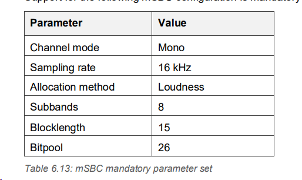

mSBc帧在每个帧之前应有同步标头H2。H2标头允许接收机知道是否丢弃了一个或多个无线链路包。
在使用mSBC编解码器时，宽带语音应仅使用eSCO传输。应支持下面的eSCOT1设置。

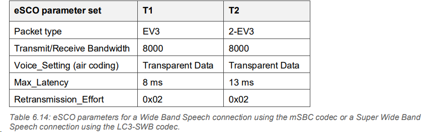

#### codec 和链路参数协商

本配置文件中定义的编解码器协商程序确定在建立音频连接时使用哪种编解码器。该程序不用于
协商与所选编解码器一起使用的链路参数。链路参数由链路管理器使用链路管理器协议协商。
推荐的链接参数为:
对于 CVSD:S4优于S3，S3 优于S2，S2优于S1，S1优于 D1，D1优于 DO。使用S4 的决定也可能基于特定实现的共存用例。
对于mSBC:T2优于T1。

对于LC3-SWB:T2优于T1。

#### LC3-SWB 编码

如果此配置文件支持超宽带语音，则必须支持LC3-SWB编解码器。该编解码器的规格在LC3规范中指定。[10]AG和HF应同时实现LC3-SWB编解码器的编码器和解码器。
LC3-SWB的设置见表6.14和表6.15.
如果支持超宽带语音，则必须支持表6.15所示配置。

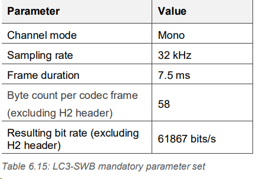

参见3.2.5 对于位速率值与字节数之间的关系。LC3-SWB帧在每个帧之前都应有同步头H2。2字节的H2头使接收机能够确定是否丢弃了一个或多个无线电链路数据包。
使用 LC3-SWB时，超宽带语音应仅使用eSCO传输。应支持表6.14所示的eSCO T1设置。

### 语音质量建议

将宽带语音和超宽带语音引入HFP配置文件，可以提高最终用户对语音质量的满意度。超宽带语音对应于5G语音服务中提供的最大音频带宽，并且由许多OTT语音服务提供。应使用具有最高音频质量的可用编解码器。例如，超宽带语音比宽带语音更可取，宽带语音比窄带语音连接更可取。

#### PLC 包丢失隐藏

强烈建议在压缩音频(如 mSBC和LC3-SWB)的接收端实施某种形式的 PLC，以在降级信道条件下减少合成音频的伪像。
对于 mSBC，可以使用附录C中提供的示例PLC算法。在典型的分组丢失条件下，此示例 PLC 的语音质量被认为是令人满意的。如果实现选择修改或实现替代 PLC 方案，则任何此类替代 PLC的性能应满足或超过附录C中提供的示例PLC的性能。

LC3 规范[10]还提供了一个可用于超宽带语音的PLC算法示例(参见附录B[10])

#### 信号水平

在本规范中，对编解码器进行16位线性PCM接口的全速定义是3dBm0。此定义适用于支持窄带、宽带语音和超宽带语音的设备。
关于推荐音频级别的详细信息见附录D第13.1节。
发送和接收频率掩模的推荐规格载于附录D第13.2节。

## GAP

本节定义了核心规范“通用访问配置文件”中定义的功能的支持要求.

### 模式

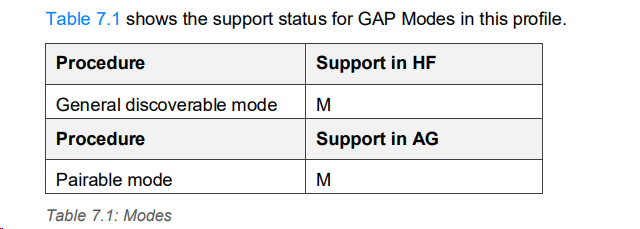

对于免提单元和音频网关，基带身份验证和加密是可选的。如果两个设备都支持身份验证和加密，则两个设备上的应用程序可能需要使用它们。但是，如果两个设备都支持安全连接，则蓝牙核心 4.1规范(或更高版本)强制使用它。
免提单元可以在不创建安全连接的情况下使用音频网关的服务。是否由免提单元为用户提供或支持安全执行，取决于具体实现。
无论何时使用基带身份验证或加密，两个设备都应使用通用访问配置文件(第3卷，C部分，第 5.1节)中描述的 GAP 身份验证程序创建安全连接。[1]).该过程可能包括输入蓝牙 PIN 码或密钥，并创建适当的链接密钥。如果 Simple Secure Pairing未使用且免提单元的 U受限，则可在 GAP 身份验证过程中使用固定蓝牙 PIN 码。
则经过身份验证的有效载荷超时应小于或等于10秒。超时后的断开连接行如果使用安全连接，为是实现所特有的。

### idle 模式流程

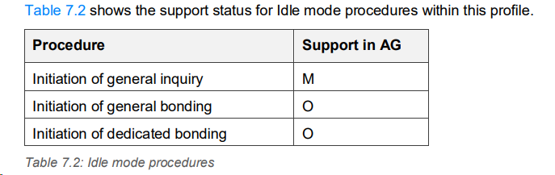

## 参考

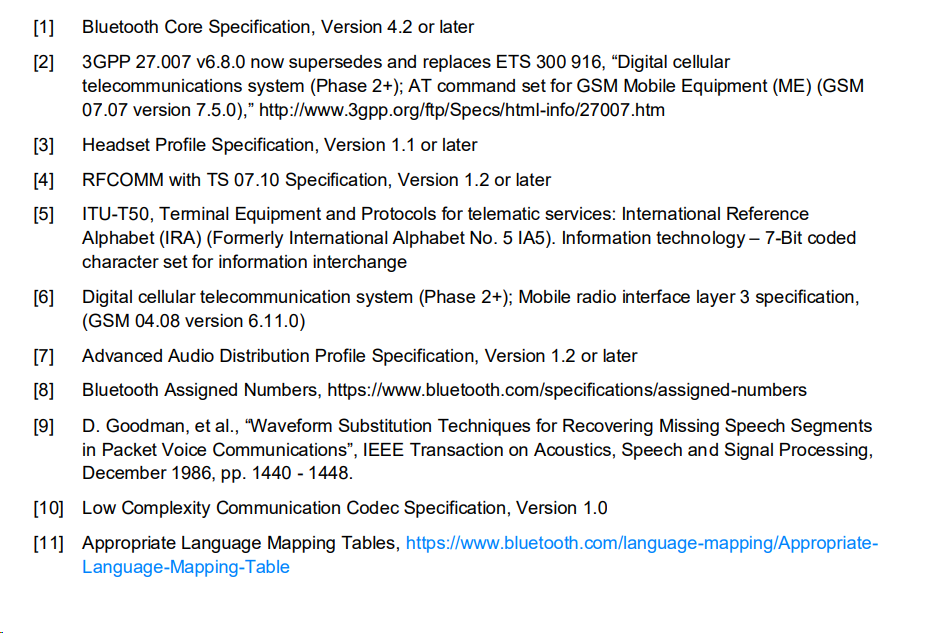

## 缩写

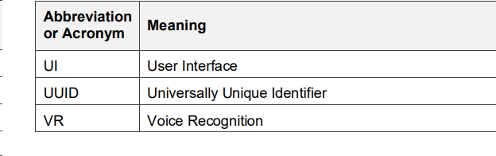

## mSBC 技术

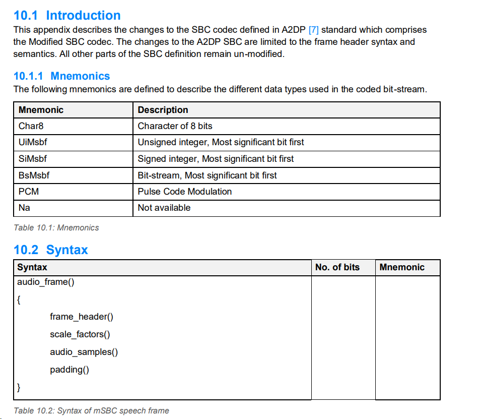

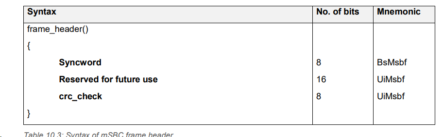

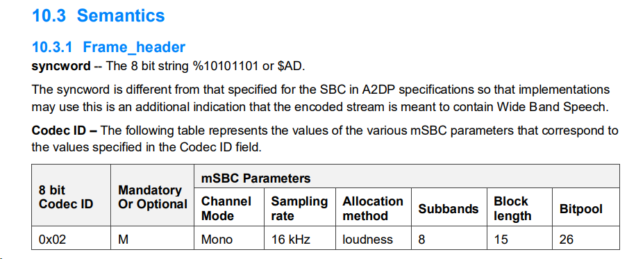

## codec ID

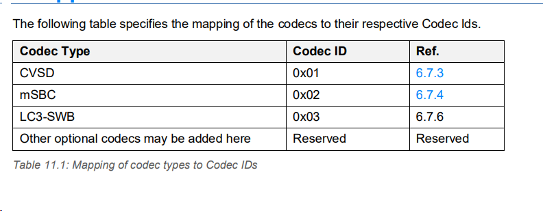

## PLC 实现

## 质量指标

## LC3-SBW 技术

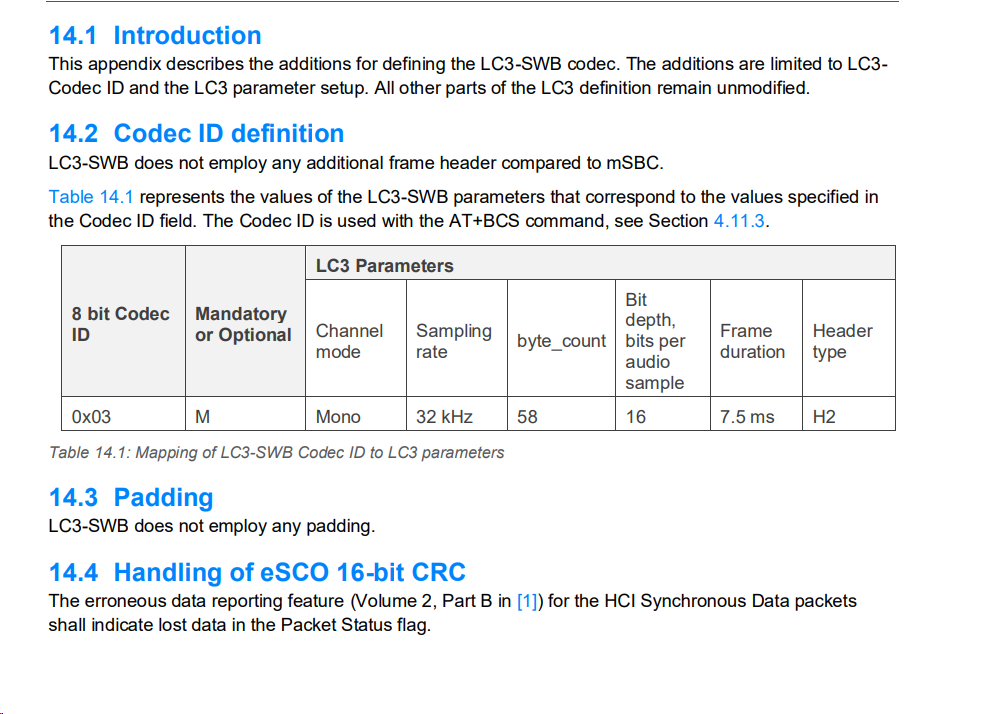