# HFP 

本文基于HFP1.9 pdf，以及一些cfa的讲解

**HFP1.9 -> HFP1.8 更新主要内容**

**LC3-SWBS  超级宽带语音**

**HFP1.8 -> HFP1.7 更新内容**

**EVRA: 增强语音识别激活**

**HFP1.7-> HFP 1.6 HF 指示器**

## 简介

 HFP(Hands-free Profile)，可以让蓝牙设备可以控制电话，如接听、挂断、拒接、语音拨号等，拒接、语音拨号要视蓝牙耳机及电话是否支持。

HFP定义了音频[网关](http://baike.baidu.com/view/807.htm)(Audio Gateway)和免提组件(Hands Free)两个角色：

**AG**–该设备为音频（特别是手机）的输入/输出网关。通常指的是**手机**

**HF**–该设备作为音频[网关](http://baike.baidu.com/view/807.htm)的远程音频输入/输出机制，并可提供若干遥控功能。通常指的是耳机或者其他免提设备。**通常指带有麦克风的耳机或者音箱**

下面是HFP1.9 中的章节，主要内容在章节4和章节5。 

| 章节                               | 大概内容            | 备注                                         |
| ---------------------------------- | ------------------- | -------------------------------------------- |
| 1  Introduce                       | 介绍                | 仔细看完，                                   |
| 2 Porfile overview                 | Profile 大概内容    | 仔细看完，                                   |
| 3 application layer                | AG和HF需要的feature | 仔细看完，重点feature索引都在这里            |
| **4 Hands-Free Control**           | **AT 命令交互**     | **仔细看部分，需要的时候要能快速查到仔细查** |
| **5 AT Command and Results Codes** | **AT cmd和结果**    | **仔细看部分，需要的时候能快速仔细查**       |
| 6 RFCOMM                           | RFCOMM 交互需求     | 仔细看完，                                   |
| 7 GAP                              | GAP中的需要内容     | 仔细看完，                                   |
| 8-9                                | 参考和专业名词      | 不用看                                       |
| 10 mSBC技术                        |                     | 需要处理codec的需要仔细看                    |
| 11 code ID                         |                     | 仔细看完，                                   |
| 12 PLC 的实现                      |                     | 需要PLC的仔细看                              |
| 13 质量指标                        | 音质质量指标        | 略看                                         |
| 14 LC3-SWB 技术                    | LC3-SWB 技术指标    | 略看                                         |

## 框架结构

****

HFP 最核心的就是AT CMD， AT CMD是HFP的主要内容，主要是AT 命令来处理大部分HFP流程。

涉及到AT CMD来传输命令，AT CMD类似于很多网络卡片，例如WIFI 里面的cmd，需要通过串口相互传输，所以AT CMD是架设在RFCOMM之上的

另外大部分的br/edr的profile都是有SDP做服务描述的。类似于的GATT里面的service表格。

HFP还需要使用GAP的一些定时器等相关的服务。

打电话传输的音频数据是用的msbc还是CVSD来传输的，由Hfp来控制。

### AG HF 交互框图

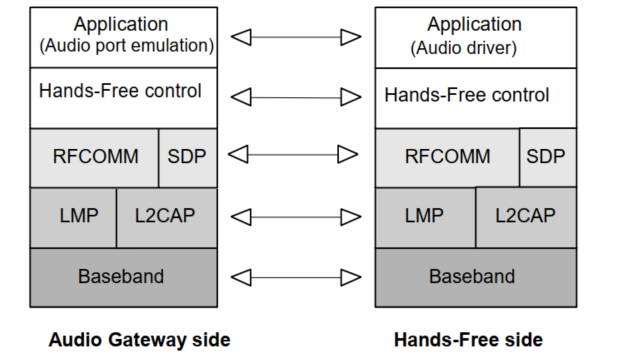

这里有个类似于OSI的网路协议的结构

L1 : baseband  物理层，这层是无线电流

L2: 数据链路层， LMP 和L2CAP层

L3: 网路层， 这一层是广播和发现来实现。

L4: 传输层 RFCOMM 

L5: 会话层  

L6: 表示层： SDP

L7: 应用层： HFP

##  SDP 服务

AG端和HF端都维护一张SDP表， profile中列举了该表的说明，主要这张表中有一个feature需要重点了解一下。

我们来看下这张表中的内容

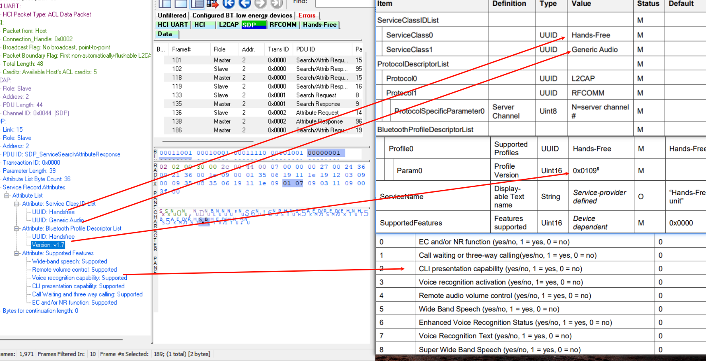

HF的SDP中会有HF端的HFP的版本信息，如图1.7

下面是HF的feature

- EC/NR 这个是回声消除和降噪
- call waiting or three-way calling  三方通话是否支持
- CLI presentation capability  主叫线路识别
- Voice recognition activitation  VR 语音识别
- remote audio volume control    远程音量控制
- wide band speech    WBS 宽带是否支持（msbc）
- enhanced Voice recognition 状态， 高级语音识别VR是否支持
- Voice recognition text   ： 语音识别文字是否支持
- Super Wide Band Speech    : SWBS 是否支持

下面是AG端的SDP 信息

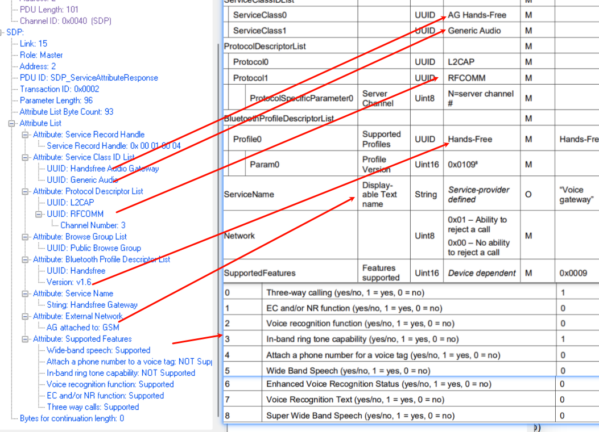

这边只讲feature信息，其他的部分可以在assigned number中获取

- Three-way calling   三方通话是否支持
- EC/NR    回声消除和降噪是否支持
- Voice recognition   语音识别
- In-band ring tone capability   是否支持带内响铃
- Attach a phone number for voice tag   是否支持电话号码当成一个tag

- WBS  宽带载波是否支持
- Enhance Voice Recoigition  高级语音识别装调
- Voice Recognition Text  语音识别文字
- SWBS   LC3宽带载波是否支持

上面所有描述的feature 都在第三章节中有对应的流程索引

## AT 命令

上面是蓝牙相关的，下面就要讲到AT命令

AT cmd是控制整个HFP的灵魂，都是贯穿大部分的流程，

AT+都是由HF端发起的, 比如AT+BRSF

AG端回应的都是+..     比如+BRSF

AT命令基本沿用了3GPP中定义的AT cmd的部分内容, 同时蓝牙有自己扩充的,

需要看详细内容,就可以看[27007-680_at_cmd.doc](ref\27007-680_at_cmd.doc) 

AT命令中有个特点，如果第一个字母是B的话，基本上都是bluetooth的扩充的。

可以参考章节5.3， 有对BLUETOOTH扩充的AT命令说明

AT命令格式：

HF-> AG:

<AT command> <cr>

AG-> HF:

<cr><lf>OK<cr><lf>

<cr><lf>ERROR<cr><lf>

<cr><lf><result code><cr><lf>

5.2 章节讲了哪些3GPP规定的AT命令是沿用的

### AT命令 详解

AT命令可以看几个特殊的命令讲解，其他的命令根据文档可以自行查看

#### AT 通用命令

通用的AT命令都是基于GSM的。

- ATA
- AT+CIND

标准指标更新 AT 命令。只读取命令 AT+CIND？和测试命令 AT+CIND=？在本规范中是必需的。

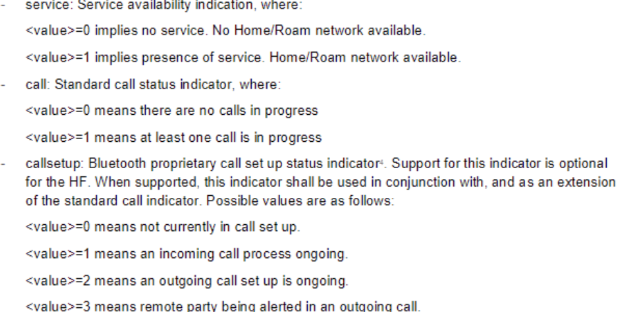

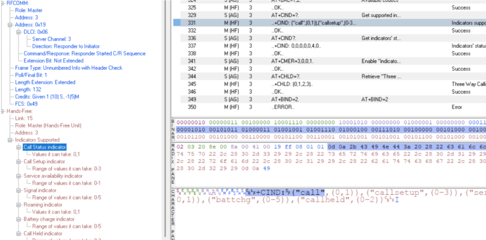

这几个值可能比较重要

call status ：

call Setup profile中4.33章节有介绍：

call held indicator

Service availability

signal ：应该就是信号强度： 0-5数值

roam： 应该就是漫游的状态：0 代表没有漫游， 1代表在漫游

battchg：是电池的状态：0-5数值型。应该就是通常耳机端电池电量的意思

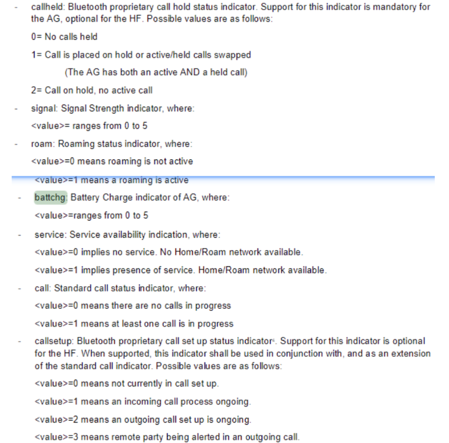

#### AT 蓝牙 命令

- AT+BRSF

查看bluetooth 支持的特性

这个特性又检查了一遍，部分和SDP的类似

下面的图是HF的支持feature

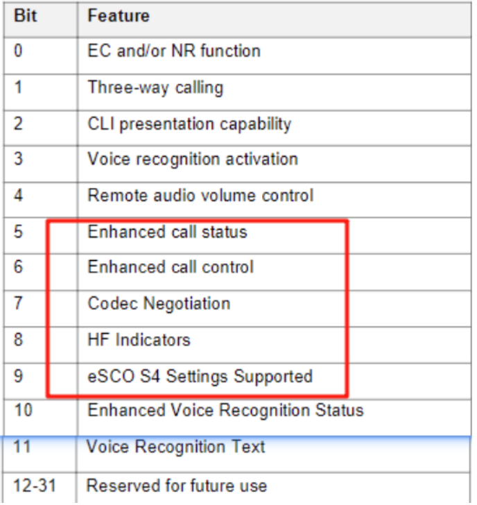

这里没有SWBS的支持，多了通话和指示器的支持以及S4的支持。

这里是个32bit的数值

AG的feature

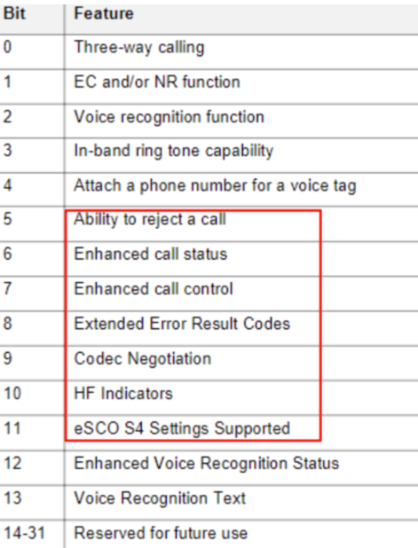

边也是的和SDP差别在途中标红的地方

- AT+BIA(Bluetooth Indicators Activation)

蓝牙指示灯激活

- AT+BINP(Bluetooth INPut)
- AT+BLDN (Bluetooth Last Dialed Number)

蓝牙拨打上一通电话

- AT+BVRA(Bluetooth Voice Recognition Activation)

语音识别唤醒

- +BVRA (Bluetooth Voice Recognition Activation)
- AT+NREC (Noise Reduction and Echo Canceling)

回音消除和降噪

- AT+VGM (Gain of Microphone)

麦克风音量

- AT+VGS (Gain of Speaker)

音箱音量大小

- +BSIR (Bluetooth Setting of In-band Ring tone)

带内响铃

- AT+BTRH (Bluetooth Response and Hold Feature)

- +BTRH (Bluetooth Response and Hold Feature)

- AT+BCC (Bluetooth Codec Connection)

- AT+BCS (Bluetooth Codec Selection)

  1是cvsd 2 是msbc

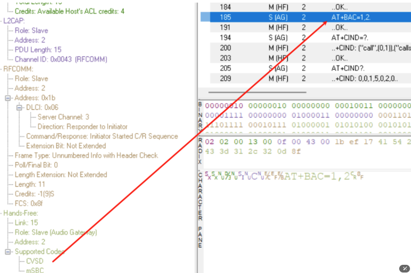

- +BCS (Bluetooth Codec Selection)

- AT+BAC (Bluetooth Available Codecs)

- AT+BIND (Bluetooth HF Indicators Feature)

  只有HF和AG端都定义HF indicator 则该命令有用，值如下， 一般用于指示电量

  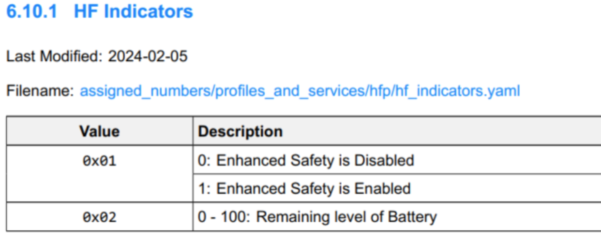

  - +BIND (Bluetooth HF Indicators Feature)
  - AT+BIEV (Bluetooth HF Indicators Feature)

  ## 流程

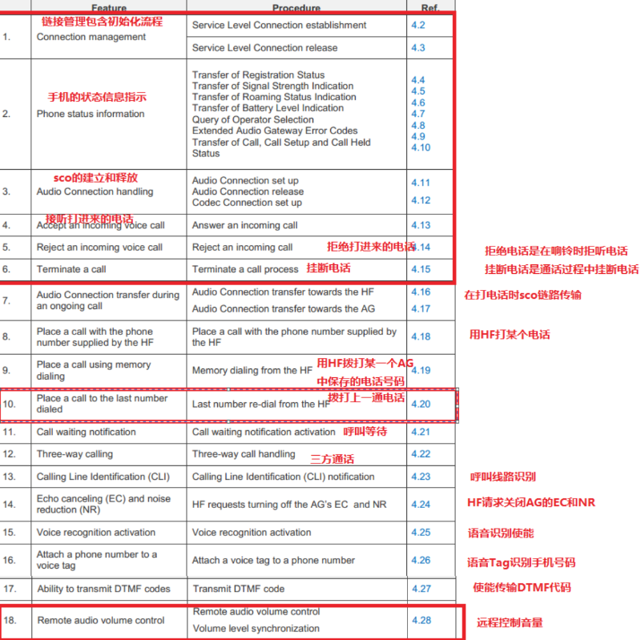

流程主要讲述如何发送AT命令。

很多feature都是需要看流程来展示的

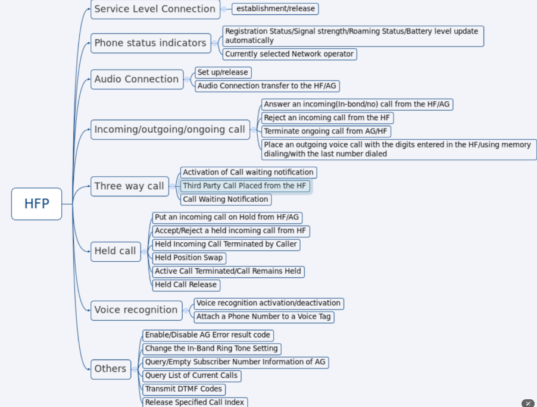

这边选择一个codec选择的 例子，基本上讲的是AG端发送了+BCS 后面跟着codec的值

然后HF端返回AT+BCS 

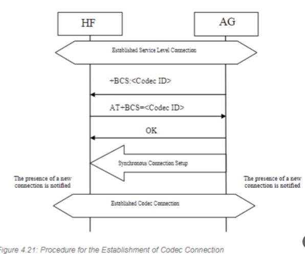

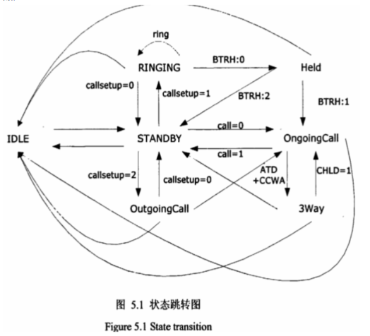

## 6 CODEC

HFP的编码方式：

编码方式一共有3种：CVSD mSBC LC3-SWB

空气中传输方式有： sco 和esco

HFP 中总结一下集中传输格式

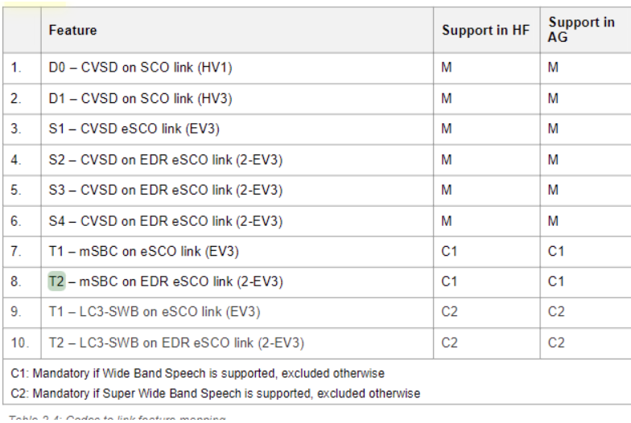

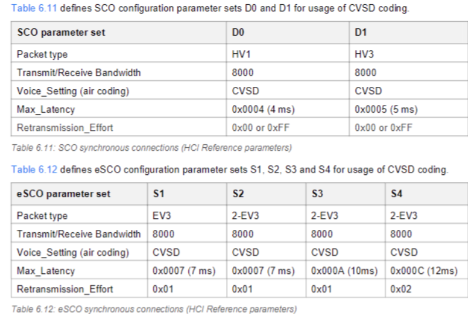

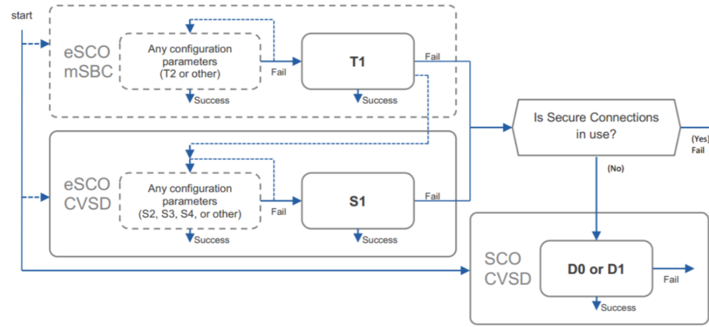

附：两种audio的codec
CVSD: pcm: 8kHz, 16 bits, 1 channel.
     compression ratio: 16 (controller encoding)
     insert ratio: 8
       pcm data rate= 16kB/s =8K*16/8
     CVSD data rate=8kB/s =16kB/s* 8/16
      air data: CVSD
mSBC: pcm 16kHz, 16 bits, 1 channel.
     compression ratio: 4 (host encoding: 240->60)
       pcm data rate= 32kB/s
       mSBC data rate=8kB/s = 32kB/s / 4
      air data: transparent data (mSBC)

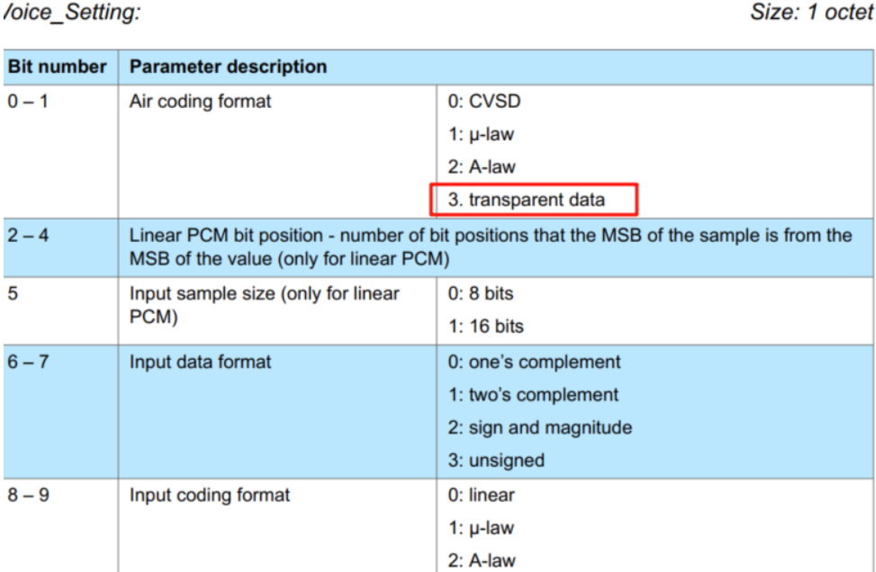

参考：

[1] Bluetooth Core Specification, Version 4.2 or later  

[2] [27007-680_at_cmd.doc](ref\27007-680_at_cmd.doc) 

[3] [HFP_v1.9.pdf](ref\HFP_v1.9.pdf) 

[4]  [headset 1.1.pdf](ref\headset 1.1.pdf) 

[5]  [Assigned_Numbers.pdf](ref\Assigned_Numbers.pdf) 