# ble_app_blinky 介绍

## 简介

​		此ble_app_blinky是nordic nrf5x系列芯片的蓝牙从设备（Slave）应用程序。基于Nordic nRF5_SDK_16 的软件包移植而成。


​		支持RT-Thread实时嵌入式系统。作为RT-Thread软件包nrf5x_sdk的例程，可通过RT-Thread 开发辅助工具Env直接配置到RT-Thread系统工程中。


​		nrf5x_sdk软件包网址：https://github.com/supperthomas/nrf5x_sdk

## 功能

​		ble_app_blinky应用程序实现了通过蓝牙主设备（Master）控制从设备（Slave）的led灯闪烁，并且能监测按钮的按压、抬起状态。


​		功能集成到一个服务中，服务包括LED和Button两个特性。LED特性支持读、写，Button特性支持读、通知。

## 软硬件平台

​		硬件平台是nordic的nrf5x系列开发板。


​		软件平台是nrf5x系列芯片的RT-Thread嵌入式系统工程，工程需要包含nrfx和nrf5x_sdk两个软件包，Nordic ble协议栈s140，片上外设配置包含UART和GPIO。

## 试验

### 试验板

​		以nrf52840开发板试验。如下图：


### 程序配置设置

- 下载RT-Thread的nrf52840 BSP工程模板，下载地址是 https://github.com/RT-Thread/rt-thread

- 下载并安装RT-Thread 开发辅助工具Env。参考RTT安装介绍，下载地址 https://www.rt-thread.org/page/download.html

- 进入nrf52840工程文件夹

  \rt-thread\bsp\nrf5x\nrf52840

  

- 打开env配置工具

  在工程中右击选择ConEmu Here

  

- 然后弹出如下界面

  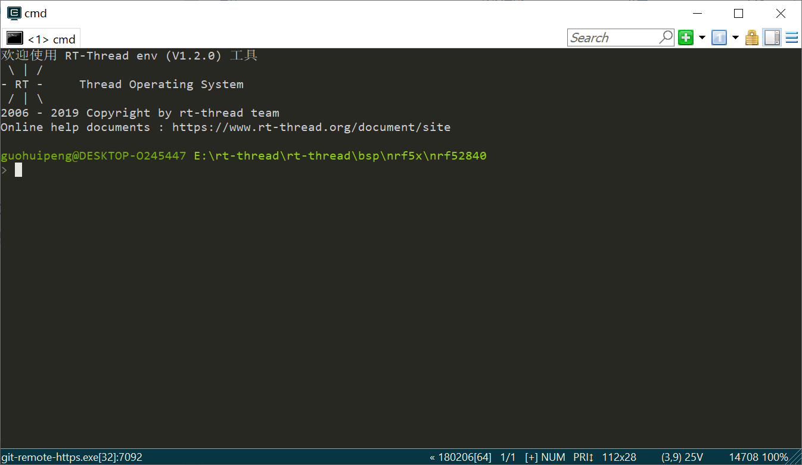

- 输入menuconfig弹出如下界面

  

- 使用方向键选择配置UART和GPIO

  


在Enable UART中可以选择UART0或者UART1，可以配置rx和tx的引脚编号。此开发板选择默认。


- 配置ble协议栈

  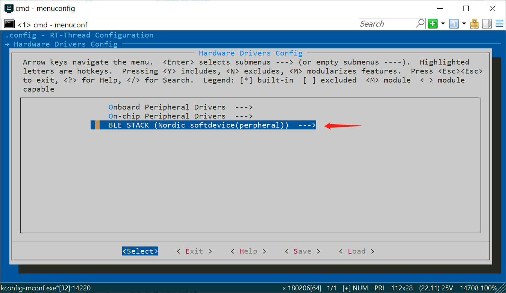

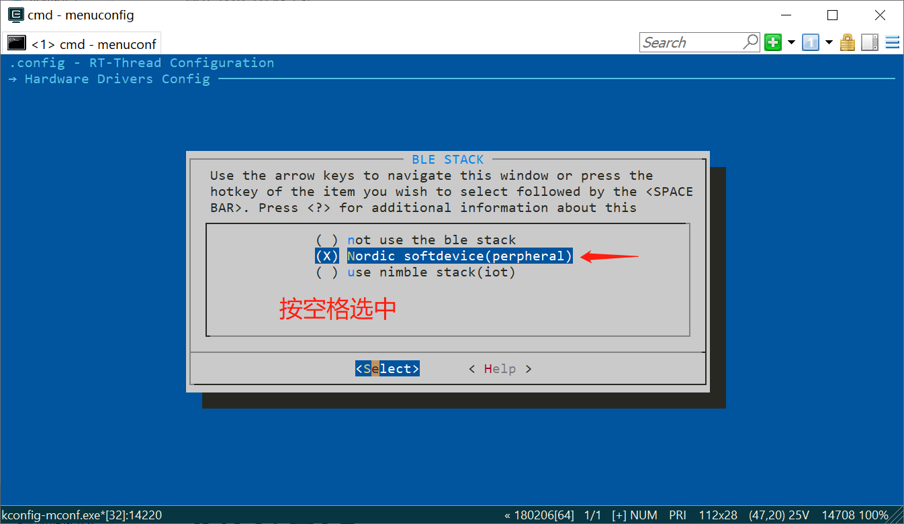

- 配置nrfx和nrf5x_sdk软件包

  

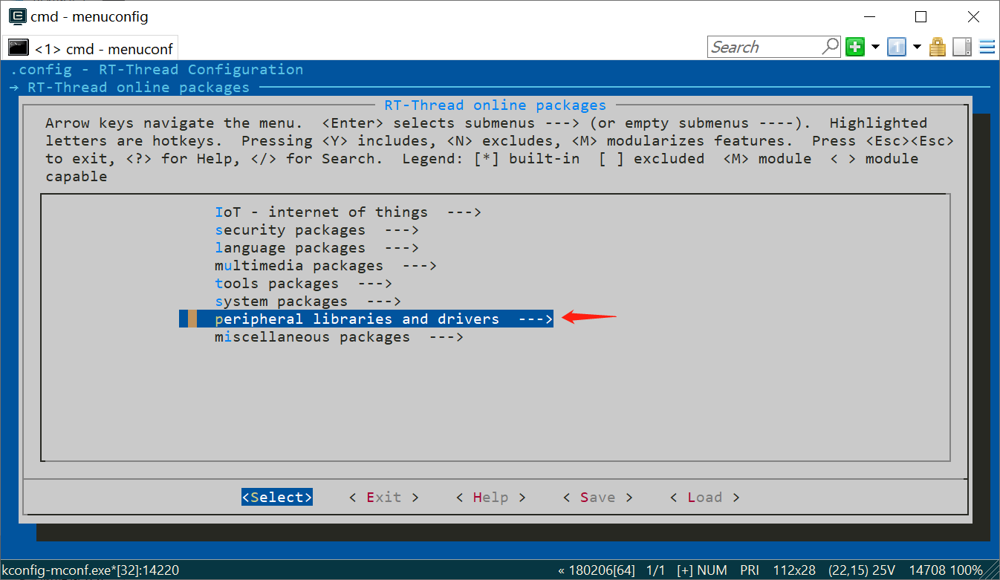


在nrf5x_sdk中选择ble_app_blinky应用例程

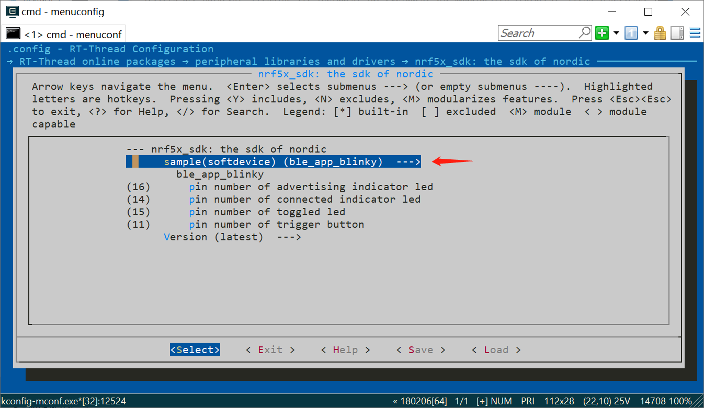

ble_app_blinky例程中可以配置应用使用的引脚编号（要与开发板对应），此开发板选择默认值。引脚编号是rtt驱动层drv_gpio.c对nrf5x芯片定义的引脚编号。从1-47依次对应gpio端口0的32个引脚和gpio端口1的16个引脚。

### 配置编译

按Esc退到该界面


选择yes保存，出现如下界面


输入scons --target=mdk5回车编译工程，因为使用mdk5开发环境，也可以根据具体环境选择mdk4或者iar等。

编译需要一段时间，完成后退出env工具。

### 编译下载程序

打开项目中的工程文件


编译工程

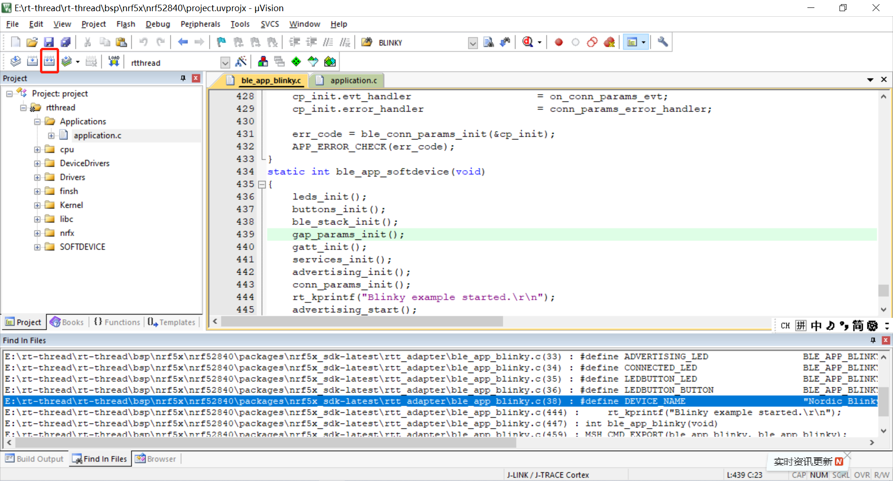

连接开发板，选择softdevice，下载程序

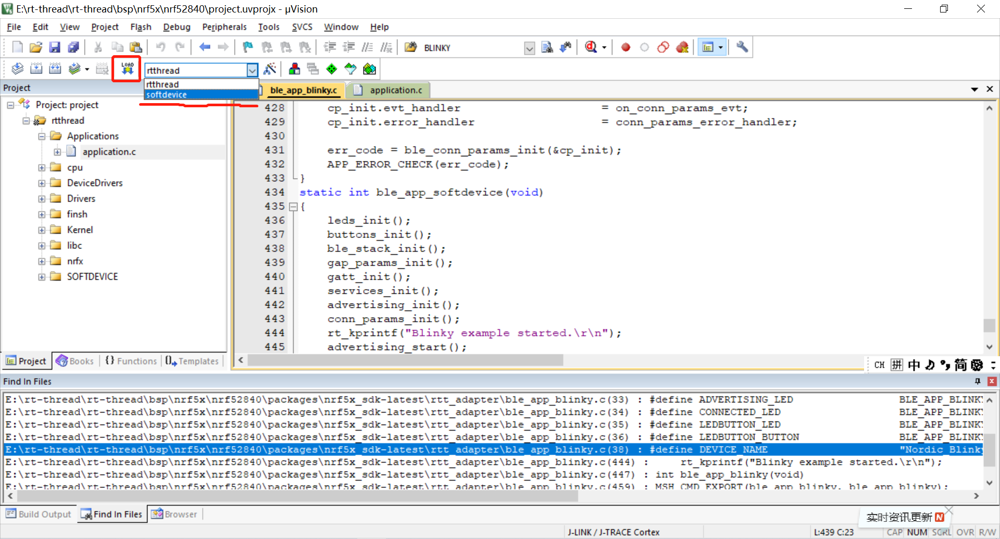

选择rtthread，下载程序


打开串口调试助手，首次启动运行出现如下信息

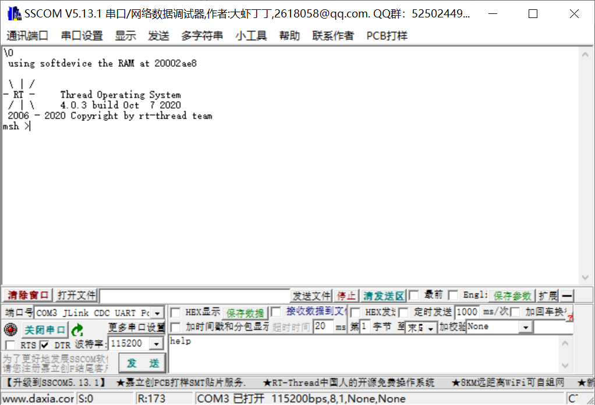

输入help，按压回车，出现如下信息


输入ble_app_blinky，启动ble_app_blinky应用例程。开发板的广播指示灯亮。

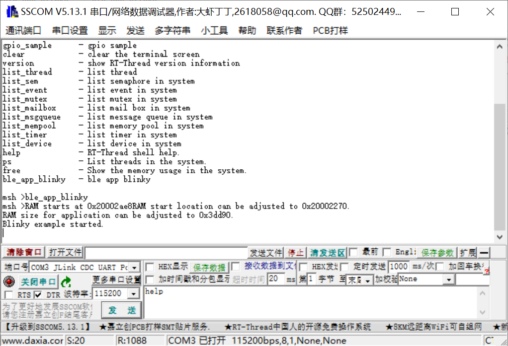

### 手机连接验证

手机端下载nRF Connect工具。下载地址是


https://www.nordicsemi.com/Software-and-tools/Development-Tools/nRF-Connect-for-mobile


打开手机蓝牙功能，打开该app，搜索到Nordic_Blinky。


点击CONNECT，连接并打开按钮和LED服务


按照下面操作，可蓝牙无线控制开发板。

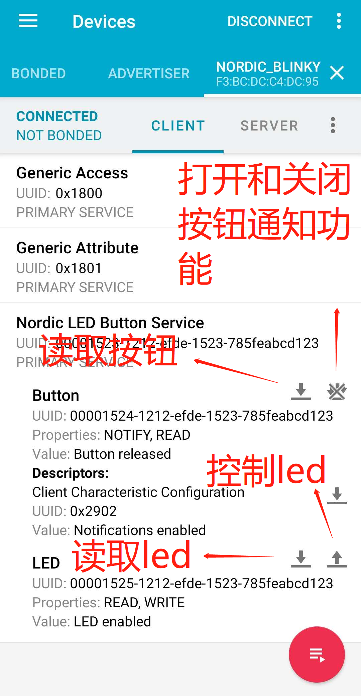

## 软件结构

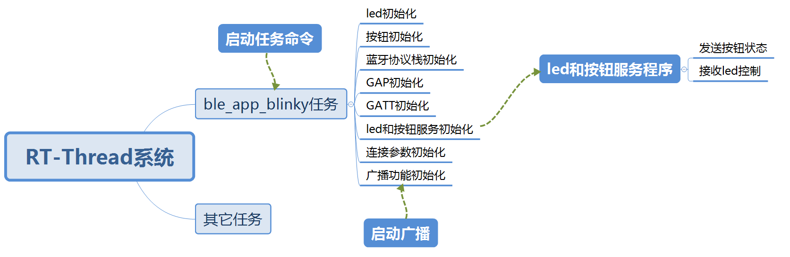


## 程序

程序调用接口主要有：

协议栈softdevice s140的通用接口函数，在nrf5x_sdk包softdevice的文件夹下。


rt-thread与nrf5x_sdk适配接口函数，在nrf5x_sdk包rtt_adapter文件夹下。


nrf5x_sdk包含的ble服务组件层针对led和按钮的接口函数，在ble_lbs.c和ble_lbs.h里面。ble_lbs.c和ble_lbs.h是在协议栈softdevice s140的API接口之上封装的模块工具，可用于为包含有led和按钮服务的app提供添加服务，添加特性，注册事件句柄。


rt-thread的pin组件接口函数，配置nrf5x芯片的gpio口。

### 创建ble_app_blinky任务

```c
int ble_app_blinky(void)
{
	static rt_thread_t tid1 = RT_NULL;

   	tid1 = rt_thread_create("softdevice",
                        ble_app_softdevice, RT_NULL,
                        4096,
                        22, 5);
   	if (tid1 != RT_NULL)
        rt_thread_startup(tid1);
    return RT_EOK;
}
```

### 任务里的初始化工作

```c
static int ble_app_softdevice(void)
{
    leds_init();			//led初始化
    buttons_init();			//按钮初始化
    ble_stack_init();		//蓝牙协议栈初始化
    gap_params_init();		//通用访问协议初始化
    gatt_init();			//通用属性规范初始化
    services_init();		//服务初始化
    advertising_init(); 	//广播初始化
    conn_params_init(); 	//连接参数初始化
    rt_kprintf("Blinky example started.\r\n");
    advertising_start();	//开启广播
}
```

### led和按钮初始化

```c
static void leds_init(void)
{
    rt_pin_mode(ADVERTISING_LED, PIN_MODE_OUTPUT);
    rt_pin_mode(CONNECTED_LED, PIN_MODE_OUTPUT);
    rt_pin_mode(LEDBUTTON_LED, PIN_MODE_OUTPUT);
    
    /*led off*/
    rt_pin_write(ADVERTISING_LED, PIN_HIGH);
    rt_pin_write(CONNECTED_LED, PIN_HIGH);
    rt_pin_write(LEDBUTTON_LED, PIN_HIGH);
}
```

```c
static void buttons_init(void)
{
    rt_err_t err_code;
    
    /*illustrate last parameter.
    true: hi_accuracy(IN_EVENT),
    false: lo_accuracy(PORT_EVENT)
    */
    err_code =  rt_pin_attach_irq(LEDBUTTON_BUTTON, 		       									PIN_IRQ_MODE_RISING_FALLING,
                                 button_event_handler, //按钮状态处理的回调函数
                                 (void*)false); 
}
```

其中接口函数是rt-thread的pin组件层gpio操作接口函数。


按钮引脚配置为端口触发事件，注册了中断回调函数button_event_handler。

### 协议栈初始化

```c
static void ble_stack_init(void)
{
    ret_code_t err_code;
    uint32_t ram_start = 0;
    err_code = nrf_sdh_enable_request();//向所有监视器请求启用ble协议栈
    APP_ERROR_CHECK(err_code);

    // Configure the BLE stack using the default settings.
    // Fetch the start address of the application RAM.

    err_code = nrf_sdh_ble_default_cfg_set(APP_BLE_CONN_CFG_TAG, &ram_start);//用默认参数配置ble协议栈
    APP_ERROR_CHECK(err_code);

    // Enable BLE stack.
    err_code = nrf_sdh_ble_enable(&ram_start);//使能ble协议栈
    APP_ERROR_CHECK(err_code);
    
    // Register a handler for BLE events.
    NRF_SDH_BLE_OBSERVER(m_ble_observer, APP_BLE_OBSERVER_PRIO, ble_evt_handler, NULL);//注册ble连接相关状态处理事件的句柄
}
```

协议栈在使用前必须征得所有监视器确认，然后使用默认参数配置协议栈并启动协议栈。最后注册一个监视连接状态的处理句柄。

### 通用访问协议参数初始化

```c
static void gap_params_init(void)
{
    ret_code_t              err_code;
    ble_gap_conn_params_t   gap_conn_params;
    ble_gap_conn_sec_mode_t sec_mode;

    BLE_GAP_CONN_SEC_MODE_SET_OPEN(&sec_mode);//设置该设备为开发连接

    err_code = sd_ble_gap_device_name_set(&sec_mode,
                                       (constuint8_t*)DEVICE_NAME,
                                          strlen(DEVICE_NAME));
    									//设置gap设备名，即蓝牙搜索名
    APP_ERROR_CHECK(err_code);

    memset(&gap_conn_params, 0, sizeof(gap_conn_params));

    gap_conn_params.min_conn_interval = MIN_CONN_INTERVAL;
    gap_conn_params.max_conn_interval = MAX_CONN_INTERVAL;
    gap_conn_params.slave_latency     = SLAVE_LATENCY;
    gap_conn_params.conn_sup_timeout  = CONN_SUP_TIMEOUT;

    err_code = sd_ble_gap_ppcp_set(&gap_conn_params);//设置gap的连接参数
    APP_ERROR_CHECK(err_code);
}
```

设置内容包括，安全属性为开放连接，设备搜索名称，最大最小连接间隔，延时的连接事件数（即累计多少个连接事件后再处理），未连接溢出时间（即超出该时间未进行一次连接就溢出）。

### 通用属性规范初始化

```c
static void gatt_init(void)
{
    ret_code_t err_code = nrf_ble_gatt_init(&m_gatt, NULL);
    APP_ERROR_CHECK(err_code);
}
```

再nrf_ble_gatt_init中初始化内容主要是中心设备和外围设备的GATT层一包最大传输字节数，GAP层一包最大传输字节数。

### led和按钮的服务初始化

```c
static void services_init(void)
{
    ret_code_t         err_code;
    ble_lbs_init_t     init     = {0};
    nrf_ble_qwr_init_t qwr_init = {0};

    // Initialize Queued Write Module.
    qwr_init.error_handler = nrf_qwr_error_handler;

    err_code = nrf_ble_qwr_init(&m_qwr, &qwr_init);//写队列初始化
    APP_ERROR_CHECK(err_code);

    // Initialize LBS.
    init.led_write_handler = led_write_handler;//led切换操作句柄

    err_code = ble_lbs_init(&m_lbs, &init);
    APP_ERROR_CHECK(err_code);
}

uint32_t ble_lbs_init(ble_lbs_t * p_lbs, const ble_lbs_init_t * p_lbs_init)
{
    uint32_t              err_code;
    ble_uuid_t            ble_uuid;
    ble_add_char_params_t add_char_params;

    // Initialize service structure.
    p_lbs->led_write_handler = p_lbs_init->led_write_handler;

    // Add service.
    ble_uuid128_t base_uuid = {LBS_UUID_BASE};
    err_code = sd_ble_uuid_vs_add(&base_uuid, &p_lbs->uuid_type);
    VERIFY_SUCCESS(err_code);

    ble_uuid.type = p_lbs->uuid_type;
    ble_uuid.uuid = LBS_UUID_SERVICE;

    err_code = sd_ble_gatts_service_add(BLE_GATTS_SRVC_TYPE_PRIMARY, &ble_uuid, &p_lbs->service_handle);
    VERIFY_SUCCESS(err_code);

    // Add Button characteristic.
    memset(&add_char_params, 0, sizeof(add_char_params));
    add_char_params.uuid              = LBS_UUID_BUTTON_CHAR;
    add_char_params.uuid_type         = p_lbs->uuid_type;
    add_char_params.init_len          = sizeof(uint8_t);
    add_char_params.max_len           = sizeof(uint8_t);
    add_char_params.char_props.read   = 1;
    add_char_params.char_props.notify = 1;

    add_char_params.read_access       = SEC_OPEN;
    add_char_params.cccd_write_access = SEC_OPEN;

    err_code = characteristic_add(p_lbs->service_handle,
                                  &add_char_params,
                                  &p_lbs->button_char_handles);
    if (err_code != NRF_SUCCESS)
    {
        return err_code;
    }

    // Add LED characteristic.
    memset(&add_char_params, 0, sizeof(add_char_params));
    add_char_params.uuid             = LBS_UUID_LED_CHAR;
    add_char_params.uuid_type        = p_lbs->uuid_type;
    add_char_params.init_len         = sizeof(uint8_t);
    add_char_params.max_len          = sizeof(uint8_t);
    add_char_params.char_props.read  = 1;
    add_char_params.char_props.write = 1;

    add_char_params.read_access  = SEC_OPEN;
    add_char_params.write_access = SEC_OPEN;

    return characteristic_add(p_lbs->service_handle, &add_char_params, &p_lbs->led_char_handles);
}
```

ble_lbs_init为添加led和按钮的服务，设置服务UUID，把led和按钮服务添加到服务属性表。服务里添加led特性和按钮特性。设置特性的读，写，通知等参数内容。

### 广播初始化

```c
static void advertising_init(void)
{
    ret_code_t    err_code;
    ble_advdata_t advdata;
    ble_advdata_t srdata;

    ble_uuid_t adv_uuids[] = {{LBS_UUID_SERVICE, m_lbs.uuid_type}};

    // Build and set advertising data.
    memset(&advdata, 0, sizeof(advdata));

    advdata.name_type          = BLE_ADVDATA_FULL_NAME;
    advdata.include_appearance = true;
    advdata.flags              = BLE_GAP_ADV_FLAGS_LE_ONLY_GENERAL_DISC_MODE;


    memset(&srdata, 0, sizeof(srdata));
    srdata.uuids_complete.uuid_cnt = sizeof(adv_uuids) / sizeof(adv_uuids[0]);
    srdata.uuids_complete.p_uuids  = adv_uuids;

    err_code = ble_advdata_encode(&advdata, m_adv_data.adv_data.p_data, &m_adv_data.adv_data.len);
    APP_ERROR_CHECK(err_code);

    err_code = ble_advdata_encode(&srdata, m_adv_data.scan_rsp_data.p_data, &m_adv_data.scan_rsp_data.len);
    APP_ERROR_CHECK(err_code);

    ble_gap_adv_params_t adv_params;

    // Set advertising parameters.
    memset(&adv_params, 0, sizeof(adv_params));

    adv_params.primary_phy     = BLE_GAP_PHY_1MBPS;//1 Mbps PHY主信道
    adv_params.duration        = APP_ADV_DURATION;//广播溢出时间为无线大
    adv_params.properties.type = BLE_GAP_ADV_TYPE_CONNECTABLE_SCANNABLE_UNDIRECTED;//无处理的可连接和可扫描
    adv_params.p_peer_addr     = NULL;
    adv_params.filter_policy   = BLE_GAP_ADV_FP_ANY;//允许任意设备扫描和连接
    adv_params.interval        = APP_ADV_INTERVAL;//广播时间间隔

    err_code = sd_ble_gap_adv_set_configure(&m_adv_handle, &m_adv_data, &adv_params);
    APP_ERROR_CHECK(err_code);
}
```

### 连接参数初始化

```c
static void conn_params_init(void)
{
    ret_code_t             err_code;
    ble_conn_params_init_t cp_init;

    memset(&cp_init, 0, sizeof(cp_init));

    cp_init.p_conn_params                  = NULL;
    cp_init.first_conn_params_update_delay = 20000;//FIRST_CONN_PARAMS_UPDATE_DELAY;//第一次更新连接参数的延时时间
    cp_init.next_conn_params_update_delay  = 5000;//NEXT_CONN_PARAMS_UPDATE_DELAY;//除第一次外的更新连接参数的延时时间
    cp_init.max_conn_params_update_count   = MAX_CONN_PARAMS_UPDATE_COUNT;//放弃连接前的尝试连接次数
    cp_init.start_on_notify_cccd_handle    = BLE_GATT_HANDLE_INVALID;//在启动连接时候开启cccd
    cp_init.disconnect_on_fail             = false;//更新连接参数失败后不断开连接
    cp_init.evt_handler                    = on_conn_params_evt;//接收连接参数的句柄
    cp_init.error_handler                  = conn_params_error_handler;

    err_code = ble_conn_params_init(&cp_init);
    APP_ERROR_CHECK(err_code);
}
```

### 开启广播

```c
static void advertising_start(void)
{
    ret_code_t err_code;

    err_code = sd_ble_gap_adv_start(m_adv_handle, APP_BLE_CONN_CFG_TAG);
    APP_ERROR_CHECK(err_code);
    
    //LED on
    rt_pin_write(ADVERTISING_LED, PIN_LOW);//广播指示灯亮
}
```

### led切换操作

```c
static void led_write_handler(uint16_t conn_handle, ble_lbs_t * p_lbs, uint8_t led_state)
{
    if (led_state)
    {
        rt_pin_write(LEDBUTTON_LED, PIN_LOW);
        NRF_LOG_INFO("Received LED ON!");
    }
    else
    {
        rt_pin_write(LEDBUTTON_LED, PIN_HIGH);
        NRF_LOG_INFO("Received LED OFF!");
    }
}
```

在服务初始化的时候注册的操作句柄，接收到主设备的led控制后在此处切换led亮灭。

### 按钮状态通知操作

```c
static void button_event_handler(uint8_t pin_no, uint8_t button_action)
{
    ret_code_t err_code;
    uint8_t button_status;
    
    button_status = rt_pin_read(LEDBUTTON_BUTTON);
    
    NRF_LOG_INFO("Send button state change.");
    err_code = ble_lbs_on_button_change(m_conn_handle, &m_lbs, 											button_status?0:1);
    if (err_code != NRF_SUCCESS &&
                err_code != BLE_ERROR_INVALID_CONN_HANDLE &&
                err_code != NRF_ERROR_INVALID_STATE &&
                err_code != BLE_ERROR_GATTS_SYS_ATTR_MISSING)
    {
        APP_ERROR_CHECK(err_code);
    }
 
}
```

按钮状态变化时调用，其中读取了引脚的电平状态，利用接口函数ble_lbs_on_button_change通知主设备改变按钮特性值。注意，按钮pressed值应为1，released应为0，所以引脚的电平状态应该取反处理。