# ble_app_uart 介绍

## 简介

此ble_app_uart是nordic nrf5x系列芯片的蓝牙从设备应用程序，适配RT-Thread操作系统，可通过RT-Thread开发辅助工具Env直接图形化配置，使能该sample

## 功能

该例程， 实现了BLE 主机（一般是手机）和BLE从机基本的通讯功能， 同时，基于通讯功能的基础上，和rt-thread的finsh功能相结合，最终实现的功能为：

- 通过BLE主机（手机），使用nrf connect app， 向BLE从机发送finsh控制台相关命令，比如ps,  help, free等， 从机可以接受到该命令，同时将该命令转发给finsh线程，执行对应finsh命令。
- 从机收到finsh命令， 执行完毕， 然后将执行的结果回显在串口控制台中， 同时，也会将串口控制台中回显的所有消息，转发给BLE主机，BLE主机接收到消息后， 在nrf connect app中可以回显出来。

如下图简单描述数据流过程

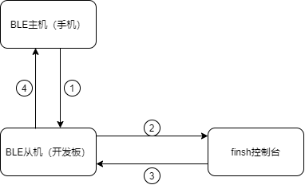

## 软硬件平台

- 硬件平台： nordic nrf5x系列开发板

  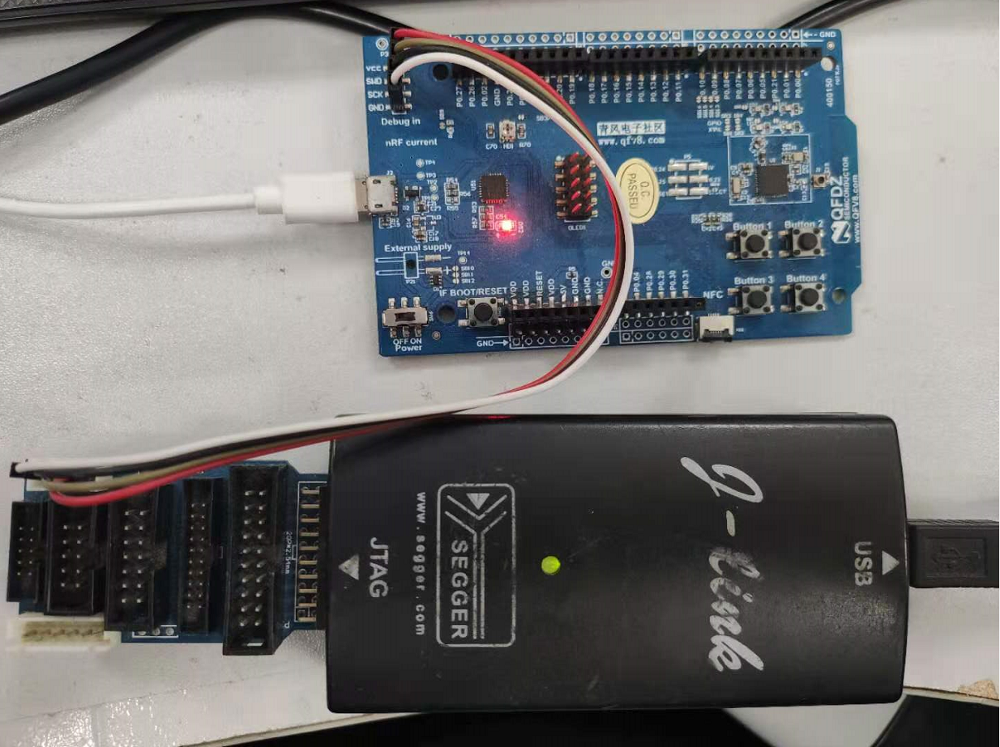

  

- 软件平台： RT-Thread nrf5x bsp, 工程需要通过Env配置，增加nrfx和nrf5x_sdk这两个package

  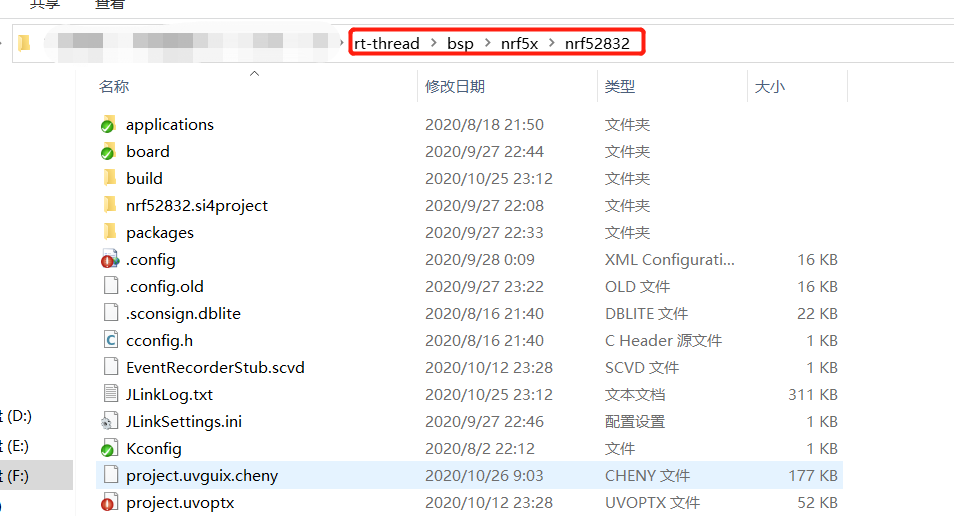

## 功能配置

- 在bsp/nrf5x/nrf52832目录中，打开env

  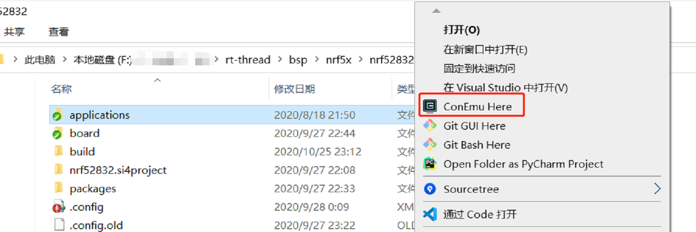

- 进入目录 RT-Thread online packages -> peripheral libraries and drivers -> nrf5x_sdk: the sdk of nordic-->

  - 选择nrf5x_sdk: the sdk of nordic

  

  - 进入nrf5x_sdk后， 选择ble app uart

  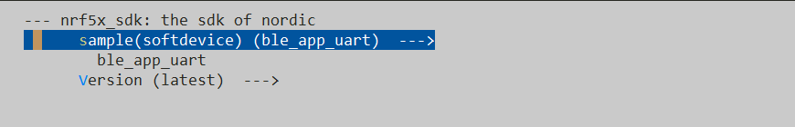

- 进入目录 RT-Thread online packages -> peripheral libraries and drivers -> nrfx: Standalone drivers for peripherals present in Nordic Semiconductor's SoCs.--->

  - 选择nrfx

    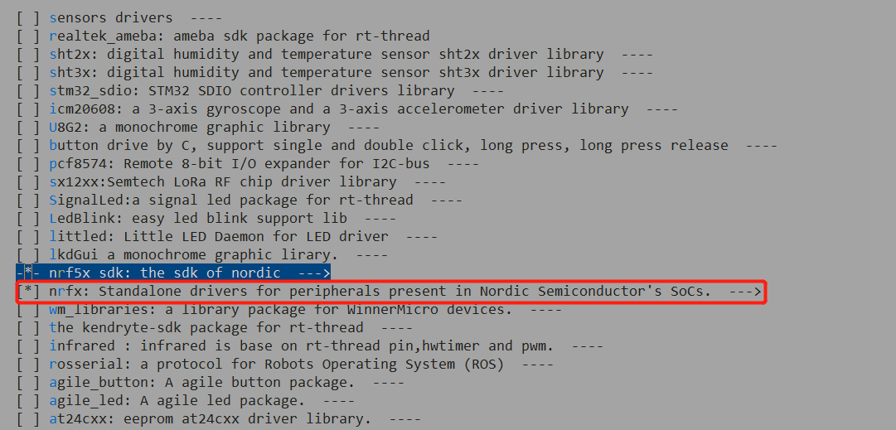

- 进入Hardware Drivers Config -> On-chip Peripheral Drivers->

  - 使能常用的驱动，比如GPIO, UART等

      

- 进入Hardware Drivers Config -> BLE STACK

  - 选择Nordic softdevice(peripheral)

    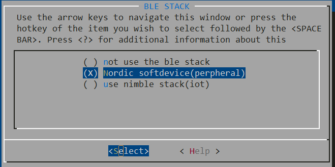

- 最后点击Yes 保存

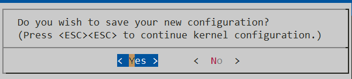

- 输入scons --target=mdk5回车编译工程，因为使用mdk5开发环境，也可以根据具体环境选择mdk4或者iar等。

  编译需要一段时间，完成后退出env工具。

- 编译，下载代码

## app 测试

- 下载代码

- 在finsh控制台， 开启ble uart功能

  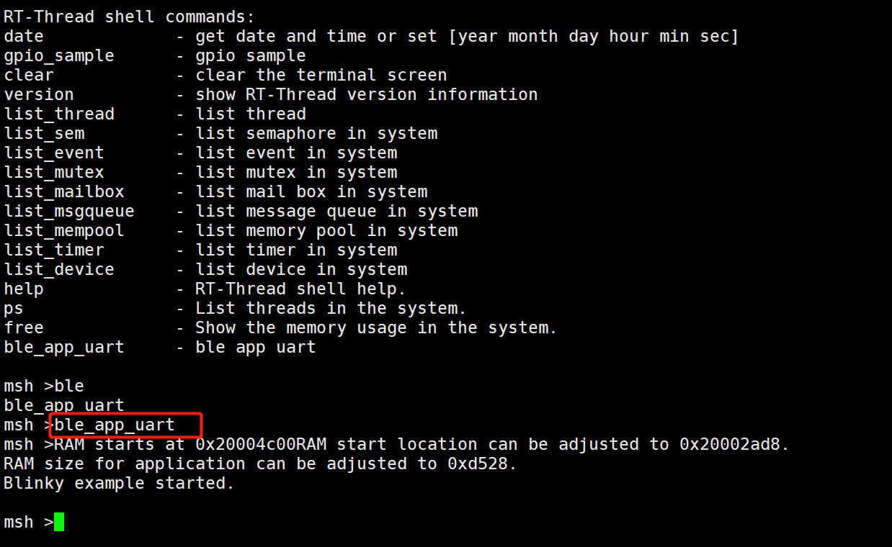

- 打开nrf connect，搜索Nordic_UART蓝牙，点击connect

  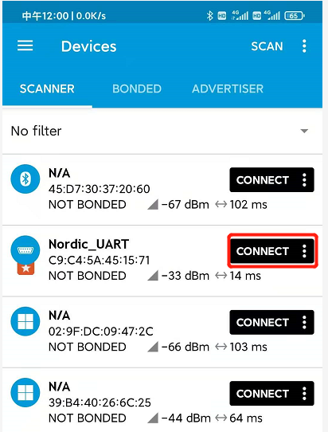

- 开启通知使能，点击如下图红色框区域

  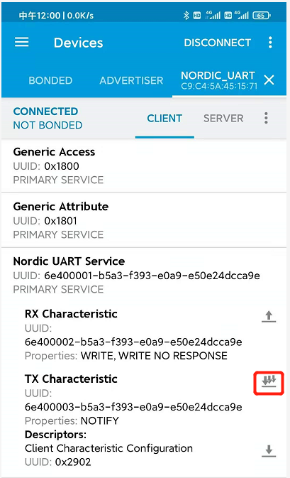

- 发送finsh 命令，点击红色框，输入ps命令

  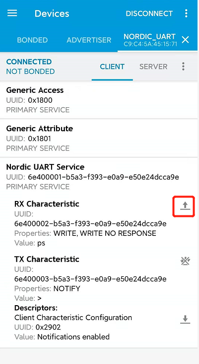

  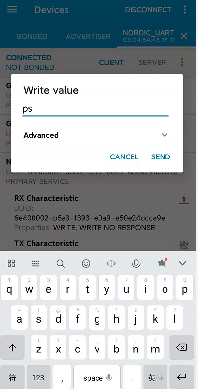

- 查看串口控制终端，是否收到finsh命令，并执行finsh命令

  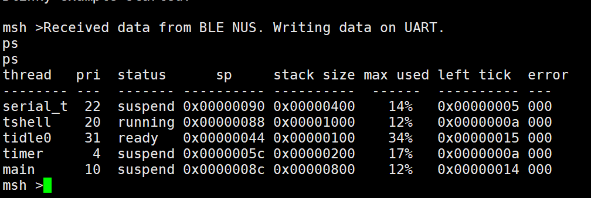

- 查看手机，是否收到finsh命令，和控制台中一致的finsh响应数据（注：在手机界面，向右滑动，可以查看所有的影响数据）

  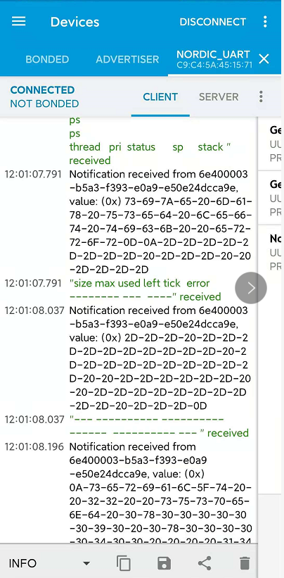

## 代码原理

- 实现框架

  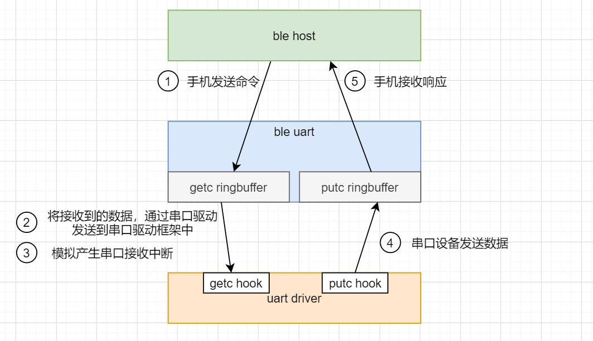

  ​	

  1. 手机发送命令
  2. ble uart应用程序接收到消息， 并将受到的命令存到getc ringbuffer中
  3. 产生串口软件接受中断（模拟硬件串口的接受中断）
  4. 串口设备发送的数据存放到putc ringbuffer中
  5. 将putc ringbuffer中的数据通过BLE协议栈相关API接口，发送给手机

- 查看packages/nrf5x_sdk-latest/rtt_adapter/ble_app_uart.c， 接受手机命令

  如下代码，实现，当BLE从设备接收到手机的消息时，将接收到的消息存放到getc ringbuffer中，并产生软件模拟的串口接受中断

  

  

  如下代码，实现， 将从手机接收到的数据，发送到串口驱动框架中，然后通知finsh线程读取接收到的数据

  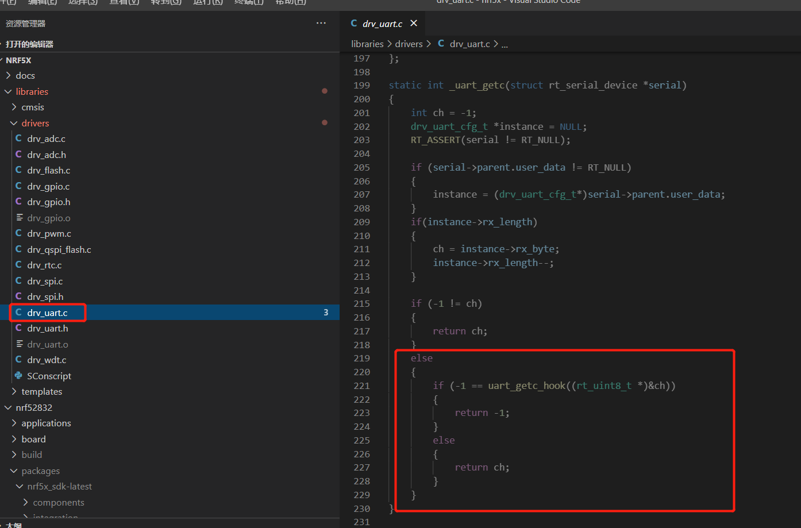

- 查看packages/nrf5x_sdk-latest/rtt_adapter/ble_app_uart.c， 向手机发送响应消息

  uart_task为一个task, 该task会定时查询当前putc ringbuffer是否有需要发送， 如果有需要发送的数据， 则调用ble_nus_data_send

  API将数据发送给手机

  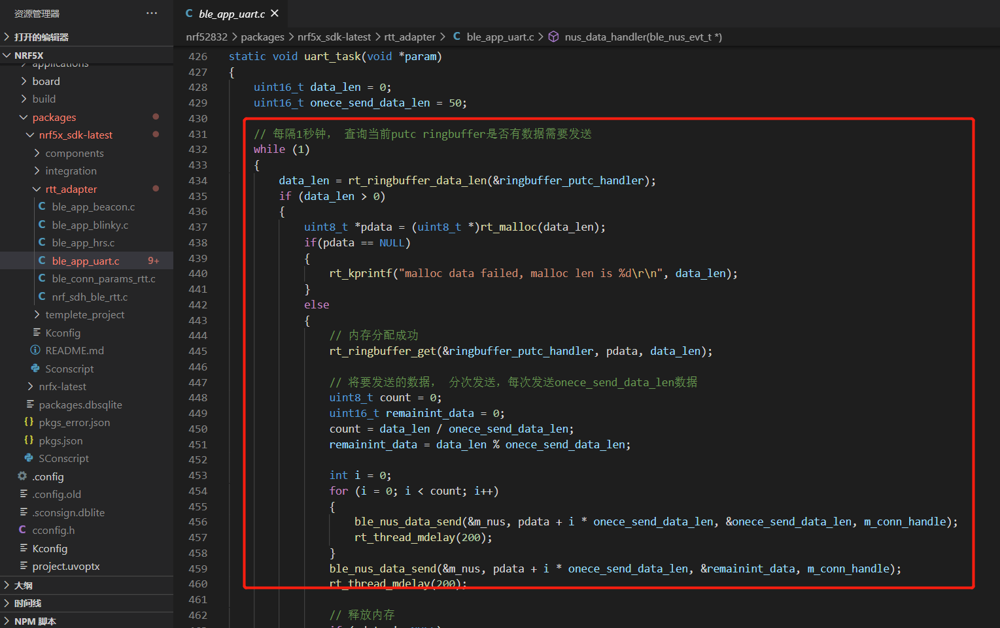

  

  将finsh线程发送给串口外设，回显在finsh控制台中的所有信息缓存在putc ringbuffer中， 然后上面的uart task会定期将缓存中的数据发送给手机

  

